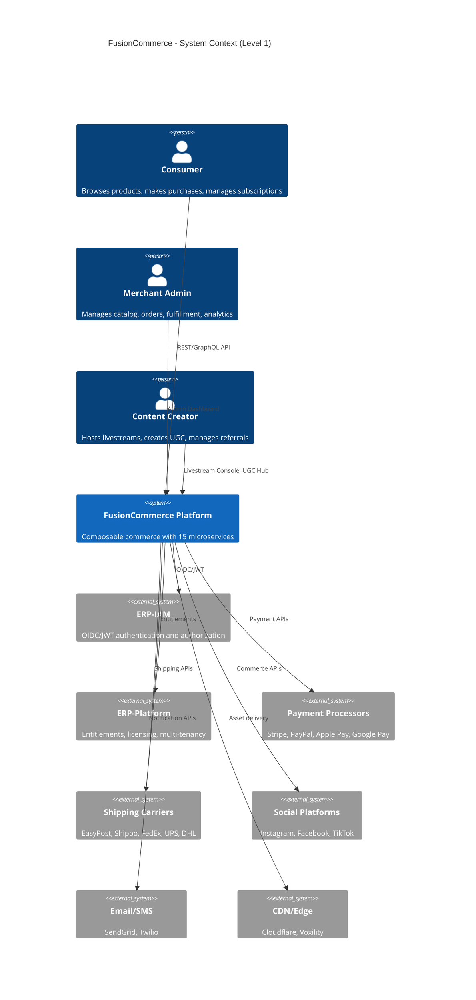
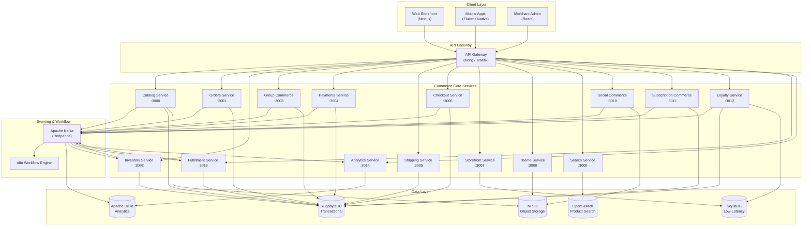
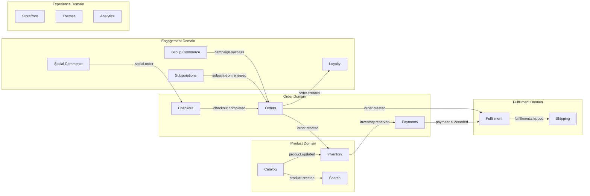
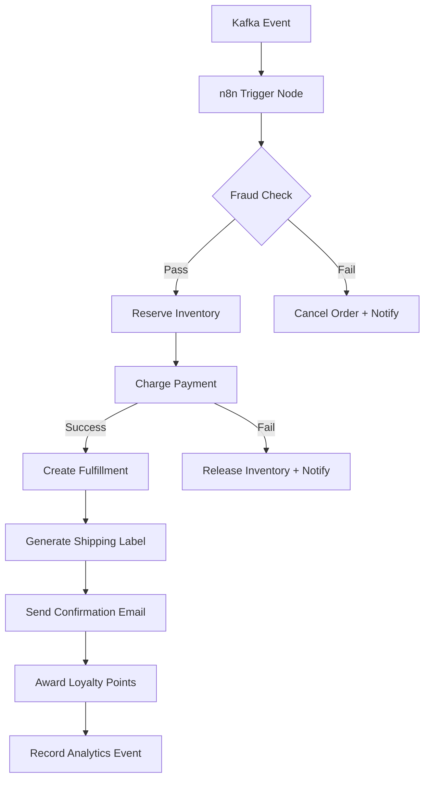
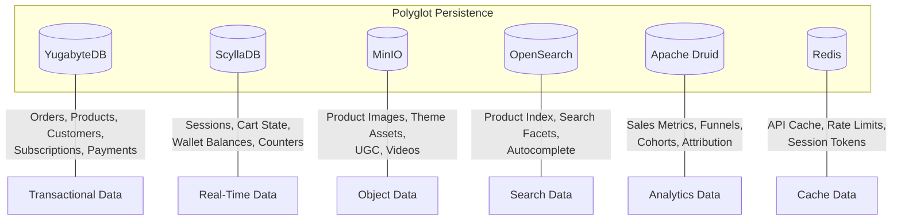
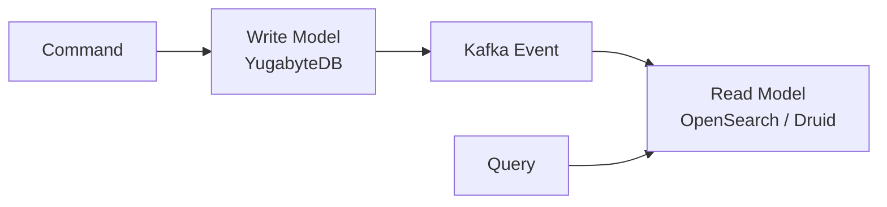
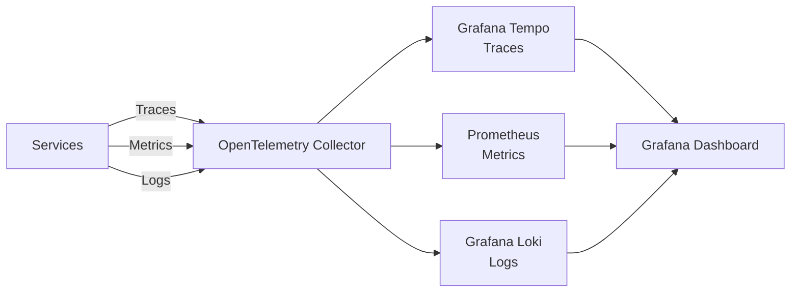
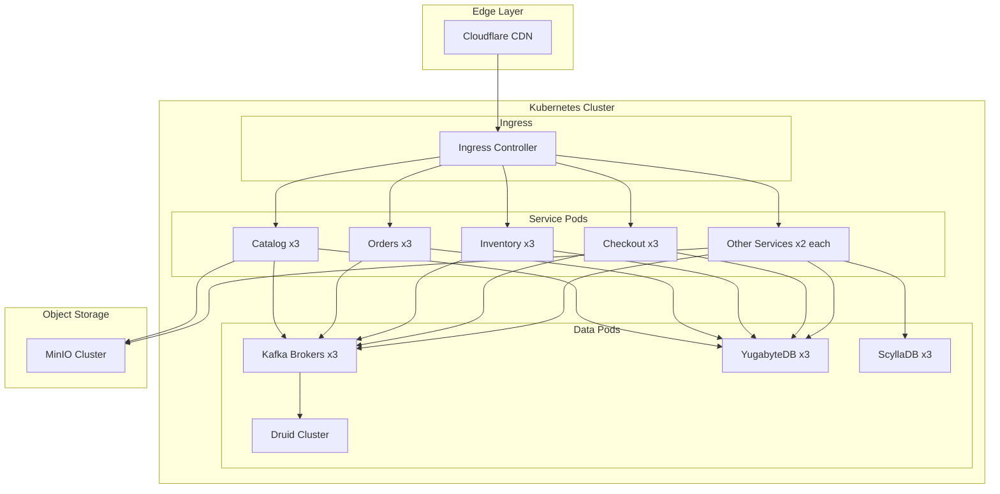

# System Architecture -- FusionCommerce (ERP-eCommerce)
> Version: 1.0 | Last Updated: 2026-02-23 | Status: Draft
> Classification: Internal | Author: AIDD System

## 1. Introduction

FusionCommerce is an API-first, event-driven, composable commerce platform organized as a TypeScript monorepo containing 15 microservices, 5 shared packages, and multi-platform client applications. The architecture follows a six-layer model: Headless Presentation, Commerce Core Services, Eventing and Workflow Orchestration, Intelligence and Data, State and Storage, and Infrastructure and Operations.

## 2. C4 Model Architecture

### 2.1 System Context Diagram

### 2.2 Container Diagram

## 3. Layered Architecture

### 3.1 Layer 1 -- Headless Presentation

The presentation layer consists of decoupled "heads" that consume FusionCommerce APIs:

| Head | Technology | Purpose |
|------|-----------|---------|
| Web Storefront | Next.js / Vue Storefront | Primary consumer shopping experience |
| Mobile Apps | Flutter + Native (Android/iOS) | Native mobile commerce |
| Merchant Admin | React + Ant Design | Back-office management dashboard |
| Social Embeds | Platform SDKs | Instagram Shopping, Facebook Shops, TikTok Shop |
| Conversational | WhatsApp/Messenger Bots | Chat-based commerce |
| In-Store | Kiosk / POS applications | Physical retail integration |

### 3.2 Layer 2 -- Commerce Core Services

Fifteen microservices implement the business logic, each owning its domain data and communicating through Kafka events:

### 3.3 Layer 3 -- Eventing and Workflow ("Nervous System")

Apache Kafka (deployed as Redpanda for development simplicity) serves as the central event backbone. Every significant domain action produces a Kafka event:

| Topic | Producer | Consumers | Purpose |
|-------|----------|-----------|---------|
| product.created | Catalog | Search, Analytics, Social Commerce | Product published notification |
| product.updated | Catalog | Search, Inventory, Storefront | Product change propagation |
| order.created | Orders | Inventory, Fulfillment, Loyalty, Analytics | New order processing |
| inventory.reserved | Inventory | Payments, Orders | Stock reservation confirmation |
| inventory.insufficient | Inventory | Orders, Notifications | Out-of-stock alert |
| payment.succeeded | Payments | Fulfillment, Orders, Notifications | Payment confirmation |
| payment.failed | Payments | Orders, Notifications, Cart Recovery | Payment failure handling |
| fulfillment.shipped | Fulfillment | Shipping, Notifications, Analytics | Shipment created |
| campaign.created | Group Commerce | Social Commerce, Notifications | New group deal launched |
| campaign.success | Group Commerce | Orders, Notifications | Group deal threshold met |
| subscription.renewed | Subscription | Orders, Payments, Notifications | Recurring order triggered |
| loyalty.points_earned | Loyalty | Notifications, Analytics | Points credited |
| cart.abandoned | Checkout | Cart Recovery (n8n), Analytics | Abandoned cart detected |
| search.query | Search | Analytics, AI Recommendations | Search analytics event |

**n8n Workflow Orchestration** listens to Kafka topics and executes multi-step business workflows:

### 3.4 Layer 4 -- Intelligence and Data ("Brain")

- **Apache Druid** ingests Kafka streams for sub-second analytics queries across sales funnels, CLV, cart abandonment, cohort analysis, and channel attribution.
- **AI Decisioning Plane** provides intelligence-as-a-service for product recommendations, dynamic pricing, fraud detection, search relevance ranking, and marketing attribution.

### 3.5 Layer 5 -- State and Storage

### 3.6 Layer 6 -- Infrastructure and Operations

| Component | Technology | Purpose |
|-----------|-----------|---------|
| Container Orchestration | Kubernetes (Rancher) | Service deployment, autoscaling |
| CI/CD | GitLab CI + ArgoCD | Build, test, GitOps deployment |
| Service Mesh | Istio/Linkerd | mTLS, observability, traffic management |
| Edge/CDN | Cloudflare + Voxility | Global asset delivery, DDoS protection |
| Monitoring | OpenTelemetry + Grafana | Distributed tracing, metrics, logs |
| Secret Management | Vault | Credentials, API keys, certificates |

## 4. Service Communication Patterns

### 4.1 Synchronous (REST/HTTP)

- Client to API Gateway
- API Gateway to individual services for query operations
- Service-to-service for real-time queries (e.g., checkout querying inventory)

### 4.2 Asynchronous (Kafka Events)

- All state-changing operations produce events
- Downstream services consume events for eventual consistency
- n8n workflows orchestrate multi-service processes

### 4.3 CQRS Pattern

Write operations go through the command path to YugabyteDB, producing Kafka events. Read operations query optimized read models in OpenSearch (for product search) or Druid (for analytics).

## 5. Cross-Cutting Concerns

### 5.1 Authentication and Authorization

All API requests pass through the API Gateway, which validates JWT tokens issued by ERP-IAM. Service-to-service calls use mTLS via the service mesh. Entitlements (which features a merchant can access) are managed by ERP-Platform.

### 5.2 Multi-Tenancy

Every data record includes a `tenant_id` field. Row-level security in YugabyteDB ensures data isolation. The API Gateway injects the tenant context from the JWT token into every downstream request.

### 5.3 Observability

## 6. Deployment Topology

## 7. Technology Stack Summary

| Layer | Technology | Version | Rationale |
|-------|-----------|---------|-----------|
| Runtime | Node.js | 20 LTS | Async I/O, TypeScript native, large ecosystem |
| Language | TypeScript | 5.x | Type safety, developer productivity |
| HTTP Framework | Fastify | 4.x | Fastest Node.js HTTP framework |
| Event Bus | Apache Kafka (Redpanda) | Latest | Event-driven backbone, replay, ordering |
| Workflow Engine | n8n | 1.70+ | Low-code workflow automation |
| Primary DB | YugabyteDB | Latest | Distributed SQL, strong consistency |
| Low-Latency DB | ScyllaDB | Latest | Sub-millisecond reads for sessions/counters |
| Object Storage | MinIO | Latest | S3-compatible, self-hosted |
| Analytics DB | Apache Druid | Latest | Real-time OLAP on event streams |
| Search | OpenSearch | Latest | Full-text search, faceted filtering |
| Cache | Redis | 7.x | API caching, rate limiting, sessions |
| Container | Docker + Kubernetes | Latest | Containerized deployment, orchestration |
