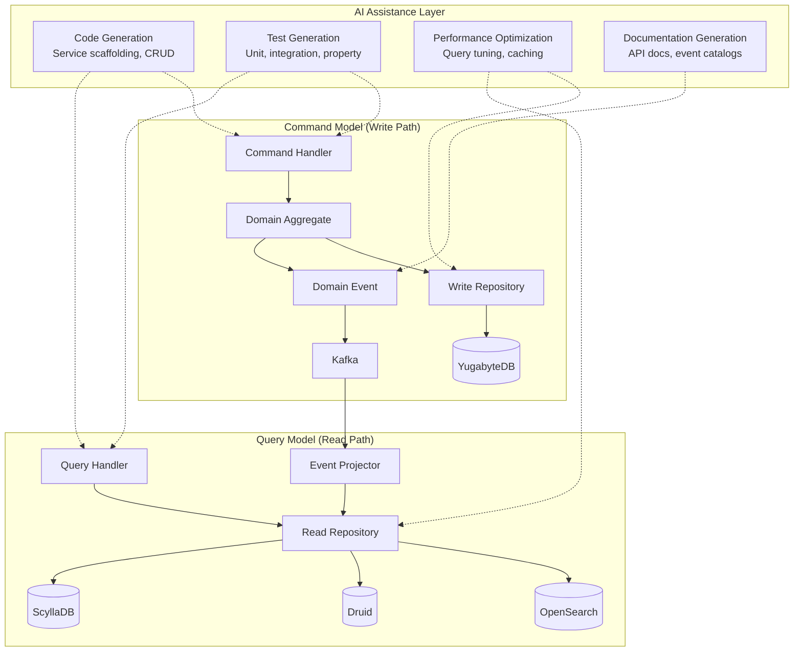
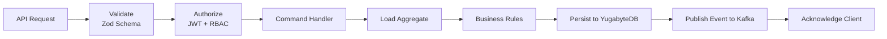
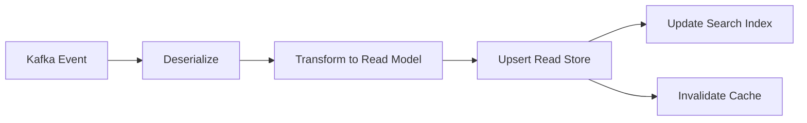
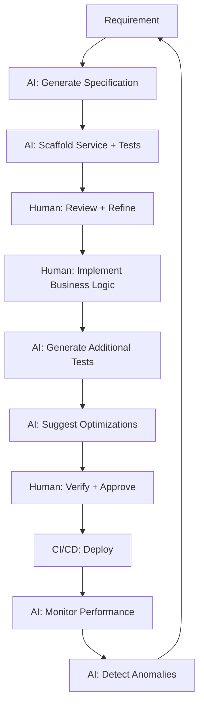
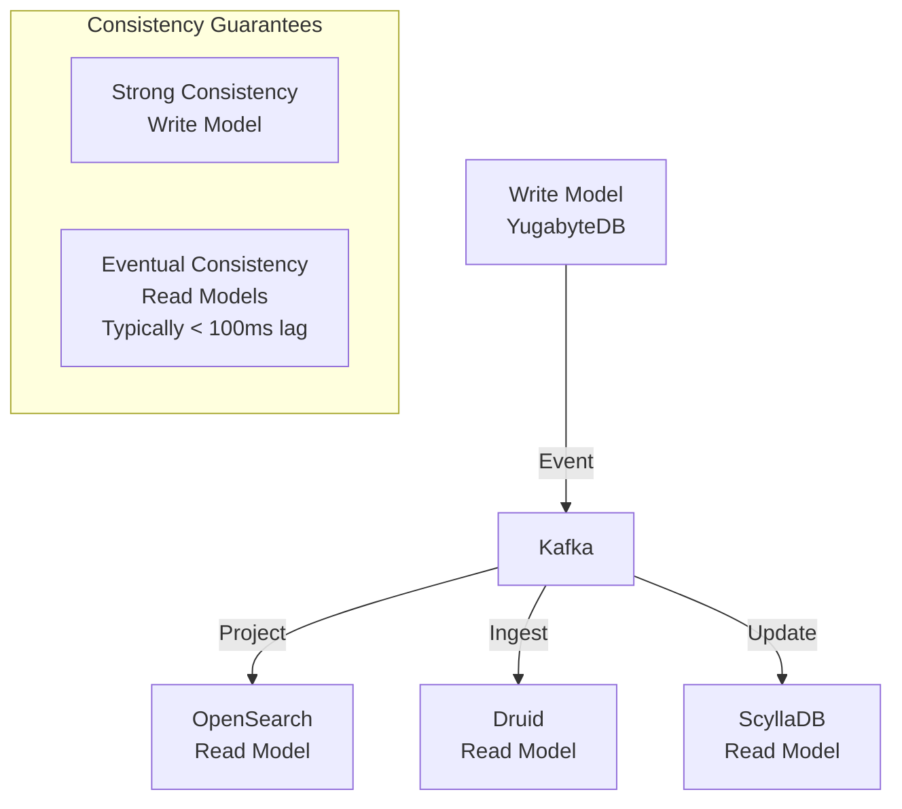

# Backend Dual-Model AIDD -- FusionCommerce (ERP-eCommerce)
> Version: 1.0 | Last Updated: 2026-02-23 | Status: Draft
> Classification: Internal | Author: AIDD System

## 1. Introduction

This document describes the AI-Driven Development (AIDD) dual-model approach used for FusionCommerce backend development. The dual model separates the system into a Command Model (write path) and a Query Model (read path), following CQRS principles augmented by AI-assisted code generation, testing, and optimization.

## 2. AIDD Dual-Model Architecture



## 3. Command Model Implementation

### 3.1 Command Processing Pipeline



### 3.2 Aggregate Design

Each service owns its aggregate root following DDD principles:

| Service | Aggregate Root | Invariants |
|---------|---------------|------------|
| Catalog | Product | SKU uniqueness per tenant, price non-negative |
| Orders | Order | Status transitions valid, total matches items |
| Inventory | StockLevel | Quantity non-negative, reservation <= available |
| Checkout | Cart | Max items limit, valid coupon stacking |
| Payments | Payment | Amount matches order total, valid payment method |
| Loyalty | LoyaltyAccount | Points non-negative, tier matches spend threshold |
| Subscriptions | Subscription | Valid frequency, payment method attached |
| Group Commerce | Campaign | Participant count <= max, within time window |

### 3.3 AI-Assisted Command Generation

The AIDD system generates command handlers from domain specifications:

```
Input specification:
  - Domain: Loyalty
  - Command: EarnPoints
  - Aggregate: LoyaltyAccount
  - Business rules: Apply tier multiplier, check bonus promotions, credit wallet
  - Events: loyalty.points_earned

Generated output:
  - src/commands/earn-points.handler.ts
  - src/commands/earn-points.validator.ts
  - __tests__/earn-points.handler.test.ts (with edge cases)
```

## 4. Query Model Implementation

### 4.1 Event Projection Pipeline



### 4.2 Read Model Stores

| Read Model | Store | Source Events | Query Patterns |
|-----------|-------|--------------|---------------|
| Product Search | OpenSearch | product.created, product.updated | Full-text, faceted, vector search |
| Sales Analytics | Apache Druid | order.created, order.completed | Time-series aggregation, funnels |
| Cart State | ScyllaDB | cart.item_added, cart.item_removed | Key-value lookup by cart_id |
| Wallet Balance | ScyllaDB | loyalty.points_earned, loyalty.points_redeemed | Key-value lookup by customer_id |
| Session Data | ScyllaDB | session.created, session.updated | Key-value with TTL |
| Order Timeline | YugabyteDB | order.*, fulfillment.*, payment.* | Customer order history |

### 4.3 AI-Optimized Query Generation

The AIDD system analyzes query patterns and generates optimized queries:

```
Input: "Show top 10 selling products this week by revenue"
Generated Druid query:
  SELECT product_id, product_name,
         SUM(revenue) as total_revenue,
         SUM(quantity) as total_units
  FROM sales_events
  WHERE __time >= CURRENT_TIMESTAMP - INTERVAL '7' DAY
    AND tenant_id = ?
  GROUP BY product_id, product_name
  ORDER BY total_revenue DESC
  LIMIT 10
```

## 5. AIDD Development Workflow



## 6. AI-Assisted Code Quality

### 6.1 Generated Code Standards

| Aspect | Standard | AI Enforcement |
|--------|----------|---------------|
| Type safety | Strict TypeScript, no `any` | ESLint + AI linting |
| Error handling | All async operations wrapped in try-catch | Pattern detection |
| Logging | Structured JSON logs with correlation IDs | Template generation |
| Testing | Minimum 80% coverage, edge cases included | Test case generation |
| Documentation | JSDoc on all public methods | Auto-documentation |
| Security | Input validation, parameterized queries | Vulnerability scanning |

### 6.2 AI-Generated Test Categories

| Category | Description | Generation Method |
|----------|-------------|-------------------|
| Happy path | Normal successful operations | Specification-driven |
| Validation | Invalid inputs, boundary values | Fuzz testing patterns |
| Concurrency | Race conditions, deadlocks | Property-based testing |
| Error handling | Network failures, timeout, data corruption | Chaos patterns |
| Performance | Throughput, latency under load | Benchmark generation |
| Security | Injection, authorization bypass | OWASP pattern matching |

## 7. Dual-Model Synchronization



The write model provides strong consistency for transactional operations. Read models are eventually consistent with typical lag under 100 milliseconds. The AIDD system monitors projection lag and alerts when it exceeds thresholds.
