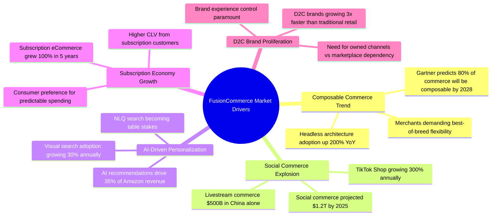
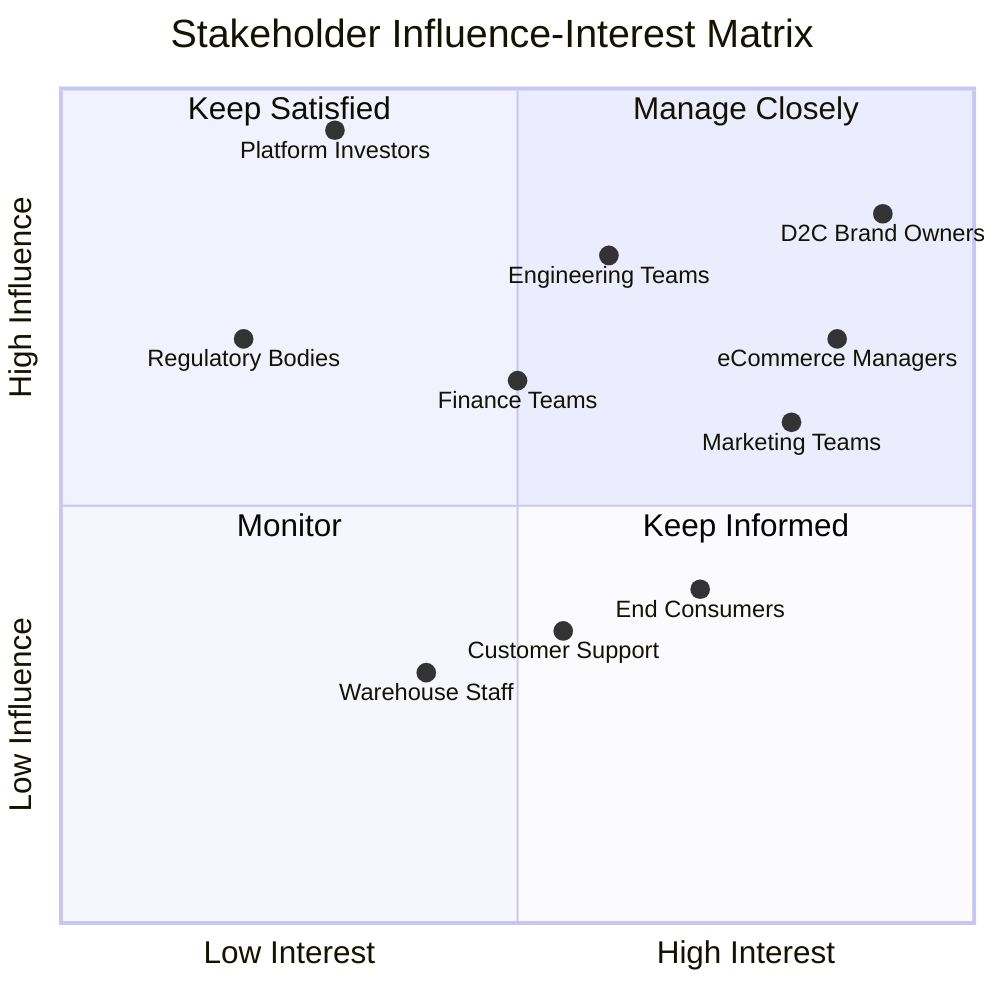
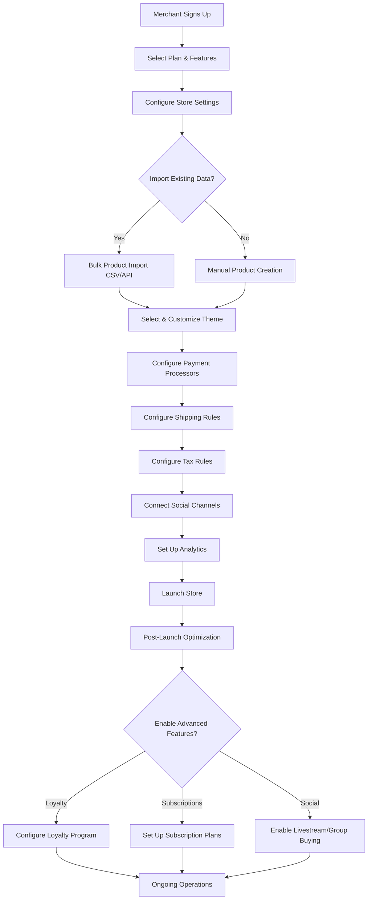

# Business Requirements Document -- FusionCommerce (ERP-eCommerce)
> Version: 1.0 | Last Updated: 2026-02-23 | Status: Draft
> Classification: Internal | Author: AIDD System

## 1. Executive Summary

FusionCommerce addresses the growing market demand for composable, API-first commerce platforms that enable D2C and B2C brands to differentiate through personalized experiences, social commerce channels, and AI-driven intelligence. The global eCommerce platform market is projected to reach $20.5 billion by 2028 at a 16.3% CAGR. Current market leaders -- Shopify, Magento, BigCommerce, and WooCommerce -- force merchants into either expensive, inflexible SaaS platforms or complex, maintenance-heavy open-source solutions. FusionCommerce positions itself as the composable alternative that combines the simplicity of SaaS with the flexibility of open-source, augmented by global innovation models from China, India, and Latin America.

## 2. Business Objectives

| ID | Objective | KPI | Target |
|----|-----------|-----|--------|
| BO-001 | Capture market share in composable commerce | Active merchant installations | 500 merchants in 12 months |
| BO-002 | Enable higher merchant revenue through social commerce | GMV attributed to social channels | 25% of total GMV |
| BO-003 | Reduce merchant platform costs vs. Shopify Plus | Annual cost savings per merchant | $15K-$50K/year |
| BO-004 | Improve checkout conversion over industry average | Checkout completion rate | > 3.5% (vs. 2.1% avg) |
| BO-005 | Drive subscription revenue for recurring commerce | Subscription GMV percentage | 15% of total GMV |
| BO-006 | Establish AI search as competitive moat | Search-to-purchase conversion | > 8% (vs. 3% industry avg) |

## 3. Business Context

### 3.1 Market Drivers

### 3.2 Problem Statement

| Stakeholder | Current Pain Point | FusionCommerce Solution |
|-------------|-------------------|------------------------|
| D2C Brand Owner | Shopify Plus costs $2K/mo + 0.5% GMV tax | Self-hosted, zero GMV fees, lower TCO |
| eCommerce Manager | Siloed data across 10+ plugins/apps | Unified platform with native analytics |
| Marketing Team | No native social commerce or livestream | Built-in Instagram, TikTok, livestream |
| Engineering Team | Magento's monolith cannot scale horizontally | Composable microservices, per-service scaling |
| Finance Team | Revenue reporting requires manual consolidation | Real-time Druid dashboards, cohort analysis |
| Consumers | Slow search, basic recommendations | AI search with NLQ, visual, and voice |

## 4. Stakeholder Analysis

## 5. Business Process Flows

### 5.1 Merchant Onboarding

### 5.2 Revenue Model

| Revenue Stream | Description | Pricing Model |
|---------------|-------------|---------------|
| Platform License | Self-hosted enterprise license | Annual subscription tiers |
| Managed Hosting | Cloud-hosted managed service | Monthly per-merchant |
| Theme Marketplace | Premium themes for storefronts | One-time purchase + revenue share |
| Extension Marketplace | Third-party extensions and integrations | Revenue share (70/30) |
| Professional Services | Implementation, migration, customization | Time & materials |
| Support Plans | SLA-backed technical support | Tiered annual plans |

## 6. Business Rules

### 6.1 Commerce Rules

| ID | Rule | Description |
|----|------|-------------|
| BR-001 | Cart expiration | Cart items reserved for 30 minutes before release |
| BR-002 | Inventory hold | Inventory decremented on order confirmation, not cart add |
| BR-003 | Coupon stacking | Maximum 1 percentage + 1 fixed discount per order |
| BR-004 | Minimum order | Configurable minimum order value per store |
| BR-005 | Geo-restriction | Products can be restricted by shipping country |
| BR-006 | Price rounding | All prices rounded to 2 decimal places in display currency |

### 6.2 Loyalty Rules

| ID | Rule | Description |
|----|------|-------------|
| BR-010 | Points earning | 1 point per $1 spent (configurable per tier) |
| BR-011 | Points expiry | Points expire after 12 months of inactivity |
| BR-012 | Tier calculation | Tier based on rolling 12-month spend |
| BR-013 | Tier demotion | Grace period of 3 months before tier demotion |
| BR-014 | Redemption floor | Minimum 500 points required for redemption |

### 6.3 Subscription Rules

| ID | Rule | Description |
|----|------|-------------|
| BR-020 | Payment retry | Failed subscription payments retried 3 times over 7 days |
| BR-021 | Skip limit | Maximum 2 consecutive skips before auto-pause |
| BR-022 | Cancel window | Subscription can be canceled up to 48 hours before renewal |
| BR-023 | Swap window | Product swaps allowed up to 72 hours before shipment |

## 7. Compliance Requirements

| Regulation | Scope | Requirements |
|-----------|-------|-------------|
| PCI DSS Level 1 | Payment processing | Tokenized card storage, encrypted transmission, quarterly scans |
| GDPR | EU customers | Consent management, data portability, right to erasure |
| CCPA | California customers | Opt-out of data sale, data access requests |
| PSD2/SCA | European payments | Strong Customer Authentication for card payments |
| VAT/GST | International tax | Automated tax calculation and remittance |
| ADA/WCAG 2.1 | Accessibility | AA compliance for all storefront pages |

## 8. Risk Assessment

| Risk | Probability | Impact | Mitigation |
|------|-------------|--------|------------|
| Social platform API changes break integrations | High | High | Abstraction layer, monitoring, fallback mechanisms |
| Payment processor downtime impacts checkout | Medium | Critical | Multi-processor failover, offline queue |
| AI search returns irrelevant results at launch | Medium | High | Phased rollout with A/B testing, manual merchandising override |
| Merchant migration complexity from Shopify/Magento | High | Medium | Automated migration tools, professional services |
| Kafka cluster failure impacts event processing | Low | Critical | Multi-AZ deployment, dead letter queues, replay capability |
| GDPR consent requirements reduce conversion | Medium | Medium | Progressive consent UX, minimal mandatory fields |

## 9. Expected ROI

### 9.1 Merchant ROI (vs. Shopify Plus for $1M GMV/year merchant)

| Cost Category | Shopify Plus Annual | FusionCommerce Annual | Savings |
|--------------|--------------------|-----------------------|---------|
| Platform fees | $24,000 | $12,000 (license) | $12,000 |
| Transaction fees (0.5% GMV) | $5,000 | $0 | $5,000 |
| App subscriptions (10 apps avg) | $6,000 | $0 (native features) | $6,000 |
| Theme/customization | $3,000 | $1,500 | $1,500 |
| **Total** | **$38,000** | **$13,500** | **$24,500** |

### 9.2 Revenue Uplift from FusionCommerce Features

| Feature | Expected Revenue Impact |
|---------|----------------------|
| AI search improving search-to-purchase | +12% conversion on search queries |
| Cart abandonment recovery | +8% recovered revenue |
| Loyalty program increasing repeat purchases | +20% repeat customer rate |
| Social commerce new channel revenue | +15% incremental GMV |
| Subscription commerce recurring revenue | +25% predictable monthly revenue |

## 10. Success Criteria

| Criteria | Metric | Target | Timeline |
|----------|--------|--------|----------|
| Market adoption | Active merchant count | 500 | 12 months |
| Merchant satisfaction | NPS score | > 60 | 6 months post-launch |
| Platform reliability | Uptime SLA | 99.99% | Continuous |
| Checkout performance | Conversion rate improvement | +50% over merchant's previous platform | 3 months post-migration |
| Support efficiency | Ticket resolution time | < 4 hours (P1), < 24 hours (P2) | Continuous |
