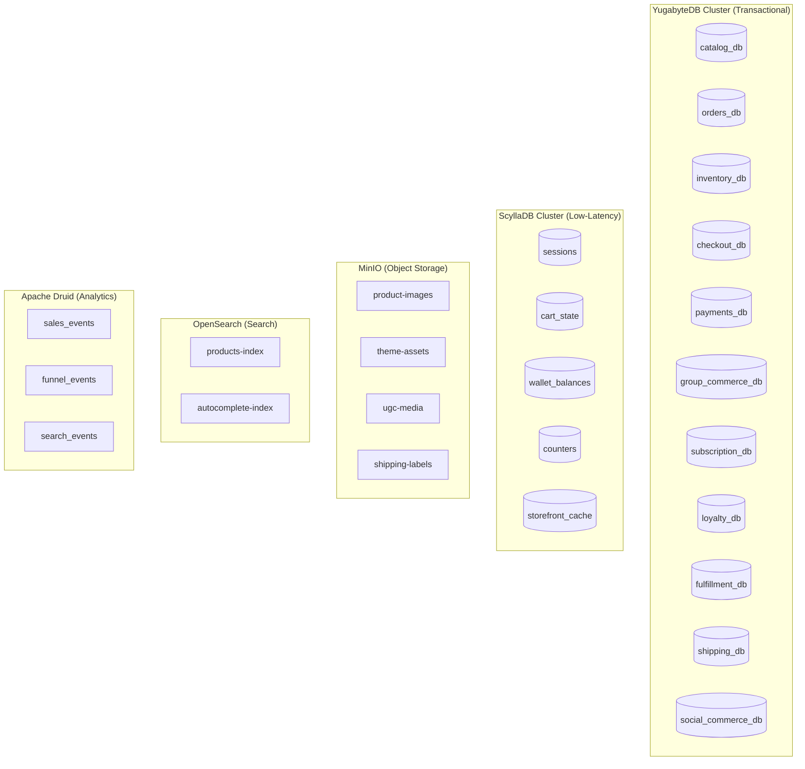
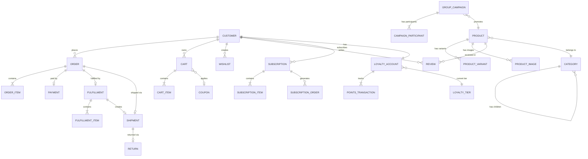

# Database Schema -- FusionCommerce (ERP-eCommerce)
> Version: 1.0 | Last Updated: 2026-02-23 | Status: Draft
> Classification: Internal | Author: AIDD System

## 1. Overview

FusionCommerce employs a database-per-service pattern with polyglot persistence. Each microservice owns its schema and is the sole writer to its tables. The primary transactional store is YugabyteDB (PostgreSQL-compatible), with ScyllaDB for low-latency access patterns, MinIO for object storage, OpenSearch for product search indexes, and Apache Druid for analytics.

## 2. Database Topology



## 3. Catalog Service Schema (catalog_db)

### 3.1 products

| Column | Type | Constraints | Description |
|--------|------|-------------|-------------|
| id | UUID | PRIMARY KEY | Product identifier |
| tenant_id | VARCHAR(64) | NOT NULL, INDEX | Tenant isolation |
| sku | VARCHAR(128) | NOT NULL, UNIQUE per tenant | Stock keeping unit |
| name | VARCHAR(512) | NOT NULL | Product display name |
| slug | VARCHAR(512) | NOT NULL, UNIQUE per tenant | URL-friendly name |
| description | TEXT | | Full product description |
| short_description | VARCHAR(1024) | | Truncated description |
| price | DECIMAL(12,2) | NOT NULL | Base price |
| compare_at_price | DECIMAL(12,2) | | Original price for sale display |
| currency | VARCHAR(3) | NOT NULL, DEFAULT 'USD' | ISO 4217 currency code |
| status | VARCHAR(32) | NOT NULL, DEFAULT 'draft' | draft, active, archived |
| category_id | UUID | FOREIGN KEY | Category reference |
| brand | VARCHAR(256) | | Product brand name |
| tags | TEXT[] | | Array of searchable tags |
| metadata | JSONB | | Arbitrary key-value attributes |
| seo_title | VARCHAR(256) | | SEO meta title |
| seo_description | VARCHAR(512) | | SEO meta description |
| weight | DECIMAL(8,2) | | Weight in grams |
| created_at | TIMESTAMPTZ | NOT NULL, DEFAULT now() | Creation timestamp |
| updated_at | TIMESTAMPTZ | NOT NULL, DEFAULT now() | Last update timestamp |

### 3.2 product_variants

| Column | Type | Constraints | Description |
|--------|------|-------------|-------------|
| id | UUID | PRIMARY KEY | Variant identifier |
| product_id | UUID | NOT NULL, FOREIGN KEY | Parent product |
| sku | VARCHAR(128) | NOT NULL, UNIQUE per tenant | Variant SKU |
| name | VARCHAR(256) | NOT NULL | Variant display name (e.g., "Large / Blue") |
| price | DECIMAL(12,2) | | Override price (null = use product price) |
| options | JSONB | NOT NULL | { "size": "L", "color": "Blue" } |
| inventory_quantity | INTEGER | NOT NULL, DEFAULT 0 | Current stock level |
| weight | DECIMAL(8,2) | | Override weight |
| barcode | VARCHAR(128) | | UPC/EAN barcode |
| image_id | UUID | FOREIGN KEY | Primary variant image |
| position | INTEGER | NOT NULL, DEFAULT 0 | Sort order |
| created_at | TIMESTAMPTZ | NOT NULL, DEFAULT now() | Creation timestamp |

### 3.3 categories

| Column | Type | Constraints | Description |
|--------|------|-------------|-------------|
| id | UUID | PRIMARY KEY | Category identifier |
| tenant_id | VARCHAR(64) | NOT NULL, INDEX | Tenant isolation |
| name | VARCHAR(256) | NOT NULL | Category name |
| slug | VARCHAR(256) | NOT NULL, UNIQUE per tenant | URL-friendly name |
| parent_id | UUID | FOREIGN KEY (self) | Parent category for hierarchy |
| description | TEXT | | Category description |
| image_url | VARCHAR(1024) | | Category banner image |
| position | INTEGER | NOT NULL, DEFAULT 0 | Sort order |
| is_active | BOOLEAN | NOT NULL, DEFAULT true | Visibility flag |

### 3.4 product_images

| Column | Type | Constraints | Description |
|--------|------|-------------|-------------|
| id | UUID | PRIMARY KEY | Image identifier |
| product_id | UUID | NOT NULL, FOREIGN KEY | Parent product |
| url | VARCHAR(1024) | NOT NULL | MinIO object URL |
| alt_text | VARCHAR(512) | | Accessibility alt text |
| position | INTEGER | NOT NULL, DEFAULT 0 | Sort order |
| width | INTEGER | | Image width in pixels |
| height | INTEGER | | Image height in pixels |

### 3.5 product_reviews

| Column | Type | Constraints | Description |
|--------|------|-------------|-------------|
| id | UUID | PRIMARY KEY | Review identifier |
| product_id | UUID | NOT NULL, FOREIGN KEY | Reviewed product |
| customer_id | UUID | NOT NULL | Reviewer |
| rating | SMALLINT | NOT NULL, CHECK (1-5) | Star rating |
| title | VARCHAR(256) | | Review title |
| body | TEXT | | Review content |
| is_verified_purchase | BOOLEAN | DEFAULT false | Verified buyer flag |
| status | VARCHAR(32) | DEFAULT 'pending' | pending, approved, rejected |
| created_at | TIMESTAMPTZ | NOT NULL, DEFAULT now() | Submission timestamp |

## 4. Orders Service Schema (orders_db)

### 4.1 orders

| Column | Type | Constraints | Description |
|--------|------|-------------|-------------|
| id | UUID | PRIMARY KEY | Order identifier |
| tenant_id | VARCHAR(64) | NOT NULL, INDEX | Tenant isolation |
| order_number | VARCHAR(32) | NOT NULL, UNIQUE per tenant | Human-readable number (#FC-10001) |
| customer_id | UUID | NOT NULL, INDEX | Customer reference |
| email | VARCHAR(256) | NOT NULL | Notification email (supports guest checkout) |
| status | VARCHAR(32) | NOT NULL | pending, confirmed, paid, shipped, delivered, cancelled, refunded |
| financial_status | VARCHAR(32) | NOT NULL | pending, paid, partially_refunded, refunded |
| fulfillment_status | VARCHAR(32) | NOT NULL | unfulfilled, partial, fulfilled |
| subtotal | DECIMAL(12,2) | NOT NULL | Sum of line item totals |
| discount_total | DECIMAL(12,2) | DEFAULT 0 | Applied discount amount |
| shipping_total | DECIMAL(12,2) | DEFAULT 0 | Shipping cost |
| tax_total | DECIMAL(12,2) | DEFAULT 0 | Tax amount |
| total | DECIMAL(12,2) | NOT NULL | Final order total |
| currency | VARCHAR(3) | NOT NULL | ISO 4217 currency code |
| shipping_address | JSONB | | { street, city, state, zip, country } |
| billing_address | JSONB | | { street, city, state, zip, country } |
| notes | TEXT | | Customer or merchant notes |
| metadata | JSONB | | Custom attributes |
| created_at | TIMESTAMPTZ | NOT NULL, DEFAULT now() | Order creation |
| updated_at | TIMESTAMPTZ | NOT NULL, DEFAULT now() | Last update |

### 4.2 order_items

| Column | Type | Constraints | Description |
|--------|------|-------------|-------------|
| id | UUID | PRIMARY KEY | Line item identifier |
| order_id | UUID | NOT NULL, FOREIGN KEY | Parent order |
| product_id | UUID | NOT NULL | Product reference |
| variant_id | UUID | | Variant reference |
| sku | VARCHAR(128) | NOT NULL | SKU at time of purchase |
| name | VARCHAR(512) | NOT NULL | Product name at time of purchase |
| quantity | INTEGER | NOT NULL | Ordered quantity |
| unit_price | DECIMAL(12,2) | NOT NULL | Price per unit |
| total | DECIMAL(12,2) | NOT NULL | quantity * unit_price |
| discount_amount | DECIMAL(12,2) | DEFAULT 0 | Applied discount |
| tax_amount | DECIMAL(12,2) | DEFAULT 0 | Tax on this item |

## 5. Checkout Service Schema (checkout_db)

### 5.1 carts

| Column | Type | Constraints | Description |
|--------|------|-------------|-------------|
| id | UUID | PRIMARY KEY | Cart identifier |
| tenant_id | VARCHAR(64) | NOT NULL, INDEX | Tenant isolation |
| customer_id | UUID | | Null for guest carts |
| session_id | VARCHAR(128) | INDEX | Browser session for guest carts |
| status | VARCHAR(32) | DEFAULT 'active' | active, abandoned, converted |
| subtotal | DECIMAL(12,2) | DEFAULT 0 | Running cart total |
| currency | VARCHAR(3) | DEFAULT 'USD' | Cart currency |
| coupon_code | VARCHAR(64) | | Applied coupon |
| discount_amount | DECIMAL(12,2) | DEFAULT 0 | Discount from coupon |
| abandoned_at | TIMESTAMPTZ | | When cart was flagged as abandoned |
| converted_at | TIMESTAMPTZ | | When checkout completed |
| created_at | TIMESTAMPTZ | DEFAULT now() | Cart creation |
| updated_at | TIMESTAMPTZ | DEFAULT now() | Last activity |

### 5.2 cart_items

| Column | Type | Constraints | Description |
|--------|------|-------------|-------------|
| id | UUID | PRIMARY KEY | Item identifier |
| cart_id | UUID | NOT NULL, FOREIGN KEY | Parent cart |
| product_id | UUID | NOT NULL | Product reference |
| variant_id | UUID | | Variant reference |
| quantity | INTEGER | NOT NULL, CHECK (> 0) | Item quantity |
| unit_price | DECIMAL(12,2) | NOT NULL | Price at time of add |

### 5.3 coupons

| Column | Type | Constraints | Description |
|--------|------|-------------|-------------|
| id | UUID | PRIMARY KEY | Coupon identifier |
| tenant_id | VARCHAR(64) | NOT NULL | Tenant isolation |
| code | VARCHAR(64) | NOT NULL, UNIQUE per tenant | Coupon code (e.g., SAVE20) |
| type | VARCHAR(32) | NOT NULL | percentage, fixed_amount, free_shipping |
| value | DECIMAL(12,2) | NOT NULL | Discount value |
| min_purchase | DECIMAL(12,2) | DEFAULT 0 | Minimum cart value |
| max_uses | INTEGER | | Total usage limit |
| used_count | INTEGER | DEFAULT 0 | Current usage count |
| starts_at | TIMESTAMPTZ | NOT NULL | Validity start |
| expires_at | TIMESTAMPTZ | | Validity end |
| is_active | BOOLEAN | DEFAULT true | Active flag |

## 6. Entity Relationship Diagram



## 7. ScyllaDB Tables (Low-Latency)

### 7.1 sessions

```cql
CREATE TABLE sessions (
    session_id TEXT PRIMARY KEY,
    tenant_id TEXT,
    customer_id UUID,
    cart_id UUID,
    data MAP<TEXT, TEXT>,
    created_at TIMESTAMP,
    expires_at TIMESTAMP
) WITH default_time_to_live = 2592000;  -- 30 days
```

### 7.2 wallet_balances

```cql
CREATE TABLE wallet_balances (
    tenant_id TEXT,
    customer_id UUID,
    balance_type TEXT,  -- 'points', 'cashback', 'store_credit'
    balance DECIMAL,
    updated_at TIMESTAMP,
    PRIMARY KEY ((tenant_id, customer_id), balance_type)
);
```

### 7.3 group_campaign_counters

```cql
CREATE TABLE group_campaign_counters (
    campaign_id UUID PRIMARY KEY,
    current_participants COUNTER,
    total_views COUNTER
);
```

## 8. MinIO Bucket Structure

| Bucket | Content | Access Pattern |
|--------|---------|----------------|
| `product-images` | Product photos (originals + resized variants) | CDN-cached public read |
| `theme-assets` | Theme CSS, JS, fonts, template images | CDN-cached public read |
| `ugc-media` | User reviews with photos, community posts | Authenticated read |
| `shipping-labels` | Generated PDF shipping labels | Authenticated read |
| `import-exports` | Bulk CSV imports and data exports | Authenticated read/write |

## 9. Migration Strategy

All YugabyteDB schema changes use Knex migrations with timestamp-prefixed filenames:

```
services/{service}/migrations/
  20240101000000_create_{table}_table.ts
  20240102000000_add_{feature}_to_{table}.ts
```

Migration execution is automated during service startup in development and controlled via CI/CD pipeline for production deployments.
