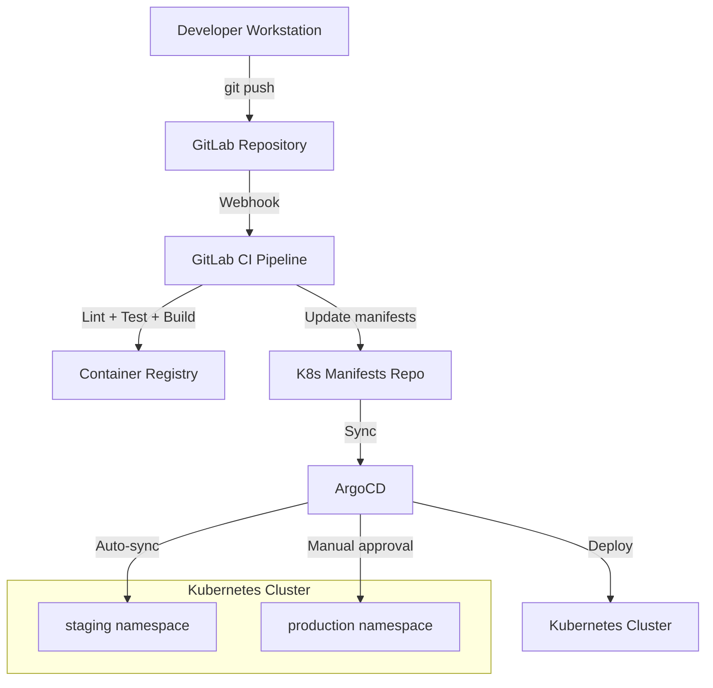
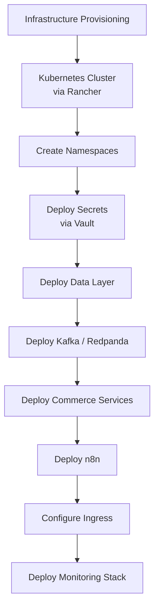
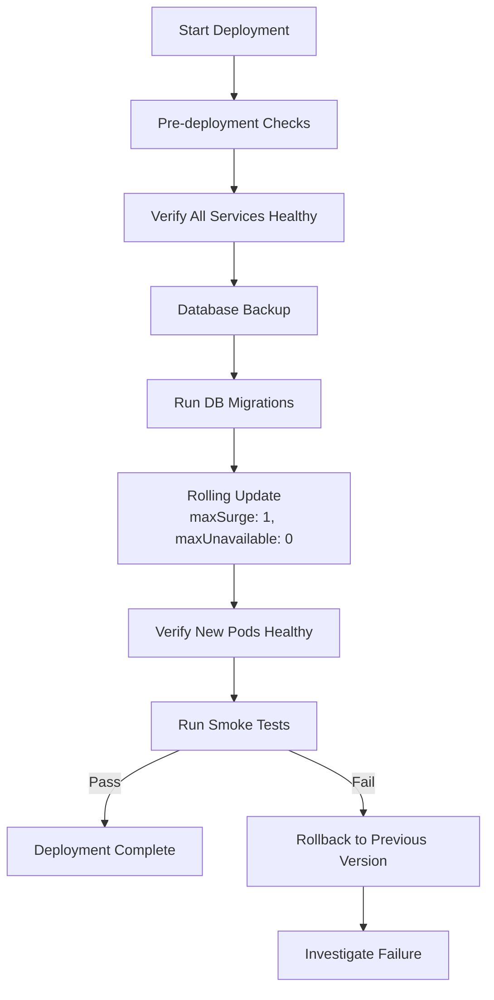
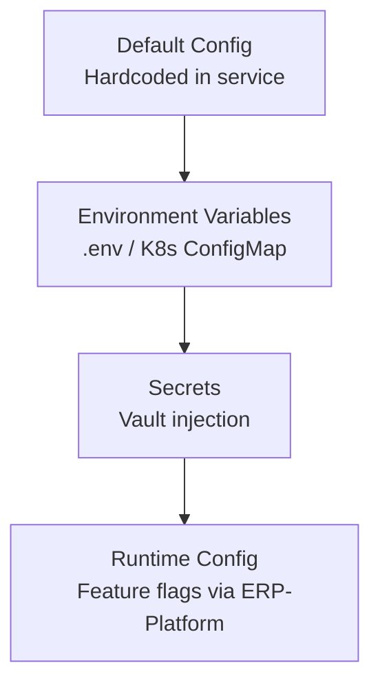

# Deployment Guide -- FusionCommerce (ERP-eCommerce)
> Version: 1.0 | Last Updated: 2026-02-23 | Status: Draft
> Classification: Internal | Author: AIDD System

## 1. Introduction

This document provides step-by-step procedures for deploying FusionCommerce across development, staging, and production environments. It covers local development with Docker Compose, Kubernetes deployment via ArgoCD, infrastructure provisioning, and operational runbook procedures.

## 2. Deployment Architecture Overview



## 3. Local Development (Docker Compose)

### 3.1 Prerequisites

- Docker Desktop 4.x with 8 GB RAM allocated
- Node.js 20 LTS
- npm 10.x

### 3.2 Quick Start

```bash
# Clone the repository
git clone https://gitlab.com/opensase/erp-ecommerce.git
cd erp-ecommerce

# Install dependencies
npm install

# Copy environment configuration
cp .env.example .env

# Start infrastructure + services
docker compose up --build
```

### 3.3 Service Ports

| Service | URL | Health Check |
|---------|-----|-------------|
| Catalog | http://localhost:3000 | http://localhost:3000/health |
| Orders | http://localhost:3001 | http://localhost:3001/health |
| Inventory | http://localhost:3002 | http://localhost:3002/health |
| Group Commerce | http://localhost:3003 | http://localhost:3003/health |
| Payments | http://localhost:3004 | http://localhost:3004/health |
| Shipping | http://localhost:3005 | http://localhost:3005/health |
| n8n | http://localhost:5678 | (admin: admin/password) |
| Redpanda Console | http://localhost:8080 | |
| Redpanda Kafka | localhost:19092 | |

### 3.4 Development Without Docker

```bash
# Set in-memory mode (no Kafka required)
export USE_IN_MEMORY_BUS=true

# Run individual services
npm run dev --workspace=@fusioncommerce/catalog-service
npm run dev --workspace=@fusioncommerce/orders-service
npm run dev --workspace=@fusioncommerce/inventory-service
```

## 4. Kubernetes Deployment

### 4.1 Cluster Provisioning



### 4.2 Namespace Structure

```bash
# Create namespaces
kubectl create namespace fusioncommerce
kubectl create namespace fusioncommerce-data
kubectl create namespace fusioncommerce-monitoring
```

### 4.3 Data Layer Deployment

```yaml
# YugabyteDB Helm deployment
helm repo add yugabytedb https://charts.yugabyte.com
helm install yugabyte yugabytedb/yugabyte \
  --namespace fusioncommerce-data \
  --set resource.tserver.requests.cpu=4 \
  --set resource.tserver.requests.memory=16Gi \
  --set resource.tserver.limits.cpu=8 \
  --set resource.tserver.limits.memory=32Gi \
  --set storage.tserver.size=500Gi \
  --set replicas.tserver=3 \
  --set replicas.master=3
```

```yaml
# Redpanda Helm deployment
helm repo add redpanda https://charts.redpanda.com
helm install redpanda redpanda/redpanda \
  --namespace fusioncommerce-data \
  --set statefulset.replicas=3 \
  --set resources.cpu.cores=4 \
  --set resources.memory.container.max=8Gi \
  --set storage.persistentVolume.size=200Gi
```

### 4.4 Service Deployment Template

```yaml
apiVersion: apps/v1
kind: Deployment
metadata:
  name: catalog-service
  namespace: fusioncommerce
spec:
  replicas: 3
  selector:
    matchLabels:
      app: catalog-service
  template:
    metadata:
      labels:
        app: catalog-service
    spec:
      containers:
      - name: catalog-service
        image: registry.opensase.io/fusioncommerce/catalog-service:latest
        ports:
        - containerPort: 3000
        env:
        - name: PORT
          value: "3000"
        - name: KAFKA_BROKERS
          value: "redpanda.fusioncommerce-data.svc:9092"
        - name: DATABASE_URL
          valueFrom:
            secretKeyRef:
              name: fusioncommerce-secrets
              key: database-url
        resources:
          requests:
            cpu: 250m
            memory: 256Mi
          limits:
            cpu: 1000m
            memory: 512Mi
        readinessProbe:
          httpGet:
            path: /health
            port: 3000
          initialDelaySeconds: 10
          periodSeconds: 5
        livenessProbe:
          httpGet:
            path: /health
            port: 3000
          initialDelaySeconds: 30
          periodSeconds: 10
---
apiVersion: autoscaling/v2
kind: HorizontalPodAutoscaler
metadata:
  name: catalog-service-hpa
  namespace: fusioncommerce
spec:
  scaleTargetRef:
    apiVersion: apps/v1
    kind: Deployment
    name: catalog-service
  minReplicas: 2
  maxReplicas: 10
  metrics:
  - type: Resource
    resource:
      name: cpu
      target:
        type: Utilization
        averageUtilization: 70
```

## 5. CI/CD Pipeline

### 5.1 GitLab CI Configuration

```yaml
stages:
  - lint
  - test
  - build
  - security
  - deploy

lint:
  stage: lint
  script:
    - npm ci
    - npm run lint

test:
  stage: test
  script:
    - npm ci
    - npm run test -- --coverage
  artifacts:
    reports:
      coverage_report:
        coverage_format: cobertura
        path: coverage/cobertura-coverage.xml

build:
  stage: build
  script:
    - docker build -t $CI_REGISTRY_IMAGE/catalog-service:$CI_COMMIT_SHA -f services/catalog/Dockerfile .
    - docker push $CI_REGISTRY_IMAGE/catalog-service:$CI_COMMIT_SHA
  parallel:
    matrix:
      - SERVICE: [catalog, orders, inventory, group-commerce, payments, shipping,
                   checkout-service, storefront-service, theme-service, search-service,
                   social-commerce-service, subscription-commerce-service, loyalty-service,
                   fulfillment-service, analytics-service]

security:
  stage: security
  script:
    - trivy image $CI_REGISTRY_IMAGE/catalog-service:$CI_COMMIT_SHA

deploy_staging:
  stage: deploy
  script:
    - argocd app sync fusioncommerce-staging
  environment:
    name: staging
  only:
    - develop

deploy_production:
  stage: deploy
  script:
    - argocd app sync fusioncommerce-production
  environment:
    name: production
  when: manual
  only:
    - main
```

## 6. Rolling Update Procedure



### 6.1 Pre-Deployment Checklist

| Step | Command | Expected |
|------|---------|----------|
| 1. Check cluster health | `kubectl get nodes` | All nodes Ready |
| 2. Check pod status | `kubectl get pods -n fusioncommerce` | All pods Running |
| 3. Check Kafka health | `rpk cluster health` | All brokers healthy |
| 4. Check DB health | `ysqlsh -c "SELECT 1"` | Connection successful |
| 5. Backup databases | `ysql_dump > backup.sql` | Backup created |
| 6. Run migrations | `npm run migrate` | Migrations applied |

### 6.2 Rollback Procedure

```bash
# Immediate rollback via ArgoCD
argocd app rollback fusioncommerce-production

# Or via kubectl
kubectl rollout undo deployment/catalog-service -n fusioncommerce
kubectl rollout undo deployment/orders-service -n fusioncommerce
# ... repeat for all affected services

# Verify rollback
kubectl rollout status deployment/catalog-service -n fusioncommerce
```

## 7. Environment Configuration

### 7.1 Secret Management

All secrets are stored in HashiCorp Vault and injected into Kubernetes via the Vault Agent Injector:

```yaml
annotations:
  vault.hashicorp.com/agent-inject: "true"
  vault.hashicorp.com/role: "fusioncommerce"
  vault.hashicorp.com/agent-inject-secret-db: "secret/data/fusioncommerce/database"
  vault.hashicorp.com/agent-inject-secret-stripe: "secret/data/fusioncommerce/stripe"
  vault.hashicorp.com/agent-inject-secret-easypost: "secret/data/fusioncommerce/easypost"
```

### 7.2 Configuration Hierarchy



## 8. Monitoring and Alerting

| Alert | Condition | Severity | Action |
|-------|-----------|----------|--------|
| Service down | Pod CrashLoopBackOff | Critical | Page on-call, auto-restart |
| High latency | p99 > 500ms for 5 min | Warning | Investigate, scale up |
| Error rate spike | 5xx rate > 1% for 5 min | Critical | Page on-call, check logs |
| Kafka lag | Consumer lag > 10K for 10 min | Warning | Scale consumers |
| DB connection pool | Available connections < 2 | Warning | Increase pool, investigate |
| Disk usage | > 80% on any data node | Warning | Add storage, archive data |
| Certificate expiry | < 7 days to expiry | Warning | Renew via Let's Encrypt |
