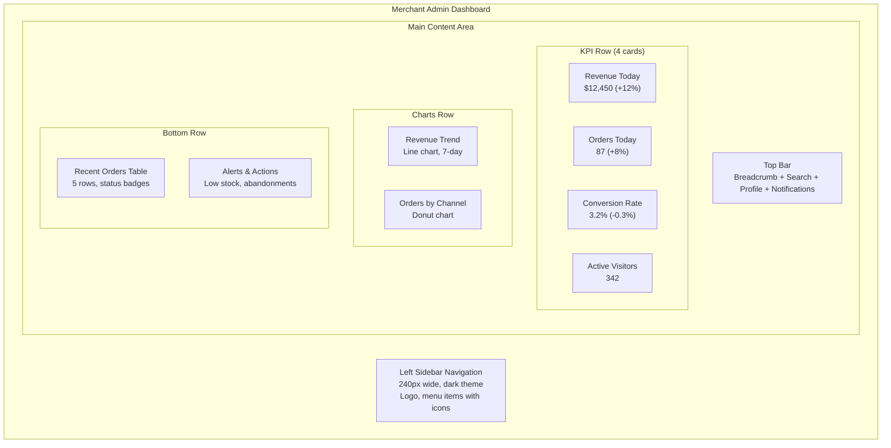
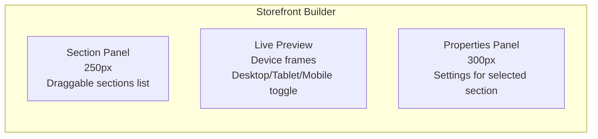
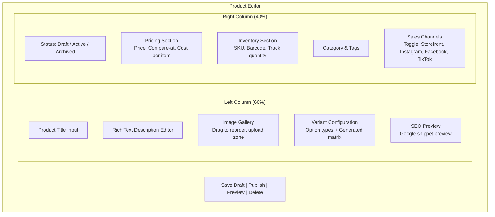
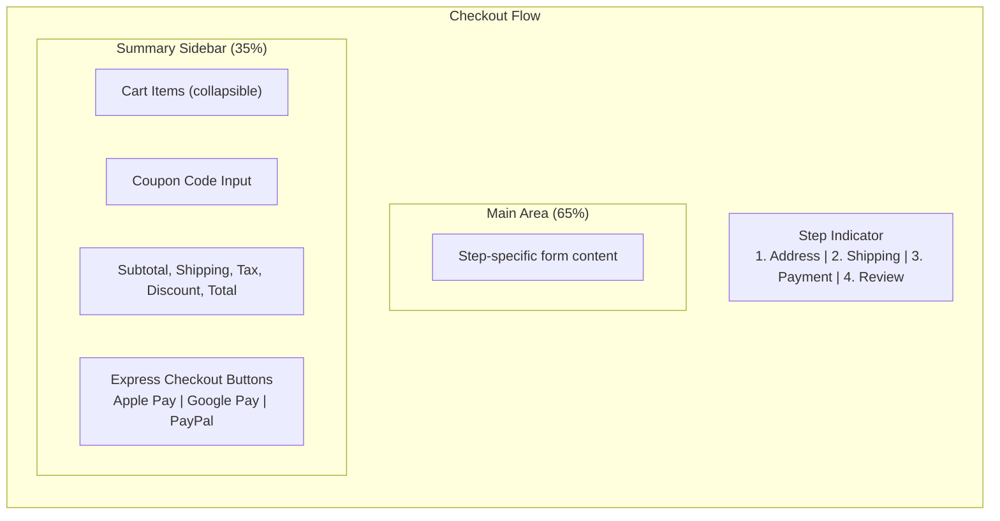
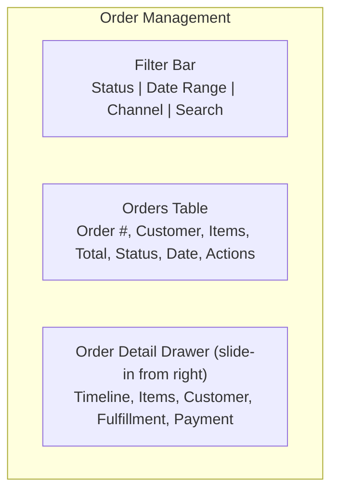
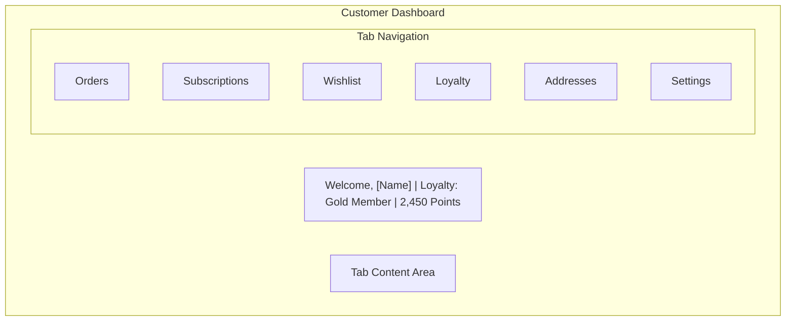
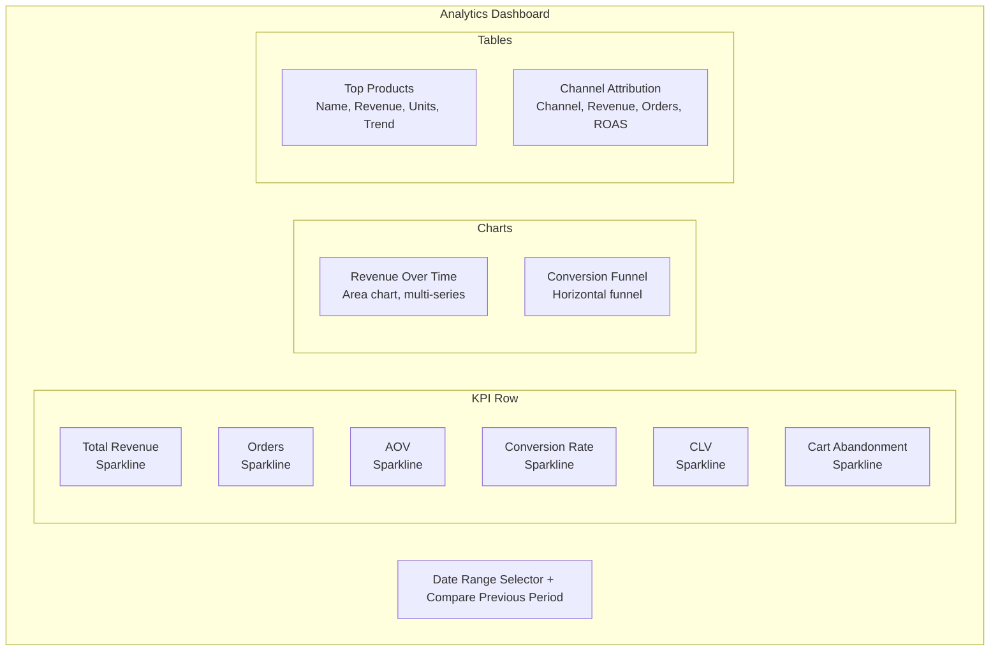
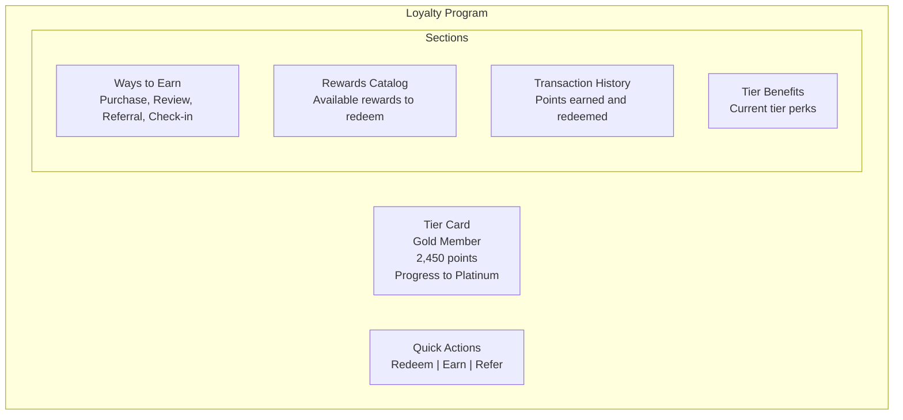
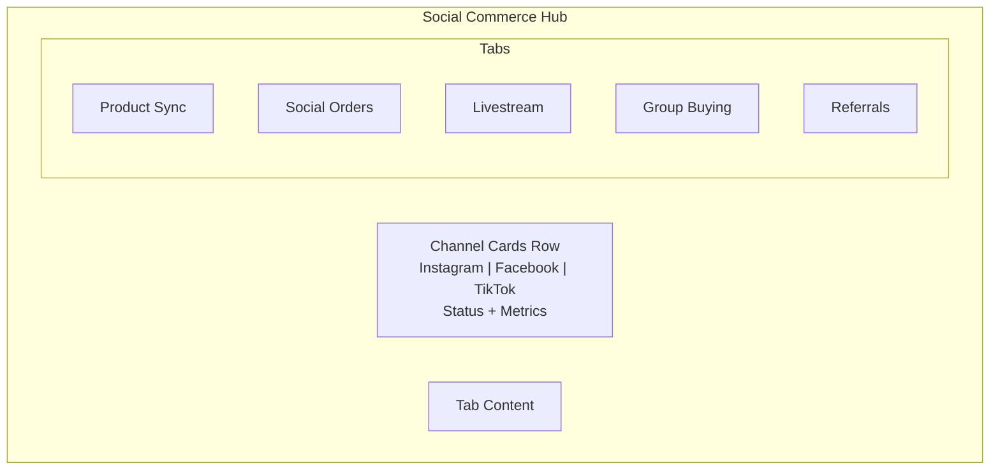
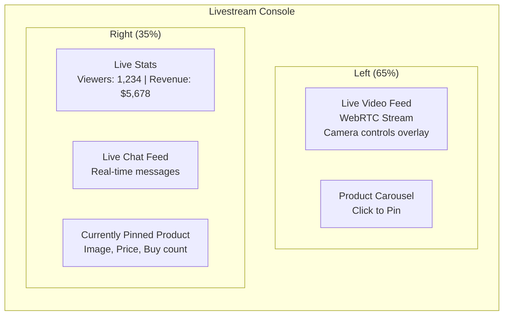

# Figma and Make.com Automation Prompts -- FusionCommerce (ERP-eCommerce)
> Version: 1.0 | Last Updated: 2026-02-23 | Status: Draft
> Classification: Internal | Author: AIDD System

## 1. Overview

This document provides detailed Figma design prompts for 10 core FusionCommerce screens and Make.com (formerly Integromat) automation prompts for workflow orchestration. Each Figma prompt includes layout specifications, component inventory, interaction states, and responsive breakpoints.

---

## 2. Figma Prompt 1: Merchant Admin Dashboard

**Screen Name:** `FC-Admin-Dashboard`
**Resolution:** 1440x900 (desktop), 768x1024 (tablet)

### Layout Specification

**Design Requirements:**
- Left sidebar: Dark navy (#1B2559) with white icons and labels, active state with accent bar
- KPI cards: White cards with shadow, large number (32px bold), percentage change with green/red indicator arrow
- Charts: Use Recharts-style clean line and donut charts, brand color palette
- Orders table: Alternating row colors, status badges (Pending=yellow, Shipped=blue, Delivered=green)
- Alerts panel: Red/orange alert icons, actionable buttons ("Restock", "Send Recovery Email")
- Responsive: On tablet, sidebar collapses to icon-only; KPI cards stack 2x2
- Interaction states: Hover effects on all clickable elements, loading skeleton states for data

---

## 3. Figma Prompt 2: Storefront Builder (Theme Engine)

**Screen Name:** `FC-Storefront-Builder`
**Resolution:** 1440x900 (desktop)

### Layout Specification

**Design Requirements:**
- Three-column layout: section palette (left), live preview (center), property editor (right)
- Section palette: Draggable cards for Hero Banner, Product Grid, Testimonials, Newsletter, Footer, Custom HTML
- Live preview: Actual storefront rendering in an iframe with device frame toggles (desktop, tablet, mobile icons)
- Properties panel: Form controls for colors (color picker), fonts (dropdown), spacing (slider), content (text inputs)
- Drag-and-drop visual indicators: Blue drop zone lines, ghost element during drag
- Theme selector: Thumbnail grid of 50+ themes at top, "Customize" button per theme
- Undo/Redo buttons in toolbar, Save Draft, Publish buttons
- States: Empty state ("Start by choosing a theme"), editing state, unsaved changes indicator

---

## 4. Figma Prompt 3: Product Editor

**Screen Name:** `FC-Product-Editor`
**Resolution:** 1440x900 (desktop)

### Layout Specification

**Design Requirements:**
- Two-column layout: main content (left 60%), sidebar (right 40%)
- Image gallery: Grid of thumbnails, drag to reorder, "Add Images" dropzone, first image marked "Primary"
- Variant section: Dynamic form -- select option types (Size, Color, Material), enter values, see auto-generated variant matrix table with per-variant SKU, price, inventory fields
- Rich text editor: Toolbar with bold, italic, lists, links, image embed
- SEO preview: Rendered like a Google search result (blue title, green URL, gray description)
- Pricing: Currency selector, margin calculator showing profit
- Sales channels: Toggle switches per channel with sync status indicator
- States: Form validation errors (red borders, error messages below fields), autosave indicator

---

## 5. Figma Prompt 4: Checkout Flow

**Screen Name:** `FC-Checkout-Flow`
**Resolution:** 1440x900 (desktop), 375x812 (mobile)

### Layout Specification

**Design Requirements:**
- Step indicator: Horizontal progress bar with numbered circles, completed steps show checkmark, current step highlighted
- Address step: Form with name, address line 1, line 2, city, state, zip, country dropdown, "Save address" checkbox
- Shipping step: Radio buttons for shipping options with carrier name, estimated delivery, and price
- Payment step: Stripe Elements card input (card number, expiry, CVC), Apple Pay and Google Pay buttons above card form, "Pay with PayPal" button, loyalty points slider
- Review step: Summary of all selections, "Place Order" prominent button, terms checkbox
- Order summary sidebar: Fixed position on scroll, item thumbnails with name, variant, quantity, price
- Mobile: Single column, order summary collapses to expandable accordion at top
- Express checkout buttons: Apple Pay (black), Google Pay (white with border), styled per brand guidelines
- Trust badges: Lock icon + "Secure Checkout", "30-day Returns", accepted payment method logos
- States: Loading spinner during payment processing, success checkmark animation, error states with retry

---

## 6. Figma Prompt 5: Order Management

**Screen Name:** `FC-Order-Management`
**Resolution:** 1440x900 (desktop)

### Layout Specification

**Design Requirements:**
- Filter bar: Dropdown for status (All, Pending, Confirmed, Shipped, Delivered, Cancelled), date range picker, channel filter (Direct, Instagram, Facebook, TikTok), text search
- Orders table: Sortable columns, bulk action checkboxes, status badges with colors, customer avatar and name, item count with expandable preview
- Order detail: Slide-in drawer (450px width) with sections: Order timeline (vertical timeline with events), Items list, Customer info (with link to CRM), Fulfillment status (pick/pack/ship progress), Payment details, Notes
- Actions: Fulfill, Cancel, Refund buttons with confirmation modals
- Bulk actions: Select multiple orders, "Fulfill Selected", "Print Labels", "Export"
- Empty state: Illustration with "No orders matching filters"

---

## 7. Figma Prompt 6: Customer Dashboard (Consumer)

**Screen Name:** `FC-Customer-Dashboard`
**Resolution:** 1440x900 (desktop), 375x812 (mobile)

### Layout Specification

**Design Requirements:**
- Header area: Customer name, loyalty tier badge (color-coded), points balance with "Redeem" button
- Tab navigation: Horizontal tabs on desktop, bottom tab bar on mobile
- Orders tab: Order cards with status timeline, "Track", "Return", "Reorder" buttons
- Subscriptions tab: Active subscription cards with next delivery date, "Skip", "Swap", "Pause" buttons
- Wishlist tab: Product grid with "Add to Cart" and "Remove" buttons, sale notification badges
- Loyalty tab: Points history, tier progress bar showing distance to next tier, available rewards
- Addresses tab: Address cards with "Edit", "Delete", "Set Default" actions
- Settings tab: Profile form, notification preferences toggles, privacy controls
- Mobile: Single column, cards stack vertically, tab bar at bottom (icons + labels)

---

## 8. Figma Prompt 7: Analytics Dashboard

**Screen Name:** `FC-Analytics-Dashboard`
**Resolution:** 1440x900 (desktop)

### Layout Specification

**Design Requirements:**
- Date range: Preset options (Today, 7 days, 30 days, 90 days, Custom), compare toggle
- KPI cards: Large metric number, mini sparkline chart (14-day trend), percentage change indicator
- Revenue chart: Area chart with gradient fill, multiple series (current vs. previous period), hover tooltip
- Funnel: Horizontal funnel visualization showing Visit -> Search -> PDP -> Cart -> Checkout -> Order with drop-off percentages
- Top products: Table with product thumbnail, name, revenue, units sold, 7-day trend sparkline
- Channel attribution: Stacked bar or table showing Direct, Organic, Social, Email, Paid channels
- Export button on each chart/table for CSV/PDF download
- Real-time indicator: Green pulsing dot + "Updated 5 seconds ago"

---

## 9. Figma Prompt 8: Loyalty Program (Consumer)

**Screen Name:** `FC-Loyalty-Program`
**Resolution:** 375x812 (mobile-first), 1440x900 (desktop)

### Layout Specification

**Design Requirements:**
- Tier card: Gradient background matching tier color (Gold = amber gradient), member name, points balance, circular progress indicator showing percent to next tier
- Quick actions: Three prominent CTA buttons with icons
- Ways to earn: Card grid showing earning opportunities with point values (e.g., "Write a Review: +50 pts")
- Rewards catalog: Product-style cards showing redeemable rewards with point cost
- Transaction history: Scrollable list with +/- point amounts, dates, and descriptions
- Gamification elements: Daily check-in button with streak counter, spin-to-win modal
- Mobile: Single column, swipeable sections, sticky bottom CTA bar
- Animations: Points counter animation when earning, confetti effect on tier upgrade

---

## 10. Figma Prompt 9: Social Commerce Hub (Admin)

**Screen Name:** `FC-Social-Commerce-Hub`
**Resolution:** 1440x900 (desktop)

### Layout Specification

**Design Requirements:**
- Channel cards: Platform logo + name, connection status (green dot = connected), key metrics (products synced, orders this month, revenue), "Settings" gear icon
- Product sync tab: Table showing product name, sync status per channel (checkmarks/warnings), last sync timestamp, "Sync Now" button
- Social orders tab: Orders table filtered to social channel origin, platform icon badge on each order
- Livestream tab: Upcoming events calendar, "Schedule New" button, past event cards with viewer/revenue metrics
- Group buying tab: Active campaigns with progress bars (participants/threshold), create new campaign button
- Referrals tab: Referral link management, top referrers leaderboard, referral analytics (clicks, conversions, revenue)
- Alert banners: Yellow for sync warnings, red for disconnected channels

---

## 11. Figma Prompt 10: Livestream Console

**Screen Name:** `FC-Livestream-Console`
**Resolution:** 1440x900 (desktop)

### Layout Specification

**Design Requirements:**
- Video feed: Large video player (16:9 aspect), camera/mic toggle overlay buttons, "Go Live" / "End Stream" prominent button
- Product carousel: Horizontal scrollable product cards below video, click product card to "Pin" it (shows to all viewers)
- Live stats: Real-time updating counters (viewers, peak viewers, revenue, items sold, avg watch time)
- Chat feed: Scrolling chat messages with username, message, purchase badges ("just bought!"), auto-scroll with "Scroll to bottom" button
- Pinned product: Large card showing currently pinned product with image, name, price, "X purchased" counter
- Product queue: Drag-and-drop reorder list of products planned for the stream
- Timer: Elapsed stream time in top-right corner
- States: Pre-live (countdown timer, test video), live (recording indicator red dot), post-live (summary stats)

---

## 12. Make.com Automation Prompts

### 12.1 Cart Abandonment Recovery

**Trigger:** Webhook from FusionCommerce (cart.abandoned event)
**Flow:**
1. Receive webhook with cart data (items, customer email, cart total)
2. Wait module: 1 hour delay
3. HTTP request: Check if cart still abandoned (GET /v1/cart/:id)
4. Router: If still abandoned, continue; if converted, stop
5. SendGrid: Send recovery email with 10% coupon and cart items
6. Wait module: 24 hour delay
7. HTTP request: Re-check cart status
8. Router: If still abandoned, send 15% coupon email
9. Wait module: 48 hour delay
10. Twilio: Send SMS with direct cart link

### 12.2 Order Processing Automation

**Trigger:** Webhook from FusionCommerce (order.created event)
**Flow:**
1. Receive order payload
2. HTTP request: AI fraud scoring API
3. Router: Score > 0.8 = approve, 0.5-0.8 = review, < 0.5 = reject
4. If approved: HTTP request to inventory service (reserve stock)
5. HTTP request: Process payment via Stripe
6. Router: Payment success or failure
7. If success: HTTP request to fulfillment service (create fulfillment)
8. SendGrid: Send order confirmation email
9. HTTP request: Award loyalty points

### 12.3 Subscription Renewal

**Trigger:** Schedule (daily at 6:00 AM UTC)
**Flow:**
1. HTTP request: GET /v1/subscriptions/due-today
2. Iterator: Loop through each subscription
3. HTTP request: POST /v1/payments/charge (saved payment method)
4. Router: Payment success or failure
5. If success: POST /v1/orders (create renewal order), update next renewal date
6. If failure: Increment retry count, schedule retry in 2 days
7. SendGrid: Send renewal confirmation or payment failure notification

### 12.4 Social Channel Sync

**Trigger:** Webhook from FusionCommerce (product.created, product.updated)
**Flow:**
1. Receive product data
2. Transform: Format product for Instagram catalog specification
3. HTTP request: POST to Instagram Graph API (catalog update)
4. Transform: Format product for Facebook Commerce specification
5. HTTP request: POST to Facebook Commerce API
6. Transform: Format product for TikTok Shop specification
7. HTTP request: POST to TikTok Shop API
8. Router: Log any sync failures
9. HTTP request: Update sync status in FusionCommerce

---

## 13. Design System Tokens

| Token | Value | Usage |
|-------|-------|-------|
| --color-primary | #4F46E5 (Indigo 600) | Primary buttons, links, active states |
| --color-secondary | #10B981 (Emerald 500) | Success states, positive metrics |
| --color-danger | #EF4444 (Red 500) | Error states, destructive actions |
| --color-warning | #F59E0B (Amber 500) | Warning banners, pending states |
| --color-surface | #FFFFFF | Card backgrounds |
| --color-background | #F9FAFB (Gray 50) | Page background |
| --color-sidebar | #1B2559 | Admin sidebar |
| --font-heading | Inter Bold | Headings, KPI numbers |
| --font-body | Inter Regular | Body text, form labels |
| --font-mono | JetBrains Mono | Code, SKUs, order numbers |
| --radius-sm | 6px | Buttons, inputs |
| --radius-md | 12px | Cards |
| --radius-lg | 16px | Modals, panels |
| --shadow-sm | 0 1px 2px rgba(0,0,0,0.05) | Cards |
| --shadow-md | 0 4px 6px rgba(0,0,0,0.1) | Elevated cards, dropdowns |
| --shadow-lg | 0 10px 15px rgba(0,0,0,0.1) | Modals |
