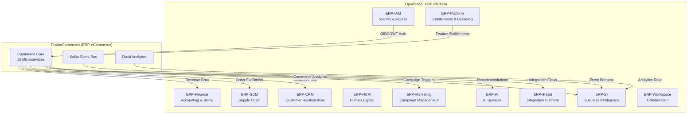
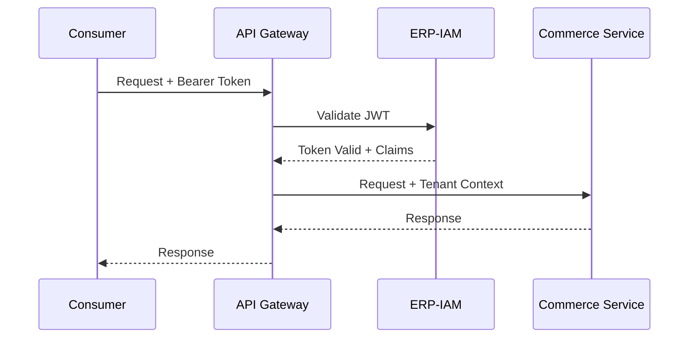
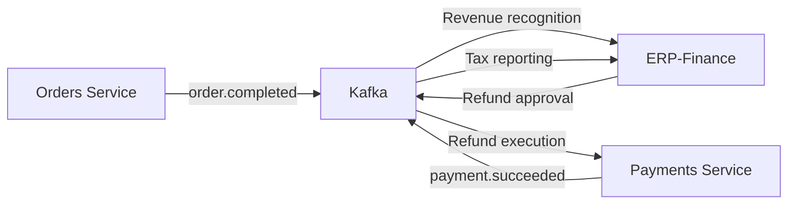
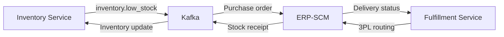
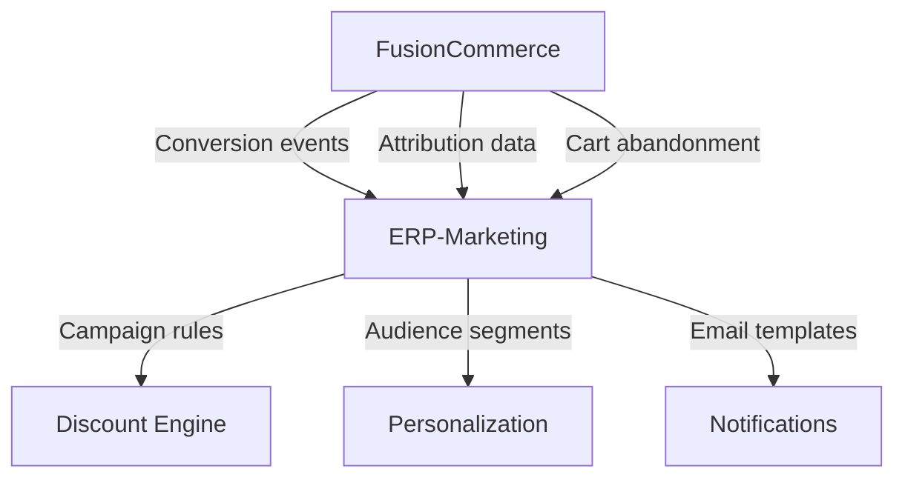
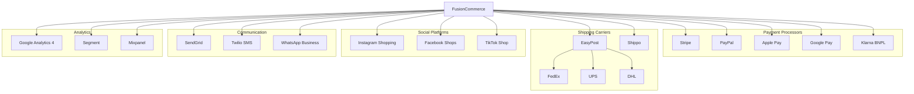
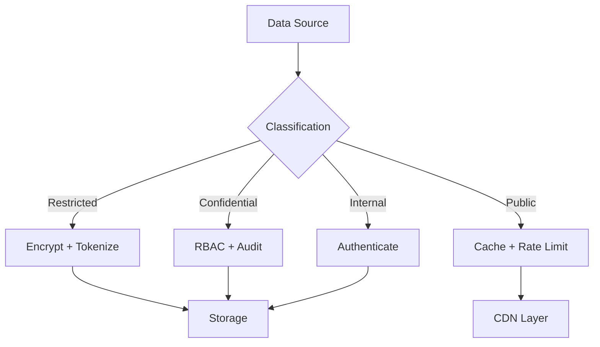

# Enterprise Architecture -- FusionCommerce (ERP-eCommerce)
> Version: 1.0 | Last Updated: 2026-02-23 | Status: Draft
> Classification: Internal | Author: AIDD System

## 1. Introduction

This document defines how FusionCommerce (ERP-eCommerce) integrates within the broader OpenSASE ERP ecosystem and external enterprise systems. It covers integration patterns, data flows, governance models, and alignment with enterprise architecture frameworks (TOGAF).

## 2. Enterprise Context

## 3. Integration Patterns

### 3.1 ERP-IAM Integration

FusionCommerce delegates all authentication and authorization to ERP-IAM using OIDC/JWT:

| Integration Point | Protocol | Data | Direction |
|-------------------|----------|------|-----------|
| Customer login | OIDC Authorization Code | User identity, roles | IAM -> eCommerce |
| Merchant login | OIDC + MFA | Admin identity, permissions | IAM -> eCommerce |
| API authentication | JWT Bearer | Access token, tenant_id | IAM -> eCommerce |
| User registration | REST API | Customer profile creation | eCommerce -> IAM |
| Role sync | Kafka event | Role assignments | IAM -> eCommerce |

### 3.2 ERP-Finance Integration

Every completed order and payment flows to ERP-Finance for accounting:

| Data Flow | Events | Frequency |
|-----------|--------|-----------|
| Revenue recording | order.completed -> finance.revenue.recorded | Per order |
| Tax remittance | order.completed -> finance.tax.calculated | Per order |
| Refund processing | finance.refund.approved -> payment.refund.executed | On demand |
| Settlement reconciliation | payment.batch.settled -> finance.reconciliation | Daily |
| Subscription billing | subscription.renewed -> finance.invoice.created | Per renewal |

### 3.3 ERP-SCM Integration

Supply chain management integrates for procurement and fulfillment:

### 3.4 ERP-CRM Integration

Customer data flows bidirectionally for a unified Customer 360 view:

| Direction | Data | Purpose |
|-----------|------|---------|
| eCommerce -> CRM | Purchase history, browse behavior, loyalty status | Customer 360 enrichment |
| CRM -> eCommerce | Support tickets, satisfaction scores, segments | Personalization signals |
| eCommerce -> CRM | Cart abandonment events | Outbound campaign triggers |
| CRM -> eCommerce | Customer preferences, communication consent | Compliance and targeting |

### 3.5 ERP-Marketing Integration

### 3.6 External Integration Map

## 4. Data Governance

### 4.1 Data Classification

| Classification | Examples | Controls |
|---------------|----------|----------|
| Restricted | Payment card data, PII | PCI DSS, encryption at rest and in transit, tokenization |
| Confidential | Order details, pricing, customer profiles | Role-based access, audit logging, encryption |
| Internal | Product catalog, themes, configurations | Authentication required, standard access controls |
| Public | Published product listings, reviews | Rate limiting, CDN caching |

### 4.2 Data Flow Governance

### 4.3 Data Retention Policies

| Data Type | Retention | Archival | Deletion |
|-----------|-----------|----------|----------|
| Order records | 7 years | After 2 years to cold storage | Upon GDPR erasure request |
| Payment data | Tokenized only; tokens expire per PCI policy | N/A | Token revocation |
| Customer profiles | Active account + 3 years inactive | After 1 year inactive | Upon account deletion |
| Analytics events | 3 years | After 1 year to Druid deep storage | Rolling purge |
| Product catalog | Indefinite while active | Upon product archival | Soft delete only |
| Session data | 30 days | None | Auto-expire in ScyllaDB |
| Loyalty points | Account lifetime + 1 year | None | Upon account closure |

## 5. TOGAF Architecture Alignment

### 5.1 Business Architecture

FusionCommerce supports the following business capabilities within the enterprise:
- **Commerce Execution**: Product sales, checkout, payment processing
- **Customer Engagement**: Loyalty, social commerce, subscriptions
- **Fulfillment Operations**: Warehouse, shipping, returns
- **Business Intelligence**: Sales analytics, customer insights, funnel optimization

### 5.2 Application Architecture

The 15-microservice decomposition follows Domain-Driven Design bounded contexts. Each service owns its data, publishes domain events, and communicates asynchronously through Kafka.

### 5.3 Technology Architecture

Standardized on Node.js/TypeScript with Fastify for all services, Kafka for events, and a polyglot persistence strategy (YugabyteDB, ScyllaDB, MinIO, Druid, OpenSearch).

### 5.4 Data Architecture

CQRS with event sourcing capability. Write models in YugabyteDB, read models in OpenSearch and Druid. All state changes captured as Kafka events for audit and replay.

## 6. Governance and Standards

| Standard | Scope | Enforcement |
|----------|-------|-------------|
| API versioning | All REST endpoints | URL path prefix (/v1/, /v2/) |
| Event schema | All Kafka topics | @fusioncommerce/contracts package |
| Authentication | All external endpoints | ERP-IAM JWT validation at gateway |
| Logging format | All services | Structured JSON, OpenTelemetry correlation |
| Health checks | All services | GET /health endpoint required |
| Error format | All API responses | Standardized error envelope |
| Multi-tenancy | All data | tenant_id column, row-level security |
