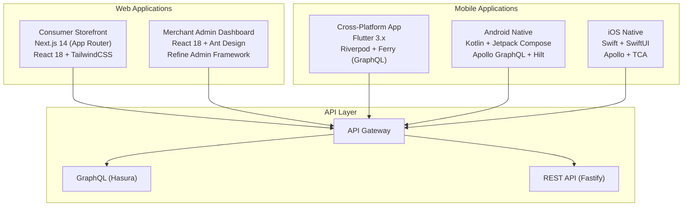
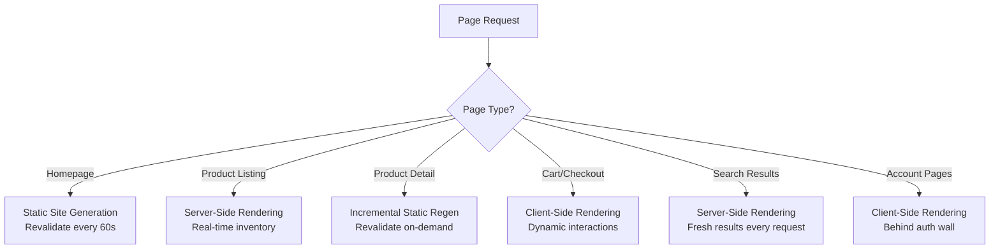
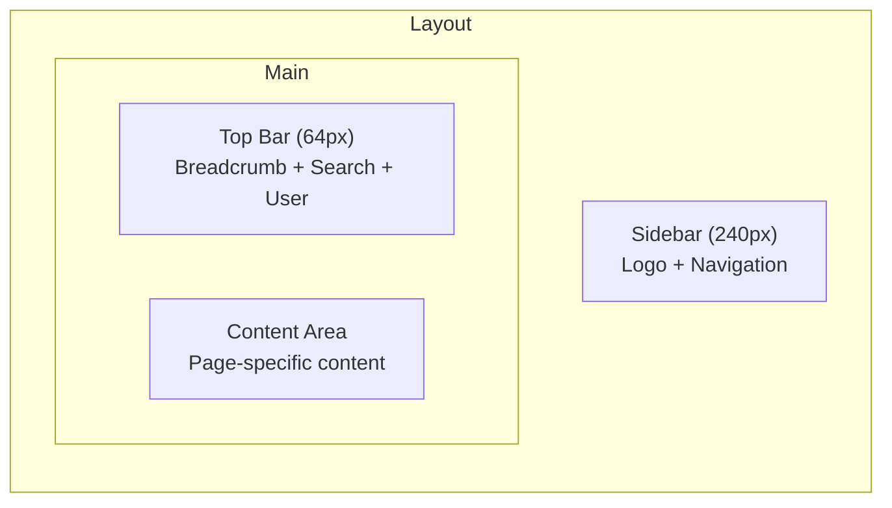
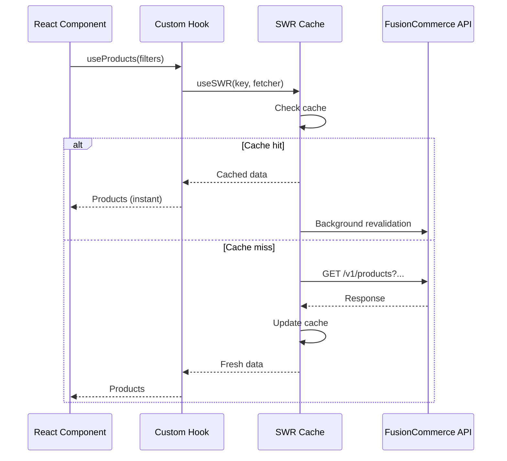
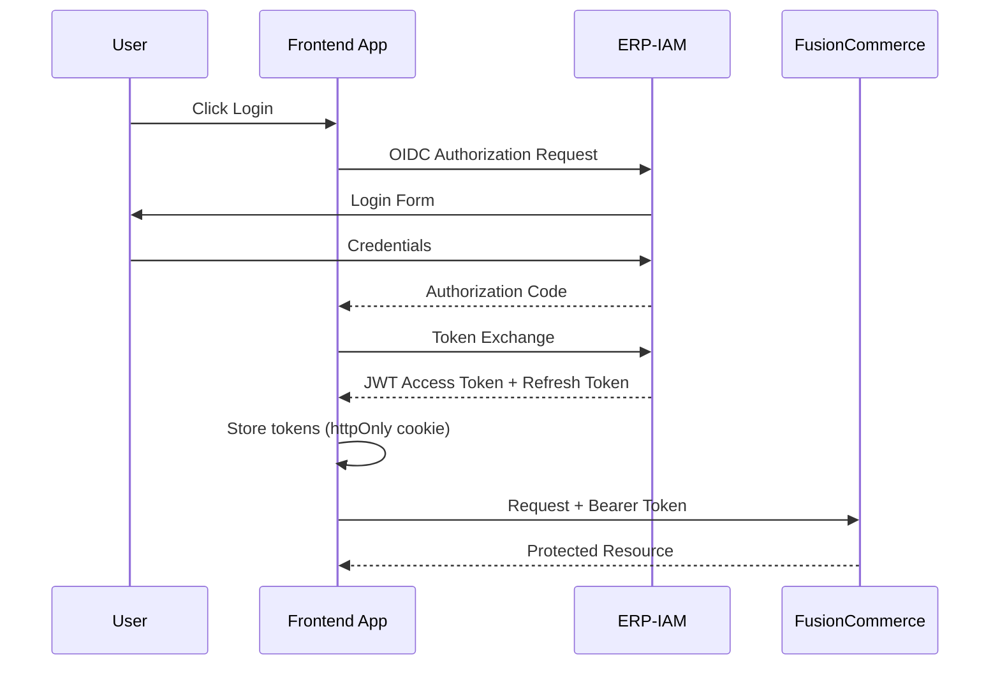

# Frontend Architecture -- FusionCommerce (ERP-eCommerce)
> Version: 1.0 | Last Updated: 2026-02-23 | Status: Draft
> Classification: Internal | Author: AIDD System

## 1. Introduction

This document describes the frontend architecture of FusionCommerce, covering the web storefront, merchant admin dashboard, and mobile applications. The architecture follows a headless commerce pattern where all frontends consume the same FusionCommerce API layer.

## 2. Frontend Application Map



## 3. Consumer Storefront (Next.js)

### 3.1 Technology Stack

| Technology | Version | Purpose |
|-----------|---------|---------|
| Next.js | 14 (App Router) | SSR/SSG framework with server components |
| React | 18 | UI component library |
| TailwindCSS | 3.x | Utility-first CSS framework |
| SWR | 2.x | Data fetching and caching |
| Zustand | 4.x | Client-side state management |
| Stripe.js | Latest | PCI-compliant payment UI |
| Framer Motion | Latest | Animations and transitions |

### 3.2 Application Structure

```
web/storefront/
  app/
    layout.tsx              # Root layout with header, footer
    page.tsx                # Homepage
    products/
      page.tsx              # Product listing (SSR)
      [slug]/page.tsx       # Product detail (SSR + ISR)
    cart/page.tsx            # Shopping cart (CSR)
    checkout/
      page.tsx              # Multi-step checkout
      confirmation/page.tsx # Order confirmation
    account/
      orders/page.tsx       # Order history
      subscriptions/page.tsx
      loyalty/page.tsx
      wishlist/page.tsx
    search/page.tsx         # Search results
  components/
    product/               # Product card, gallery, variant selector
    cart/                  # Cart drawer, line items
    checkout/              # Address form, payment, review
    search/                # Search bar, facets, results grid
    loyalty/               # Points display, tier badge
    social/                # Group buying widget, livestream player
  lib/
    api.ts                 # API client configuration
    hooks/                 # Custom React hooks
    utils/                 # Utility functions
  styles/
    globals.css            # Global styles
    theme.css              # Theme variables
```

### 3.3 Rendering Strategy



### 3.4 Performance Targets

| Metric | Target | Strategy |
|--------|--------|----------|
| LCP | < 1.5s | SSR/SSG, optimized images, CDN |
| FID | < 100ms | Code splitting, lazy loading |
| CLS | < 0.1 | Reserved image dimensions, font display swap |
| Lighthouse Score | > 90 | All Core Web Vitals optimized |
| Bundle Size | < 200KB (initial) | Tree shaking, dynamic imports |

## 4. Merchant Admin Dashboard (React)

### 4.1 Technology Stack

| Technology | Purpose |
|-----------|---------|
| React 18 | UI framework |
| Refine | Admin panel framework (CRUD generation) |
| Ant Design | Component library |
| React Query | Server state management |
| React Router | Navigation |
| Recharts | Charts and visualizations |
| React DnD | Drag and drop (theme builder) |

### 4.2 Application Structure

```
web/admin/
  src/
    pages/
      dashboard/          # Home dashboard with KPIs
      products/           # Product CRUD, variants, images
      orders/             # Order list, detail, fulfillment
      customers/          # Customer list, profiles
      discounts/          # Coupon management
      analytics/          # Druid-powered dashboards
      social/             # Social commerce hub
      loyalty/            # Loyalty program config
      subscriptions/      # Subscription management
      fulfillment/        # Warehouse, shipping
      themes/             # Theme builder (drag-and-drop)
      settings/           # Store configuration
    components/
      shared/             # Reusable admin components
      charts/             # Chart components (Recharts)
      forms/              # Form components
    providers/
      auth.tsx            # ERP-IAM OIDC provider
      data.tsx            # Refine data provider (REST)
    hooks/
      useOrders.ts
      useProducts.ts
      useAnalytics.ts
```

### 4.3 Admin Dashboard Layout



## 5. Mobile Architecture (Flutter)

### 5.1 State Management

```mermaid
flowchart TB
    UI[Widget Layer] --> PROV[Riverpod Providers]
    PROV --> REPO[Repository Layer]
    REPO --> GQL[Ferry GraphQL Client]
    REPO --> REST[HTTP Client (Dio)]
    GQL --> CACHE[Hive Local Cache]
    REST --> CACHE
```

### 5.2 Feature Modules

| Module | Screens | Key Interactions |
|--------|---------|-----------------|
| Auth | Login, Register, Forgot Password | Biometric auth, OAuth |
| Home | Featured products, categories, search | Pull-to-refresh, infinite scroll |
| Product | Detail, reviews, variants | Image gallery, variant selector |
| Cart | Cart, checkout, confirmation | Swipe to remove, Apple/Google Pay |
| Orders | History, detail, tracking | Real-time tracking map |
| Loyalty | Points, rewards, tier progress | Gamification animations |
| Account | Profile, addresses, preferences | Settings management |

## 6. Component Library

### 6.1 Shared Component Catalog

| Component | Props | Usage |
|-----------|-------|-------|
| ProductCard | product, variant, onAddToCart | Product grids, search results |
| PriceDisplay | amount, currency, compareAt | Product cards, checkout |
| VariantSelector | variants, selected, onChange | Product detail page |
| CartDrawer | items, onUpdate, onRemove | Slide-out cart |
| StarRating | rating, count, size | Product reviews |
| StatusBadge | status, type | Order status, fulfillment |
| SearchBar | onSearch, suggestions | Header, search page |
| FacetFilter | facets, selected, onChange | Search results sidebar |
| TierBadge | tier, points | Loyalty widgets |
| ProgressBar | current, target, label | Tier progress, campaign progress |

## 7. API Integration Pattern



## 8. Authentication Flow


