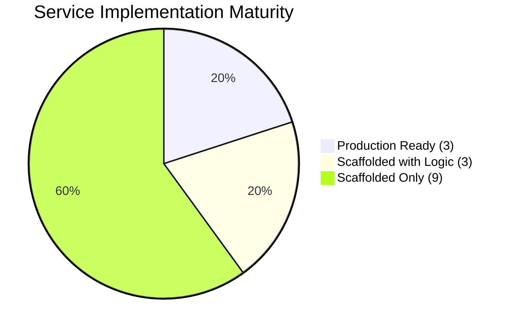
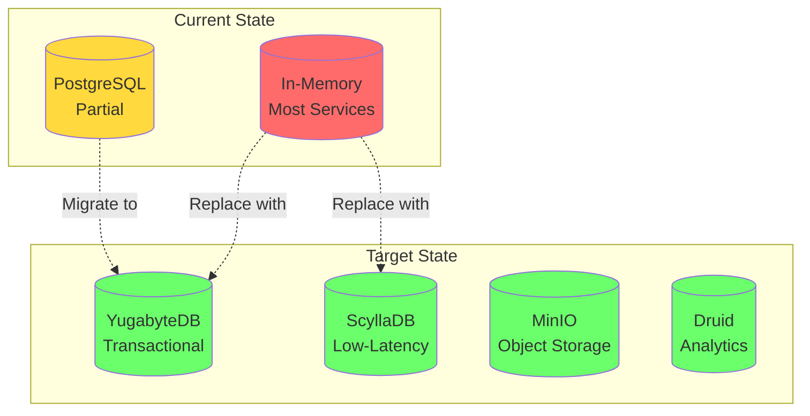
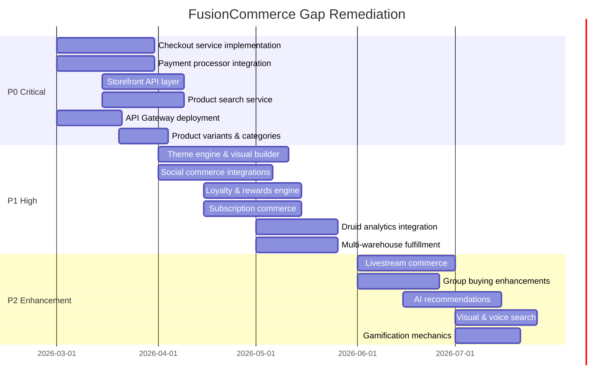

# Gap Analysis -- FusionCommerce (ERP-eCommerce)
> Version: 1.0 | Last Updated: 2026-02-23 | Status: Draft
> Classification: Internal | Author: AIDD System

## 1. Executive Summary

This gap analysis identifies the delta between FusionCommerce's current implementation state and its target-state vision as a composable commerce platform competing with Shopify, Magento, BigCommerce, and WooCommerce. The analysis covers functional gaps, architectural gaps, documentation gaps, operational gaps, and competitive parity gaps across all 15 microservices and supporting infrastructure.

## 2. Methodology

The current state was assessed by examining the actual codebase at `/ERP-eCommerce/`, including all 15 services, 5 packages, the `docs/` directory, and infrastructure configuration. The target state is derived from the PRD and competitive benchmarking against Shopify Plus, Adobe Commerce (Magento), BigCommerce Enterprise, and WooCommerce with premium plugins.

## 3. Service Implementation Status

| Service | Port | Implementation Level | Key Gaps |
|---------|------|---------------------|----------|
| catalog | 3000 | Production Ready | No variants, no categories, in-memory storage only |
| orders | 3001 | Production Ready | Limited status lifecycle, no cancellation/refund |
| inventory | 3002 | Production Ready | No multi-warehouse, no low-stock alerts |
| group-commerce | 3003 | Functional | No campaign expiry, no social sharing links |
| payments | 3004 | Scaffolded | Stripe integration not implemented |
| shipping | 3005 | Scaffolded | EasyPost/Shippo not integrated |
| checkout-service | - | Scaffolded | Multi-step flow not implemented |
| storefront-service | - | Scaffolded | Headless API surface not defined |
| theme-service | - | Scaffolded | Visual builder not implemented |
| search-service | - | Scaffolded | NLQ/visual/voice search not implemented |
| social-commerce-service | - | Scaffolded | No social platform integrations |
| subscription-commerce-service | - | Scaffolded | No recurring billing logic |
| loyalty-service | - | Scaffolded | No points engine or tier system |
| fulfillment-service | - | Scaffolded | No pick/pack/ship workflows |
| analytics-service | - | Scaffolded | No Druid integration |

## 4. Functional Gaps

### 4.1 Critical Gaps (P0 -- Blocking Go-Live)

| Gap ID | Area | Description | Impact | Remediation |
|--------|------|-------------|--------|-------------|
| FG-001 | Checkout | No multi-step checkout flow exists | Cannot complete purchases | Implement checkout-service with cart, shipping, payment, review steps |
| FG-002 | Payments | Stripe/PayPal integration not implemented | No payment processing | Integrate Stripe SDK, implement webhook handling |
| FG-003 | Storefront | No headless storefront API layer | No consumer-facing experience | Build storefront-service with product, cart, collection endpoints |
| FG-004 | Shipping | No carrier integration for label generation | Cannot fulfill orders | Integrate EasyPost or Shippo APIs |
| FG-005 | Search | No product search beyond basic list endpoint | Poor product discovery | Implement search-service with full-text indexing |
| FG-006 | Catalog | No product variants (size, color) | Cannot sell variable products | Add variant model to catalog service |
| FG-007 | Auth | No customer authentication | No account-based features | Integrate ERP-IAM OIDC/JWT flows |

### 4.2 High Priority Gaps (P1 -- Required for Competitive Parity)

| Gap ID | Area | Description | Impact | Remediation |
|--------|------|-------------|--------|-------------|
| FG-010 | Theme | No visual theme builder | Merchants cannot customize storefront | Build theme-service with drag-and-drop builder |
| FG-011 | Social | No Instagram/Facebook/TikTok integration | Missing major sales channels | Implement social-commerce-service with platform APIs |
| FG-012 | Loyalty | No points/rewards system | Cannot incentivize repeat purchases | Build loyalty-service with points engine |
| FG-013 | Subscription | No recurring order management | Cannot offer subscription boxes | Build subscription-commerce-service |
| FG-014 | Analytics | No Druid integration for real-time dashboards | No business intelligence | Connect analytics-service to Druid cluster |
| FG-015 | Fulfillment | No multi-warehouse routing | Single location only | Implement warehouse routing in fulfillment-service |
| FG-016 | Cart Abandon | No abandonment detection or recovery | Lost revenue from abandoned carts | Implement detection in checkout + n8n recovery workflows |

### 4.3 Competitive Parity Gaps (vs. Shopify/Magento)

| Feature | Shopify | Magento | FusionCommerce Status | Gap |
|---------|---------|---------|----------------------|-----|
| Product reviews | Native | Extension | Not implemented | Need review system with moderation |
| Gift cards | Native | Native | Not implemented | Need digital gift card service |
| SEO tools | Native | Native | Not implemented | Need meta tags, sitemaps, structured data |
| Email marketing | Shopify Email | Extension | Not implemented | Need email campaign integration |
| Blog/CMS | Native | CMS module | Not implemented | Need content management for storefront |
| Multi-language | Native (20 langs) | Native | Not implemented | Need i18n framework |
| Tax automation | Shopify Tax | Extension | Not implemented | Need tax calculation engine |

## 5. Architectural Gaps

### 5.1 Data Layer Gaps

| Gap ID | Component | Current | Target | Priority |
|--------|-----------|---------|--------|----------|
| AG-001 | Primary DB | PostgreSQL (3 services) + In-Memory (12 services) | YugabyteDB for all transactional data | P0 |
| AG-002 | Session store | None | ScyllaDB for sessions, counters, wallet balances | P1 |
| AG-003 | Object storage | None | MinIO for product images, UGC, theme assets | P0 |
| AG-004 | Analytics DB | None | Apache Druid for real-time analytics | P1 |
| AG-005 | Search engine | None | OpenSearch/MeiliSearch for product search | P0 |
| AG-006 | Cache layer | None | Redis for API response caching, rate limiting | P0 |

### 5.2 Infrastructure Gaps

| Gap ID | Component | Current | Target | Priority |
|--------|-----------|---------|--------|----------|
| AG-010 | API Gateway | None | Kong/Traefik with rate limiting, auth, routing | P0 |
| AG-011 | Service mesh | None | Istio/Linkerd for mTLS, observability | P1 |
| AG-012 | Observability | None | OpenTelemetry + Grafana stack | P0 |
| AG-013 | CI/CD | Basic Docker builds | GitLab CI + ArgoCD GitOps pipeline | P1 |
| AG-014 | CDN | None | Cloudflare for static assets and edge caching | P1 |

## 6. Documentation Gaps

| Document | Exists in docs/ | Quality | Gaps |
|----------|----------------|---------|------|
| PRD | Yes | Good | Needs social commerce, loyalty, subscription detail |
| BRD | Yes | Basic | Needs ROI analysis and competitive detail |
| Architecture | Yes | Good | Needs target-state architecture with all 15 services |
| HLD | Yes | Good | Needs updating for new services |
| LLD | Yes | Basic | Needs code-level detail for all services |
| Database Schema | Yes | Partial | Only covers 3 services, needs all 15 |
| API Documentation | Yes | Basic | Needs OpenAPI specs for all endpoints |
| Use Cases | Yes | Good | Needs social commerce and loyalty use cases |
| Deployment Guide | Yes | Basic | Needs production deployment procedures |
| Training Materials | Yes | Shells only | Need substantial content |
| Figma Prompts | Exists | Basic | Needs all 10 screen specifications |

## 7. Remediation Roadmap

## 8. Effort Estimation

| Priority | Gap Count | Estimated Effort | Team Size | Duration |
|----------|-----------|-----------------|-----------|----------|
| P0 Critical | 7 functional + 4 architectural | 45 person-weeks | 6 engineers | 8 weeks |
| P1 High | 7 functional + 5 architectural | 60 person-weeks | 6 engineers | 10 weeks |
| P2 Enhancement | 10 features | 50 person-weeks | 4 engineers | 12 weeks |
| **Total** | **33 gaps** | **155 person-weeks** | **6 engineers** | **30 weeks** |

## 9. Conclusion

FusionCommerce has a solid architectural foundation with Kafka event-driven patterns, a well-organized monorepo, and 3 production-ready core services. The primary gaps are in the 12 services that remain at scaffold level, the absence of key infrastructure components (search engine, cache, CDN, observability), and the need for full polyglot persistence migration from in-memory to YugabyteDB/ScyllaDB/MinIO. Closing the P0 gaps is estimated at 8 weeks with a team of 6, after which FusionCommerce will achieve minimum viable product status for merchant beta launch.
