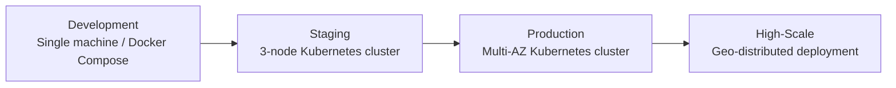
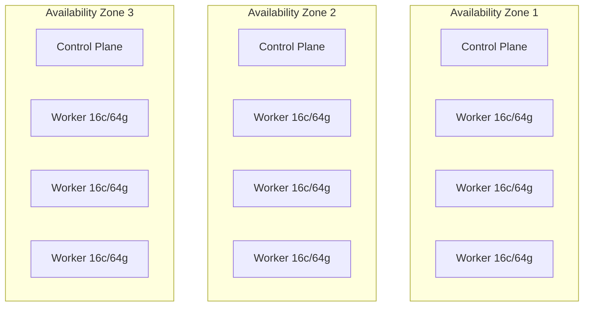
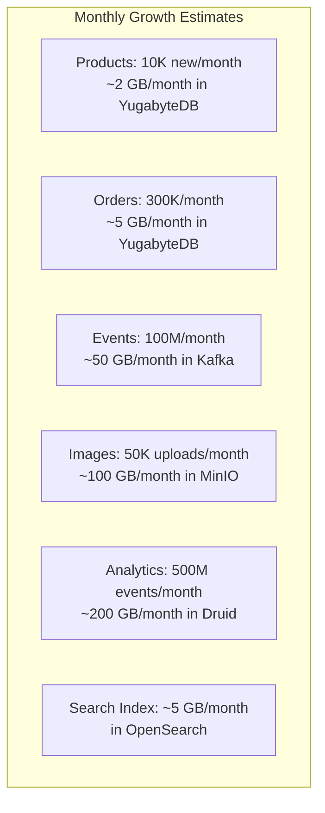

# Hardware Requirements -- FusionCommerce (ERP-eCommerce)
> Version: 1.0 | Last Updated: 2026-02-23 | Status: Draft
> Classification: Internal | Author: AIDD System

## 1. Introduction

This document specifies the hardware and infrastructure requirements for deploying FusionCommerce across development, staging, and production environments. Sizing is based on projected workloads of up to 100,000 concurrent users and 10,000 orders per second.

## 2. Environment Tiers

## 3. Development Environment

**Purpose:** Individual developer workstation for local development and testing.

| Component | Requirement |
|-----------|------------|
| CPU | 4+ cores (8 recommended for running all 15 services) |
| RAM | 16 GB minimum, 32 GB recommended |
| Disk | 50 GB SSD (for node_modules, Docker images, databases) |
| OS | macOS 13+, Ubuntu 22.04+, Windows 11 (WSL2) |
| Docker | Docker Desktop 4.x with 8 GB allocated RAM |
| Node.js | v20 LTS |
| Network | Stable internet for npm registry and container pulls |

**Docker Compose Resource Allocation:**

| Container | CPU Limit | Memory Limit |
|-----------|-----------|-------------|
| Redpanda (Kafka) | 1 core | 1 GB |
| Each microservice (x6 minimum) | 0.25 core | 256 MB |
| n8n | 0.5 core | 512 MB |
| PostgreSQL | 0.5 core | 512 MB |
| Redis | 0.25 core | 256 MB |
| **Total** | **4 cores** | **5 GB** |

## 4. Staging Environment

**Purpose:** Pre-production environment for integration testing, performance testing, and UAT.

### 4.1 Kubernetes Cluster

| Component | Specification | Quantity |
|-----------|--------------|----------|
| Control Plane | 2 vCPU, 4 GB RAM | 3 nodes (HA) |
| Worker Nodes | 8 vCPU, 32 GB RAM, 200 GB SSD | 3 nodes |
| Total Cluster | 30 vCPU, 108 GB RAM | 6 nodes |

### 4.2 Data Infrastructure

| Component | Specification | Quantity |
|-----------|--------------|----------|
| YugabyteDB | 4 vCPU, 16 GB RAM, 500 GB NVMe | 3 nodes (RF=3) |
| Kafka (Redpanda) | 4 vCPU, 8 GB RAM, 200 GB NVMe | 3 brokers |
| ScyllaDB | 4 vCPU, 8 GB RAM, 200 GB NVMe | 3 nodes |
| MinIO | 2 vCPU, 4 GB RAM, 1 TB HDD | 4 nodes (erasure coded) |
| OpenSearch | 4 vCPU, 16 GB RAM, 200 GB SSD | 3 nodes |
| Apache Druid | 4 vCPU, 16 GB RAM, 500 GB SSD | 3 nodes |
| Redis | 2 vCPU, 4 GB RAM | 3 nodes (Sentinel) |

### 4.3 Staging Total

| Resource | Total |
|----------|-------|
| vCPU | 94 |
| RAM | 216 GB |
| Storage (SSD/NVMe) | 5 TB |
| Storage (HDD) | 4 TB |

## 5. Production Environment

**Purpose:** Customer-facing deployment supporting 100,000 concurrent users with 99.99% uptime SLA.

### 5.1 Kubernetes Cluster (Multi-AZ)

| Component | Specification | Quantity (per AZ) | Total |
|-----------|--------------|-------------------|-------|
| Control Plane | 4 vCPU, 8 GB RAM | 1 | 3 |
| Worker Nodes | 16 vCPU, 64 GB RAM, 500 GB NVMe | 3 | 9 |

### 5.2 Data Infrastructure (Production)

| Component | Specification | Quantity | Total Resources |
|-----------|--------------|----------|-----------------|
| YugabyteDB | 8 vCPU, 32 GB RAM, 1 TB NVMe | 6 nodes (RF=3, 2/AZ) | 48 vCPU, 192 GB RAM |
| Kafka (Redpanda) | 8 vCPU, 16 GB RAM, 500 GB NVMe | 6 brokers (2/AZ) | 48 vCPU, 96 GB RAM |
| ScyllaDB | 8 vCPU, 16 GB RAM, 500 GB NVMe | 6 nodes (RF=3) | 48 vCPU, 96 GB RAM |
| MinIO | 4 vCPU, 8 GB RAM, 4 TB HDD | 8 nodes (erasure coded) | 32 vCPU, 64 GB RAM |
| OpenSearch | 8 vCPU, 32 GB RAM, 500 GB SSD | 6 nodes (3 master, 3 data) | 48 vCPU, 192 GB RAM |
| Apache Druid | 8 vCPU, 32 GB RAM, 1 TB SSD | 6 nodes (broker, coordinator, historical, middleManager) | 48 vCPU, 192 GB RAM |
| Redis | 4 vCPU, 16 GB RAM | 6 nodes (3 primary + 3 replica) | 24 vCPU, 96 GB RAM |

### 5.3 Production Total

| Resource | Kubernetes | Data Layer | Grand Total |
|----------|-----------|------------|-------------|
| vCPU | 156 | 296 | **452** |
| RAM | 588 GB | 928 GB | **1,516 GB** |
| NVMe/SSD | 4.5 TB | 12 TB | **16.5 TB** |
| HDD | - | 32 TB | **32 TB** |
| Nodes | 12 | 44 | **56** |

## 6. Network Requirements

| Requirement | Specification |
|-------------|--------------|
| Inter-node bandwidth | 10 Gbps minimum |
| Internet bandwidth | 1 Gbps (asymmetric, 80% egress) |
| Network latency (intra-AZ) | < 1ms |
| Network latency (cross-AZ) | < 5ms |
| Public IPs | 3 (Load Balancer, 1 per AZ) |
| Private subnet | /20 per AZ (4096 IPs) |
| DNS | Cloudflare managed DNS |
| TLS certificates | Let's Encrypt wildcard (auto-renewed) |

## 7. Capacity Planning

### 7.1 Storage Growth Projections

### 7.2 12-Month Storage Forecast

| Component | Initial | Month 6 | Month 12 |
|-----------|---------|---------|----------|
| YugabyteDB | 50 GB | 92 GB | 134 GB |
| Kafka | 100 GB | 400 GB | 700 GB |
| MinIO | 200 GB | 800 GB | 1.4 TB |
| Druid | 100 GB | 1.3 TB | 2.5 TB |
| OpenSearch | 20 GB | 50 GB | 80 GB |
| Redis | 2 GB | 4 GB | 8 GB |
| **Total** | **472 GB** | **2.6 TB** | **4.8 TB** |

## 8. Disaster Recovery

| Component | RPO | RTO | Strategy |
|-----------|-----|-----|----------|
| YugabyteDB | 0 (sync replication) | 30 seconds (auto-failover) | Multi-AZ RF=3 |
| Kafka | 0 (ISR replication) | 60 seconds (leader election) | Multi-AZ RF=3 |
| ScyllaDB | 0 (sync replication) | 30 seconds | Multi-AZ RF=3 |
| MinIO | Near-zero (erasure coding) | 5 minutes | Erasure coded, 8-node |
| OpenSearch | 1 hour (snapshot) | 30 minutes (restore) | Hourly snapshots to MinIO |
| Druid | Kafka replay | 1 hour (re-ingest) | Deep storage in MinIO |
| Configuration | Real-time (GitOps) | 15 minutes (ArgoCD sync) | Git repository |

## 9. Recommended Cloud Sizing (Equivalent)

### AWS Equivalents

| Component | Instance Type | Count |
|-----------|--------------|-------|
| K8s Worker | m6i.4xlarge (16 vCPU, 64 GB) | 9 |
| YugabyteDB | i3.2xlarge (8 vCPU, 61 GB, NVMe) | 6 |
| Kafka | m6i.2xlarge (8 vCPU, 32 GB) | 6 |
| ScyllaDB | i3.2xlarge | 6 |
| OpenSearch | r6g.2xlarge (8 vCPU, 64 GB) | 6 |
| Druid | r6i.2xlarge (8 vCPU, 64 GB) | 6 |
| Redis | r6g.xlarge (4 vCPU, 26 GB) | 6 |
| MinIO | c6id.xlarge (4 vCPU, 8 GB) | 8 |

### Estimated Monthly Cloud Cost (AWS us-east-1)

| Component | Monthly Cost |
|-----------|-------------|
| Kubernetes cluster (EC2) | $5,800 |
| YugabyteDB (EC2 + EBS) | $4,200 |
| Kafka (EC2 + EBS) | $3,100 |
| ScyllaDB (EC2) | $4,200 |
| OpenSearch (EC2 + EBS) | $3,800 |
| Druid (EC2 + EBS) | $3,800 |
| Redis (EC2) | $2,400 |
| MinIO (EC2 + EBS) | $2,800 |
| Network & Load Balancers | $1,500 |
| **Total** | **$31,600/month** |
