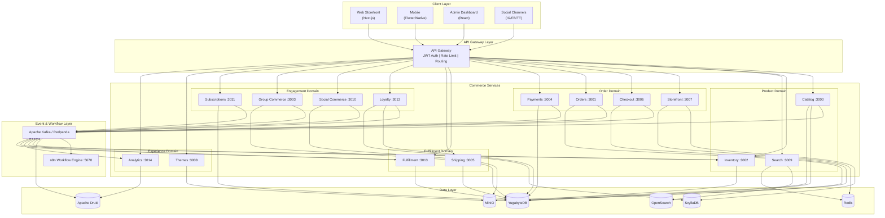
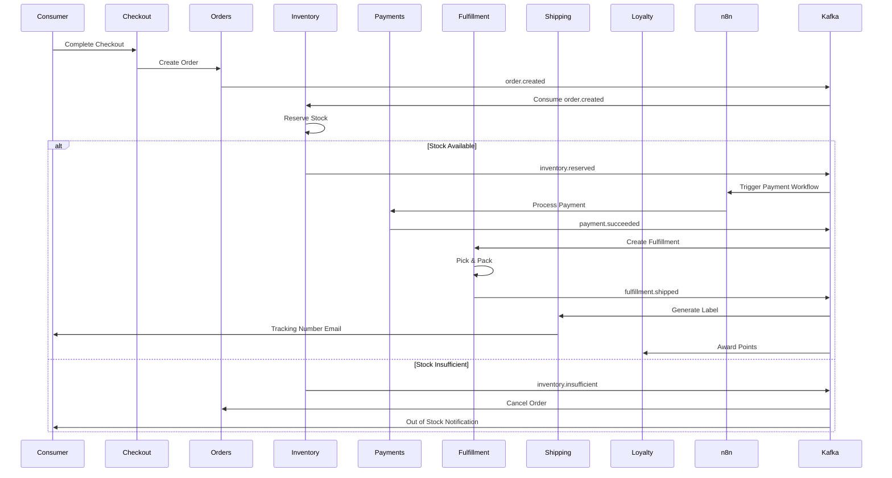
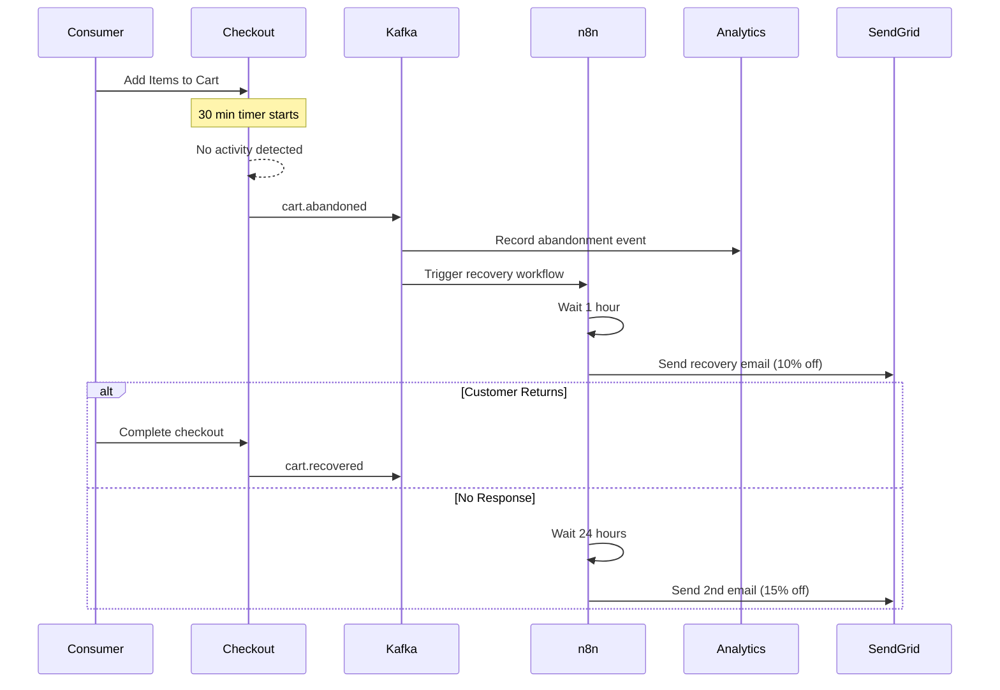
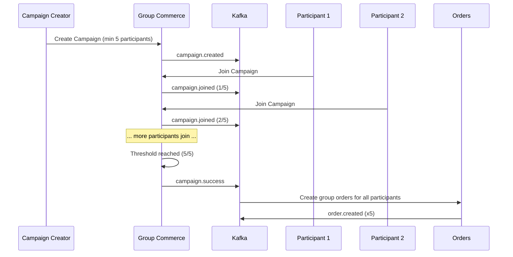
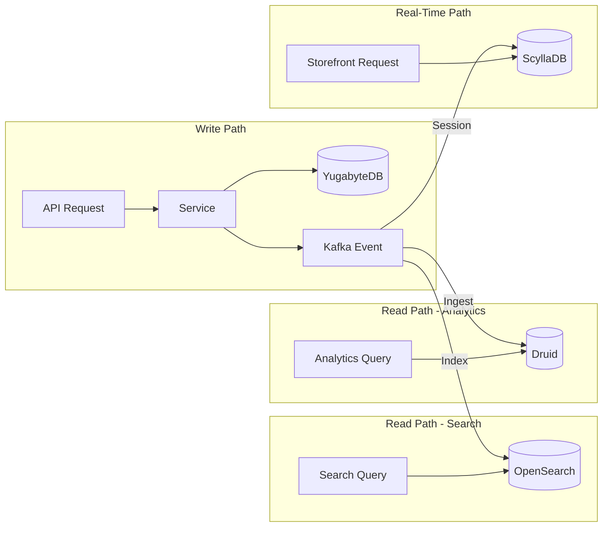
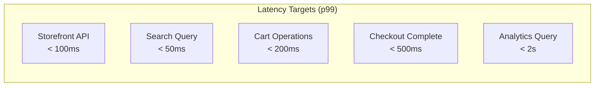
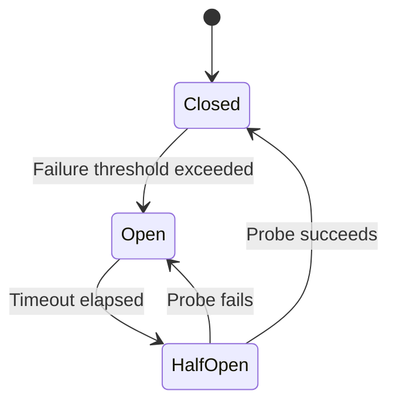
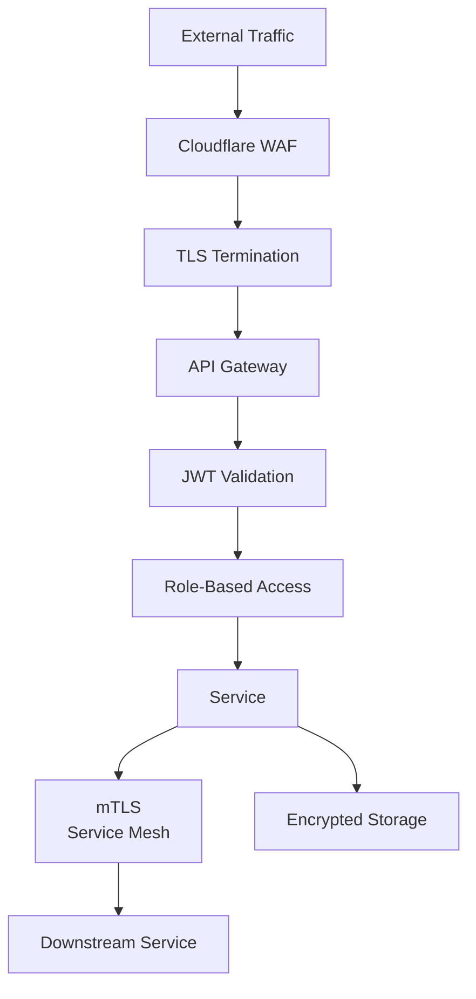

# High-Level Design -- FusionCommerce (ERP-eCommerce)
> Version: 1.0 | Last Updated: 2026-02-23 | Status: Draft
> Classification: Internal | Author: AIDD System

## 1. Introduction

This High-Level Design document describes the system-level architecture of FusionCommerce, covering the 15 microservices, their interactions, data flows, event topology, and deployment strategy at a level suitable for architecture review and capacity planning.

## 2. System Overview

FusionCommerce is a composable, event-driven commerce platform implemented as a TypeScript monorepo. It contains 15 microservices, 5 shared packages, multi-platform client applications, and infrastructure configuration for Apache Kafka (Redpanda), n8n workflow engine, and a polyglot persistence layer.

### 2.1 High-Level Component Diagram



## 3. Service Descriptions

### 3.1 Product Domain

| Service | Port | Responsibility | Key APIs |
|---------|------|---------------|----------|
| Catalog | 3000 | Product CRUD, variants, categories, images, reviews | POST/GET/PUT/DELETE /products, /categories, /collections |
| Inventory | 3002 | Stock levels, reservations, multi-warehouse allocation | PUT /inventory/:sku, GET /inventory/:sku, POST /inventory/reserve |
| Search | 3009 | NLQ, full-text, faceted, visual, voice search; merchandising rules | GET /search?q=, POST /search/visual, GET /search/suggest |

### 3.2 Order Domain

| Service | Port | Responsibility | Key APIs |
|---------|------|---------------|----------|
| Storefront | 3007 | Headless API aggregation, cart, wishlist, recently viewed | GET /storefront/products, POST /cart, GET /wishlist |
| Checkout | 3006 | Multi-step checkout, guest checkout, coupon/discount engine | POST /checkout/start, PUT /checkout/:id/shipping, POST /checkout/:id/complete |
| Orders | 3001 | Order lifecycle, status management, order history | POST /orders, GET /orders/:id, PUT /orders/:id/status |
| Payments | 3004 | Payment processing, Stripe/PayPal integration, refunds | POST /payments/intent, POST /payments/confirm, POST /payments/refund |

### 3.3 Fulfillment Domain

| Service | Port | Responsibility | Key APIs |
|---------|------|---------------|----------|
| Fulfillment | 3013 | Pick/pack/ship workflows, multi-warehouse routing, 3PL | POST /fulfillments, PUT /fulfillments/:id/pack, PUT /fulfillments/:id/ship |
| Shipping | 3005 | Label generation, carrier integration, tracking | POST /shipments, GET /shipments/:id/tracking, POST /shipments/rates |

### 3.4 Engagement Domain

| Service | Port | Responsibility | Key APIs |
|---------|------|---------------|----------|
| Loyalty | 3012 | Points, tiers, cashback, digital wallet, gamification | POST /loyalty/earn, POST /loyalty/redeem, GET /loyalty/balance |
| Social Commerce | 3010 | Instagram/Facebook/TikTok sync, livestream, referrals | POST /social/sync, POST /social/livestream, GET /social/referrals |
| Group Commerce | 3003 | Group buying campaigns, participant management | POST /campaigns, POST /campaigns/:id/join, GET /campaigns/:id |
| Subscriptions | 3011 | Subscription plans, recurring billing, skip/pause/swap | POST /subscriptions, PUT /subscriptions/:id/skip, PUT /subscriptions/:id/swap |

### 3.5 Experience Domain

| Service | Port | Responsibility | Key APIs |
|---------|------|---------------|----------|
| Themes | 3008 | Visual builder, template rendering, theme management | GET /themes, POST /themes/:id/customize, GET /themes/:id/render |
| Analytics | 3014 | Druid queries, funnel analysis, cohort, attribution | GET /analytics/funnel, GET /analytics/cohort, GET /analytics/clv |

## 4. Event Flow Architecture

### 4.1 Order Processing Saga



### 4.2 Cart Abandonment Recovery



### 4.3 Group Buying Flow



## 5. Data Flow Summary



## 6. Scalability Design

### 6.1 Horizontal Scaling Strategy

| Component | Scaling Approach | Min Replicas | Max Replicas | Scale Trigger |
|-----------|-----------------|-------------|-------------|---------------|
| Catalog | HPA (CPU/Memory) | 2 | 10 | CPU > 70% |
| Orders | HPA (CPU/Memory) | 3 | 15 | CPU > 60% |
| Checkout | HPA (Custom - active carts) | 3 | 20 | Active carts > 5000 |
| Search | HPA (Latency) | 3 | 12 | p99 > 80ms |
| Storefront | HPA (RPS) | 3 | 25 | RPS > 1000/pod |
| Kafka | Partition-based | 3 brokers | 9 brokers | Partition lag > 10K |
| YugabyteDB | Tablet splitting | 3 nodes | 9 nodes | Tablet size > 10GB |

### 6.2 Performance Targets



## 7. Failure Handling

### 7.1 Circuit Breaker Pattern



Applied to all external service calls (Stripe, EasyPost, social platform APIs) with configurable thresholds:
- **Failure threshold**: 5 consecutive failures
- **Timeout**: 30 seconds
- **Probe interval**: 10 seconds

### 7.2 Dead Letter Queue Strategy

Failed Kafka event processing routes to DLQ topics for manual review and replay:

```
order.created          -> order.created.dlq
payment.succeeded      -> payment.succeeded.dlq
inventory.reserved     -> inventory.reserved.dlq
```

## 8. Security Architecture



| Layer | Control | Implementation |
|-------|---------|----------------|
| Edge | WAF, DDoS protection | Cloudflare |
| Transport | TLS 1.3 | Let's Encrypt certificates |
| Authentication | JWT validation | ERP-IAM OIDC |
| Authorization | RBAC + ABAC | Per-service policy enforcement |
| Service-to-Service | mTLS | Istio service mesh |
| Data at Rest | AES-256 encryption | YugabyteDB encryption |
| PCI Compliance | Tokenization | Stripe.js / PayPal.js (client-side) |
