# Low-Level Design -- FusionCommerce (ERP-eCommerce)
> Version: 1.0 | Last Updated: 2026-02-23 | Status: Draft
> Classification: Internal | Author: AIDD System

## 1. Introduction

This Low-Level Design document provides implementation-level detail for each FusionCommerce microservice, including class hierarchies, method signatures, data structures, algorithm descriptions, and API endpoint specifications.

## 2. Catalog Service (catalog-service)

### 2.1 Class Diagram

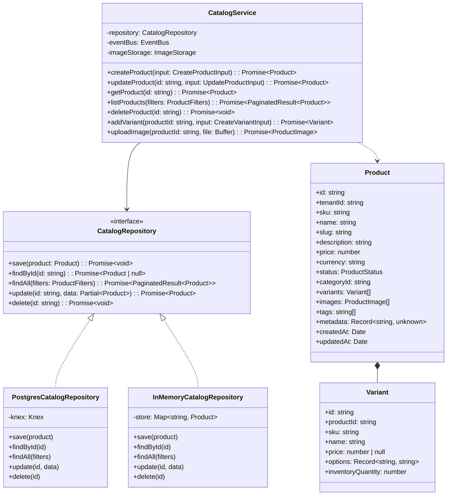

### 2.2 API Endpoints

| Method | Path | Request | Response | Description |
|--------|------|---------|----------|-------------|
| POST | /v1/products | CreateProductInput JSON | 201 Product | Create product, emit product.created |
| GET | /v1/products | ?page, limit, category, brand, status | 200 PaginatedResult | List products with filtering |
| GET | /v1/products/:id | - | 200 Product | Get product with variants and images |
| PUT | /v1/products/:id | UpdateProductInput JSON | 200 Product | Update product, emit product.updated |
| DELETE | /v1/products/:id | - | 204 No Content | Soft-delete product |
| POST | /v1/products/:id/variants | CreateVariantInput JSON | 201 Variant | Add product variant |
| POST | /v1/products/:id/images | multipart/form-data | 201 ProductImage | Upload image to MinIO |
| GET | /v1/categories | ?parent_id | 200 Category[] | List categories |
| POST | /v1/categories | CreateCategoryInput JSON | 201 Category | Create category |

## 3. Checkout Service (checkout-service)

### 3.1 Checkout State Machine

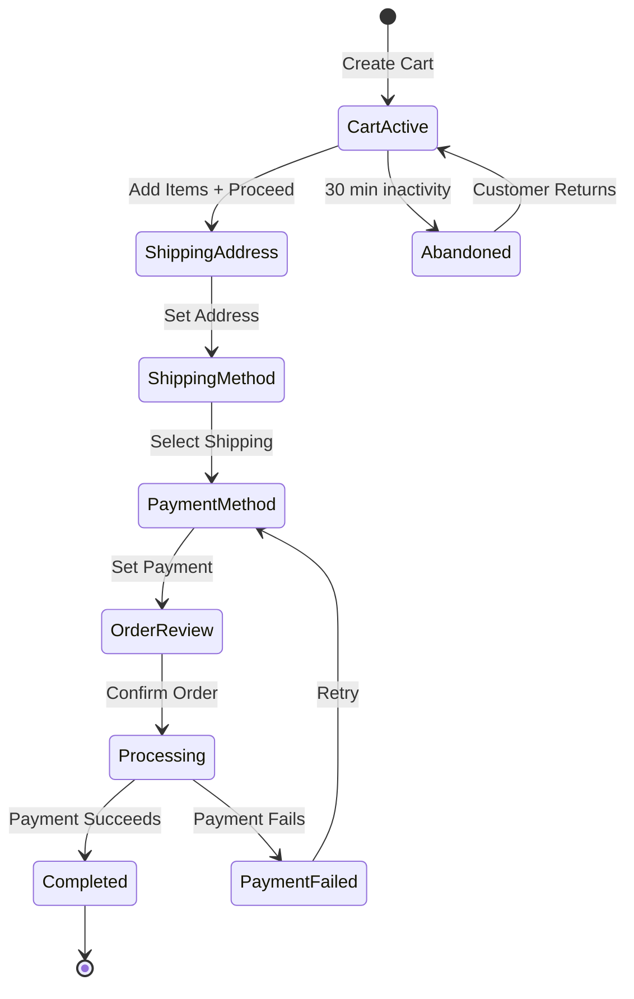

### 3.2 Checkout Class Structure

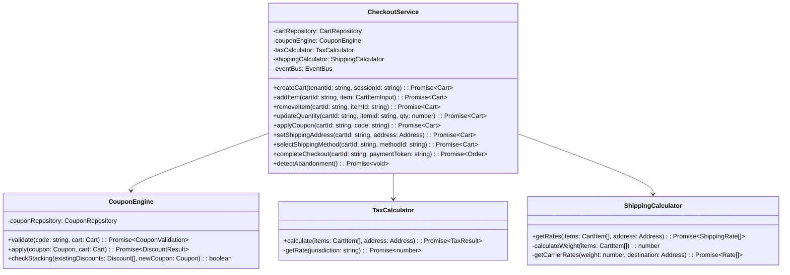

### 3.3 Coupon Engine Algorithm

```
FUNCTION validateCoupon(code, cart):
    coupon = couponRepository.findByCode(code)
    IF coupon IS NULL: RETURN { valid: false, reason: "INVALID_CODE" }
    IF coupon.isActive IS false: RETURN { valid: false, reason: "INACTIVE" }
    IF now() < coupon.startsAt: RETURN { valid: false, reason: "NOT_YET_ACTIVE" }
    IF coupon.expiresAt AND now() > coupon.expiresAt: RETURN { valid: false, reason: "EXPIRED" }
    IF coupon.maxUses AND coupon.usedCount >= coupon.maxUses: RETURN { valid: false, reason: "MAX_USES" }
    IF cart.subtotal < coupon.minPurchase: RETURN { valid: false, reason: "MIN_PURCHASE" }
    IF NOT checkStacking(cart.existingDiscounts, coupon): RETURN { valid: false, reason: "STACKING" }
    RETURN { valid: true, discount: calculateDiscount(coupon, cart) }
```

## 4. Search Service (search-service)

### 4.1 Search Pipeline

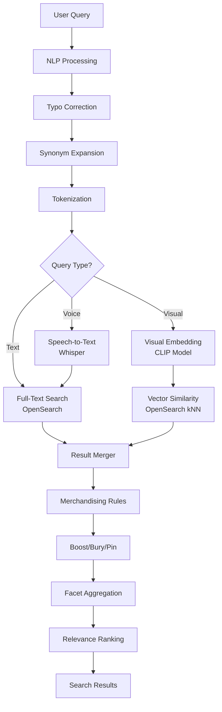

### 4.2 Merchandising Rules Engine

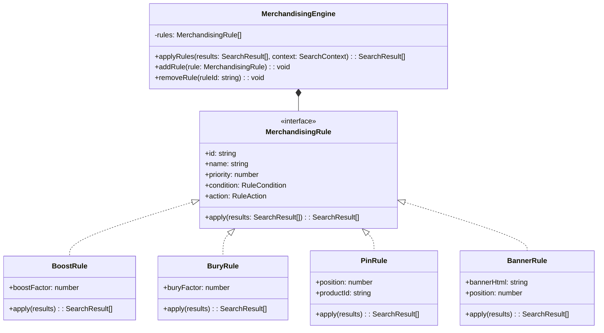

## 5. Loyalty Service (loyalty-service)

### 5.1 Points Calculation Engine

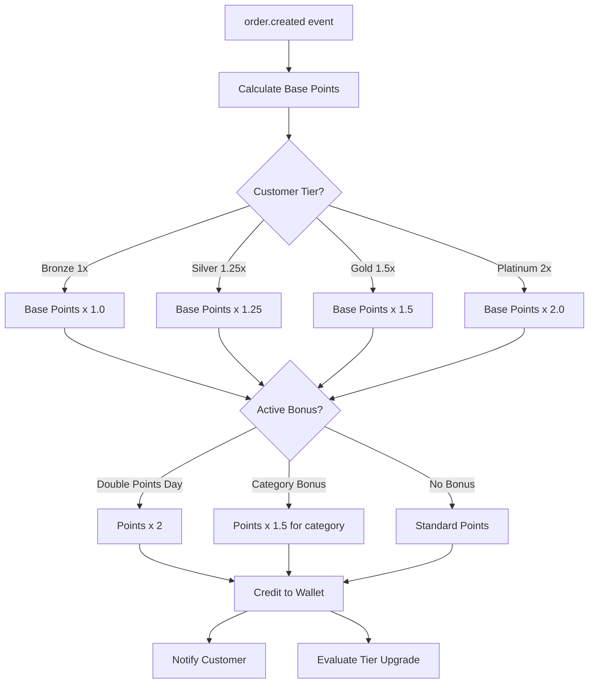

### 5.2 Tier Evaluation Algorithm

```
FUNCTION evaluateTier(customerId):
    account = loyaltyRepository.findByCustomer(customerId)
    spend12m = orderRepository.sumSpendLast12Months(customerId)

    newTier = CASE
        WHEN spend12m >= 5000: 'platinum'
        WHEN spend12m >= 2000: 'gold'
        WHEN spend12m >= 500:  'silver'
        ELSE: 'bronze'

    IF newTier > account.currentTier:
        account.currentTier = newTier
        account.tierUpgradedAt = now()
        eventBus.publish('loyalty.tier_upgraded', { customerId, newTier })
    ELSE IF newTier < account.currentTier:
        IF monthsSince(account.tierUpgradedAt) > 3:  // Grace period
            account.currentTier = newTier
            eventBus.publish('loyalty.tier_downgraded', { customerId, newTier })

    loyaltyRepository.save(account)
```

## 6. Subscription Commerce Service (subscription-commerce-service)

### 6.1 Subscription Lifecycle State Machine

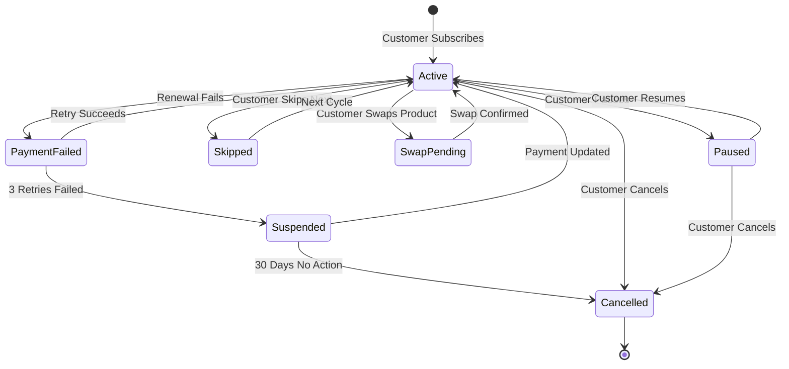

### 6.2 Renewal Processing

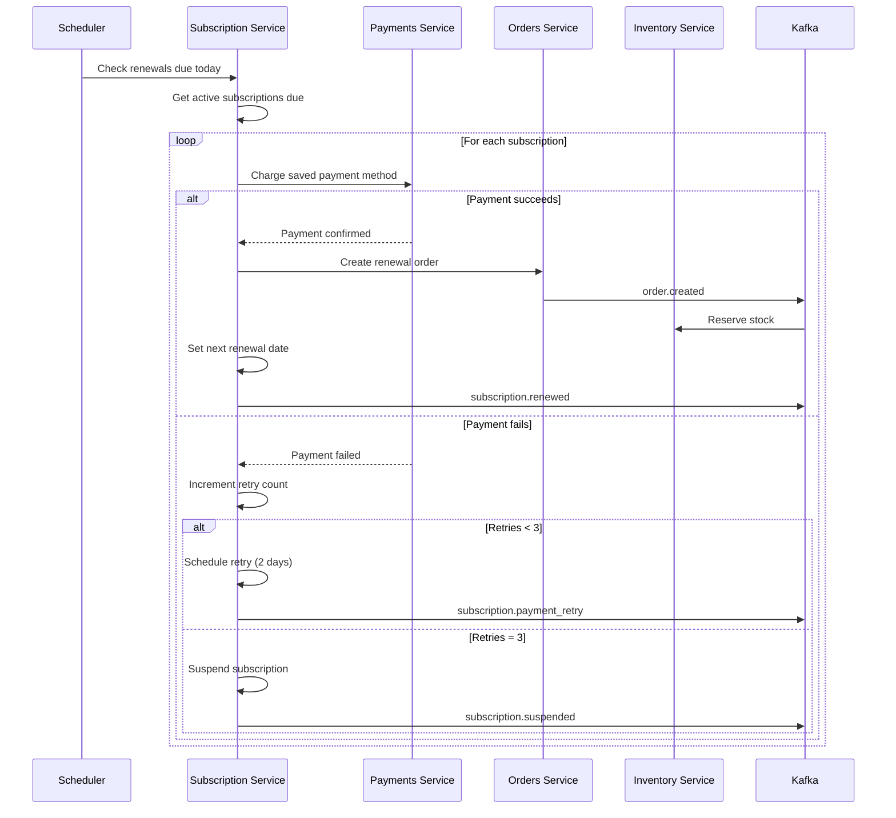

## 7. Fulfillment Service (fulfillment-service)

### 7.1 Multi-Warehouse Routing Algorithm

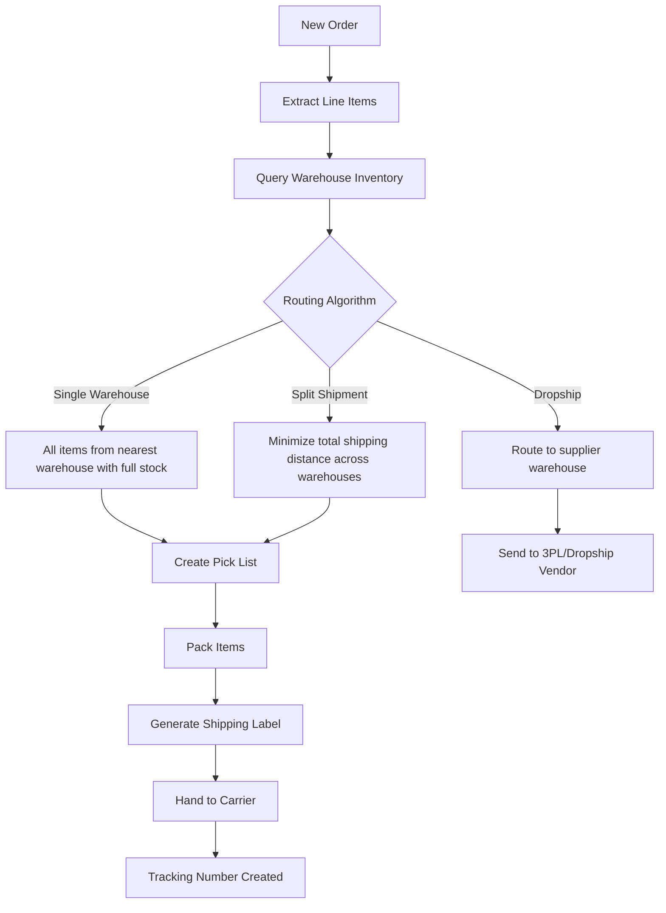

### 7.2 Warehouse Selection Algorithm

```
FUNCTION selectWarehouse(items, shippingAddress):
    warehouses = warehouseRepository.findAll()
    candidates = []

    FOR EACH warehouse IN warehouses:
        availability = checkAllItemsAvailable(warehouse.id, items)
        IF availability.allAvailable:
            distance = calculateDistance(warehouse.location, shippingAddress)
            shippingCost = estimateShippingCost(distance, items.totalWeight)
            candidates.push({ warehouse, distance, shippingCost, type: 'single' })

    IF candidates.length > 0:
        RETURN candidates.sortBy(c => c.shippingCost).first()

    // No single warehouse can fulfill -- try split shipment
    splitPlan = optimizeSplitShipment(warehouses, items, shippingAddress)
    IF splitPlan.feasible:
        RETURN splitPlan

    // Check dropship vendors
    dropshipPlan = checkDropshipAvailability(items)
    IF dropshipPlan.feasible:
        RETURN dropshipPlan

    THROW InsufficientInventoryError
```

## 8. Social Commerce Service (social-commerce-service)

### 8.1 Platform Integration Architecture

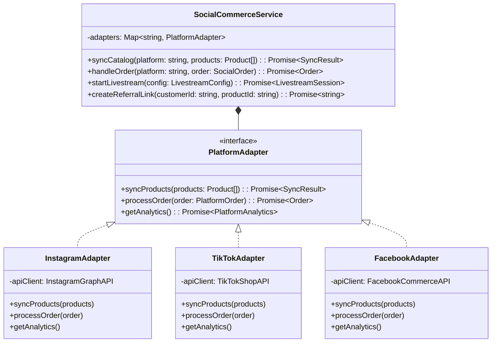

## 9. Analytics Service (analytics-service)

### 9.1 Druid Data Model

| Datasource | Dimensions | Metrics | Granularity |
|-----------|------------|---------|-------------|
| sales_events | tenant_id, product_id, category, channel, country | revenue, quantity, order_count | MINUTE |
| funnel_events | tenant_id, step, device, source | event_count, unique_users | MINUTE |
| search_events | tenant_id, query, has_results, clicked | search_count, click_count, ctr | MINUTE |
| cart_events | tenant_id, action, product_id | cart_adds, cart_removes, abandonment | MINUTE |
| loyalty_events | tenant_id, tier, action_type | points_earned, points_redeemed, members | HOUR |

### 9.2 Funnel Analysis Query Pattern

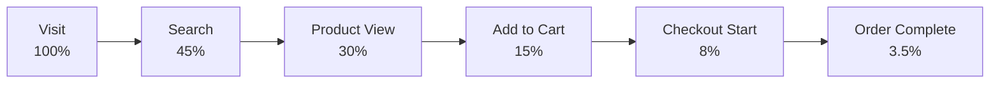

```sql
SELECT
  step,
  COUNT(DISTINCT session_id) as unique_users,
  COUNT(DISTINCT session_id) * 100.0 /
    FIRST_VALUE(COUNT(DISTINCT session_id)) OVER (ORDER BY step_order) as conversion_pct
FROM funnel_events
WHERE tenant_id = ? AND __time >= CURRENT_TIMESTAMP - INTERVAL '7' DAY
GROUP BY step, step_order
ORDER BY step_order
```
