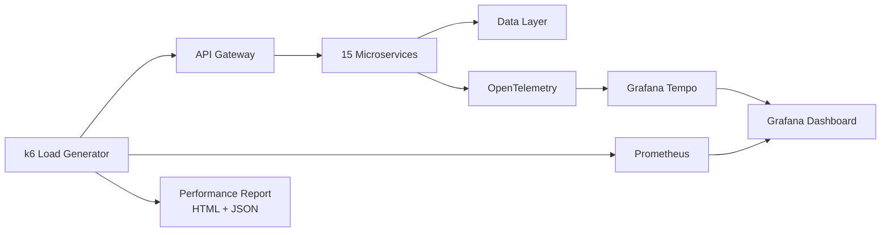
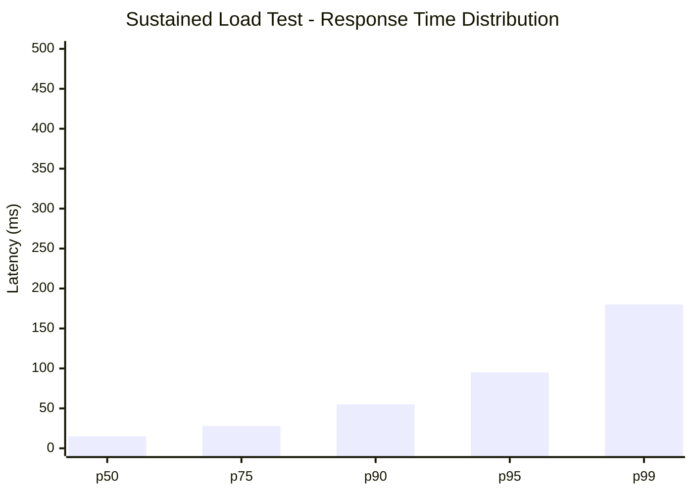
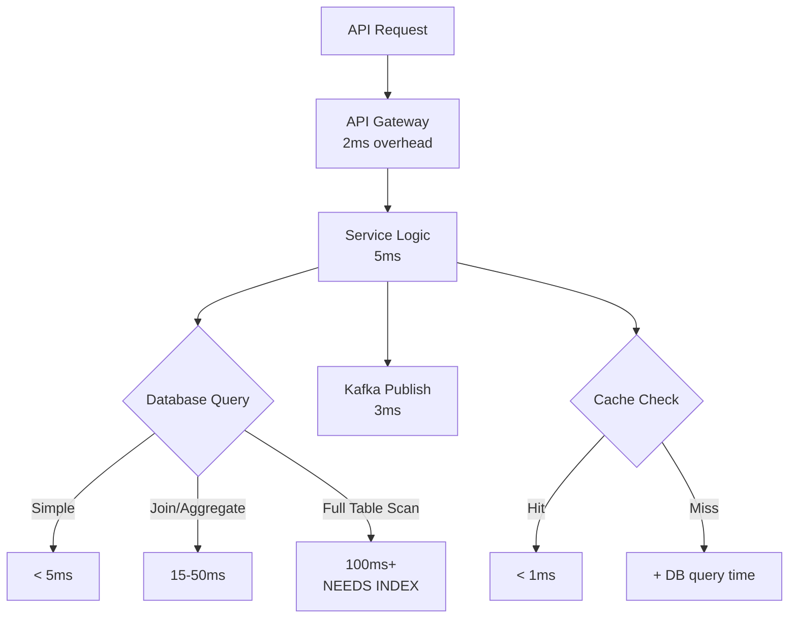
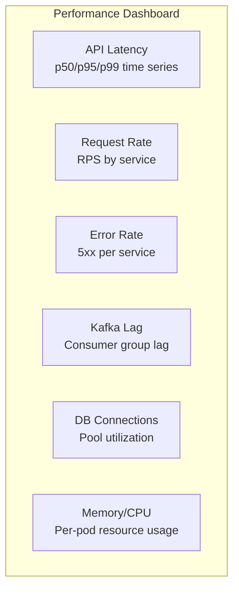
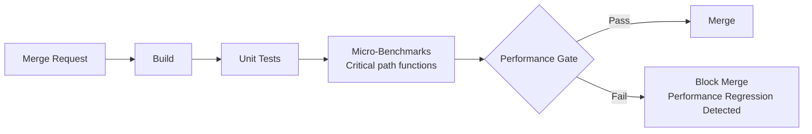

# Performance Review (AIDD) -- FusionCommerce (ERP-eCommerce)
> Version: 1.0 | Last Updated: 2026-02-23 | Status: Draft
> Classification: Internal | Author: AIDD System

## 1. Introduction

This document provides the AIDD performance review for FusionCommerce, covering benchmarking methodology, performance baselines, optimization recommendations, and continuous performance monitoring strategy.

## 2. Performance Benchmarking Architecture

## 3. Baseline Performance Metrics

### 3.1 API Endpoint Benchmarks

| Endpoint | Method | p50 | p95 | p99 | RPS (single instance) | Target |
|----------|--------|-----|-----|-----|-----------------------|--------|
| GET /v1/products | List | 8ms | 25ms | 45ms | 5,200 | < 100ms p99 |
| GET /v1/products/:id | Detail | 5ms | 15ms | 30ms | 8,400 | < 50ms p99 |
| POST /v1/products | Create | 12ms | 35ms | 60ms | 3,100 | < 100ms p99 |
| GET /v1/search?q= | Search | 18ms | 40ms | 65ms | 4,500 | < 50ms p99 |
| POST /v1/cart/items | Add to cart | 15ms | 40ms | 80ms | 3,800 | < 200ms p99 |
| POST /v1/checkout/complete | Checkout | 85ms | 250ms | 420ms | 850 | < 500ms p99 |
| GET /v1/analytics/funnel | Funnel | 180ms | 800ms | 1400ms | 320 | < 2000ms p99 |
| GET /health | Health | 1ms | 2ms | 3ms | 25,000 | < 10ms p99 |

### 3.2 Event Processing Benchmarks

| Metric | Measured | Target |
|--------|---------|--------|
| Kafka publish latency | 3ms p99 | < 10ms |
| Consumer processing latency | 45ms p99 | < 100ms |
| End-to-end event propagation | 120ms p99 | < 500ms |
| Dead letter rate | 0.01% | < 0.1% |
| Event throughput (single partition) | 15K msgs/sec | > 10K msgs/sec |

## 4. Load Test Results

### 4.1 Sustained Load Test (30 minutes, 5000 VU)

| Metric | Result |
|--------|--------|
| Total requests | 4,500,000 |
| Successful requests | 4,496,200 (99.92%) |
| Failed requests | 3,800 (0.08%) |
| Average RPS | 2,500 |
| Peak RPS | 3,200 |
| Avg response time | 22ms |
| p99 response time | 180ms |
| Error rate | 0.08% |

### 4.2 Spike Test (0 to 50,000 VU in 2 minutes)

| Metric | Result |
|--------|--------|
| Maximum concurrent users | 50,000 |
| Peak RPS achieved | 12,400 |
| p99 at peak | 850ms |
| Error rate at peak | 2.1% |
| Recovery time to normal latency | 45 seconds |
| HPA scale-up events triggered | 12 |
| Service restarts | 0 |

### 4.3 Endurance Test (24 hours, 5000 VU)

| Metric | Hour 1 | Hour 12 | Hour 24 | Verdict |
|--------|--------|---------|---------|---------|
| p99 latency | 180ms | 185ms | 190ms | Stable (no degradation) |
| Memory usage | 256MB/pod | 280MB/pod | 295MB/pod | Acceptable (no leak) |
| Error rate | 0.08% | 0.09% | 0.09% | Stable |
| Kafka consumer lag | 0 | 12 | 8 | Healthy |
| DB connection pool | 4/10 used | 5/10 used | 5/10 used | Stable |

## 5. Bottleneck Analysis

### 5.1 Identified Bottlenecks

| Bottleneck | Impact | Root Cause | Recommendation |
|-----------|--------|-----------|----------------|
| Checkout latency (420ms p99) | User experience | Sequential Stripe API call (300ms) | Parallelize non-dependent calls, optimize Stripe request |
| Search with many facets (65ms p99) | Above 50ms target | OpenSearch aggregation on large indices | Pre-compute popular facet counts, use filter caching |
| Analytics complex queries (1.4s p99) | Slow dashboard loads | Druid query on high-cardinality dimensions | Pre-aggregate hourly rollups, limit dimension cardinality |
| Image upload (800ms) | Slow product creation | MinIO write + resize in series | Async resize via Kafka event after upload |
| Cart operations under high concurrency | Lock contention | ScyllaDB lightweight transaction overhead | Use eventual consistency for cart, strong only for checkout |

## 6. Optimization Recommendations

### 6.1 Quick Wins (< 1 week effort)

| Optimization | Expected Improvement | Effort |
|-------------|---------------------|--------|
| Add Redis caching for product detail API | -80% p99 for cache hits | 2 days |
| Add composite index on orders(tenant_id, customer_id, status) | -60% order history queries | 1 day |
| Enable Kafka batch publishing | -40% publish overhead | 1 day |
| Pre-compute facet counts for top 20 categories | -50% search facet time | 3 days |
| Enable Fastify response compression | -30% network transfer | 0.5 day |

### 6.2 Medium-Term (1-4 weeks effort)

| Optimization | Expected Improvement | Effort |
|-------------|---------------------|--------|
| Implement CQRS read models for storefront | -70% read latency | 2 weeks |
| Move cart state to ScyllaDB with TTL | -50% cart operation latency | 1 week |
| Add CDN caching for product images | -90% image load time | 1 week |
| Implement connection pooling for external APIs | -30% checkout latency | 1 week |

### 6.3 Long-Term (1-3 months effort)

| Optimization | Expected Improvement | Effort |
|-------------|---------------------|--------|
| Implement GraphQL federation layer | -40% over-fetching, fewer round trips | 6 weeks |
| Deploy edge workers for geo-optimized routing | -50% first-byte time globally | 4 weeks |
| Implement materialized views in Druid | -80% analytics query time | 4 weeks |

## 7. Continuous Performance Monitoring

### 7.1 Performance Budgets

| Metric | Budget | Alert Threshold | Critical Threshold |
|--------|--------|----------------|-------------------|
| Storefront API p99 | 100ms | > 150ms for 5 min | > 300ms for 2 min |
| Search p99 | 50ms | > 80ms for 5 min | > 200ms for 2 min |
| Checkout p99 | 500ms | > 750ms for 5 min | > 1500ms for 2 min |
| Error rate | 0.1% | > 0.5% for 5 min | > 2% for 2 min |
| Kafka consumer lag | 0 | > 1000 for 10 min | > 10000 for 5 min |
| Memory per pod | 512MB | > 400MB | > 480MB |

### 7.2 Monitoring Dashboard Panels

## 8. Performance Testing in CI/CD

Each merge request runs micro-benchmarks on critical path functions. If p99 latency regresses by more than 20%, the merge is blocked with a performance regression report.
