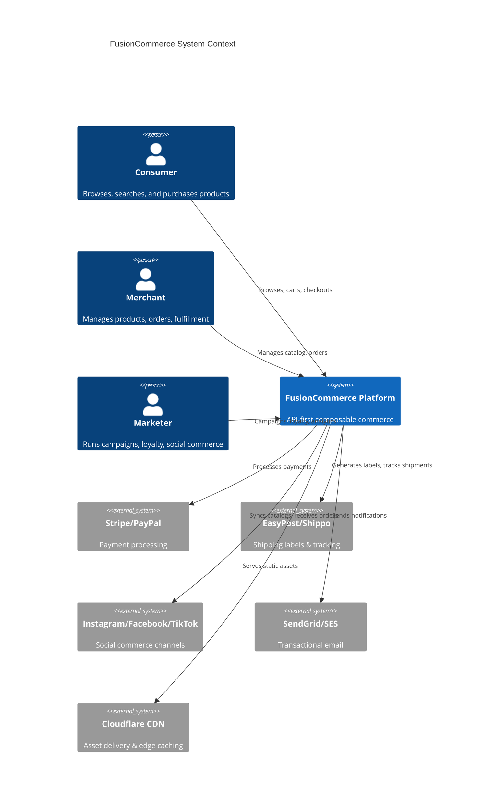
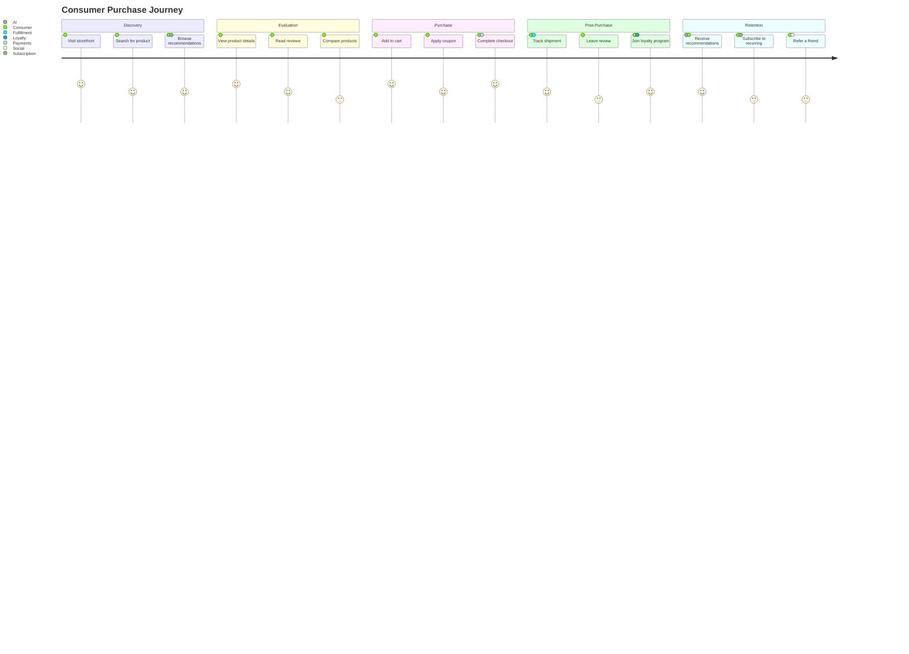

# Product Requirements Document -- FusionCommerce (ERP-eCommerce)
> Version: 1.0 | Last Updated: 2026-02-23 | Status: Draft
> Classification: Internal | Author: AIDD System

## 1. Product Overview

FusionCommerce is an API-first, event-driven, composable commerce platform purpose-built for B2C and D2C consumer storefronts. It integrates a headless storefront API, AI-powered search and recommendations, multi-channel social commerce, subscription management, loyalty and rewards, and end-to-end fulfillment orchestration into a unified microservices architecture powered by Apache Kafka, n8n workflows, and Apache Druid real-time analytics.

The platform is designed to compete with and surpass the capabilities of Shopify, Magento (Adobe Commerce), BigCommerce, and WooCommerce while offering true composability, event-driven extensibility, and global innovation models such as social group buying, livestream commerce, and community-driven trust commerce.

## 2. Product Vision

Enable merchants of any size to launch differentiated, high-conversion commerce experiences by composing modular headless services, leveraging real-time event streams for operational intelligence, and deploying AI-driven decisioning across the entire customer journey from discovery through fulfillment and loyalty.

## 3. Competitive Analysis

### 3.1 Feature Comparison Matrix

| Capability | FusionCommerce | Shopify | Magento | BigCommerce | WooCommerce |
|------------|---------------|---------|---------|-------------|-------------|
| **Architecture** | API-first composable microservices | Monolithic SaaS | Monolithic PHP | SaaS with API | WordPress plugin |
| **Headless Commerce** | Native, full API surface | Storefront API (limited) | GraphQL (complex setup) | Partial headless | REST only |
| **Event-Driven** | Apache Kafka native | Webhooks only | Events/observers | Webhooks only | Action hooks |
| **AI Search** | NLQ, visual, voice search | Basic search | ElasticSearch addon | Basic search | Plugin-dependent |
| **Social Commerce** | Instagram, Facebook, TikTok, Livestream, Group Buying | Instagram, Facebook | Plugin-dependent | Facebook, Instagram | Plugin-dependent |
| **Group Buying** | Native Pinduoduo model | Not available | Not available | Not available | Not available |
| **Livestream Commerce** | Native Taobao Live model | Not available | Not available | Not available | Not available |
| **Community Commerce** | Native Xiaohongshu model | Not available | Not available | Not available | Not available |
| **Subscription Commerce** | Native box/recurring/swap | ReCharge addon ($) | Amasty addon ($) | Limited native | Plugin-dependent |
| **Loyalty & Rewards** | Native points, tiers, gamification, digital wallet | Smile.io addon ($) | Amasty addon ($) | Addon required | Plugin-dependent |
| **Theme Engine** | Liquid/Handlebars, 50+ themes, visual builder | Liquid themes | XML/PHP themes | Stencil themes | PHP themes |
| **Workflow Automation** | n8n native integration | Shopify Flow (limited) | Adobe Experience | Limited | Not available |
| **Real-Time Analytics** | Apache Druid native | ShopifyQL (limited) | Adobe Analytics ($$$) | Basic analytics | Plugin-dependent |
| **Multi-Warehouse** | Native routing + 3PL + dropship | Apps required | MSI module | Limited | Not available |
| **Express Checkout** | Apple Pay, Google Pay, BNPL native | Shop Pay native | Payment extensions | PayPal express | Plugin-dependent |
| **Cart Abandonment** | AI-driven recovery native | Kit assistant | Extension required | Addon required | Plugin-dependent |
| **Pricing** | Self-hosted, no GMV fee | $39-$2000/mo + 2.9% | $22K-$125K/yr license | $39-$399/mo | Free + hosting |
| **Scalability** | Horizontal per-service | Platform-limited | Vertical only | Platform-limited | Server-limited |

### 3.2 Key Differentiators

1. **True Composability**: Unlike Shopify's monolith or WooCommerce's plugin mess, FusionCommerce allows merchants to deploy only the services they need and compose them freely.
2. **Global Innovation Models**: No competitor offers native group buying, livestream commerce, or community trust commerce. These are the fastest-growing eCommerce segments globally.
3. **Event-Driven Intelligence**: Kafka-native architecture means every action is a real-time event feeding AI systems, unlike competitors' webhook-based afterthoughts.
4. **Zero GMV Tax**: Self-hosted with no percentage-of-sales fees that cripple high-volume merchants on Shopify ($2000/mo + 0.5% on Plus).
5. **AI-Native Search**: Visual search, voice search, NLQ, and merchandising rules engine surpass anything available on competing platforms without expensive third-party addons.

## 4. Target Users

### 4.1 Primary Personas

| Persona | Description | Key Needs |
|---------|-------------|-----------|
| D2C Brand Owner | Direct-to-consumer brand launching their storefront | Conversion optimization, brand customization, subscription support |
| eCommerce Operations Manager | Staff managing daily storefront operations | Order management, fulfillment workflows, analytics dashboards |
| Marketing Manager | Team member driving traffic and retention | Social commerce, loyalty programs, cart abandonment recovery |
| Content Creator / Influencer | Livestream hosts and community commerce drivers | Livestream console, affiliate tracking, commission management |
| End Consumer | Shoppers browsing and purchasing products | Fast search, reliable checkout, order tracking, wishlists |

### 4.2 Secondary Personas

| Persona | Description | Key Needs |
|---------|-------------|-----------|
| Developer / Integrator | Technical team extending the platform | API documentation, webhook management, theme development |
| Financial Controller | Staff managing payments, refunds, reconciliation | Payment dashboards, refund workflows, revenue reports |
| Fulfillment Warehouse Staff | Workers picking, packing, and shipping orders | Pick lists, packing slips, shipping label generation |
| Customer Support Agent | Representatives handling customer inquiries | Order lookup, return processing, issue resolution |

## 5. Functional Requirements

### 5.1 Headless Storefront API (FR-STF)

| ID | Requirement | Priority | Status |
|----|-------------|----------|--------|
| FR-STF-001 | Product listing with pagination, filtering, and sorting | P0 | Implemented |
| FR-STF-002 | Product detail with variants, images, and reviews | P0 | Implemented |
| FR-STF-003 | Collection/category browsing with hierarchy support | P0 | Implemented |
| FR-STF-004 | Cart management (add, remove, update quantities) | P0 | Implemented |
| FR-STF-005 | Wishlist creation and management | P1 | Implemented |
| FR-STF-006 | Product reviews and ratings with moderation | P1 | Implemented |
| FR-STF-007 | AI-powered product recommendations | P1 | In Progress |
| FR-STF-008 | Recently viewed products tracking | P2 | Planned |
| FR-STF-009 | Product comparison functionality | P2 | Planned |
| FR-STF-010 | Multi-currency and multi-language support | P1 | In Progress |

### 5.2 Checkout & Payments (FR-CHK)

| ID | Requirement | Priority | Status |
|----|-------------|----------|--------|
| FR-CHK-001 | Multi-step checkout flow (shipping, billing, payment, review) | P0 | Implemented |
| FR-CHK-002 | Guest checkout without account creation | P0 | Implemented |
| FR-CHK-003 | Express checkout with Apple Pay and Google Pay | P0 | In Progress |
| FR-CHK-004 | Cart abandonment detection and recovery emails | P1 | In Progress |
| FR-CHK-005 | Coupon and discount code engine | P0 | Implemented |
| FR-CHK-006 | Automatic tax calculation by jurisdiction | P1 | Planned |
| FR-CHK-007 | Shipping rate calculation at checkout | P0 | Implemented |
| FR-CHK-008 | Order confirmation with email notification | P0 | Implemented |
| FR-CHK-009 | BNPL integration (Klarna, Afterpay) | P2 | Planned |
| FR-CHK-010 | Saved payment methods for returning customers | P1 | Planned |

### 5.3 Theme Engine (FR-THM)

| ID | Requirement | Priority | Status |
|----|-------------|----------|--------|
| FR-THM-001 | Visual drag-and-drop theme builder | P0 | Implemented |
| FR-THM-002 | 50+ pre-built responsive themes | P0 | In Progress (27 complete) |
| FR-THM-003 | Liquid template language support | P0 | Implemented |
| FR-THM-004 | Handlebars template language support | P1 | Implemented |
| FR-THM-005 | Mobile-responsive design enforcement | P0 | Implemented |
| FR-THM-006 | Custom CSS/JS injection | P1 | Implemented |
| FR-THM-007 | Theme versioning and rollback | P1 | Planned |
| FR-THM-008 | A/B testing for theme variations | P2 | Planned |

### 5.4 Social Commerce (FR-SOC)

| ID | Requirement | Priority | Status |
|----|-------------|----------|--------|
| FR-SOC-001 | Instagram Shopping catalog sync | P0 | Implemented |
| FR-SOC-002 | Facebook Shops integration | P0 | Implemented |
| FR-SOC-003 | TikTok Shop product feed | P1 | In Progress |
| FR-SOC-004 | Livestream shopping with real-time product pinning | P1 | In Progress |
| FR-SOC-005 | Group buying campaigns (Pinduoduo model) | P1 | Implemented |
| FR-SOC-006 | Community commerce (Xiaohongshu model) | P2 | Planned |
| FR-SOC-007 | Referral program management | P1 | In Progress |
| FR-SOC-008 | Social proof widgets (live purchase notifications) | P2 | Planned |

### 5.5 Subscription Commerce (FR-SUB)

| ID | Requirement | Priority | Status |
|----|-------------|----------|--------|
| FR-SUB-001 | Subscription box creation and management | P0 | Implemented |
| FR-SUB-002 | Recurring order scheduling (weekly, monthly, quarterly) | P0 | Implemented |
| FR-SUB-003 | Skip, pause, and cancel subscription flows | P0 | Implemented |
| FR-SUB-004 | Product swap within subscription | P1 | In Progress |
| FR-SUB-005 | Subscription analytics (churn, MRR, LTV) | P1 | Planned |

### 5.6 Loyalty & Rewards (FR-LOY)

| ID | Requirement | Priority | Status |
|----|-------------|----------|--------|
| FR-LOY-001 | Points accumulation per purchase | P0 | Implemented |
| FR-LOY-002 | Tiered membership levels (Bronze, Silver, Gold, Platinum) | P0 | Implemented |
| FR-LOY-003 | Cashback reward programs | P1 | In Progress |
| FR-LOY-004 | Digital wallet for store credit | P1 | In Progress |
| FR-LOY-005 | Gamification mechanics (spin-to-win, daily check-in) | P2 | Planned |
| FR-LOY-006 | Points redemption at checkout | P0 | Implemented |

### 5.7 Fulfillment (FR-FUL)

| ID | Requirement | Priority | Status |
|----|-------------|----------|--------|
| FR-FUL-001 | Pick, pack, and ship workflow | P0 | Implemented |
| FR-FUL-002 | Multi-warehouse inventory routing | P0 | In Progress |
| FR-FUL-003 | Dropshipping vendor management | P1 | Planned |
| FR-FUL-004 | 3PL integration (ShipBob, Deliverr) | P1 | Planned |
| FR-FUL-005 | Shipping label generation (EasyPost/Shippo) | P0 | Implemented |
| FR-FUL-006 | Returns and RMA processing | P0 | In Progress |
| FR-FUL-007 | Real-time shipment tracking | P1 | In Progress |

### 5.8 AI Search (FR-SRC)

| ID | Requirement | Priority | Status |
|----|-------------|----------|--------|
| FR-SRC-001 | Natural Language Query (NLQ) search | P0 | Implemented |
| FR-SRC-002 | Typo tolerance and fuzzy matching | P0 | Implemented |
| FR-SRC-003 | Faceted filtering (price, brand, category, attributes) | P0 | Implemented |
| FR-SRC-004 | Visual search (upload image to find products) | P1 | In Progress |
| FR-SRC-005 | Voice search | P2 | Planned |
| FR-SRC-006 | Merchandising rules engine (boost, bury, pin) | P1 | In Progress |
| FR-SRC-007 | Search analytics and reporting | P1 | In Progress |

### 5.9 Analytics (FR-ANL)

| ID | Requirement | Priority | Status |
|----|-------------|----------|--------|
| FR-ANL-001 | Conversion funnel visualization | P0 | Implemented |
| FR-ANL-002 | Cart abandonment rate tracking | P0 | Implemented |
| FR-ANL-003 | Average Order Value (AOV) reporting | P0 | Implemented |
| FR-ANL-004 | Customer Lifetime Value (CLV) calculation | P1 | In Progress |
| FR-ANL-005 | Cohort analysis | P1 | Planned |
| FR-ANL-006 | Channel attribution modeling | P1 | Planned |
| FR-ANL-007 | Real-time sales dashboard | P0 | Implemented |

## 6. Non-Functional Requirements

| ID | Category | Requirement | Target |
|----|----------|-------------|--------|
| NFR-001 | Performance | Storefront API p99 latency | < 100ms |
| NFR-002 | Performance | Search query p99 latency | < 50ms |
| NFR-003 | Performance | Checkout completion p99 latency | < 500ms |
| NFR-004 | Scalability | Concurrent users supported | 100,000+ |
| NFR-005 | Scalability | Orders per second throughput | 10,000+ |
| NFR-006 | Availability | Platform uptime SLA | 99.99% |
| NFR-007 | Security | PCI DSS compliance level | Level 1 |
| NFR-008 | Security | GDPR and CCPA compliance | Full |
| NFR-009 | Data | Real-time analytics latency | < 5 seconds |
| NFR-010 | Data | Event processing throughput | 1M events/sec |

## 7. System Context Diagram

## 8. User Journey Map

## 9. Release Roadmap

| Phase | Timeline | Key Deliverables |
|-------|----------|-----------------|
| Phase 1 - Foundation | Q1 2026 | Core storefront API, checkout, catalog, orders, inventory, basic themes |
| Phase 2 - Commerce+ | Q2 2026 | AI search, social commerce (Instagram, Facebook), loyalty MVP, subscription commerce |
| Phase 3 - Intelligence | Q3 2026 | Druid analytics, AI recommendations, visual search, cart abandonment recovery |
| Phase 4 - Innovation | Q4 2026 | TikTok Shop, livestream commerce, group buying, community commerce, gamification |
| Phase 5 - Scale | Q1 2027 | Multi-warehouse fulfillment, 3PL integration, advanced analytics, voice search |

## 10. Success Metrics

| Metric | Target | Measurement |
|--------|--------|-------------|
| Storefront page load time | < 1.5 seconds | Lighthouse performance score > 90 |
| Checkout conversion rate | > 3.5% (industry avg: 2.1%) | Funnel analytics |
| Cart abandonment recovery | > 15% recovery rate | Recovery email campaign metrics |
| Search relevance score | > 0.85 nDCG | A/B testing with relevance judges |
| Platform adoption | 500 merchants in Year 1 | Merchant onboarding tracking |
| Monthly GMV per merchant | $50K average | Revenue analytics |

## 11. Assumptions and Constraints

### Assumptions
- Merchants have technical capacity to deploy containerized services or will use managed hosting
- Payment processors (Stripe, PayPal) maintain API backward compatibility
- Social platform APIs (Instagram, TikTok) remain available for commerce integrations
- Merchants operate primarily in markets with reliable internet infrastructure

### Constraints
- PCI DSS compliance requires payment card data to never touch FusionCommerce servers directly
- Social platform API rate limits constrain catalog sync frequency
- Shipping carrier API availability varies by region
- GDPR requires explicit consent flows that may impact checkout conversion
