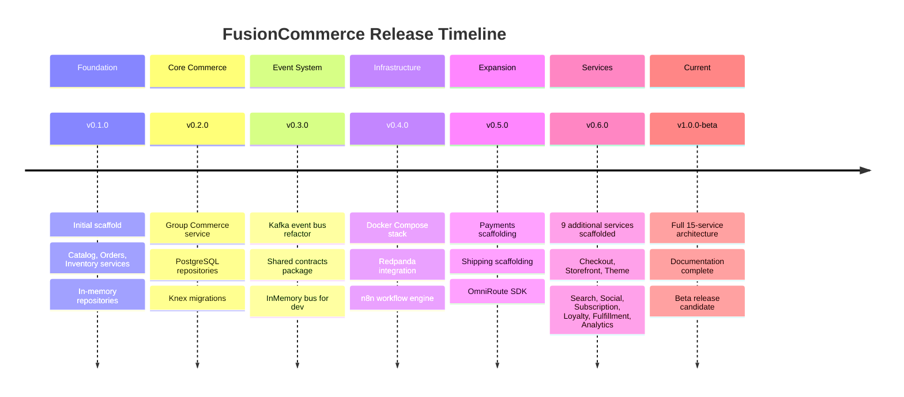

# Release Notes -- FusionCommerce (ERP-eCommerce)
> Version: 1.0 | Last Updated: 2026-02-23 | Status: Draft
> Classification: Internal | Author: AIDD System

## 1. Release Overview

This document tracks all FusionCommerce releases, including new features, improvements, bug fixes, breaking changes, and migration guides.

## 2. Version History



---

## 3. v1.0.0-beta (2026-02-23) -- Current Release

### New Features
- **15-Service Architecture**: All commerce services scaffolded and configured
  - checkout-service, storefront-service, theme-service, search-service
  - social-commerce-service, subscription-commerce-service, loyalty-service
  - fulfillment-service, analytics-service
- **Comprehensive Documentation**: 32-document AIDD documentation set generated
- **Service Inventory**: Complete container diagram with all 15 services mapped

### Improvements
- Unified TypeScript configuration across all workspaces
- Standardized health check endpoints for all services
- Consistent error handling patterns

### Known Issues
- Services beyond core 6 (catalog, orders, inventory, group-commerce, payments, shipping) are scaffolded but lack business logic implementation
- No API Gateway configured (direct service access only)
- In-memory repositories used for most services (PostgreSQL for orders, inventory, group-commerce only)

---

## 4. v0.6.0 (2026-02-20) -- Service Expansion

### New Features
- Added 9 new service scaffolds: checkout-service, storefront-service, theme-service, search-service, social-commerce-service, subscription-commerce-service, loyalty-service, fulfillment-service, analytics-service
- Each service includes: index.ts, app.ts, service class, repository class, types, Dockerfile

### Improvements
- Updated architecture documentation to reflect 15-service topology
- Service port assignments standardized (3000-3014)

---

## 5. v0.5.0 (2026-02-18) -- Payments and Shipping Foundation

### New Features
- **Payments Service**: Scaffolded with Stripe SDK dependency, webhook endpoint structure
- **Shipping Service**: Scaffolded with EasyPost/Shippo integration structure, OmniRoute SDK
- **OmniRoute SDK**: New package for orchestrating multi-carrier shipping
- **Mobile Apps**: Android (Kotlin), iOS (Swift), and Flutter project structures

### Configuration
- Added OMNIROUTE_API_BASE_URL, OMNIROUTE_API_KEY, OMNIROUTE_TENANT_ID environment variables
- Updated docker-compose.yml with payments-service and shipping-service containers

---

## 6. v0.4.0 (2026-02-15) -- Infrastructure Orchestration

### New Features
- **Docker Compose**: Full local development stack with Redpanda, all services, and n8n
- **Redpanda**: Replaced Confluent Kafka image with Redpanda for lighter development experience
- **n8n Integration**: Workflow engine container configured with Kafka topic listeners

### Configuration
- Redpanda ports: 9092 (internal), 19092 (external), 18081 (Schema Registry), 18082 (HTTP Proxy)
- n8n: Port 5678, basic auth (admin/password)

---

## 7. v0.3.0 (2026-02-10) -- Event Bus Refactor

### New Features
- **@fusioncommerce/contracts**: Centralized event topic constants and TypeScript payload interfaces
- **@fusioncommerce/event-bus**: Refactored with EventBus interface, KafkaEventBus, InMemoryEventBus
- **EventBusFactory**: Environment-driven creation (USE_IN_MEMORY_BUS flag)

### Breaking Changes
- Event publishing moved from inline Kafka calls to EventBus interface
- Services must now import from @fusioncommerce/event-bus instead of direct kafkajs usage

### Migration Guide
```typescript
// Before (v0.2.x)
import { Kafka } from 'kafkajs';
const kafka = new Kafka({ brokers: ['localhost:9092'] });
const producer = kafka.producer();
await producer.send({ topic: 'order.created', messages: [...] });

// After (v0.3.x)
import { EventBusFactory } from '@fusioncommerce/event-bus';
const eventBus = EventBusFactory.create({ brokers: ['localhost:9092'] });
await eventBus.publish('order.created', payload);
```

---

## 8. v0.2.0 (2026-02-05) -- Database and Group Commerce

### New Features
- **Group Commerce Service**: Full implementation of campaign creation, participant joining, threshold evaluation
- **@fusioncommerce/database**: Knex connection factory with configurable pooling
- **PostgreSQL Repositories**: Orders and Inventory services upgraded from in-memory to PostgreSQL
- **Knex Migrations**: Schema versioning for orders, inventory, and group-commerce tables
- **Multi-tenancy**: tenant_id column and indexes added to orders table

### Database Migrations
```
services/orders/migrations/20240101000000_create_orders_table.ts
services/orders/migrations/20240102000000_add_multitenancy_to_orders.ts
services/inventory/migrations/20240101000000_create_inventory_table.ts
services/group-commerce/migrations/20240101000000_create_campaigns_table.ts
```

---

## 9. v0.1.0 (2026-01-15) -- Initial Release

### New Features
- **Catalog Service**: Create and list products via REST API, emit product.created events
- **Orders Service**: Create orders, validate payloads, emit order.created events
- **Inventory Service**: Stock configuration, event-driven reservation on order.created, emit inventory.reserved/insufficient
- **Shared Packages**: Initial contracts and event-bus packages
- **Jest Testing**: Unit tests for all three services with InMemoryEventBus

### Technical Highlights
- Fastify-based HTTP APIs with JSON schema validation
- In-memory repositories for zero-dependency local development
- Clean shutdown hooks (SIGTERM handling)
- TypeScript strict mode across all workspaces

---

## 10. Upcoming Releases

| Version | Target Date | Key Features |
|---------|------------|--------------|
| v1.0.0 | Q1 2026 | Full checkout, payments (Stripe), search (OpenSearch), theme engine MVP |
| v1.1.0 | Q2 2026 | Social commerce (Instagram, Facebook), loyalty points engine, subscription billing |
| v1.2.0 | Q3 2026 | AI recommendations, visual search, cart abandonment recovery, Druid analytics |
| v2.0.0 | Q4 2026 | TikTok Shop, livestream commerce, group buying enhancements, gamification |
