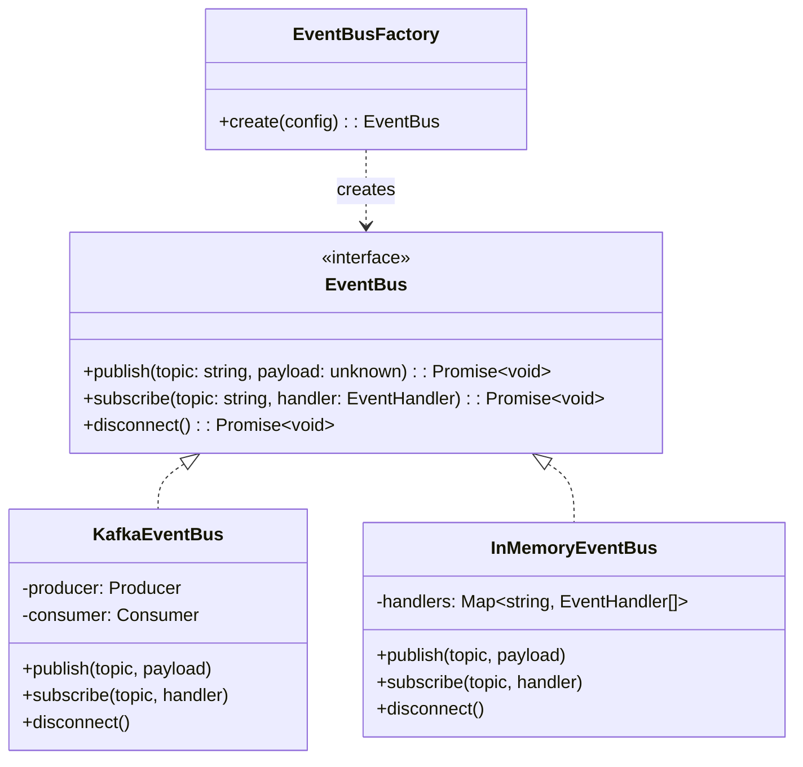
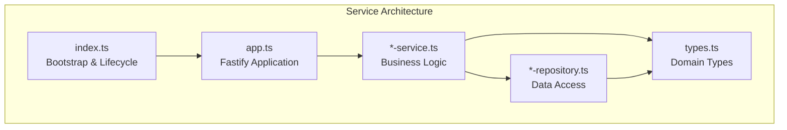
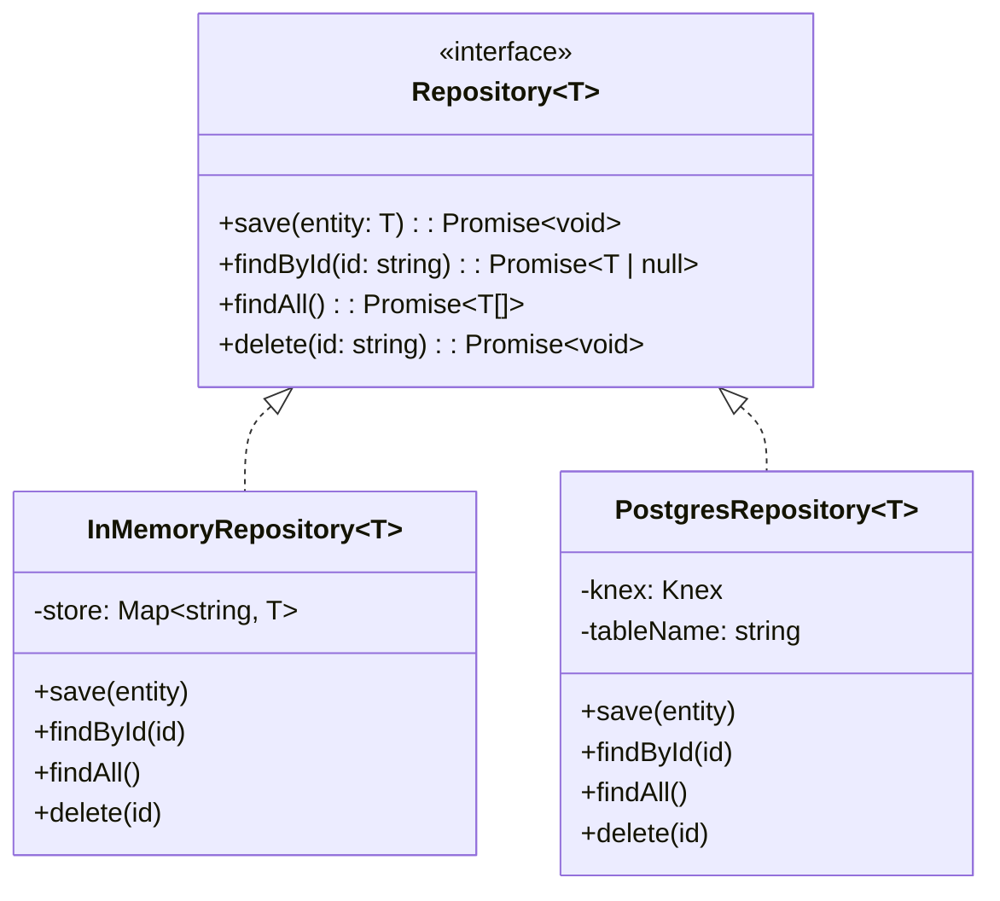
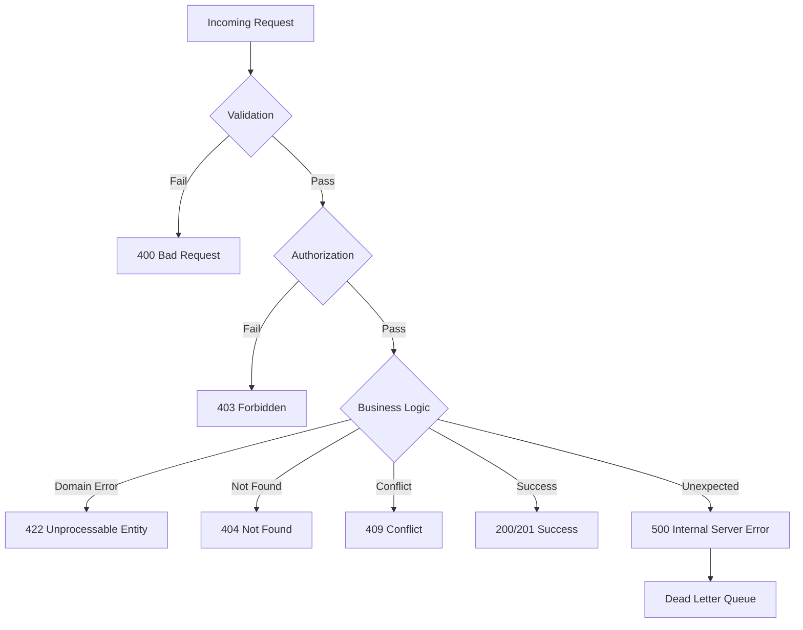
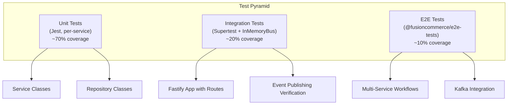
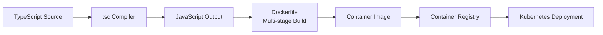

# Software Architecture -- FusionCommerce (ERP-eCommerce)
> Version: 1.0 | Last Updated: 2026-02-23 | Status: Draft
> Classification: Internal | Author: AIDD System

## 1. Introduction

This document describes the software architecture of FusionCommerce at the code level, covering the TypeScript monorepo organization, shared package design, service internal architecture, dependency management, design patterns, and coding conventions across all 15 microservices and 5 shared packages.

## 2. Repository Structure

```
ERP-eCommerce/
  package.json              # Root workspace configuration (npm workspaces)
  tsconfig.base.json        # Shared TypeScript compiler options
  jest.preset.cjs           # Shared Jest testing configuration
  docker-compose.yml        # Local development orchestration (Redpanda + services)
  schema.graphql            # GraphQL schema for Hasura layer
  Makefile                  # Build/deploy shortcuts
  .github/workflows/        # CI pipeline definitions
  packages/
    contracts/              # @fusioncommerce/contracts -- shared event types
    event-bus/              # @fusioncommerce/event-bus -- Kafka abstraction
    database/               # @fusioncommerce/database -- Knex connection factory
    e2e-tests/              # @fusioncommerce/e2e-tests -- integration test suite
    omniroute-sdk/          # @fusioncommerce/omniroute-sdk -- routing orchestration
  services/
    catalog/                # Product catalog management (:3000)
    orders/                 # Order lifecycle management (:3001)
    inventory/              # Stock management and reservation (:3002)
    group-commerce/         # Social group buying campaigns (:3003)
    payments/               # Payment processing (:3004)
    shipping/               # Shipping and tracking (:3005)
    checkout-service/       # Multi-step checkout flow (:3006)
    storefront-service/     # Headless storefront API (:3007)
    theme-service/          # Theme engine and visual builder (:3008)
    search-service/         # AI-powered product search (:3009)
    social-commerce-service/ # Social platform integrations (:3010)
    subscription-commerce-service/ # Recurring order management (:3011)
    loyalty-service/        # Points, rewards, and tiers (:3012)
    fulfillment-service/    # Pick/pack/ship workflows (:3013)
    analytics-service/      # Druid-powered analytics (:3014)
  web/                      # Frontend applications
  android/                  # Android native application
  ios/                      # iOS native application
  flutter/                  # Flutter cross-platform application
  types/                    # Shared TypeScript type definitions
```

## 3. Package Architecture

### 3.1 Dependency Graph

```mermaid
flowchart BT
    subgraph "Shared Packages"
        CTR["@fusioncommerce/contracts<br/>Event types & topic names"]
        EB["@fusioncommerce/event-bus<br/>Kafka & InMemory bus"]
        DB["@fusioncommerce/database<br/>Knex connection factory"]
        SDK["@fusioncommerce/omniroute-sdk<br/>Routing orchestration"]
        E2E["@fusioncommerce/e2e-tests<br/>Integration tests"]
    end

    subgraph "Services"
        S1["catalog-service"]
        S2["orders-service"]
        S3["inventory-service"]
        S4["group-commerce-service"]
        S5["payments-service"]
        S6["shipping-service"]
        S7["checkout-service"]
        S8["storefront-service"]
        S9["theme-service"]
        S10["search-service"]
        S11["social-commerce-service"]
        S12["subscription-commerce-service"]
        S13["loyalty-service"]
        S14["fulfillment-service"]
        S15["analytics-service"]
    end

    S1 & S2 & S3 & S4 & S5 & S6 & S7 & S8 --> CTR
    S1 & S2 & S3 & S4 & S5 & S6 & S7 & S8 --> EB
    S2 & S3 & S4 & S5 & S6 --> DB
    S2 & S6 --> SDK
    S9 & S10 & S11 & S12 & S13 & S14 & S15 --> CTR
    S9 & S10 & S11 & S12 & S13 & S14 & S15 --> EB
    EB --> CTR
    E2E --> CTR & EB
```



### 3.2 @fusioncommerce/contracts

Zero-dependency package defining event topic names and TypeScript payload interfaces:

```typescript
// Topic constants
export const TOPICS = {
  PRODUCT_CREATED: 'product.created',
  PRODUCT_UPDATED: 'product.updated',
  ORDER_CREATED: 'order.created',
  INVENTORY_RESERVED: 'inventory.reserved',
  INVENTORY_INSUFFICIENT: 'inventory.insufficient',
  PAYMENT_CREATED: 'payment.created',
  PAYMENT_SUCCEEDED: 'payment.succeeded',
  PAYMENT_FAILED: 'payment.failed',
  CAMPAIGN_CREATED: 'campaign.created',
  CAMPAIGN_JOINED: 'campaign.joined',
  CAMPAIGN_SUCCESS: 'campaign.success',
  FULFILLMENT_SHIPPED: 'fulfillment.shipped',
  CART_ABANDONED: 'cart.abandoned',
  SUBSCRIPTION_RENEWED: 'subscription.renewed',
  LOYALTY_POINTS_EARNED: 'loyalty.points_earned',
  SEARCH_QUERY: 'search.query',
} as const;

// Payload interfaces
export interface OrderCreatedPayload {
  orderId: string;
  customerId: string;
  items: Array<{ sku: string; quantity: number; price: number }>;
  total: number;
  currency: string;
  tenantId?: string;
}
```

### 3.3 @fusioncommerce/event-bus

Provides an `EventBus` interface with two implementations:



The `EventBusFactory` reads the `USE_IN_MEMORY_BUS` environment variable to decide which implementation to instantiate, enabling local development without Kafka.

### 3.4 @fusioncommerce/database

Knex-based connection factory with configurable pooling:

```typescript
export interface DatabaseConfig {
  connectionString: string;
  poolMin?: number;  // Default: 2
  poolMax?: number;  // Default: 10
}

export function createDatabase(config: DatabaseConfig): Knex;
```

## 4. Service Internal Architecture

Each service follows a consistent layered architecture pattern:



### 4.1 Entry Point (index.ts)

Bootstraps the Fastify server, connects to Kafka, registers shutdown hooks:

```typescript
async function main() {
  const eventBus = EventBusFactory.create({
    brokers: process.env.KAFKA_BROKERS?.split(',') ?? ['localhost:9092'],
    useInMemory: process.env.USE_IN_MEMORY_BUS === 'true',
    clientId: 'catalog-service',
    groupId: 'catalog-group',
  });

  const app = buildApp(eventBus);
  await app.listen({ port: Number(process.env.PORT ?? 3000), host: '0.0.0.0' });

  process.on('SIGTERM', async () => {
    await app.close();
    await eventBus.disconnect();
  });
}
```

### 4.2 Application Builder (app.ts)

Registers Fastify routes, middleware, and health check endpoints:

```typescript
export function buildApp(eventBus: EventBus): FastifyInstance {
  const app = fastify({ logger: true });
  const repository = new InMemoryRepository();
  const service = new CatalogService(repository, eventBus);

  app.post('/products', async (request, reply) => { /* ... */ });
  app.get('/products', async (request, reply) => { /* ... */ });
  app.get('/health', async () => ({ status: 'ok' }));

  return app;
}
```

### 4.3 Business Logic (*-service.ts)

Encapsulates domain logic, orchestrates repository calls and event publishing:

```typescript
export class CatalogService {
  constructor(
    private repository: CatalogRepository,
    private eventBus: EventBus,
  ) {}

  async createProduct(data: CreateProductInput): Promise<Product> {
    const product = { id: crypto.randomUUID(), ...data, createdAt: new Date() };
    await this.repository.save(product);
    await this.eventBus.publish(TOPICS.PRODUCT_CREATED, product);
    return product;
  }
}
```

### 4.4 Repository Pattern (*-repository.ts)

Abstract repository interface with in-memory and PostgreSQL implementations:



## 5. Design Patterns

| Pattern | Usage | Services |
|---------|-------|----------|
| Repository | Data access abstraction | All 15 services |
| Factory | EventBus and Database creation | event-bus, database packages |
| Strategy | In-memory vs Kafka, In-memory vs Postgres | event-bus, all service repositories |
| Observer | Kafka event subscription | inventory, fulfillment, loyalty, analytics |
| CQRS | Separate write (YugabyteDB) and read (OpenSearch, Druid) models | search, analytics |
| Saga | Multi-service orchestration via n8n | checkout -> payment -> fulfillment |
| Circuit Breaker | External API calls (Stripe, EasyPost) | payments, shipping |
| Outbox | Reliable event publishing after DB write | orders, payments |

## 6. Error Handling Strategy



## 7. Testing Architecture



Each service contains its own `__tests__/` directory with Jest test files. The shared `jest.preset.cjs` provides common configuration. Tests use the `InMemoryEventBus` by default to avoid Kafka dependency during unit testing.

## 8. Build and Compilation



Each service Dockerfile uses multi-stage builds:
1. **Builder stage**: Installs dependencies, compiles TypeScript
2. **Production stage**: Copies compiled JS, installs production dependencies only
3. Result: Minimal production images (~150MB)

## 9. API Design Standards

| Aspect | Standard |
|--------|----------|
| Protocol | REST over HTTP/1.1 and HTTP/2 |
| Format | JSON (application/json) |
| Versioning | URL path prefix (/v1/, /v2/) |
| Pagination | Cursor-based (after/before/limit) |
| Filtering | Query parameters (?category=electronics&price_min=10) |
| Sorting | ?sort=price&order=asc |
| Error format | { "error": { "code": "PRODUCT_NOT_FOUND", "message": "..." } } |
| Health check | GET /health returns { "status": "ok" } |
| Request ID | X-Request-Id header for distributed tracing |
| Rate limiting | X-RateLimit-Limit, X-RateLimit-Remaining headers |
