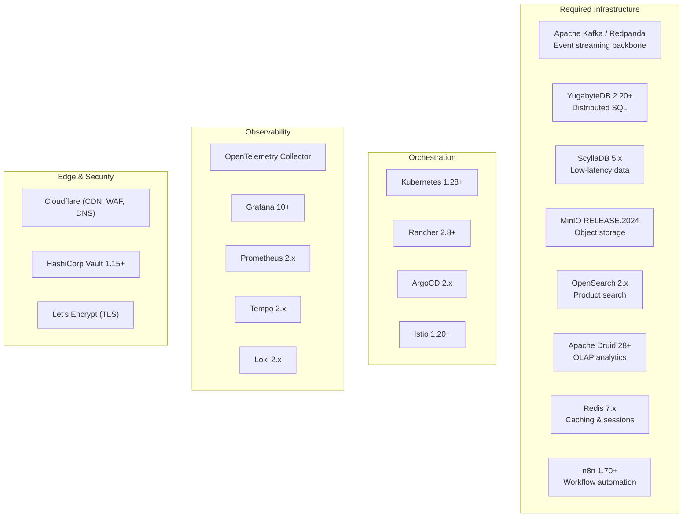
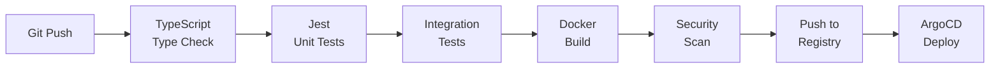
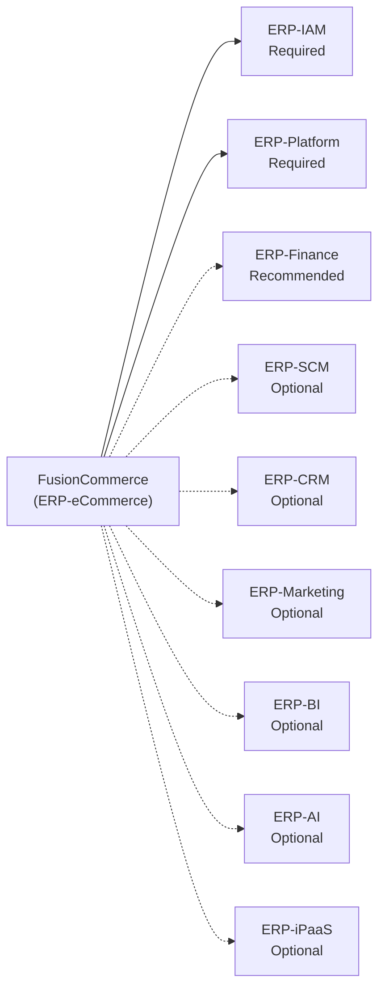

# Software Requirements -- FusionCommerce (ERP-eCommerce)
> Version: 1.0 | Last Updated: 2026-02-23 | Status: Draft
> Classification: Internal | Author: AIDD System

## 1. Introduction

This document specifies all software dependencies, runtime requirements, third-party integrations, and development toolchain requirements for building, testing, and deploying FusionCommerce.

## 2. Runtime Dependencies

### 2.1 Core Runtime

| Software | Version | Purpose | License |
|----------|---------|---------|---------|
| Node.js | 20 LTS (20.x) | Service runtime | MIT |
| TypeScript | 5.x | Type-safe development language | Apache 2.0 |
| npm | 10.x | Package manager (workspaces) | Artistic 2.0 |

### 2.2 Framework Dependencies

| Package | Version | Purpose | License |
|---------|---------|---------|---------|
| fastify | ^4.x | HTTP framework for all services | MIT |
| @fastify/cors | ^9.x | CORS handling | MIT |
| @fastify/helmet | ^11.x | Security headers | MIT |
| @fastify/rate-limit | ^9.x | API rate limiting | MIT |
| kafkajs | ^2.x | Kafka client for event bus | MIT |
| knex | ^3.x | SQL query builder and migrations | MIT |
| pg | ^8.x | PostgreSQL driver | MIT |
| ioredis | ^5.x | Redis client | MIT |
| minio | ^7.x | MinIO S3-compatible client | Apache 2.0 |
| stripe | ^14.x | Stripe payment processing SDK | MIT |
| @elastic/elasticsearch | ^8.x | OpenSearch client | Apache 2.0 |
| pino | ^8.x | Structured logging | MIT |
| zod | ^3.x | Schema validation | MIT |
| uuid | ^9.x | UUID generation | MIT |

### 2.3 AI/ML Dependencies

| Package | Version | Purpose | License |
|---------|---------|---------|---------|
| @xenova/transformers | ^2.x | CLIP model for visual search | Apache 2.0 |
| natural | ^6.x | NLP for search query processing | MIT |
| compromise | ^14.x | NLQ entity extraction | MIT |

## 3. Infrastructure Software

### 3.1 Infrastructure Version Matrix

| Software | Minimum Version | Recommended Version | Purpose |
|----------|----------------|--------------------|---------|
| Kubernetes | 1.28 | 1.30 | Container orchestration |
| Rancher | 2.8 | 2.9 | Kubernetes management |
| Docker | 24.0 | 27.0 | Container runtime |
| Redpanda | 23.3 | 24.1 | Kafka-compatible event streaming |
| YugabyteDB | 2.18 | 2.20 | Distributed SQL (PostgreSQL compat) |
| ScyllaDB | 5.2 | 5.4 | Low-latency NoSQL |
| MinIO | RELEASE.2024-01 | Latest | S3-compatible object storage |
| OpenSearch | 2.11 | 2.13 | Full-text and vector search |
| Apache Druid | 28.0 | 29.0 | Real-time OLAP analytics |
| Redis | 7.0 | 7.2 | Caching, rate limiting, pub/sub |
| n8n | 1.70 | 1.80 | Low-code workflow automation |

## 4. Development Toolchain

### 4.1 Required Tools

| Tool | Version | Purpose |
|------|---------|---------|
| Node.js | 20 LTS | Runtime |
| npm | 10.x | Package management |
| TypeScript | 5.x | Compiler |
| Docker Desktop | 4.x | Local containers |
| Docker Compose | v2 | Multi-container orchestration |
| Git | 2.40+ | Version control |
| VS Code | Latest | Recommended IDE |

### 4.2 Testing Tools

| Tool | Version | Purpose |
|------|---------|---------|
| Jest | ^29.x | Unit and integration testing |
| Supertest | ^6.x | HTTP endpoint testing |
| testcontainers | ^10.x | Container-based integration tests |
| k6 | Latest | Load and performance testing |
| Playwright | ^1.40 | E2E browser testing (storefront) |

### 4.3 CI/CD Pipeline

| Stage | Tool | Configuration |
|-------|------|---------------|
| Lint | TypeScript compiler | `npm run lint` (tsc --noEmit) |
| Unit test | Jest | `npm run test` (all workspaces) |
| Integration test | Jest + Testcontainers | `npm run test:integration` |
| Build | Docker multi-stage | Per-service Dockerfiles |
| Security scan | Trivy | Container image scanning |
| Deploy | ArgoCD | GitOps from manifests repository |

## 5. Third-Party Service Dependencies

### 5.1 Payment Processors

| Service | Purpose | API Version | Required Credentials |
|---------|---------|-------------|---------------------|
| Stripe | Primary payment processing | v2024-xx | Secret key, Webhook secret |
| PayPal | Alternative payment | v2 | Client ID, Client secret |
| Apple Pay | Express checkout | Merchant identity | Merchant ID, Certificate |
| Google Pay | Express checkout | Merchant API | Merchant ID |
| Klarna | BNPL | v1 | API key |

### 5.2 Shipping and Logistics

| Service | Purpose | Required Credentials |
|---------|---------|---------------------|
| EasyPost | Multi-carrier shipping labels | API key |
| Shippo | Alternative shipping API | API token |
| FedEx | Direct carrier integration | Account number, API key |
| UPS | Direct carrier integration | Access key, Username, Password |

### 5.3 Social Commerce

| Platform | API | Required Credentials |
|----------|-----|---------------------|
| Instagram | Graph API v18+ | App ID, App secret, Access token |
| Facebook | Commerce API | Business ID, Access token |
| TikTok | Shop Open API | App key, App secret |

### 5.4 Communication

| Service | Purpose | Required Credentials |
|---------|---------|---------------------|
| SendGrid | Transactional email | API key |
| Twilio | SMS notifications | Account SID, Auth token |
| WhatsApp Business | Chat commerce | Business account, API key |

## 6. Browser Compatibility (Storefront)

| Browser | Minimum Version | Notes |
|---------|----------------|-------|
| Chrome | 90+ | Primary target |
| Firefox | 90+ | Full support |
| Safari | 15+ | Apple Pay support |
| Edge | 90+ | Chromium-based |
| Mobile Safari | iOS 15+ | Apple Pay Sheet |
| Chrome Mobile | Android 10+ | Google Pay |

## 7. Dependency Security Policy

| Policy | Rule |
|--------|------|
| Vulnerability scanning | npm audit on every CI build |
| Critical vulnerabilities | Must be patched within 24 hours |
| High vulnerabilities | Must be patched within 7 days |
| Dependency updates | Monthly review of all production dependencies |
| License compliance | No GPL or AGPL dependencies in production |
| Lock file | package-lock.json committed and enforced (`npm ci`) |

## 8. ERP Module Dependencies

| Module | Dependency Level | Integration Purpose |
|--------|-----------------|---------------------|
| ERP-IAM | **Required** | Authentication, authorization, JWT issuance |
| ERP-Platform | **Required** | Tenant management, feature entitlements, licensing |
| ERP-Finance | Recommended | Revenue recognition, tax, refund accounting |
| ERP-SCM | Optional | Procurement, supplier management, 3PL coordination |
| ERP-CRM | Optional | Customer 360, support ticket linkage |
| ERP-Marketing | Optional | Campaign management, email marketing |
| ERP-BI | Optional | Cross-module business intelligence |
| ERP-AI | Optional | Advanced ML models, recommendation engines |
| ERP-iPaaS | Optional | Third-party integration orchestration |
