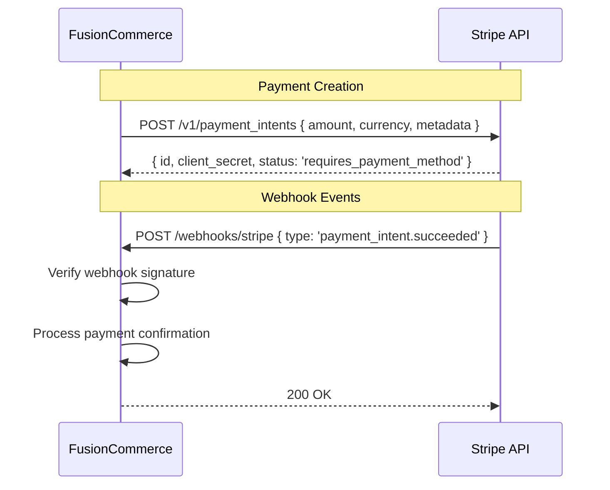

# Technical Specifications -- FusionCommerce (ERP-eCommerce)
> Version: 1.0 | Last Updated: 2026-02-23 | Status: Draft
> Classification: Internal | Author: AIDD System

## 1. Introduction

This document provides the complete technical specifications for FusionCommerce, including API reference, event schemas, configuration parameters, protocol specifications, and integration interface contracts.

## 2. API Specifications

### 2.1 Common API Standards

| Aspect | Specification |
|--------|--------------|
| Base URL | `https://{tenant}.fusioncommerce.io/api/v1` |
| Protocol | HTTPS (TLS 1.3 minimum) |
| Content-Type | application/json |
| Authentication | Bearer JWT (ERP-IAM issued) |
| Pagination | Cursor-based: `?after={cursor}&limit={count}` |
| Rate Limiting | Consumer: 1000 req/min, Merchant: 5000 req/min |
| Error Format | `{ "error": { "code": "string", "message": "string", "details": {} } }` |
| Request ID | `X-Request-Id` header (UUID, auto-generated if absent) |

### 2.2 Catalog API

```yaml
openapi: "3.1.0"
paths:
  /v1/products:
    post:
      summary: Create a product
      requestBody:
        content:
          application/json:
            schema:
              type: object
              required: [name, sku, price, currency]
              properties:
                name: { type: string, maxLength: 512 }
                sku: { type: string, maxLength: 128 }
                description: { type: string }
                price: { type: number, minimum: 0 }
                compare_at_price: { type: number }
                currency: { type: string, enum: [USD, EUR, GBP, JPY, CAD, AUD] }
                status: { type: string, enum: [draft, active, archived], default: draft }
                category_id: { type: string, format: uuid }
                tags: { type: array, items: { type: string } }
                variants:
                  type: array
                  items:
                    type: object
                    properties:
                      sku: { type: string }
                      name: { type: string }
                      price: { type: number }
                      options: { type: object }
      responses:
        201: { description: Product created }
        400: { description: Validation error }
    get:
      summary: List products
      parameters:
        - name: category
          in: query
          schema: { type: string }
        - name: brand
          in: query
          schema: { type: string }
        - name: status
          in: query
          schema: { type: string, enum: [draft, active, archived] }
        - name: price_min
          in: query
          schema: { type: number }
        - name: price_max
          in: query
          schema: { type: number }
        - name: sort
          in: query
          schema: { type: string, enum: [name, price, created_at, updated_at] }
        - name: order
          in: query
          schema: { type: string, enum: [asc, desc] }
        - name: after
          in: query
          schema: { type: string }
        - name: limit
          in: query
          schema: { type: integer, default: 20, maximum: 100 }
      responses:
        200: { description: Paginated product list }
```

### 2.3 Checkout API

| Endpoint | Method | Description |
|----------|--------|-------------|
| /v1/cart | POST | Create new cart |
| /v1/cart/:id/items | POST | Add item to cart |
| /v1/cart/:id/items/:itemId | PUT | Update item quantity |
| /v1/cart/:id/items/:itemId | DELETE | Remove item from cart |
| /v1/cart/:id/coupon | POST | Apply coupon code |
| /v1/cart/:id/coupon | DELETE | Remove coupon |
| /v1/checkout/:cartId/start | POST | Initialize checkout |
| /v1/checkout/:id/shipping-address | PUT | Set shipping address |
| /v1/checkout/:id/shipping-method | PUT | Select shipping method |
| /v1/checkout/:id/payment | PUT | Set payment method |
| /v1/checkout/:id/complete | POST | Complete checkout |

### 2.4 Search API

| Endpoint | Method | Description |
|----------|--------|-------------|
| /v1/search | GET | Text search with query params |
| /v1/search/visual | POST | Visual search with image upload |
| /v1/search/suggest | GET | Autocomplete suggestions |
| /v1/search/trending | GET | Trending search terms |

**Search Query Parameters:**

| Parameter | Type | Description |
|-----------|------|-------------|
| q | string | Search query (NLQ supported) |
| category | string | Filter by category slug |
| brand | string[] | Filter by brand names |
| price_min | number | Minimum price filter |
| price_max | number | Maximum price filter |
| attributes | object | Dynamic attribute filters (e.g., color, size) |
| sort | string | Relevance, price_asc, price_desc, newest, rating |
| facets | boolean | Include facet aggregations |
| limit | integer | Results per page (default 20, max 100) |
| after | string | Pagination cursor |

### 2.5 Loyalty API

| Endpoint | Method | Description |
|----------|--------|-------------|
| /v1/loyalty/account | GET | Get customer loyalty account |
| /v1/loyalty/earn | POST | Credit points (system use) |
| /v1/loyalty/redeem | POST | Redeem points for discount |
| /v1/loyalty/balance | GET | Get points/cashback/credit balance |
| /v1/loyalty/tiers | GET | List tier definitions |
| /v1/loyalty/transactions | GET | Points transaction history |
| /v1/loyalty/gamification/daily-checkin | POST | Daily check-in for bonus points |

## 3. Event Schemas

### 3.1 Kafka Topic Configuration

| Topic | Partitions | Replication | Retention | Compaction |
|-------|-----------|-------------|-----------|------------|
| product.created | 6 | 3 | 7 days | Delete |
| product.updated | 6 | 3 | 7 days | Compact |
| order.created | 12 | 3 | 30 days | Delete |
| order.completed | 12 | 3 | 30 days | Delete |
| inventory.reserved | 6 | 3 | 7 days | Delete |
| inventory.insufficient | 3 | 3 | 7 days | Delete |
| payment.succeeded | 12 | 3 | 90 days | Delete |
| payment.failed | 6 | 3 | 90 days | Delete |
| cart.abandoned | 6 | 3 | 30 days | Delete |
| fulfillment.shipped | 6 | 3 | 30 days | Delete |
| subscription.renewed | 3 | 3 | 30 days | Delete |
| loyalty.points_earned | 6 | 3 | 30 days | Delete |
| search.query | 12 | 3 | 7 days | Delete |

### 3.2 Event Payload Schemas

```typescript
// order.created
interface OrderCreatedEvent {
  eventId: string;        // UUID
  eventType: 'order.created';
  timestamp: string;      // ISO 8601
  tenantId: string;
  payload: {
    orderId: string;
    orderNumber: string;
    customerId: string;
    email: string;
    items: Array<{
      productId: string;
      variantId?: string;
      sku: string;
      name: string;
      quantity: number;
      unitPrice: number;
    }>;
    subtotal: number;
    discountTotal: number;
    shippingTotal: number;
    taxTotal: number;
    total: number;
    currency: string;
    shippingAddress: Address;
    billingAddress: Address;
  };
}

// inventory.reserved
interface InventoryReservedEvent {
  eventId: string;
  eventType: 'inventory.reserved';
  timestamp: string;
  tenantId: string;
  payload: {
    orderId: string;
    reservations: Array<{
      sku: string;
      quantity: number;
      warehouseId: string;
    }>;
  };
}

// cart.abandoned
interface CartAbandonedEvent {
  eventId: string;
  eventType: 'cart.abandoned';
  timestamp: string;
  tenantId: string;
  payload: {
    cartId: string;
    customerId?: string;
    email?: string;
    items: Array<{
      productId: string;
      name: string;
      quantity: number;
      unitPrice: number;
      imageUrl: string;
    }>;
    subtotal: number;
    currency: string;
    abandonedAt: string;
  };
}
```

## 4. Configuration Parameters

### 4.1 Service Configuration

```typescript
interface ServiceConfig {
  // Server
  PORT: number;                    // Default: 3000-3014 per service
  HOST: string;                    // Default: '0.0.0.0'
  LOG_LEVEL: 'debug' | 'info' | 'warn' | 'error';  // Default: 'info'

  // Kafka
  KAFKA_BROKERS: string;          // Comma-separated broker list
  KAFKA_CLIENT_ID: string;        // Service name
  KAFKA_GROUP_ID: string;         // Consumer group
  USE_IN_MEMORY_BUS: boolean;     // Default: false

  // Database
  DATABASE_URL: string;            // PostgreSQL/YugabyteDB connection string
  DB_POOL_MIN: number;            // Default: 2
  DB_POOL_MAX: number;            // Default: 10

  // Redis
  REDIS_URL: string;              // Redis connection string
  REDIS_CACHE_TTL: number;        // Default: 300 (seconds)

  // MinIO
  MINIO_ENDPOINT: string;
  MINIO_ACCESS_KEY: string;
  MINIO_SECRET_KEY: string;
  MINIO_BUCKET: string;

  // External APIs
  STRIPE_SECRET_KEY: string;
  STRIPE_WEBHOOK_SECRET: string;
  EASYPOST_API_KEY: string;
  SENDGRID_API_KEY: string;

  // ERP Integration
  IAM_ISSUER_URL: string;         // OIDC issuer for JWT validation
  PLATFORM_API_URL: string;       // ERP-Platform entitlements
}
```

### 4.2 Checkout Configuration

| Parameter | Type | Default | Description |
|-----------|------|---------|-------------|
| CART_EXPIRY_MINUTES | number | 30 | Minutes before cart marked abandoned |
| MAX_CART_ITEMS | number | 50 | Maximum items per cart |
| MAX_ITEM_QUANTITY | number | 99 | Maximum quantity per line item |
| COUPON_STACK_LIMIT | number | 2 | Maximum coupons per cart |
| EXPRESS_CHECKOUT_ENABLED | boolean | true | Enable Apple Pay/Google Pay |
| GUEST_CHECKOUT_ENABLED | boolean | true | Allow checkout without account |

### 4.3 Loyalty Configuration

| Parameter | Type | Default | Description |
|-----------|------|---------|-------------|
| POINTS_PER_DOLLAR | number | 1 | Base points earned per dollar |
| POINTS_EXPIRY_MONTHS | number | 12 | Months of inactivity before expiry |
| MIN_REDEMPTION_POINTS | number | 500 | Minimum points for redemption |
| POINT_VALUE_CENTS | number | 1 | Value of 1 point in cents |
| TIER_BRONZE_THRESHOLD | number | 0 | Annual spend for Bronze |
| TIER_SILVER_THRESHOLD | number | 500 | Annual spend for Silver |
| TIER_GOLD_THRESHOLD | number | 2000 | Annual spend for Gold |
| TIER_PLATINUM_THRESHOLD | number | 5000 | Annual spend for Platinum |
| TIER_DEMOTION_GRACE_MONTHS | number | 3 | Grace period before tier demotion |

## 5. Integration Interface Contracts

### 5.1 Stripe Integration



### 5.2 EasyPost Integration

| Operation | Endpoint | Request | Response |
|-----------|----------|---------|----------|
| Get Rates | POST /shipments | { from, to, parcel, carrier_accounts } | { rates: [...] } |
| Buy Label | POST /shipments/:id/buy | { rate: { id } } | { tracking_code, label_url } |
| Track | GET /trackers/:id | - | { status, tracking_details } |

### 5.3 Social Platform Integration

| Platform | API | Operations |
|----------|-----|------------|
| Instagram | Instagram Graph API | Product catalog sync, order import |
| Facebook | Commerce API | Product feed, collection management |
| TikTok | TikTok Shop API | Product listing, order management |

## 6. Performance Specifications

| Metric | Specification |
|--------|--------------|
| API response time (p50) | < 20ms |
| API response time (p99) | < 100ms |
| Search query latency (p99) | < 50ms |
| Checkout latency (p99) | < 500ms |
| Kafka event processing latency | < 100ms |
| Concurrent users | 100,000+ |
| Orders per second | 10,000+ |
| Events per second | 1,000,000+ |
| Database connections per service | 2-10 (pool) |
| Image upload size limit | 10MB per image |
| CSV import size limit | 50MB per file |
| API payload size limit | 1MB |
