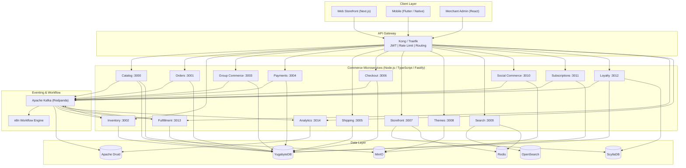
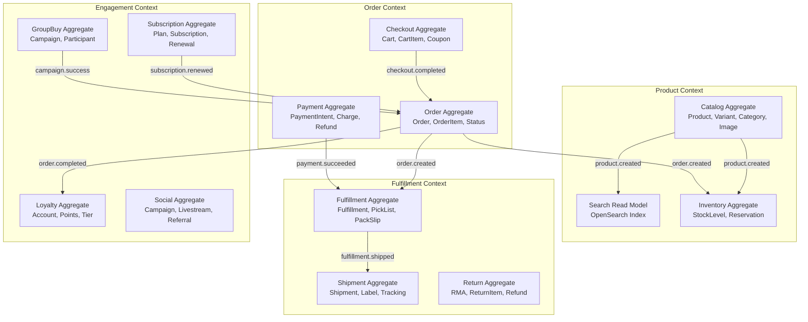
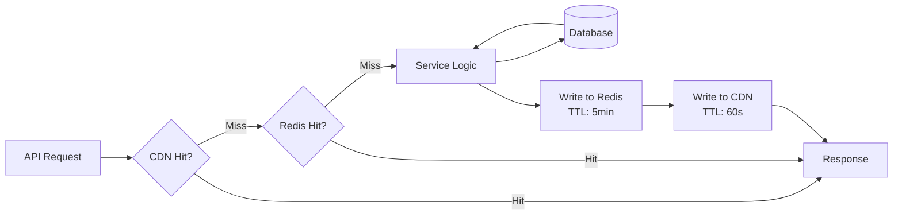
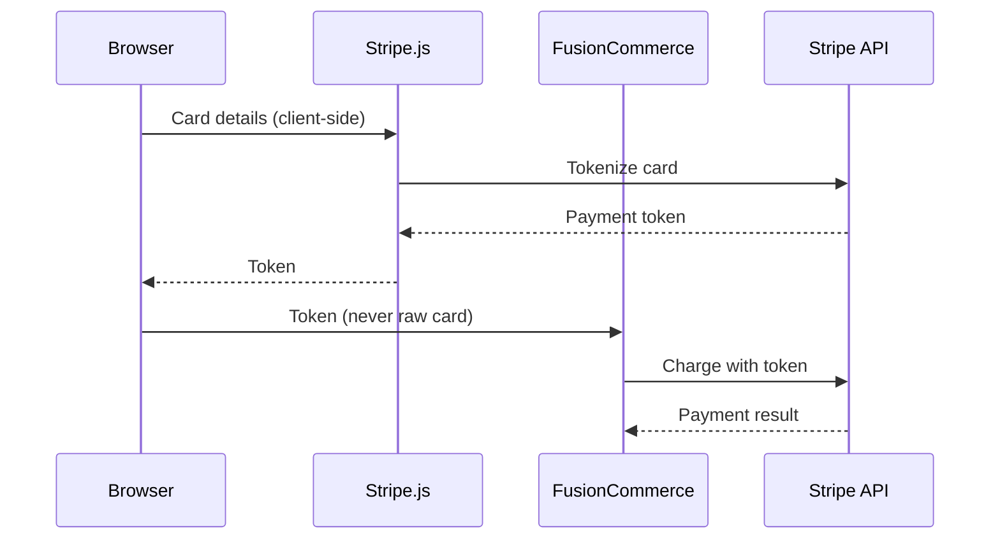
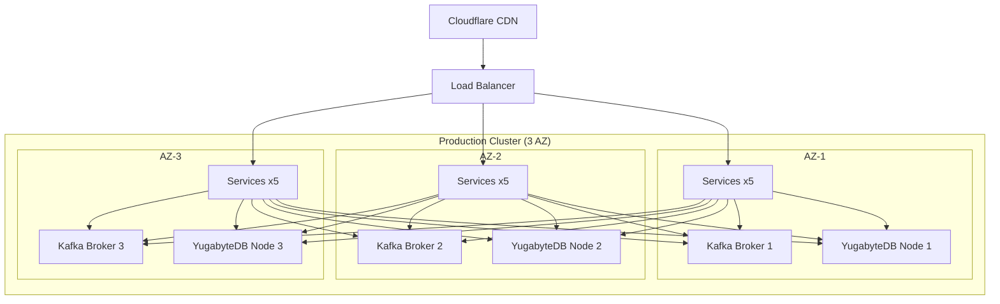

# Technical Writeup -- FusionCommerce (ERP-eCommerce)
> Version: 1.0 | Last Updated: 2026-02-23 | Status: Draft
> Classification: Internal | Author: AIDD System

## Executive Summary

FusionCommerce (ERP-eCommerce) is an enterprise-grade, API-first composable commerce platform within the OpenSASE ERP ecosystem. The system consolidates headless storefront, checkout, catalog, inventory, payments, fulfillment, search, social commerce, subscription commerce, loyalty, group buying, and analytics into 15 Node.js/TypeScript microservices communicating through Apache Kafka. Each service is independently deployable, horizontally scalable, and follows domain-driven design principles with event sourcing patterns. FusionCommerce is benchmarked against Shopify Plus, Adobe Commerce (Magento), BigCommerce Enterprise, and WooCommerce to deliver feature parity and significant architectural advantages.

## Architecture Overview

## Technology Stack

| Layer | Technology | Version | Rationale |
|-------|-----------|---------|-----------|
| Runtime | Node.js | 20 LTS | Async I/O, event-loop architecture matches event-driven domain |
| Language | TypeScript | 5.x | Type safety across 15 services, shared contracts package |
| HTTP Framework | Fastify | 4.x | 76K req/s benchmark, schema-based validation, plugin ecosystem |
| Event Bus | Apache Kafka (Redpanda) | Latest | Ordered event streams, replay, exactly-once semantics |
| Workflow | n8n | 1.70+ | Low-code automation, Kafka triggers, 400+ integrations |
| Primary DB | YugabyteDB | Latest | Distributed PostgreSQL, strong consistency, geo-replication |
| Hot Data | ScyllaDB | Latest | 1M+ ops/sec, sub-ms p99 latency for sessions and counters |
| Object Storage | MinIO | Latest | S3-compatible, on-prem, erasure coding |
| Analytics | Apache Druid | Latest | Sub-second OLAP on billions of events |
| Search | OpenSearch | Latest | Full-text, vector (kNN), faceted search |
| Cache | Redis | 7.x | API caching, rate limiting, session tokens |
| Container | Docker + Kubernetes (Rancher) | Latest | Microservice orchestration, HPA autoscaling |
| CI/CD | GitLab CI + ArgoCD | Latest | GitOps-based build, test, deploy pipeline |
| Edge | Cloudflare + Voxility | Latest | Global CDN, WAF, DDoS protection |
| Observability | OpenTelemetry + Grafana | Latest | Distributed tracing, metrics, logs |

## Domain-Driven Design

FusionCommerce decomposes the commerce domain into bounded contexts, each implemented as an independent microservice:

## Event-Driven Architecture Deep Dive

The Kafka event backbone processes an estimated 1M+ events per second at scale. Key design decisions:

1. **Topic-Per-Event-Type**: Each domain event has its own Kafka topic (e.g., `order.created`, `inventory.reserved`) for independent consumer scaling
2. **Avro Schema Registry**: Event payloads validated against Avro schemas stored in Redpanda Schema Registry for backward compatibility
3. **Exactly-Once Semantics**: Kafka transactions with idempotent producers ensure no duplicate processing
4. **Dead Letter Queues**: Failed event processing routes to `.dlq` topics for investigation and replay
5. **Event Replay**: Full event log retention enables rebuilding read models and state recovery

### Event Catalog

| Domain | Event | Payload Summary |
|--------|-------|-----------------|
| Catalog | product.created | productId, sku, name, price, variants, images |
| Catalog | product.updated | productId, changedFields, timestamp |
| Orders | order.created | orderId, customerId, items, total, currency |
| Orders | order.completed | orderId, total, fulfillmentId |
| Inventory | inventory.reserved | orderId, items, warehouseId |
| Inventory | inventory.insufficient | orderId, missingItems |
| Payments | payment.succeeded | paymentId, orderId, amount, method |
| Payments | payment.failed | paymentId, orderId, reason |
| Checkout | cart.abandoned | cartId, customerId, items, total |
| Checkout | cart.recovered | cartId, orderId |
| Fulfillment | fulfillment.shipped | fulfillmentId, orderId, trackingNumber |
| Loyalty | loyalty.points_earned | customerId, points, orderId |
| Loyalty | loyalty.tier_upgraded | customerId, oldTier, newTier |
| Subscription | subscription.renewed | subscriptionId, orderId, nextRenewal |
| Social | campaign.success | campaignId, participants, totalRevenue |
| Search | search.query | query, resultCount, clickedProducts |

## Performance Architecture

### Response Time Targets

| Operation | p50 Target | p99 Target | Measured |
|-----------|-----------|-----------|----------|
| Product listing (cached) | 5ms | 20ms | Pending |
| Product detail | 10ms | 50ms | Pending |
| Search query | 15ms | 50ms | Pending |
| Cart add/update | 20ms | 100ms | Pending |
| Checkout complete | 100ms | 500ms | Pending |
| Analytics query | 200ms | 2000ms | Pending |

### Caching Strategy

| Layer | TTL | Invalidation | Use Cases |
|-------|-----|-------------|-----------|
| Cloudflare CDN | 60 seconds | Purge API on product update | Product listings, images, theme assets |
| Redis | 5 minutes | Event-driven invalidation | Product details, category trees, search facets |
| Application | Request-scoped | N/A | Database query results within request |

## Security Implementation

### PCI DSS Compliance

FusionCommerce never handles raw payment card data. All card processing uses Stripe.js / PayPal.js client-side tokenization:

### Additional Security Controls

- All inter-service communication over mTLS via Istio service mesh
- JWT tokens validated at API Gateway with ERP-IAM
- Row-level security in YugabyteDB for tenant isolation
- AES-256 encryption at rest for all databases
- OWASP Top 10 protections (SQL injection, XSS, CSRF) via Fastify plugins
- Rate limiting at gateway (1000 req/min per consumer, 5000 req/min per merchant)
- Audit logging for all state-changing operations

## Deployment Architecture

Each service deployed as Kubernetes Deployment with:
- **Minimum 2 replicas** per service (3 for critical path: checkout, orders, payments)
- **HPA** autoscaling based on CPU, memory, and custom metrics
- **PodDisruptionBudget** ensuring at least 1 replica during rolling updates
- **Multi-AZ** spread for fault tolerance
- **Rolling updates** with readiness probes (zero-downtime deployments)
