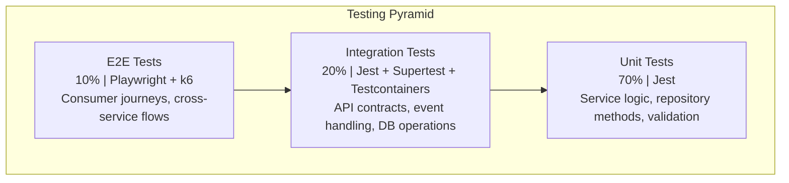
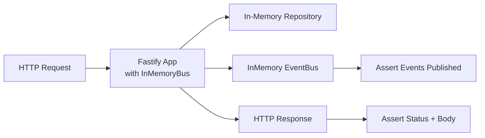
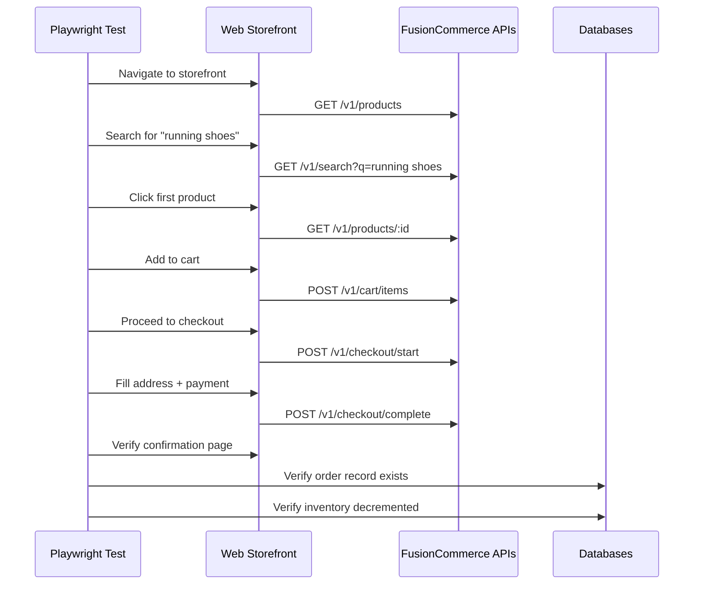
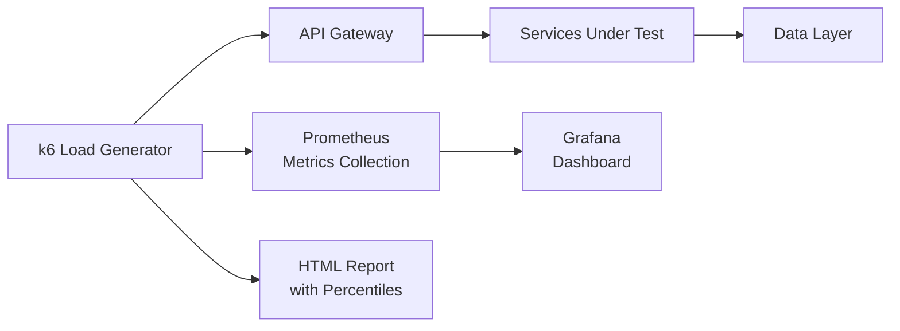
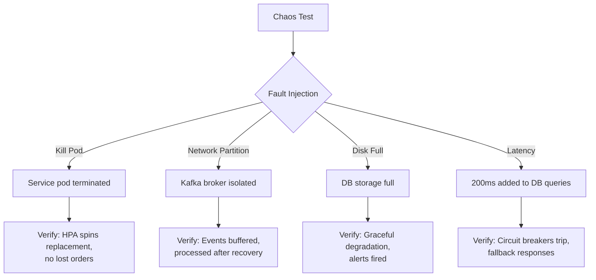

# Testing Requirements (AIDD) -- FusionCommerce (ERP-eCommerce)
> Version: 1.0 | Last Updated: 2026-02-23 | Status: Draft
> Classification: Internal | Author: AIDD System

## 1. Introduction

This document defines the testing strategy, test plan, and quality gates for FusionCommerce following AIDD (AI-Driven Development) testing methodology. It covers unit, integration, end-to-end, performance, security, and chaos testing across all 15 microservices.

## 2. Testing Pyramid



## 3. Unit Testing Strategy

### 3.1 Coverage Targets

| Service | Target Coverage | Critical Paths |
|---------|----------------|---------------|
| catalog | 85% | Product creation, variant management, validation |
| orders | 90% | Order creation, status transitions, total calculation |
| inventory | 90% | Reservation logic, concurrent access, insufficient stock |
| checkout-service | 90% | Cart operations, coupon engine, tax calculation |
| payments | 85% | PaymentIntent creation, webhook handling, refunds |
| search-service | 80% | Query parsing, NLQ processing, merchandising rules |
| loyalty-service | 85% | Points calculation, tier evaluation, redemption |
| subscription-commerce-service | 85% | Renewal processing, skip/pause/cancel logic |
| group-commerce | 85% | Campaign lifecycle, participant management |
| fulfillment-service | 85% | Warehouse routing, pick list generation |
| social-commerce-service | 80% | Platform adapter sync, order processing |
| shipping | 80% | Label generation, rate calculation |
| storefront-service | 80% | Cart aggregation, wishlist management |
| theme-service | 75% | Template rendering, asset management |
| analytics-service | 75% | Query building, data aggregation |

### 3.2 Unit Test Examples

```typescript
// catalog-service: Product creation
describe('CatalogService', () => {
  it('should create product with valid data', async () => {
    const product = await service.createProduct({
      name: 'Test Shoe', sku: 'TST-001', price: 99.99, currency: 'USD'
    });
    expect(product.id).toBeDefined();
    expect(product.name).toBe('Test Shoe');
  });

  it('should reject product with negative price', async () => {
    await expect(service.createProduct({
      name: 'Bad', sku: 'BAD-001', price: -10, currency: 'USD'
    })).rejects.toThrow('Price must be non-negative');
  });

  it('should publish product.created event', async () => {
    await service.createProduct({...validData});
    expect(mockEventBus.publish).toHaveBeenCalledWith(
      'product.created', expect.objectContaining({ sku: 'TST-001' })
    );
  });
});
```

## 4. Integration Testing Strategy

### 4.1 API Contract Tests



### 4.2 Event Contract Tests

| Test Scenario | Producer | Consumer | Verification |
|--------------|----------|----------|--------------|
| Order triggers inventory reservation | orders | inventory | inventory.reserved event contains correct SKUs and quantities |
| Payment success triggers fulfillment | payments | fulfillment | Fulfillment record created with correct order reference |
| Cart abandonment triggers recovery | checkout | n8n (mock) | cart.abandoned event contains cart items and customer email |
| Campaign success triggers orders | group-commerce | orders | Orders created for all participants at group price |
| Subscription renewal triggers order | subscriptions | orders | Recurring order matches subscription items and pricing |

### 4.3 Database Integration Tests

```typescript
// Using Testcontainers for PostgreSQL
describe('PostgresOrderRepository', () => {
  let container: StartedPostgreSqlContainer;
  let repo: PostgresOrderRepository;

  beforeAll(async () => {
    container = await new PostgreSqlContainer().start();
    const knex = createDatabase({ connectionString: container.getConnectionUri() });
    await knex.migrate.latest();
    repo = new PostgresOrderRepository(knex);
  });

  afterAll(async () => await container.stop());

  it('should persist and retrieve order', async () => {
    const order = buildTestOrder();
    await repo.save(order);
    const retrieved = await repo.findById(order.id);
    expect(retrieved).toMatchObject(order);
  });

  it('should enforce tenant isolation', async () => {
    const order1 = buildTestOrder({ tenantId: 'tenant-a' });
    const order2 = buildTestOrder({ tenantId: 'tenant-b' });
    await repo.save(order1);
    await repo.save(order2);
    const results = await repo.findByTenant('tenant-a');
    expect(results).toHaveLength(1);
    expect(results[0].tenantId).toBe('tenant-a');
  });
});
```

## 5. End-to-End Testing

### 5.1 Consumer Journey Tests

| Test ID | Journey | Steps | Services Involved |
|---------|---------|-------|-------------------|
| E2E-001 | Browse to Purchase | Search -> PDP -> Cart -> Checkout -> Confirm | search, storefront, checkout, orders, inventory, payments |
| E2E-002 | Guest Checkout | Cart -> Guest Email -> Checkout -> Confirm | checkout, orders, payments |
| E2E-003 | Subscription Signup | PDP -> Subscribe -> First Order -> Renewal | subscriptions, orders, payments |
| E2E-004 | Group Buying | Create Campaign -> 5 Joins -> Orders | group-commerce, orders, payments |
| E2E-005 | Return Processing | Order History -> Return Request -> Refund | orders, fulfillment, payments |
| E2E-006 | Loyalty Redemption | Order -> Earn Points -> Redeem at Checkout | loyalty, checkout, orders |

### 5.2 E2E Test Flow



## 6. Performance Testing

### 6.1 Load Test Scenarios

| Scenario | Tool | Virtual Users | Duration | Target |
|----------|------|--------------|----------|--------|
| Product browsing | k6 | 5,000 VU | 30 min | p99 < 100ms |
| Search queries | k6 | 2,000 VU | 30 min | p99 < 50ms |
| Cart operations | k6 | 1,000 VU | 30 min | p99 < 200ms |
| Checkout flow | k6 | 500 VU | 30 min | p99 < 500ms |
| Mixed workload | k6 | 10,000 VU | 60 min | Error rate < 0.1% |
| Spike test | k6 | 0->50,000 VU in 2 min | 10 min | No crashes, graceful degradation |
| Endurance test | k6 | 5,000 VU | 24 hours | No memory leaks, stable latency |

### 6.2 Performance Test Architecture



## 7. Security Testing

| Test Category | Tool | Frequency | Scope |
|--------------|------|-----------|-------|
| SAST | SonarQube | Every commit | TypeScript source code |
| DAST | OWASP ZAP | Weekly | All API endpoints |
| Dependency audit | npm audit + Snyk | Every build | All npm packages |
| Container scan | Trivy | Every build | All Docker images |
| Penetration test | External vendor | Quarterly | Full platform |
| PCI compliance scan | ASV (Approved Scanning Vendor) | Quarterly | Payment-related endpoints |

### 7.1 Security Test Cases

| Test | Description | Expected Result |
|------|-------------|----------------|
| SEC-001 | Request with expired JWT | 401 Unauthorized |
| SEC-002 | Request with tampered JWT | 401 Unauthorized |
| SEC-003 | Cross-tenant data access | 403 Forbidden or empty results |
| SEC-004 | SQL injection in search query | Query sanitized, no injection |
| SEC-005 | XSS in product review | HTML sanitized, script not executed |
| SEC-006 | Rate limit exceeded | 429 Too Many Requests |
| SEC-007 | CSRF token validation | 403 without valid CSRF token |
| SEC-008 | Stripe webhook signature | 400 for invalid signatures |

## 8. Chaos Testing



## 9. Quality Gates

| Gate | Criteria | Enforcement |
|------|----------|-------------|
| PR Merge | Unit tests pass, coverage >= 80%, no critical findings | GitLab CI required |
| Staging Deploy | All integration tests pass, no P0 bugs | ArgoCD sync policy |
| Production Deploy | All E2E tests pass, performance meets SLA, security scan clean | Manual approval + automated checks |
| Release | All acceptance criteria met, documentation updated | Release manager sign-off |

## 10. Test Data Management

| Strategy | Scope | Approach |
|----------|-------|----------|
| Unit tests | Service-scoped | Factories and builders, no shared state |
| Integration tests | Container-scoped | Testcontainers with fresh DB per suite |
| E2E tests | Environment-scoped | Seed scripts + cleanup after each test |
| Performance tests | Dedicated env | Pre-loaded with 1M products, 10M orders |
