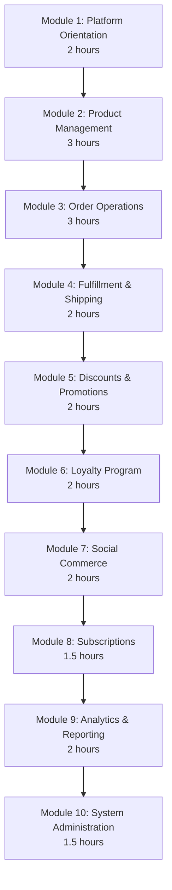
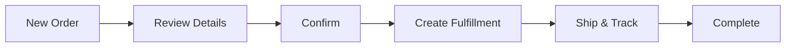

# Training Manual for Administrators -- FusionCommerce (ERP-eCommerce)
> Version: 1.0 | Last Updated: 2026-02-23 | Status: Draft
> Classification: Internal | Author: AIDD System

## 1. Training Overview

This training manual provides structured learning modules for merchant administrators, covering all FusionCommerce operational functions through hands-on exercises and practical scenarios.

## 2. Training Curriculum

**Total Training Time:** 21 hours (spread across 5 days)

## 3. Module 1: Platform Orientation

### Learning Objectives
- Navigate the admin dashboard confidently
- Understand the FusionCommerce architecture at a high level
- Identify key system components and their roles

### 3.1 Dashboard Walkthrough

The admin dashboard is organized into these primary sections:

| Section | Icon | Purpose |
|---------|------|---------|
| Home | Dashboard | Key metrics overview, recent orders, alerts |
| Products | Package | Product catalog, categories, inventory |
| Orders | Shopping bag | Order management, fulfillment |
| Customers | People | Customer profiles, segments |
| Discounts | Tag | Coupons, automatic discounts |
| Storefront | Palette | Theme customization, navigation |
| Analytics | Chart | Reports and dashboards |
| Social | Share | Social commerce channels |
| Loyalty | Star | Loyalty program management |
| Subscriptions | Refresh | Subscription management |
| Settings | Gear | System configuration |

### Exercise 1.1: Dashboard Exploration
1. Log in to the admin dashboard
2. Identify today's order count, revenue, and active visitors
3. Navigate to each major section and note what information is available
4. Find the settings page and locate payment provider configuration

## 4. Module 2: Product Management

### Learning Objectives
- Create single and variant products
- Upload and manage product images
- Configure categories and collections
- Perform bulk product imports

### 4.1 Hands-On: Create Your First Product

**Scenario:** You are adding a new sneaker to your catalog.

1. Navigate to **Products > Add Product**
2. Enter:
   - Title: "FusionRun Pro Sneaker"
   - Description: Write a compelling 2-paragraph description
   - Base Price: $129.99
   - Compare-at Price: $159.99
   - SKU: FR-PRO-001
3. Add variants:
   - Size: 7, 8, 9, 10, 11, 12
   - Color: Black, White, Red
   - System generates 18 variant combinations
4. Upload 4 product images (different angles)
5. Assign to category: Footwear > Running
6. Add tags: "running", "sneaker", "athletic"
7. Configure SEO: meta title, description, URL slug
8. Save as Draft, preview, then Publish

### 4.2 Hands-On: Bulk Import

**Scenario:** Import 50 products from a supplier catalog.

1. Download CSV template
2. Fill in 5 sample rows (instructor provides template)
3. Upload CSV and review validation results
4. Fix any errors and re-import
5. Verify imported products appear in catalog

### Exercise 2.1: Category Structure
Design a 3-level category hierarchy for a fashion store:
- Level 1: Department (Men, Women, Kids)
- Level 2: Category (Clothing, Shoes, Accessories)
- Level 3: Subcategory (T-Shirts, Jeans, Sneakers)

Create this hierarchy in the admin dashboard.

## 5. Module 3: Order Operations

### Learning Objectives
- Process orders from receipt to fulfillment
- Handle cancellations and refunds
- Manage returns through the RMA flow

### 5.1 Order Processing Flow

### Exercise 3.1: Order Processing
**Scenario:** Process 3 sample orders:
1. Standard order (confirm, fulfill, ship)
2. Order requiring cancellation (customer requested before shipping)
3. Order with return request (customer received wrong size)

For each order, document:
- What status changes occurred
- What events were triggered
- What notifications the customer received

## 6. Module 4: Fulfillment and Shipping

### Learning Objectives
- Generate pick lists and packing slips
- Create shipping labels
- Track shipments
- Process returns

### Exercise 4.1: Fulfillment Workflow
1. Open a confirmed order
2. Click "Create Fulfillment"
3. Review the generated pick list
4. Simulate picking by confirming items
5. Record package dimensions and weight
6. Generate a shipping label
7. Note the tracking number
8. Mark order as shipped

## 7. Module 5: Discounts and Promotions

### Learning Objectives
- Create percentage and fixed-amount coupons
- Set up automatic discounts
- Configure coupon restrictions and limits

### Exercise 5.1: Campaign Setup
Create the following promotions:
1. **Coupon**: "WELCOME10" - 10% off first order, max 1000 uses
2. **Coupon**: "FREESHIP" - Free shipping on orders over $75
3. **Automatic**: Buy 2 get 1 free on accessories
4. Test each promotion by simulating a checkout

## 8. Module 6: Loyalty Program

### Exercise 6.1: Loyalty Configuration
1. Set up points earning: 1 point per $1 spent
2. Configure tiers: Bronze (0), Silver ($500), Gold ($2000), Platinum ($5000)
3. Set Silver multiplier to 1.25x, Gold to 1.5x, Platinum to 2x
4. Create a "Double Points Weekend" promotion
5. Enable daily check-in gamification feature

## 9. Module 7: Social Commerce

### Exercise 7.1: Channel Connection
1. Connect Instagram Shopping (test account)
2. Sync 10 products to Instagram catalog
3. Verify products appear correctly with prices and images
4. Schedule a mock livestream event
5. Pre-select 5 products for the livestream

## 10. Module 8: Subscriptions

### Exercise 8.1: Subscription Setup
1. Create a subscription plan: "Monthly Wellness Box"
2. Configure frequencies: Monthly, Quarterly
3. Set pricing: $39.99/month, $99.99/quarter
4. Define swappable products
5. Configure skip policy (max 2 consecutive)
6. Set payment retry rules (3 retries over 7 days)

## 11. Module 9: Analytics and Reporting

### Exercise 9.1: Report Analysis
Using the analytics dashboard:
1. Identify the current week's conversion rate
2. Find the step with the highest drop-off in the conversion funnel
3. List the top 5 selling products this month
4. Calculate the average order value
5. Compare revenue by channel (direct, social, email)
6. Export a sales report as CSV

## 12. Module 10: System Administration

### Learning Objectives
- Manage team members and roles
- Configure payment and shipping providers
- Handle security and compliance settings

### Exercise 10.1: Team Management
1. Create a new team member with "Order Manager" role
2. Verify they can access orders but not product editing
3. Create a "Warehouse Staff" role with fulfillment-only access
4. Verify role restrictions are enforced

## 13. Assessment

### Knowledge Check (25 questions)
After completing all modules, administrators take a knowledge check covering:
- Dashboard navigation (5 questions)
- Product management (5 questions)
- Order processing (5 questions)
- Loyalty and promotions (5 questions)
- Analytics interpretation (5 questions)

**Passing Score:** 80% (20/25 correct)

### Practical Assessment
Complete a real-world scenario: Set up a new product line, create promotions, process orders, handle a return, and produce a weekly sales report. Evaluated by instructor.
