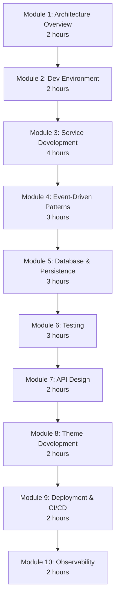
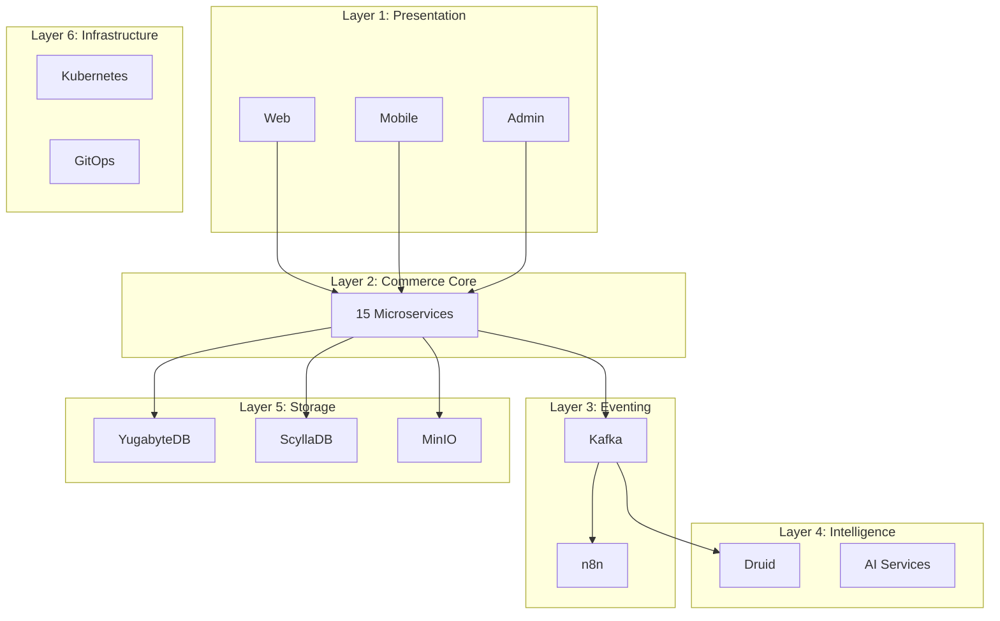
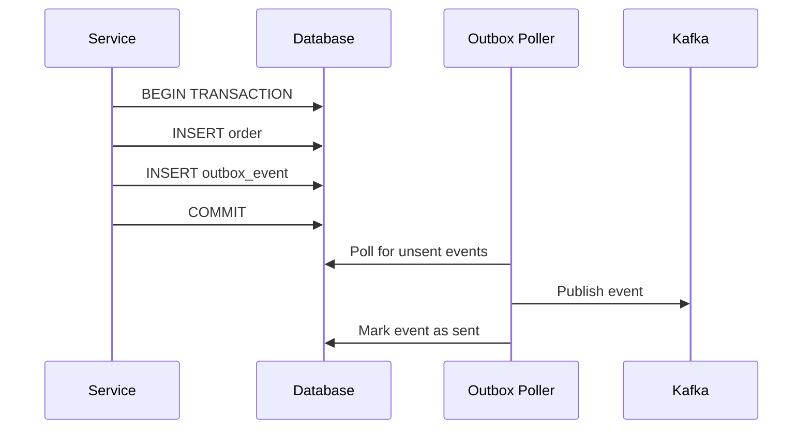

# Training Manual for Developers -- FusionCommerce (ERP-eCommerce)
> Version: 1.0 | Last Updated: 2026-02-23 | Status: Draft
> Classification: Internal | Author: AIDD System

## 1. Training Overview

This training manual provides a structured learning path for developers joining the FusionCommerce team or integrating with the platform. It covers the full development lifecycle from environment setup through production deployment.

## 2. Training Curriculum



**Total Training Time:** 25 hours (5 days)

## 3. Module 1: Architecture Deep Dive

### Learning Objectives
- Explain the 6-layer architecture
- Identify all 15 services and their bounded contexts
- Trace an event through the Kafka backbone

### 3.1 Architecture Walkthrough



### Exercise 1.1: Event Tracing
Trace the complete lifecycle of an order from consumer click to delivery notification:
1. Identify each service involved
2. List each Kafka event produced
3. Note which n8n workflows trigger
4. Document which databases are written to

## 4. Module 2: Development Environment

### Exercise 2.1: Environment Setup
1. Clone the repository
2. Install dependencies with `npm install`
3. Run `npm run build` and fix any compilation errors
4. Run `npm run test` and verify all tests pass
5. Start the full stack with `docker compose up --build`
6. Verify all services respond to health checks
7. Create a product via the Catalog API
8. Create an order and observe the event flow

## 5. Module 3: Service Development

### 5.1 Hands-On: Build a Notification Service

Build a new `notification-service` that:
1. Subscribes to `order.created` events
2. Sends order confirmation "emails" (log to console for training)
3. Subscribes to `fulfillment.shipped` events
4. Sends shipping notification with tracking number

Steps:
1. Create service directory structure following the template
2. Implement the notification service class
3. Register Kafka consumers for relevant topics
4. Add health check endpoint
5. Write unit tests
6. Create Dockerfile
7. Add to docker-compose.yml

### Exercise 3.1: Service Implementation

```typescript
// Complete this service class
export class NotificationService {
  constructor(private eventBus: EventBus) {}

  async onOrderCreated(payload: OrderCreatedPayload): Promise<void> {
    // TODO: Send order confirmation
  }

  async onFulfillmentShipped(payload: FulfillmentShippedPayload): Promise<void> {
    // TODO: Send shipping notification
  }
}
```

## 6. Module 4: Event-Driven Patterns

### Learning Objectives
- Implement event publishing with guaranteed delivery
- Build event consumers with idempotent processing
- Handle dead letter queues and event replay

### 6.1 Hands-On: Outbox Pattern

Implement the transactional outbox pattern for reliable event publishing:



### Exercise 4.1: Build an Idempotent Consumer

Implement an inventory reservation consumer that:
1. Receives `order.created` events
2. Uses event ID to detect duplicates
3. Processes each event exactly once
4. Stores processed event IDs for deduplication
5. Publishes `inventory.reserved` on success

## 7. Module 5: Database and Persistence

### Exercise 5.1: Create Migration and Repository

1. Create a Knex migration for a `wishlists` table
2. Implement `WishlistRepository` with both InMemory and Postgres versions
3. Write integration tests using Testcontainers
4. Verify tenant isolation in queries

### 5.2 Hands-On: Query Optimization

Given a slow query on the orders table:
```sql
SELECT * FROM orders WHERE customer_id = ? AND status = 'delivered' ORDER BY created_at DESC LIMIT 10;
```

1. Analyze the query plan with EXPLAIN ANALYZE
2. Create appropriate indexes
3. Measure before/after performance
4. Document the optimization in a PR

## 8. Module 6: Testing

### Exercise 6.1: Test Writing Workshop

Write tests at all three levels for the loyalty points feature:

1. **Unit test**: Test `LoyaltyService.calculatePoints()` with different tiers and multipliers
2. **Integration test**: Test the loyalty API endpoint with Supertest
3. **E2E test**: Test the complete flow from order placement to points appearing in wallet

### 6.2 Performance Test Exercise

Write a k6 script to load test the search API:
```javascript
import http from 'k6/http';
import { check } from 'k6';

export const options = {
  vus: 100,
  duration: '5m',
};

export default function () {
  const queries = ['shoes', 'red dress', 'wireless headphones'];
  const q = queries[Math.floor(Math.random() * queries.length)];
  const res = http.get(`http://localhost:3009/v1/search?q=${q}`);
  check(res, { 'status is 200': (r) => r.status === 200 });
  check(res, { 'response time < 50ms': (r) => r.timings.duration < 50 });
}
```

## 9. Module 7: API Design

### Exercise 7.1: Design a New API

Design the Wishlist API following FusionCommerce standards:
1. Define endpoints (CRUD + share wishlist)
2. Define request/response schemas (JSON)
3. Define error responses
4. Implement cursor-based pagination
5. Add rate limiting configuration
6. Document with OpenAPI specification

## 10. Module 8: Theme Development

### Exercise 8.1: Build a Custom Section

Create a "Featured Products Carousel" Liquid section:
1. Define section settings (number of products, autoplay speed)
2. Create the Liquid template with product cards
3. Style with CSS (responsive for mobile)
4. Add JavaScript for carousel behavior
5. Test on desktop, tablet, and mobile viewports

## 11. Module 9: Deployment

### Exercise 9.1: Deploy to Staging

1. Create a feature branch
2. Push changes and trigger CI pipeline
3. Verify lint, test, and build stages pass
4. Review the built Docker image
5. Deploy to staging via ArgoCD sync
6. Verify service health in staging cluster
7. Run smoke tests against staging

## 12. Module 10: Observability

### Exercise 10.1: Debug a Performance Issue

Given a scenario where checkout latency has spiked to 2 seconds:
1. Check Grafana dashboard for latency metrics
2. Use distributed tracing (Tempo) to find the slow span
3. Identify the root cause (e.g., slow DB query, external API timeout)
4. Propose a fix (caching, circuit breaker, query optimization)
5. Implement and verify the fix

## 13. Capstone Project

Build a complete **Gift Card Service** from scratch:
1. Design the domain model (gift card creation, balance, redemption)
2. Implement the service with repository and event publishing
3. Create database migrations
4. Write unit and integration tests
5. Build the Dockerfile
6. Add to docker-compose.yml
7. Create OpenAPI documentation
8. Deploy to staging environment
9. Demo the working service

### Evaluation Criteria
| Criterion | Weight |
|-----------|--------|
| Code quality and patterns | 25% |
| Test coverage (>80%) | 20% |
| Event-driven integration | 20% |
| API design compliance | 15% |
| Documentation | 10% |
| Deployment success | 10% |
