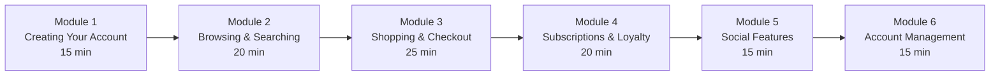
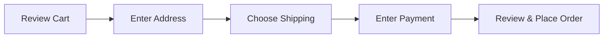

# Training Manual for End Users -- FusionCommerce (ERP-eCommerce)
> Version: 1.0 | Last Updated: 2026-02-23 | Status: Draft
> Classification: Internal | Author: AIDD System

## 1. Training Overview

This training manual provides guided tutorials for consumers using a FusionCommerce-powered storefront. Each module includes step-by-step instructions, tips, and practical exercises.

## 2. Training Modules

**Total Training Time:** ~2 hours

## 3. Module 1: Creating Your Account

### 3.1 Registration

1. Navigate to the storefront homepage
2. Click "Sign Up" or "Create Account" in the header
3. Enter your email address and create a password
4. Verify your email by clicking the link sent to your inbox
5. Complete your profile: name, phone number (optional)
6. Add a shipping address (optional, can add during checkout)

### Tips
- Use a strong password (minimum 8 characters with mixed case, numbers, and symbols)
- Verify your email promptly to access all features
- Adding a shipping address now saves time during checkout

### Exercise 1.1
Create a test account and complete your profile. Add two shipping addresses (home and office).

## 4. Module 2: Browsing and Searching

### 4.1 Using Search

Type your search in the search bar at the top of any page. FusionCommerce search understands natural language:

| Try Searching | What Happens |
|--------------|-------------|
| "blue dress under $50" | Finds blue dresses priced under $50 |
| "wireless earbuds" | Shows all wireless earbuds |
| "birthday gift for dad" | AI suggestions for gift-worthy items |

### 4.2 Using Filters

After searching or browsing a category:
1. Use the **Price** slider to set your budget range
2. Select **Brands** you prefer
3. Choose **Sizes** that fit you
4. Pick **Colors** you want
5. Filter by **Rating** (4 stars and above)

### 4.3 Visual Search Tutorial

1. Click the camera icon in the search bar
2. Take a photo or upload an image of a product you like
3. The system finds similar products available in the store
4. Refine with text filters if needed

### Exercise 2.1
1. Search for "running shoes" and filter by price $50-$100
2. Try visual search by uploading a product photo
3. Browse the "Sale" category and sort by "Highest Discount"

## 5. Module 3: Shopping and Checkout

### 5.1 Adding to Cart

1. Find a product you want to buy
2. Select your options (size, color, etc.)
3. Choose the quantity
4. Click "Add to Cart"
5. A notification confirms the item was added

### 5.2 Completing Checkout

Walk through each step:
1. **Cart Review**: Verify items, quantities, and apply any coupon codes
2. **Shipping Address**: Enter or select a saved address
3. **Shipping Method**: Choose your preferred speed and cost
4. **Payment**: Enter card details or use Apple Pay / Google Pay
5. **Review**: Check everything one last time, then click "Place Order"

### 5.3 Using Coupons

1. During checkout, look for the "Apply Coupon" field
2. Enter your coupon code (e.g., SAVE20)
3. Click "Apply"
4. The discount appears in your order summary
5. If the coupon is invalid, the system explains why

### Exercise 3.1
1. Add 2 products to your cart
2. Apply a test coupon code
3. Complete checkout as a guest (email only)
4. Then complete another checkout with your account (saved address and payment)

## 6. Module 4: Subscriptions and Loyalty

### 6.1 Subscribing to Products

1. Find a product with a "Subscribe & Save" option
2. Select your delivery frequency
3. Customize your selection if it is a subscription box
4. Complete checkout; your first order ships immediately
5. Future orders are automatically created per your schedule

### 6.2 Joining the Loyalty Program

You are automatically enrolled when you make your first purchase. Start earning points immediately.

**How to check your points:**
1. Log in to your account
2. Navigate to "My Loyalty" or "My Rewards"
3. View your current points balance, tier, and history

**How to redeem points:**
1. At checkout, look for "Apply Loyalty Points"
2. Choose how many points to use
3. The discount is applied to your order total

### Exercise 4.1
1. Subscribe to a test product with monthly delivery
2. From your account, skip the next delivery
3. Check your loyalty points balance
4. Add enough points to redeem a discount at checkout

## 7. Module 5: Social Features

### 7.1 Group Buying

1. Find a group buying deal (often shared via social media)
2. Click "Join This Deal"
3. Your payment is held (not charged) until the group fills
4. Share the link with friends to help fill the group
5. When enough people join, you get the discounted price

### 7.2 Referral Program

1. Navigate to "My Account > Referrals"
2. Copy your unique referral link
3. Share with friends via any channel
4. When they sign up and make a purchase, you both earn rewards

### 7.3 Livestream Shopping

1. Check the schedule for upcoming livestream events
2. Join the stream at the scheduled time
3. Watch the host showcase products
4. Tap "Buy Now" on any product to purchase instantly
5. Your order processes in the background while you keep watching

### Exercise 5.1
1. Find your referral link and share it (test environment)
2. Join a test group buying deal
3. View an upcoming livestream schedule

## 8. Module 6: Account Management

### 8.1 Managing Addresses

1. Go to "My Account > Addresses"
2. Add multiple addresses (home, office, etc.)
3. Set a default shipping address
4. Edit or delete addresses as needed

### 8.2 Managing Payment Methods

1. Go to "My Account > Payment Methods"
2. Add a card or connect digital wallet
3. Set a default payment method
4. Remove expired or unused methods

### 8.3 Order History and Returns

1. Go to "My Account > Orders"
2. View all past orders with status
3. Click an order to see full details
4. To return an item: click "Request Return" and follow the steps

### 8.4 Privacy and Data

1. Go to "My Account > Privacy"
2. Download your data (GDPR right to access)
3. Manage communication preferences (opt in/out of emails and SMS)
4. Request account deletion if desired

### Exercise 6.1
1. Update your default shipping address
2. View your order history
3. Download your account data export
4. Update your email notification preferences

## 9. Tips for the Best Shopping Experience

| Tip | Benefit |
|-----|---------|
| Create an account | Saves checkout time, enables order tracking and wishlists |
| Save payment methods | Enables express checkout in under 10 seconds |
| Join the loyalty program | Earn points on every purchase for future discounts |
| Use the wishlist | Save items for later and get sale notifications |
| Try visual search | Find products by uploading photos |
| Watch livestreams | Access exclusive deals and products |
| Join group deals | Get lower prices when shopping with friends |
| Check daily for bonuses | Daily check-in earns bonus loyalty points |

## 10. Troubleshooting

| Issue | Solution |
|-------|---------|
| Cannot find a product | Try different search terms or visual search |
| Coupon code not working | Check expiry date, minimum purchase, and usage limits |
| Payment declined | Verify card details, try a different payment method |
| Cannot track shipment | Allow 24 hours after shipping for tracking to update |
| Forgot password | Click "Forgot Password" on login page for reset email |
| Points not showing | Points appear within 24 hours of order delivery |
