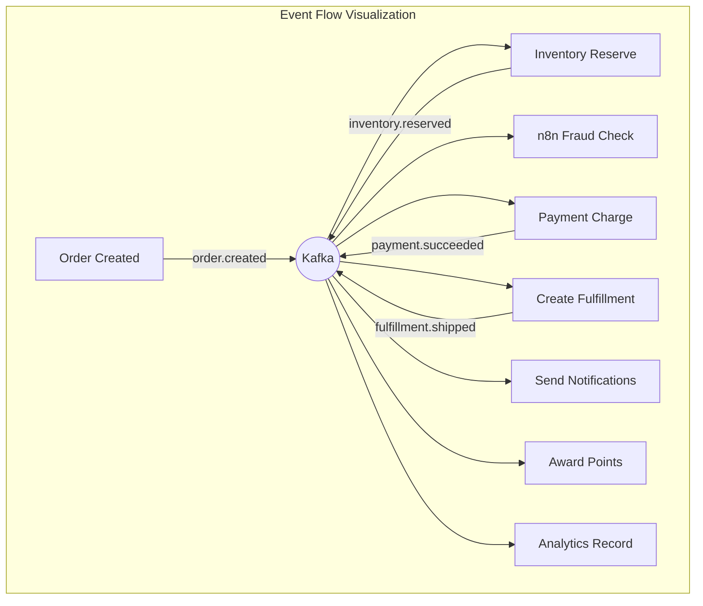

# Training Video Scripts -- FusionCommerce (ERP-eCommerce)
> Version: 1.0 | Last Updated: 2026-02-23 | Status: Draft
> Classification: Internal | Author: AIDD System

## 1. Video Catalog

| # | Title | Audience | Duration | Format |
|---|-------|----------|----------|--------|
| 1 | FusionCommerce Platform Overview | All | 5 min | Animated explainer |
| 2 | Merchant Quick Start: Your First Product | Admin | 8 min | Screen recording + voiceover |
| 3 | Processing Orders from Receipt to Delivery | Admin | 10 min | Screen recording + voiceover |
| 4 | Setting Up Your Loyalty Program | Admin | 7 min | Screen recording + voiceover |
| 5 | Launching Social Commerce Channels | Admin | 8 min | Screen recording + voiceover |
| 6 | Understanding Your Analytics Dashboard | Admin | 7 min | Screen recording + voiceover |
| 7 | Shopping on FusionCommerce: Consumer Guide | Consumer | 5 min | Screen recording + voiceover |
| 8 | Developer Onboarding: Environment Setup | Developer | 10 min | Terminal recording + voiceover |
| 9 | Building a New Microservice | Developer | 15 min | Live coding |
| 10 | Event-Driven Architecture Deep Dive | Developer | 12 min | Animated diagrams + voiceover |

## 2. Video 1: FusionCommerce Platform Overview

**Duration:** 5 minutes
**Format:** Animated explainer with narration

### Script

**[SCENE 1: Title Card]** (0:00-0:10)
*FusionCommerce logo animates in*
NARRATOR: "Welcome to FusionCommerce -- the composable commerce platform that gives you the power to build, customize, and scale your online store like never before."

**[SCENE 2: The Problem]** (0:10-0:45)
*Split screen showing frustrated merchant dealing with multiple tools*
NARRATOR: "Running an online store today means juggling dozens of apps and plugins. Your storefront, payments, shipping, loyalty, social commerce, and analytics all live in different systems. Data is siloed. Features are limited. And you are paying through the nose for it all."

**[SCENE 3: The Solution]** (0:45-1:30)
*Animated architecture diagram building layer by layer*
NARRATOR: "FusionCommerce changes everything. It is a single, unified commerce platform with 15 purpose-built services that work together seamlessly. Product catalog, checkout, payments, fulfillment, search, social commerce, subscriptions, loyalty, and analytics -- all in one platform, all communicating in real-time through Apache Kafka."

**[SCENE 4: Key Capabilities]** (1:30-3:00)
*Each capability animates as discussed*

NARRATOR: "Let me show you what makes FusionCommerce special."

"First, AI-Powered Search. Consumers can search using natural language, upload photos for visual search, or even use voice. The search engine understands intent, corrects typos, and delivers relevant results in under 50 milliseconds."

"Second, Social Commerce. Sell directly on Instagram, Facebook, and TikTok. Host livestream shopping events. Launch group buying campaigns where customers get better prices when they shop together."

"Third, Subscription Commerce. Offer subscription boxes, recurring deliveries with skip, pause, and swap flexibility."

"Fourth, Loyalty and Rewards. Points, tiered membership, cashback, digital wallet, and gamification mechanics that keep customers coming back."

"Fifth, Smart Fulfillment. Multi-warehouse routing, one-click shipping labels, and automated returns processing."

**[SCENE 5: Analytics]** (3:00-3:45)
*Dashboard animations showing real-time metrics*
NARRATOR: "And powering it all is real-time analytics via Apache Druid. See your conversion funnel, track cart abandonment, measure customer lifetime value, and attribute revenue to channels -- all updating in real-time."

**[SCENE 6: Call to Action]** (3:45-5:00)
*Merchant dashboard montage*
NARRATOR: "FusionCommerce is API-first, so developers can build custom experiences. It is self-hosted, so you own your data and pay zero transaction fees. And it is composable, so you deploy only what you need. Ready to transform your commerce? Let us get started."

---

## 3. Video 2: Merchant Quick Start -- Your First Product

**Duration:** 8 minutes
**Format:** Screen recording with voiceover

### Script

**[SCENE 1: Login]** (0:00-0:30)
*Screen recording of admin dashboard login*
NARRATOR: "Let us walk through creating your first product on FusionCommerce. Start by logging into your merchant admin dashboard."

**[SCENE 2: Navigate to Products]** (0:30-1:00)
*Click Products > Add Product*
NARRATOR: "Click 'Products' in the left navigation, then click the 'Add Product' button."

**[SCENE 3: Basic Details]** (1:00-3:00)
*Fill in form fields*
NARRATOR: "Start with the basics. Give your product a clear, descriptive title. Write a compelling description that highlights features and benefits. Set your selling price and optionally a compare-at price to show the discount."
*Demo: Fill in "FusionRun Pro Sneaker", $129.99, compare $159.99, SKU FR-PRO-001*

**[SCENE 4: Variants]** (3:00-4:30)
*Add size and color variants*
NARRATOR: "If your product comes in different sizes or colors, click 'Add Variants.' Select your option types and values. The system automatically generates all combinations -- in this case, 18 variants from 6 sizes and 3 colors."

**[SCENE 5: Images]** (4:30-5:30)
*Drag and drop images*
NARRATOR: "Drag and drop your product photos. The first image becomes the primary. FusionCommerce automatically optimizes images for fast loading on every device."

**[SCENE 6: SEO and Categories]** (5:30-6:30)
*Configure SEO and assign category*
NARRATOR: "Assign your product to a category, add searchable tags, and configure SEO metadata. A good meta title and description help your product appear in search engine results."

**[SCENE 7: Publish]** (6:30-7:30)
*Click Publish*
NARRATOR: "When everything looks good, click 'Publish.' Your product is now live on the storefront and will automatically sync to any connected social channels."

**[SCENE 8: Verification]** (7:30-8:00)
*View product on storefront*
NARRATOR: "Let us verify by visiting the storefront. Here it is -- our new FusionRun Pro Sneaker, ready for customers to discover and purchase."

---

## 4. Video 3: Processing Orders

**Duration:** 10 minutes
**Format:** Screen recording with voiceover

### Script Outline

1. (0:00-1:00) Navigate to Orders dashboard, review order queue
2. (1:00-2:30) Open an order, review details: customer, items, payment status
3. (2:30-4:00) Confirm the order and create a fulfillment
4. (4:00-5:30) Generate a pick list and walk through the pick/pack process
5. (5:30-7:00) Generate a shipping label, print label and packing slip
6. (7:00-8:00) Mark as shipped, verify tracking number assignment
7. (8:00-9:00) Handle an order cancellation scenario
8. (9:00-10:00) Process a return request from a customer

---

## 5. Video 8: Developer Onboarding

**Duration:** 10 minutes
**Format:** Terminal recording with voiceover

### Script Outline

1. (0:00-1:00) Clone repository, inspect directory structure
2. (1:00-2:30) Run `npm install`, explain workspace architecture
3. (2:30-4:00) Run `npm run build`, explain TypeScript compilation
4. (4:00-5:30) Run `npm run test`, review test output
5. (5:30-7:00) Start with `docker compose up`, verify all services
6. (7:00-8:30) Make API calls: create product, create order, observe events
7. (8:30-9:30) Show in-memory mode for rapid development
8. (9:30-10:00) Summary of developer workflow and next steps

---

## 6. Video 9: Building a New Microservice

**Duration:** 15 minutes
**Format:** Live coding session

### Script Outline

1. (0:00-2:00) Architecture review: where the new service fits
2. (2:00-4:00) Create service directory structure from template
3. (4:00-6:00) Implement types and repository interface
4. (6:00-8:00) Implement service class with business logic
5. (8:00-10:00) Build Fastify routes and health endpoint
6. (10:00-11:30) Write unit tests with Jest and InMemoryEventBus
7. (11:30-13:00) Create Dockerfile and add to docker-compose.yml
8. (13:00-14:00) Start the service and test with curl/Postman
9. (14:00-15:00) Verify event publishing and consumption

---

## 7. Video 10: Event-Driven Architecture Deep Dive

**Duration:** 12 minutes
**Format:** Animated diagrams with voiceover

### Script Outline

1. (0:00-2:00) Why event-driven? Problems with synchronous communication
2. (2:00-4:00) Kafka fundamentals: topics, partitions, consumer groups
3. (4:00-6:00) Trace an order through the system: all events and consumers
4. (6:00-8:00) Patterns: outbox, idempotent consumers, dead letter queues
5. (8:00-10:00) n8n workflow integration with Kafka triggers
6. (10:00-12:00) Event replay and read model rebuilding

---

## 8. Production Notes

### Recording Standards

| Aspect | Standard |
|--------|----------|
| Resolution | 1920x1080 (1080p) |
| Frame rate | 30 fps |
| Audio | 48 kHz, mono, clear narration |
| Font size | Minimum 14pt for code, 18pt for UI |
| Terminal theme | Dark theme, high contrast |
| Browser | Chrome with clean profile (no extensions visible) |
| Branding | FusionCommerce logo in lower-right corner |

### Publishing Checklist

- [ ] Script reviewed and approved
- [ ] Recording completed
- [ ] Captions/subtitles generated (English)
- [ ] Thumbnail created
- [ ] Video uploaded to training platform
- [ ] Linked from documentation
