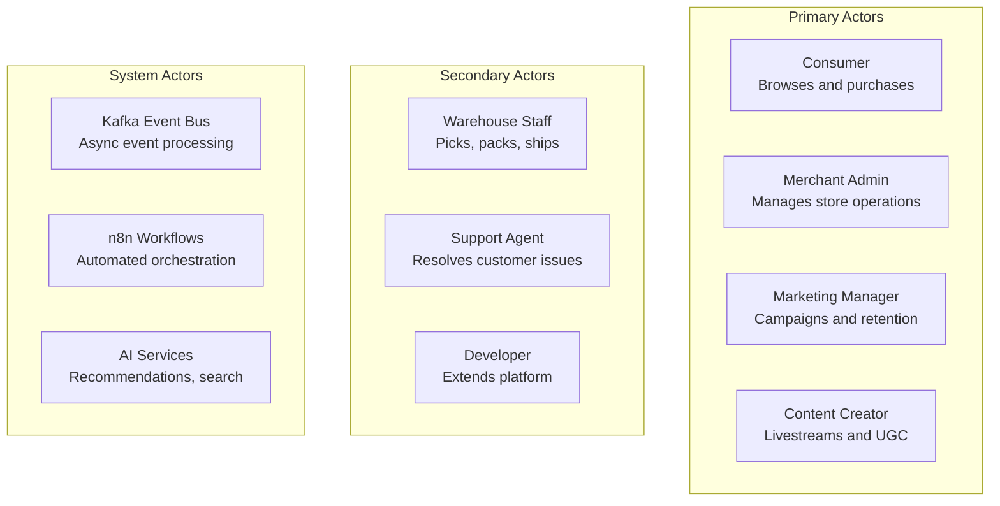
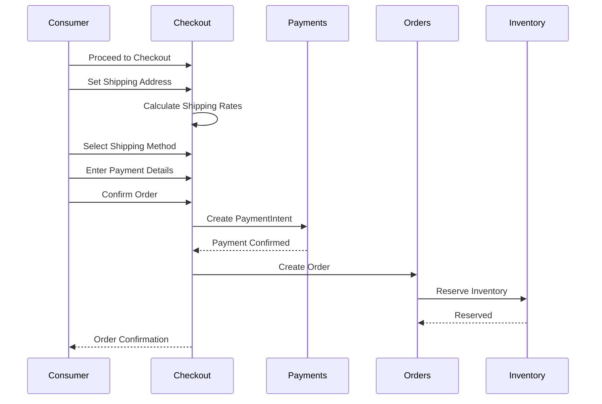
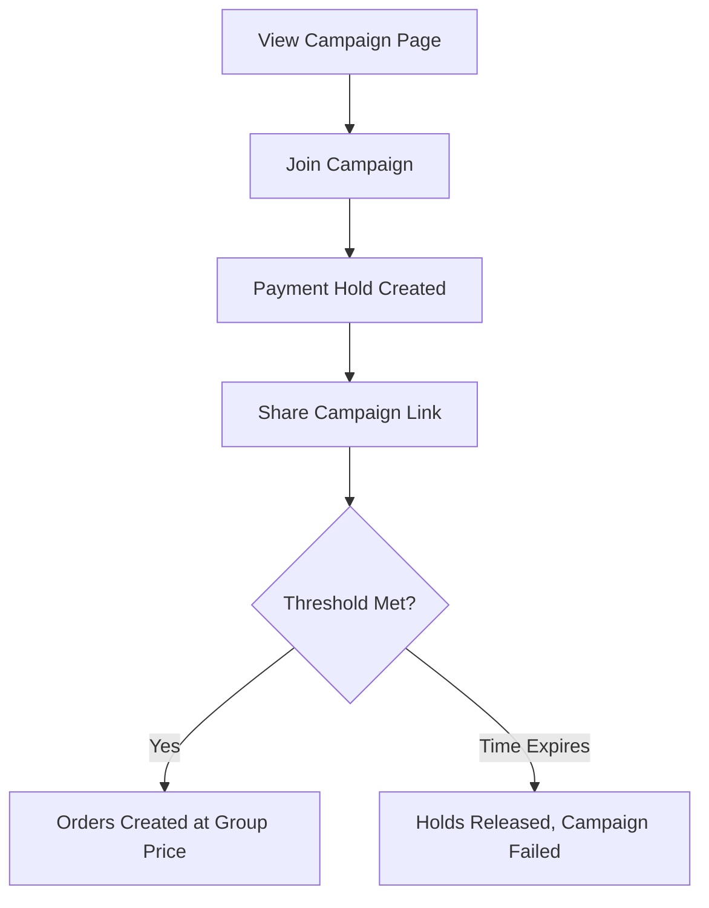
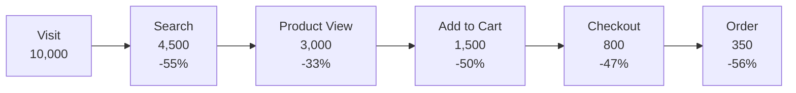

# Use Cases -- FusionCommerce (ERP-eCommerce)
> Version: 1.0 | Last Updated: 2026-02-23 | Status: Draft
> Classification: Internal | Author: AIDD System

## 1. Overview

This document catalogs 25 use cases for FusionCommerce, covering consumer shopping journeys, merchant operations, social commerce interactions, subscription management, loyalty engagement, and fulfillment workflows.

## 2. Actor Definitions

## 3. Consumer Use Cases

### UC-001: Search for Products Using Natural Language

| Field | Value |
|-------|-------|
| Actor | Consumer |
| Priority | P0 |
| Service | search-service |

**Preconditions:** Consumer has accessed the storefront.

**Main Flow:**
1. Consumer types a natural language query (e.g., "red running shoes under $100 for women")
2. Search service processes NLQ: extracts color=red, category=running shoes, price<100, gender=women
3. Search service queries OpenSearch with extracted facets
4. Merchandising rules engine applies boost/bury/pin rules
5. Results returned with faceted navigation (brand, size, price range)
6. Consumer refines results using facet filters

**Alternative Flows:**
- 2a. Typo detected ("runing shoes") -> Auto-correct and search corrected term
- 3a. Zero results -> Suggest similar queries, show popular products
- Consumer uploads image instead of typing -> Visual search via CLIP embeddings

**Postconditions:** Search results displayed, search.query event published to Kafka for analytics.

---

### UC-002: Complete Multi-Step Checkout

| Field | Value |
|-------|-------|
| Actor | Consumer |
| Priority | P0 |
| Service | checkout-service, payments, orders |

**Preconditions:** Consumer has items in cart.

**Main Flow:**
1. Consumer proceeds to checkout
2. System presents shipping address form (or saved addresses for logged-in users)
3. Consumer enters/selects shipping address
4. System calculates shipping rates via EasyPost/Shippo
5. Consumer selects shipping method
6. System presents payment options (card, Apple Pay, Google Pay, PayPal, BNPL)
7. Consumer enters payment details (Stripe Elements for PCI compliance)
8. System displays order review with totals
9. Consumer confirms order
10. System creates PaymentIntent, charges card, creates order
11. System reserves inventory, creates fulfillment
12. Order confirmation page and email displayed

**Alternative Flows:**
- 1a. Guest checkout -> Only email required, no account creation
- 6a. Consumer applies coupon code -> CouponEngine validates and applies discount
- 6b. Consumer redeems loyalty points -> Points deducted from wallet, discount applied
- 10a. Payment fails -> Display error, allow retry with different method
- 11a. Inventory insufficient -> Cancel order, notify consumer, suggest alternatives

**Postconditions:** Order created, payment captured, inventory reserved, confirmation email sent.

---

### UC-003: Guest Checkout Without Account

| Field | Value |
|-------|-------|
| Actor | Consumer (unregistered) |
| Priority | P0 |
| Service | checkout-service |

**Preconditions:** Consumer has items in cart, is not logged in.

**Main Flow:**
1. Consumer clicks "Checkout as Guest"
2. System requires only email address
3. Consumer completes shipping, payment, and review steps (same as UC-002)
4. Order created with session-based customer reference
5. Order confirmation sent to provided email
6. Consumer offered option to create account post-purchase

**Postconditions:** Order created without account; if account later created, order linked.

---

### UC-004: Express Checkout with Apple Pay

| Field | Value |
|-------|-------|
| Actor | Consumer (Apple device) |
| Priority | P0 |
| Service | checkout-service, payments |

**Preconditions:** Consumer is on Safari/iOS with Apple Pay configured.

**Main Flow:**
1. Consumer clicks "Buy with Apple Pay" on product page or cart
2. Apple Pay sheet appears with shipping address and payment method pre-filled
3. Consumer authenticates with Face ID / Touch ID
4. System creates PaymentIntent with Apple Pay token
5. Payment processes, order created automatically
6. One-step checkout complete in under 10 seconds

**Postconditions:** Order created with minimal friction; express checkout conversion rate tracked.

---

### UC-005: Add Products to Wishlist

| Field | Value |
|-------|-------|
| Actor | Consumer (logged in) |
| Priority | P1 |
| Service | storefront-service |

**Preconditions:** Consumer is authenticated.

**Main Flow:**
1. Consumer clicks heart/wishlist icon on product
2. Product added to consumer's wishlist
3. Consumer can view wishlist from account dashboard
4. Consumer can move wishlist items to cart
5. System sends notification when wishlist item goes on sale or low in stock

---

### UC-006: Write a Product Review

| Field | Value |
|-------|-------|
| Actor | Consumer (verified purchaser) |
| Priority | P1 |
| Service | catalog (reviews) |

**Preconditions:** Consumer has purchased the product (verified purchase).

**Main Flow:**
1. Consumer navigates to purchased product's page
2. Consumer clicks "Write a Review"
3. Consumer provides star rating (1-5), title, and body text
4. Optionally uploads review photos
5. System submits review for moderation
6. n8n workflow runs AI content moderation
7. If approved, review appears publicly with "Verified Purchase" badge

---

### UC-007: Join a Group Buying Campaign

| Field | Value |
|-------|-------|
| Actor | Consumer |
| Priority | P1 |
| Service | group-commerce |

**Preconditions:** Active campaign exists; consumer is on campaign page (often via shared link).

**Main Flow:**
1. Consumer views campaign: product, group price, participants needed, time remaining
2. Consumer clicks "Join This Deal"
3. System adds consumer as participant, captures payment hold
4. Consumer shares campaign link to recruit more participants
5. When minimum participants reached, campaign succeeds
6. All participants charged and orders created at group price
7. If time expires without reaching threshold, all holds released

---

### UC-008: Subscribe to Recurring Product Delivery

| Field | Value |
|-------|-------|
| Actor | Consumer |
| Priority | P1 |
| Service | subscription-commerce-service |

**Preconditions:** Product available for subscription.

**Main Flow:**
1. Consumer selects subscription frequency (weekly, biweekly, monthly, quarterly)
2. Consumer customizes box contents (if subscription box)
3. Consumer enters payment method (stored for recurring charges)
4. System creates subscription record
5. First order created immediately
6. Subsequent orders auto-created per schedule
7. Consumer manages subscription from dashboard (skip, swap, pause, cancel)

---

### UC-009: Redeem Loyalty Points at Checkout

| Field | Value |
|-------|-------|
| Actor | Consumer (loyalty member) |
| Priority | P1 |
| Service | loyalty-service, checkout-service |

**Preconditions:** Consumer has sufficient loyalty points (minimum 500).

**Main Flow:**
1. At checkout payment step, system shows available points and dollar value
2. Consumer chooses to apply points (full or partial)
3. System validates point balance and calculates discount
4. Points deducted from loyalty wallet
5. Discount applied to order total
6. Remaining balance (if any) charged to payment method

---

### UC-010: Watch Livestream and Purchase Product

| Field | Value |
|-------|-------|
| Actor | Consumer |
| Priority | P2 |
| Service | social-commerce-service, checkout-service |

**Preconditions:** Livestream is active.

**Main Flow:**
1. Consumer joins livestream via storefront or social platform
2. Host showcases products, pins current product with price overlay
3. Consumer taps "Buy Now" on pinned product
4. Express checkout overlay appears (1-click if saved payment)
5. Order created without leaving livestream
6. Consumer continues watching stream
7. Purchase appears in chat feed as social proof

---

### UC-011: Use Visual Search to Find Products

| Field | Value |
|-------|-------|
| Actor | Consumer |
| Priority | P2 |
| Service | search-service |

**Main Flow:**
1. Consumer clicks camera icon in search bar
2. Consumer uploads or takes photo of desired product
3. Search service processes image through CLIP embedding model
4. Nearest product matches returned based on visual similarity
5. Consumer refines with text filters if needed

## 4. Merchant Use Cases

### UC-012: Create and Manage Products

| Field | Value |
|-------|-------|
| Actor | Merchant Admin |
| Priority | P0 |
| Service | catalog |

**Main Flow:**
1. Merchant opens product editor in admin dashboard
2. Enters product details: name, description, price, SKU
3. Adds variants (size, color) with individual SKUs and prices
4. Uploads product images (auto-resized, stored in MinIO)
5. Assigns categories and tags
6. Sets SEO metadata (title, description, URL slug)
7. Publishes product to storefront
8. System syncs product to social channels (Instagram, Facebook, TikTok)
9. System indexes product in search engine

---

### UC-013: Process Order Fulfillment

| Field | Value |
|-------|-------|
| Actor | Warehouse Staff |
| Priority | P0 |
| Service | fulfillment-service, shipping |

**Main Flow:**
1. Warehouse staff views pending fulfillments dashboard
2. System generates pick list organized by warehouse zone
3. Staff scans each item barcode to confirm pick
4. Staff packs items and records package dimensions/weight
5. System generates shipping label via EasyPost/Shippo
6. Staff prints label and packing slip
7. Staff hands package to carrier
8. Tracking number assigned, customer notified automatically

---

### UC-014: Handle Returns and Refunds

| Field | Value |
|-------|-------|
| Actor | Support Agent, Consumer |
| Priority | P1 |
| Service | fulfillment-service, payments |

**Main Flow:**
1. Consumer initiates return from order detail page
2. Consumer selects return reason and items
3. System checks return policy (within return window, eligible product)
4. RMA number generated
5. Return shipping label generated and emailed
6. Consumer ships item back
7. Warehouse receives and inspects item
8. Refund processed via original payment method
9. If restockable, inventory restored
10. Consumer notified of refund completion

---

### UC-015: Configure Loyalty Program

| Field | Value |
|-------|-------|
| Actor | Marketing Manager |
| Priority | P1 |
| Service | loyalty-service |

**Main Flow:**
1. Marketing manager opens loyalty program settings
2. Configures point earning rules (points per dollar, category multipliers)
3. Defines tier thresholds and benefits
4. Sets up special promotions (double points days, birthday bonuses)
5. Configures gamification mechanics (spin-to-win, daily check-in)
6. Previews customer-facing loyalty widget
7. Activates program

---

### UC-016: Launch Social Commerce Campaign

| Field | Value |
|-------|-------|
| Actor | Marketing Manager |
| Priority | P1 |
| Service | social-commerce-service |

**Main Flow:**
1. Marketing manager selects campaign type (Instagram Shopping, Facebook Shops, TikTok)
2. Selects products to feature
3. Configures platform-specific settings (IG product tags, FB collection)
4. Schedules publication
5. System syncs product data to social platform API
6. Orders from social channels flow back as social.order events
7. Analytics dashboard shows channel-level performance

---

### UC-017: Set Up Subscription Box Product

| Field | Value |
|-------|-------|
| Actor | Merchant Admin |
| Priority | P1 |
| Service | subscription-commerce-service |

**Main Flow:**
1. Merchant creates subscription plan in admin
2. Configures frequencies available (weekly, monthly, quarterly)
3. Sets pricing per frequency (discounted vs. one-time price)
4. Defines swappable products and customization options
5. Configures skip and pause policies
6. Sets payment retry rules (3 retries over 7 days)
7. Creates marketing landing page
8. Activates subscription offering

---

### UC-018: Host a Livestream Shopping Event

| Field | Value |
|-------|-------|
| Actor | Content Creator |
| Priority | P2 |
| Service | social-commerce-service |

**Main Flow:**
1. Creator schedules livestream event in social commerce hub
2. Selects products to feature during stream
3. At scheduled time, starts WebRTC livestream
4. During stream, pins products in real-time
5. Viewers see product overlay with price and "Buy" button
6. Viewers purchase directly from stream (express checkout)
7. Real-time analytics show viewers, engagement, revenue
8. Stream ends, summary report generated

---

### UC-019: Manage Cart Abandonment Recovery

| Field | Value |
|-------|-------|
| Actor | Marketing Manager |
| Priority | P1 |
| Service | checkout-service, n8n workflows |

**Main Flow:**
1. Marketing manager configures abandonment settings
2. Sets inactivity threshold (default: 30 minutes)
3. Designs recovery email templates (1h, 24h, 48h)
4. Configures escalating discount offers (10%, 15%, free shipping)
5. Activates n8n workflow
6. System automatically detects abandoned carts and sends recovery sequence
7. Dashboard shows recovery rate and revenue recovered

---

### UC-020: Analyze Conversion Funnel

| Field | Value |
|-------|-------|
| Actor | Marketing Manager |
| Priority | P1 |
| Service | analytics-service |

**Main Flow:**
1. Marketing manager opens analytics dashboard
2. Selects "Conversion Funnel" report
3. System queries Druid for funnel events (visit -> search -> PDP -> cart -> checkout -> order)
4. Displays drop-off rates between each step
5. Segments by device, channel, date range
6. Identifies largest drop-off point
7. Drills into specific cohort for investigation

---

### UC-021: Bulk Import Products via CSV

| Field | Value |
|-------|-------|
| Actor | Merchant Admin |
| Priority | P2 |
| Service | catalog |

**Main Flow:**
1. Merchant downloads CSV template from admin dashboard
2. Fills template with product data (name, SKU, price, description, category, images)
3. Uploads CSV file
4. System validates each row (required fields, data types, unique SKUs)
5. Displays validation results with error rows highlighted
6. Merchant fixes errors or proceeds with valid rows
7. System imports products, emits product.created events
8. Import summary displayed (success count, error count)

---

### UC-022: Configure Multi-Warehouse Fulfillment

| Field | Value |
|-------|-------|
| Actor | Merchant Admin |
| Priority | P1 |
| Service | fulfillment-service, inventory |

**Main Flow:**
1. Merchant adds warehouse locations with addresses
2. Assigns inventory allocations per warehouse per SKU
3. Configures routing rules (nearest warehouse, lowest cost, fastest delivery)
4. Sets up 3PL/dropship vendor connections
5. System automatically routes new orders to optimal warehouse
6. Split shipment automatically created when no single warehouse has all items

---

### UC-023: Create Group Buying Campaign

| Field | Value |
|-------|-------|
| Actor | Marketing Manager |
| Priority | P1 |
| Service | group-commerce |

**Main Flow:**
1. Marketing manager selects product for group buying
2. Sets group price (discount from regular price)
3. Sets minimum participants required
4. Sets campaign duration
5. Publishes campaign
6. Generates shareable link for social distribution
7. Monitors participation in real-time dashboard
8. Upon success, orders auto-created for all participants

---

### UC-024: Build Custom Storefront Theme

| Field | Value |
|-------|-------|
| Actor | Developer |
| Priority | P1 |
| Service | theme-service |

**Main Flow:**
1. Developer selects base theme from 50+ options
2. Opens visual drag-and-drop builder
3. Arranges sections (hero banner, featured products, testimonials, newsletter)
4. Customizes colors, fonts, spacing via visual controls
5. Edits Liquid/Handlebars templates for advanced customization
6. Injects custom CSS and JavaScript
7. Previews across devices (desktop, tablet, mobile)
8. Publishes theme to storefront

---

### UC-025: Monitor Real-Time Sales Dashboard

| Field | Value |
|-------|-------|
| Actor | Merchant Admin |
| Priority | P0 |
| Service | analytics-service |

**Main Flow:**
1. Merchant opens analytics dashboard
2. Real-time metrics displayed: orders today, revenue today, active visitors, conversion rate
3. Charts show hourly revenue trend, top-selling products, geographic distribution
4. AOV, CLV, and cart abandonment rate updated in real-time via Druid
5. Alerts triggered for anomalies (sudden traffic spike, conversion drop)
6. Drill-down into any metric for detailed analysis

## 5. Use Case Summary Matrix

| UC ID | Name | Actor | Priority | Services |
|-------|------|-------|----------|----------|
| UC-001 | NLQ Product Search | Consumer | P0 | search |
| UC-002 | Multi-Step Checkout | Consumer | P0 | checkout, payments, orders |
| UC-003 | Guest Checkout | Consumer | P0 | checkout |
| UC-004 | Apple Pay Express | Consumer | P0 | checkout, payments |
| UC-005 | Wishlist Management | Consumer | P1 | storefront |
| UC-006 | Write Product Review | Consumer | P1 | catalog |
| UC-007 | Join Group Buying | Consumer | P1 | group-commerce |
| UC-008 | Subscribe to Recurring | Consumer | P1 | subscriptions |
| UC-009 | Redeem Loyalty Points | Consumer | P1 | loyalty, checkout |
| UC-010 | Livestream Purchase | Consumer | P2 | social-commerce, checkout |
| UC-011 | Visual Search | Consumer | P2 | search |
| UC-012 | Product Management | Merchant | P0 | catalog |
| UC-013 | Order Fulfillment | Warehouse | P0 | fulfillment, shipping |
| UC-014 | Returns and Refunds | Support/Consumer | P1 | fulfillment, payments |
| UC-015 | Loyalty Configuration | Marketing | P1 | loyalty |
| UC-016 | Social Commerce Campaign | Marketing | P1 | social-commerce |
| UC-017 | Subscription Box Setup | Merchant | P1 | subscriptions |
| UC-018 | Host Livestream | Creator | P2 | social-commerce |
| UC-019 | Cart Recovery Config | Marketing | P1 | checkout, n8n |
| UC-020 | Conversion Funnel | Marketing | P1 | analytics |
| UC-021 | Bulk CSV Import | Merchant | P2 | catalog |
| UC-022 | Multi-Warehouse Config | Merchant | P1 | fulfillment, inventory |
| UC-023 | Group Buying Campaign | Marketing | P1 | group-commerce |
| UC-024 | Custom Theme Build | Developer | P1 | themes |
| UC-025 | Real-Time Dashboard | Merchant | P0 | analytics |
