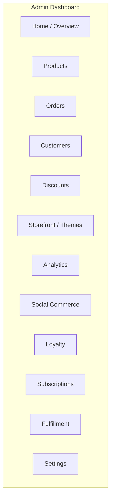
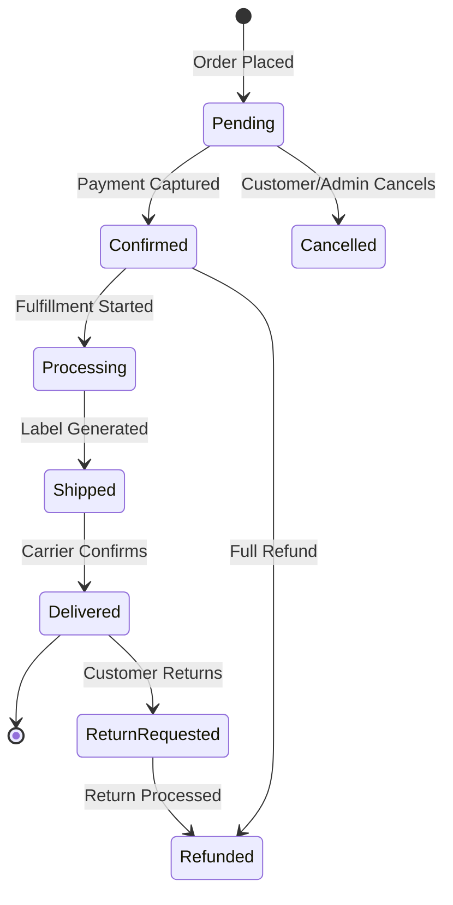

# User Manual for Administrators -- FusionCommerce (ERP-eCommerce)
> Version: 1.0 | Last Updated: 2026-02-23 | Status: Draft
> Classification: Internal | Author: AIDD System

## 1. Introduction

This manual provides comprehensive guidance for merchant administrators managing a FusionCommerce storefront. It covers all aspects of daily store operations: product management, order processing, fulfillment, analytics, loyalty program configuration, social commerce, subscription management, and system configuration.

## 2. Getting Started

### 2.1 Accessing the Admin Dashboard

Navigate to `https://admin.{your-store}.fusioncommerce.io` and authenticate using your ERP-IAM credentials. The admin dashboard provides access to all merchant operations.

### 2.2 Dashboard Overview

The home page displays key metrics at a glance: today's orders, revenue, active visitors, conversion rate, cart abandonment rate, and any alerts requiring attention.

## 3. Product Management

### 3.1 Creating a Product

1. Navigate to **Products > Add Product**
2. Fill in product details:
   - **Title**: Product display name (max 512 characters)
   - **Description**: Rich text product description with formatting
   - **Price**: Base selling price
   - **Compare-at Price**: Original price for showing discounts
   - **SKU**: Stock Keeping Unit identifier (must be unique per store)
   - **Category**: Select from category hierarchy
   - **Tags**: Add searchable tags for discovery
3. **Add Variants** (if applicable): Click "Add Variants" and define options (Size, Color, Material). The system generates all combinations automatically.
4. **Upload Images**: Drag and drop product images. First image becomes the primary. Images are automatically resized and optimized for web.
5. **SEO Settings**: Configure meta title, meta description, and URL slug.
6. **Inventory**: Set stock quantities per variant per warehouse.
7. Click **Publish** to make the product live, or **Save as Draft** to continue later.

### 3.2 Bulk Product Import

1. Navigate to **Products > Import**
2. Download the CSV template
3. Fill in product data following the column specifications
4. Upload the completed CSV
5. Review validation results (errors highlighted in red)
6. Click **Import Valid Rows** to proceed
7. Review import summary showing success/error counts

### 3.3 Managing Categories

1. Navigate to **Products > Categories**
2. Create top-level categories (e.g., "Clothing", "Electronics")
3. Add subcategories by selecting a parent (e.g., "Clothing > Shoes > Running")
4. Drag and drop to reorder categories
5. Each category supports: name, description, image, SEO metadata

## 4. Order Management

### 4.1 Order Lifecycle

### 4.2 Processing Orders

1. Navigate to **Orders** to see all orders sorted by date (newest first)
2. Click any order to view details: items, customer, shipping address, payment status
3. **Confirm Order**: Manually confirm if not auto-confirmed by payment
4. **Create Fulfillment**: Generate pick list and assign to warehouse
5. **Print Packing Slip**: Print packing slip for the order
6. **Generate Label**: Generate shipping label via EasyPost/Shippo
7. **Mark as Shipped**: Enter tracking number or auto-populated from label generation
8. **Cancel Order**: Cancel with reason; triggers refund and inventory restoration

### 4.3 Handling Returns

1. Navigate to **Orders > Returns**
2. Review return requests from customers
3. Approve or deny based on return policy
4. Upon approval, system generates return shipping label
5. When item received, mark condition (restockable/damaged)
6. Process refund (full or partial)
7. If restockable, inventory automatically restored

## 5. Discount and Coupon Management

### 5.1 Creating Coupons

1. Navigate to **Discounts > Create Coupon**
2. Configure:
   - **Code**: Customer-facing code (e.g., SUMMER20)
   - **Type**: Percentage off, Fixed amount, Free shipping
   - **Value**: Discount value (e.g., 20 for 20%)
   - **Minimum Purchase**: Minimum cart value required
   - **Max Uses**: Total number of uses allowed
   - **Date Range**: Start and end dates
   - **Product/Category Restrictions**: Limit to specific products or categories
3. Click **Activate** to make the coupon live

### 5.2 Automatic Discounts

Configure discounts that apply automatically without coupon codes:
- **Buy X Get Y**: Purchase 2, get 1 free
- **Volume Discount**: 10% off when buying 5+ items
- **Cart Value Discount**: $10 off orders over $100

## 6. Loyalty Program Administration

### 6.1 Program Configuration

1. Navigate to **Loyalty > Settings**
2. Configure earning rules:
   - Points per dollar spent (default: 1 point = $1)
   - Category multipliers (e.g., 2x points on new arrivals)
   - Bonus events (double points days, birthday bonus)
3. Configure tiers:
   - Define threshold spend amounts for each tier
   - Set multiplier per tier (Bronze 1x, Silver 1.25x, Gold 1.5x, Platinum 2x)
   - Configure tier-specific benefits (free shipping, early access, etc.)
4. Configure redemption:
   - Points value (default: 100 points = $1)
   - Minimum redemption threshold
   - Maximum redemption per order

### 6.2 Gamification Setup

1. Navigate to **Loyalty > Gamification**
2. Enable features:
   - **Daily Check-In**: Award bonus points for daily visits
   - **Spin-to-Win**: Configurable prize wheel with point rewards
   - **Referral Bonus**: Points for successful referrals
   - **Review Reward**: Points for writing verified reviews

## 7. Social Commerce Management

### 7.1 Connecting Social Channels

1. Navigate to **Social Commerce > Channels**
2. Click **Connect** next to desired platform (Instagram, Facebook, TikTok)
3. Authenticate with platform credentials
4. Configure catalog sync settings:
   - Which products to sync (all, by category, by collection)
   - Sync frequency (real-time, hourly, daily)
   - Price formatting rules

### 7.2 Managing Livestream Events

1. Navigate to **Social Commerce > Livestream**
2. Click **Schedule Event**
3. Configure event details: title, description, scheduled time
4. Pre-select products to feature during the stream
5. During the stream, pin products in real-time
6. After the stream, review performance: viewers, engagement, revenue

## 8. Analytics Dashboard

### 8.1 Available Reports

| Report | Description | Key Metrics |
|--------|-------------|-------------|
| Sales Overview | Revenue, orders, AOV trends | Revenue, order count, AOV |
| Conversion Funnel | Drop-off analysis | Visit-to-purchase rate |
| Cart Abandonment | Abandoned cart analysis | Abandonment rate, recovery rate |
| Customer Lifetime Value | CLV by segment | Average CLV, top customers |
| Product Performance | Best/worst sellers | Units sold, revenue, return rate |
| Channel Attribution | Revenue by source | Revenue per channel, ROAS |
| Search Analytics | Search performance | Top queries, zero-result queries, CTR |
| Loyalty Dashboard | Program performance | Active members, points issued, redemption rate |

### 8.2 Exporting Data

1. Navigate to any report
2. Click **Export** button
3. Select format: CSV, Excel, PDF
4. Choose date range
5. Download generated file

## 9. System Settings

### 9.1 Store Configuration

| Setting | Location | Description |
|---------|----------|-------------|
| Store name and logo | Settings > General | Branding basics |
| Currency and locale | Settings > Localization | Default currency, language |
| Tax settings | Settings > Tax | Tax rates, jurisdiction rules |
| Shipping zones | Settings > Shipping | Zone definitions, rate tables |
| Payment providers | Settings > Payments | Stripe/PayPal configuration |
| Notification templates | Settings > Notifications | Email and SMS templates |
| Team members | Settings > Team | Admin user management and roles |

### 9.2 User Roles

| Role | Permissions |
|------|------------|
| Owner | Full access to all features and settings |
| Admin | All features except billing and team management |
| Product Manager | Products, categories, inventory |
| Order Manager | Orders, fulfillment, returns |
| Marketing Manager | Discounts, loyalty, social commerce, analytics |
| Support Agent | Orders (read), returns, customer lookup |
| Warehouse Staff | Fulfillment, shipping, inventory |
