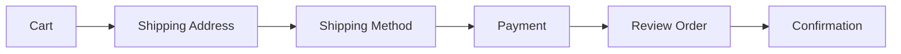

# User Manual for End Users -- FusionCommerce (ERP-eCommerce)
> Version: 1.0 | Last Updated: 2026-02-23 | Status: Draft
> Classification: Internal | Author: AIDD System

## 1. Introduction

This manual guides consumers through all aspects of shopping on a FusionCommerce-powered storefront, including product discovery, purchasing, account management, subscriptions, loyalty rewards, social commerce features, and post-purchase support.

## 2. Browsing and Discovering Products

### 2.1 Searching for Products

FusionCommerce provides AI-powered search that understands natural language. You can search using everyday phrases:
- "red running shoes under $80 for women"
- "wireless headphones with noise cancelling"
- "birthday gift ideas for mom"

The search engine handles typos automatically and suggests corrections when needed.

### 2.2 Visual Search

If you see a product you like but do not know its name:
1. Click the camera icon in the search bar
2. Upload a photo or take a picture
3. The system finds visually similar products in the store

### 2.3 Browsing by Category

Navigate through the category hierarchy from the main menu. Categories may include breadcrumb navigation so you always know where you are:

```
Home > Clothing > Shoes > Running Shoes
```

### 2.4 Filtering and Sorting

Refine results using faceted filters on the left panel:
- **Price Range**: Slide the price slider or enter min/max values
- **Brand**: Select one or more brands
- **Size**: Filter by available sizes
- **Color**: Select color swatches
- **Rating**: Filter by minimum star rating
- **Availability**: Show in-stock items only

Sort results by: Relevance, Price (low to high), Price (high to low), Newest, Best Selling, Highest Rated.

## 3. Shopping Cart

### 3.1 Adding Items

- Click "Add to Cart" on any product page
- If the product has variants (size, color), select your options first
- Adjust quantity using the +/- buttons
- A confirmation notification appears showing the item was added

### 3.2 Managing Your Cart

Access your cart via the cart icon in the header:
- **Update Quantity**: Use the +/- buttons or type a number
- **Remove Items**: Click the trash icon next to any item
- **Apply Coupon**: Enter a coupon code and click "Apply"
- **Estimated Total**: View subtotal, estimated shipping, and estimated tax

### 3.3 Saving for Later

Move items from your cart to your wishlist by clicking "Save for Later." Items remain on your wishlist until you move them back to the cart.

## 4. Checkout

### 4.1 Standard Checkout Flow



1. **Shipping Address**: Enter your delivery address or select a saved address
2. **Shipping Method**: Choose from available shipping options (Standard, Express, Overnight) with displayed prices and estimated delivery dates
3. **Payment**: Enter your payment method:
   - Credit/Debit Card
   - Apple Pay (on Safari/iOS)
   - Google Pay (on Chrome/Android)
   - PayPal
   - Buy Now, Pay Later (Klarna/Afterpay)
4. **Review**: Verify all details including items, shipping, payment, and total
5. **Place Order**: Click "Place Order" to complete your purchase

### 4.2 Guest Checkout

You can check out without creating an account. Simply provide your email address for order confirmation and tracking. After checkout, you can optionally create an account to track future orders.

### 4.3 Express Checkout

For the fastest checkout experience:
- **Apple Pay**: Click the Apple Pay button; authenticate with Face ID or Touch ID. Shipping address and payment are pre-filled from your Apple Wallet.
- **Google Pay**: Click the Google Pay button; confirm your saved card and address.

Express checkout can complete in under 10 seconds.

### 4.4 Using Loyalty Points

If you are a loyalty program member, you can apply points at checkout:
1. At the payment step, you will see your available points balance
2. Choose how many points to apply (minimum 500 required)
3. The equivalent dollar value is deducted from your order total
4. Pay any remaining balance with your payment method

## 5. Order Tracking

### 5.1 Order Confirmation

After placing an order, you receive:
- An order confirmation page with your order number
- A confirmation email with order details and estimated delivery

### 5.2 Tracking Your Shipment

1. Log in to your account and navigate to **My Orders**
2. Click on any order to see its status
3. Once shipped, click the tracking number to follow your package in real-time
4. You also receive email updates at each shipping milestone

### 5.3 Order Status Guide

| Status | Meaning |
|--------|---------|
| Pending | Order received, payment being processed |
| Confirmed | Payment confirmed, preparing for shipment |
| Processing | Order being picked and packed |
| Shipped | Package handed to carrier with tracking number |
| Delivered | Package delivered to your address |
| Cancelled | Order was cancelled (by you or the store) |

## 6. Returns and Refunds

### 6.1 Starting a Return

1. Navigate to **My Orders** and find the order
2. Click **Request Return**
3. Select the items you wish to return
4. Choose a reason for the return
5. System generates a return shipping label (free or paid, per store policy)
6. Print the label and ship the items back

### 6.2 Refund Timeline

| Step | Estimated Time |
|------|---------------|
| Return received by warehouse | 3-7 business days (shipping) |
| Inspection and processing | 1-2 business days |
| Refund issued | 1-3 business days |
| Refund appears on statement | 3-5 business days (bank dependent) |

## 7. Subscriptions

### 7.1 Subscribing to a Product

1. On a subscription-eligible product, select "Subscribe & Save"
2. Choose your delivery frequency: Weekly, Biweekly, Monthly, or Quarterly
3. Customize your selection (for subscription boxes)
4. Complete checkout with a payment method (saved for recurring charges)
5. Your first delivery ships immediately

### 7.2 Managing Your Subscription

From **My Account > Subscriptions**:
- **Skip Next Delivery**: Postpone the next shipment by one cycle
- **Swap Products**: Change products in your subscription box
- **Pause**: Temporarily stop deliveries (resume anytime)
- **Update Payment**: Change your payment method
- **Cancel**: Cancel your subscription (cancellation survey helps us improve)

## 8. Loyalty Program

### 8.1 How Points Work

- Earn points on every purchase (1 point per $1 spent, more at higher tiers)
- Points appear in your loyalty wallet within 24 hours of order delivery
- Redeem points at checkout for discounts

### 8.2 Membership Tiers

| Tier | Annual Spend | Earning Rate | Benefits |
|------|-------------|-------------|----------|
| Bronze | $0+ | 1x points | Basic member benefits |
| Silver | $500+ | 1.25x points | Free standard shipping |
| Gold | $2,000+ | 1.5x points | Free express shipping, early access to sales |
| Platinum | $5,000+ | 2x points | Free overnight shipping, VIP support, exclusive products |

### 8.3 Earning Bonus Points

- **Daily Check-In**: Visit the store daily for bonus points
- **Write Reviews**: Earn points for each verified purchase review
- **Refer Friends**: Earn 500 points when a friend makes their first purchase
- **Birthday**: Receive bonus points on your birthday (auto-applied)
- **Double Points Days**: Watch for special promotions with 2x point earnings

## 9. Social Commerce

### 9.1 Group Buying

Join group buying deals to get products at lower prices:
1. View active campaigns on the storefront or via shared links
2. Click "Join This Deal" and provide payment (held, not charged)
3. Share the link with friends to help reach the participant threshold
4. When enough people join, everyone gets the discounted price
5. If the threshold is not met before the deadline, your payment hold is released

### 9.2 Livestream Shopping

Watch live shopping events hosted by merchants and creators:
1. Join scheduled livestreams from the storefront
2. View products as the host showcases them
3. Click "Buy Now" on any pinned product for express checkout
4. Continue watching while your order processes
5. Chat with other viewers and the host

### 9.3 Referral Program

Share your unique referral link with friends:
1. Find your referral link in **My Account > Referrals**
2. Share via social media, email, or messaging
3. When a friend signs up and makes a purchase using your link:
   - You receive a reward (points, store credit, or discount)
   - Your friend receives a discount on their first order

## 10. Account Management

### 10.1 Account Settings

From **My Account**, manage:
- **Profile**: Name, email, phone number
- **Addresses**: Saved shipping and billing addresses
- **Payment Methods**: Saved cards and digital wallets
- **Communication Preferences**: Email and SMS notification preferences
- **Privacy**: Download your data, request data deletion (GDPR)

### 10.2 Wishlist

Access your wishlist from the heart icon in the header:
- Add products from any product page
- Receive notifications when wishlist items go on sale
- Move items to cart when ready to purchase
- Share your wishlist with friends and family
