# Workflows and User Journeys -- FusionCommerce (ERP-eCommerce)
> Version: 1.0 | Last Updated: 2026-02-23 | Status: Draft
> Classification: Internal | Author: AIDD System

## 1. Introduction

This document catalogs the end-to-end workflows and user journeys in FusionCommerce, covering both consumer-facing flows and merchant back-office operations. Each workflow includes sequence diagrams, state transitions, and n8n automation integration points.

## 2. Consumer Workflows

### 2.1 Product Discovery and Search

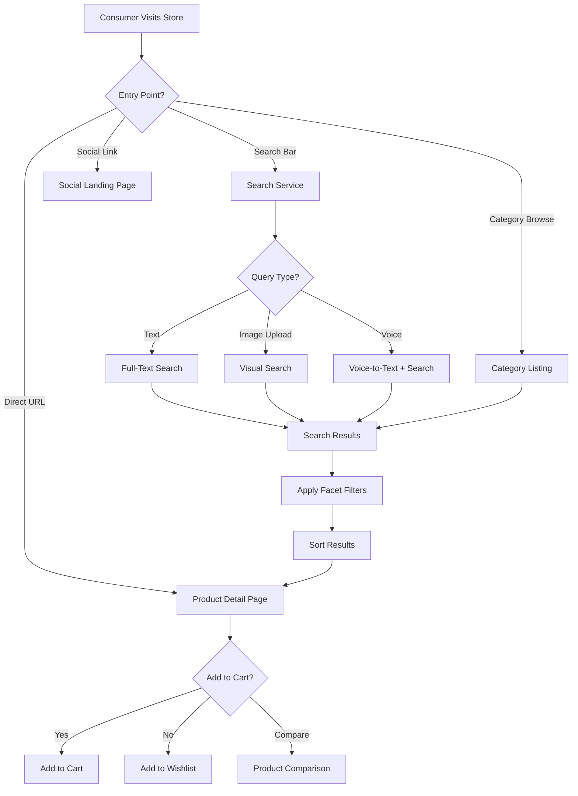

### 2.2 Shopping Cart Workflow

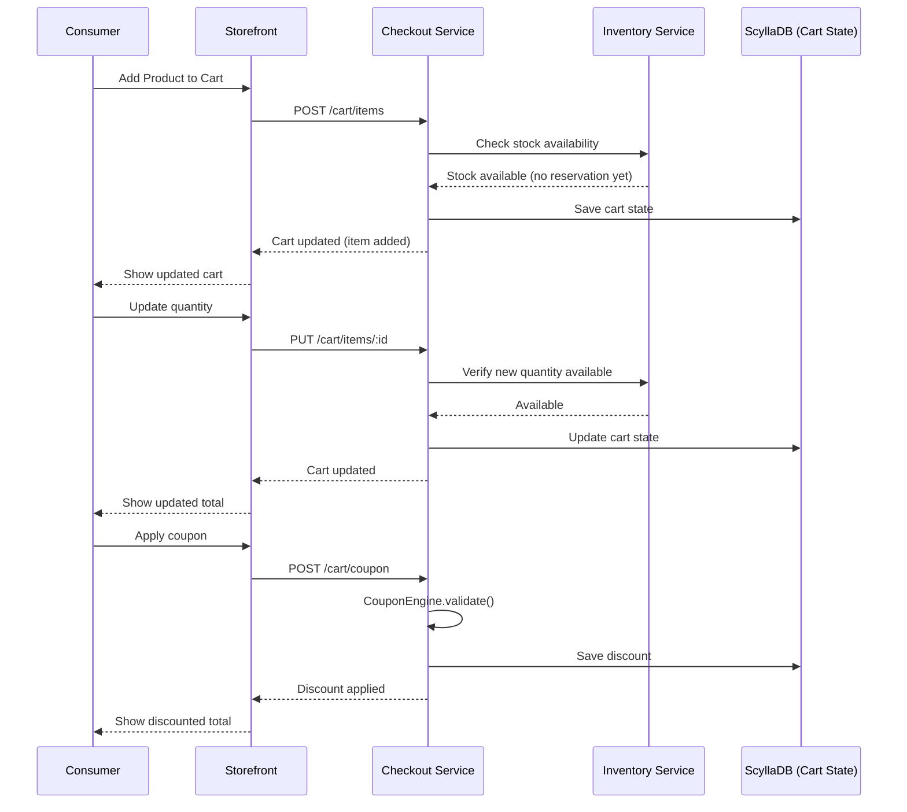

### 2.3 Multi-Step Checkout Flow

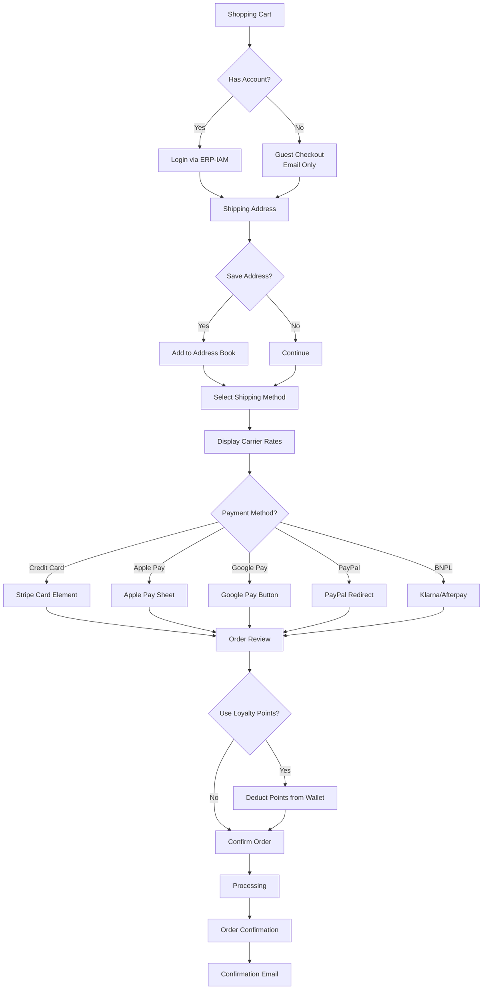

### 2.4 Express Checkout (Apple Pay / Google Pay)

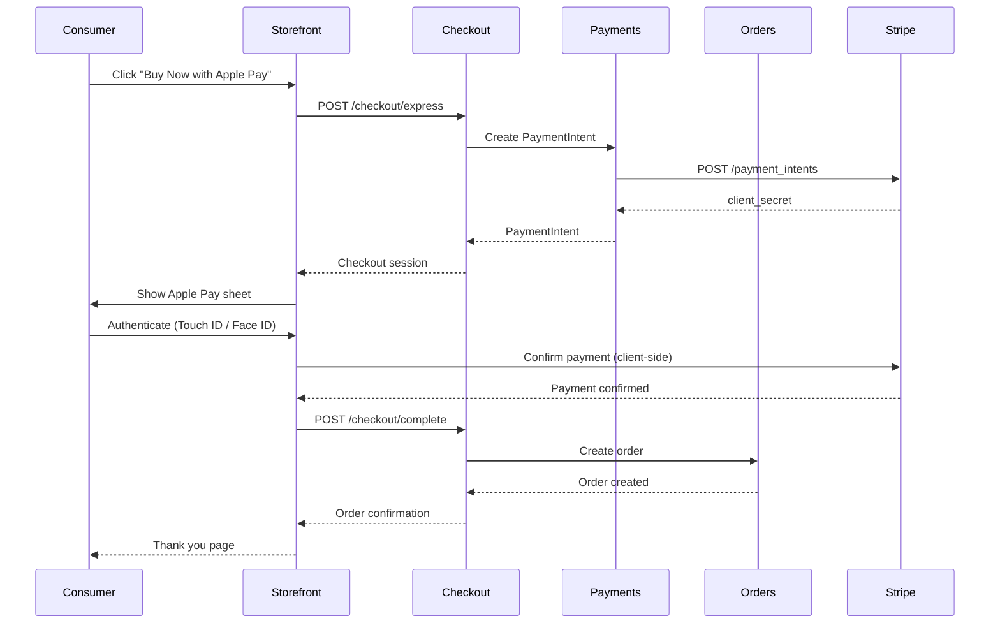

### 2.5 Subscription Signup and Management

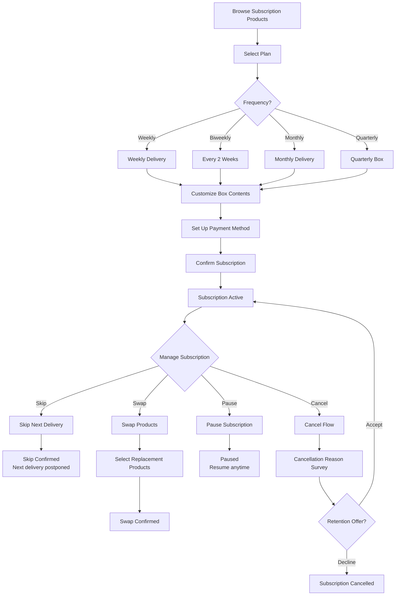

## 3. Social Commerce Workflows

### 3.1 Group Buying Campaign

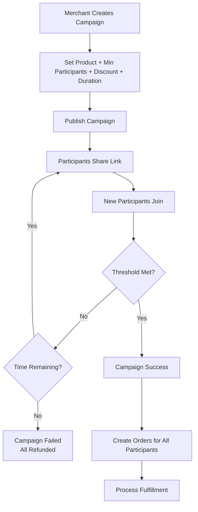

### 3.2 Livestream Shopping

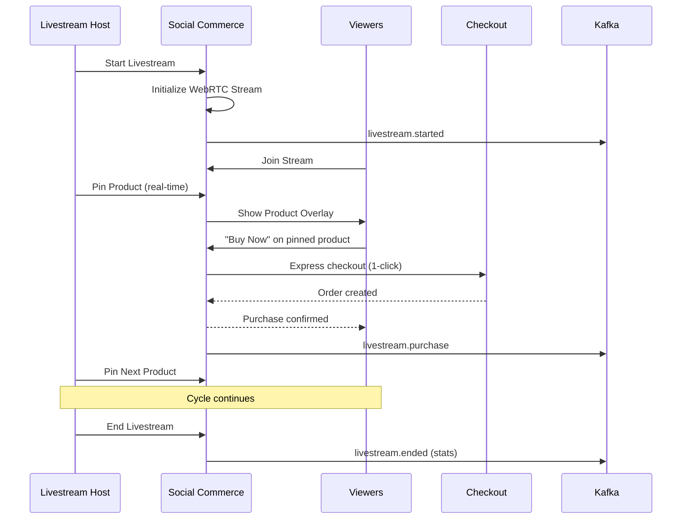

### 3.3 Referral Program

```mermaid
flowchart TD
    REF[Customer Gets Referral Link] --> SHARE[Share via Social/Email/SMS]
    SHARE --> CLICK[Friend Clicks Link]
    CLICK --> COOKIE[Referral Cookie Set (30 days)]
    COOKIE --> SIGNUP[Friend Creates Account]
    SIGNUP --> PURCHASE[Friend Makes First Purchase]
    PURCHASE --> VALIDATE[Validate Referral]
    VALIDATE --> REWARD_REF[Reward Referrer<br/>$10 credit / 500 points]
    VALIDATE --> REWARD_NEW[Reward New Customer<br/>10% off first order]
    REWARD_REF --> NOTIFY_REF[Notify Referrer]
    REWARD_NEW --> NOTIFY_NEW[Notify New Customer]
```

## 4. Merchant Workflows

### 4.1 Product Management

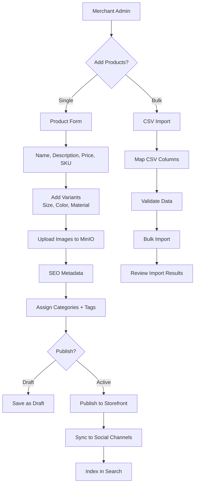

### 4.2 Order Fulfillment Workflow

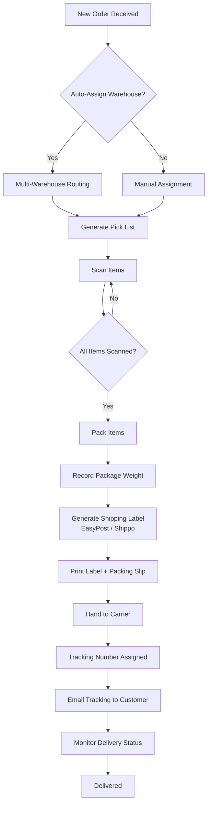

### 4.3 Returns and RMA Workflow

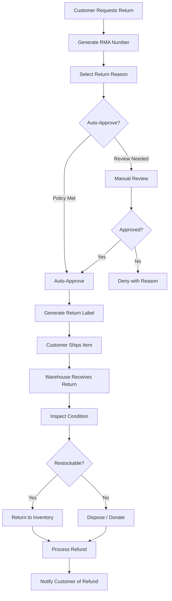

## 5. n8n Workflow Automations

### 5.1 Registered Workflows

| Workflow | Kafka Trigger | Actions | Purpose |
|----------|--------------|---------|---------|
| Order Processing | order.created | Fraud check -> Reserve inventory -> Process payment -> Create fulfillment | Core order pipeline |
| Cart Abandonment | cart.abandoned | Wait 1h -> Email 10% off -> Wait 24h -> Email 15% off -> Wait 48h -> SMS | Revenue recovery |
| Low Stock Alert | inventory.low_stock | Check threshold -> Email merchant -> Create PO suggestion | Inventory management |
| Review Moderation | review.submitted | AI content check -> Auto-approve or flag -> Notify merchant | Quality control |
| Subscription Renewal | subscription.due | Charge payment -> Create order -> Update next date | Recurring billing |
| Loyalty Tier Evaluation | order.completed | Calculate 12m spend -> Evaluate tier -> Upgrade/downgrade | Customer retention |
| Social Sync | product.created | Format for platform -> Sync to Instagram -> Sync to Facebook -> Sync to TikTok | Multi-channel |
| Refund Processing | refund.approved | Process via Stripe -> Update order status -> Email customer -> Restore points | Financial ops |

### 5.2 Cart Abandonment Recovery Workflow Detail

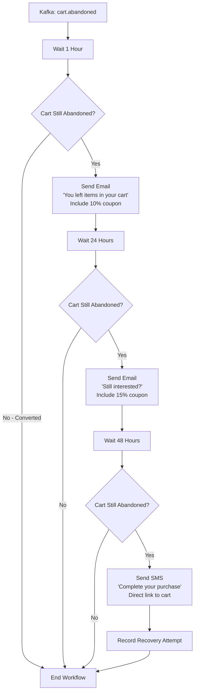

## 6. Loyalty Journey

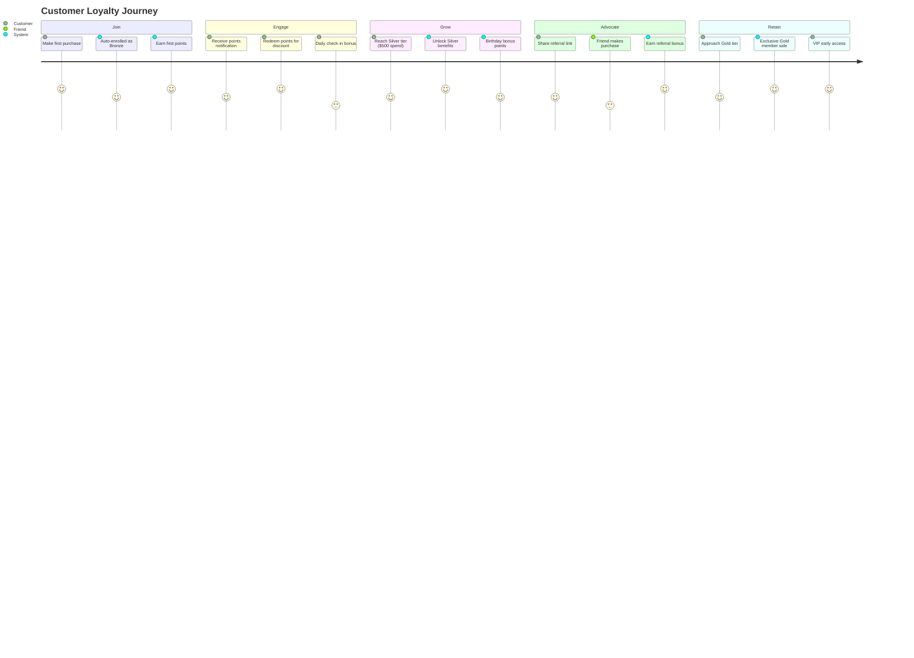
