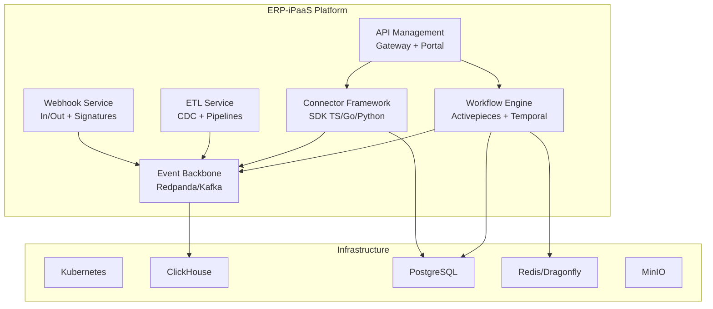

# Documentation Index -- ERP-iPaaS
> Version: 1.0 | Last Updated: 2026-02-23 | Status: Draft
> Classification: Internal | Author: AIDD System

## Overview

This directory contains the complete 32-document documentation suite for the **ERP-iPaaS** module -- the Integration Platform as a Service backbone of the BillyRonks ERP system. ERP-iPaaS provides workflow automation, connector management, event streaming, API management, ETL pipelines, and webhook management for all ERP modules.

## Document Inventory

### Analysis and Requirements
| # | Document | Description |
|---|----------|-------------|
| 1 | [gap-analysis.md](gap-analysis.md) | Gap analysis identifying documentation and feature gaps |
| 2 | [prd.md](prd.md) | Product Requirements Document with competitive benchmarking |
| 3 | [brd.md](brd.md) | Business Requirements Document |

### Architecture and Design
| # | Document | Description |
|---|----------|-------------|
| 4 | [architecture.md](architecture.md) | System Architecture overview |
| 5 | [software-architecture.md](software-architecture.md) | Software Architecture and component design |
| 6 | [enterprise-architecture.md](enterprise-architecture.md) | Enterprise Architecture and integration patterns |
| 7 | [database-schema.md](database-schema.md) | Database Schema and data dictionary |
| 8 | [workflows.md](workflows.md) | Workflows and user journeys |
| 9 | [hld.md](hld.md) | High-Level Design document |
| 10 | [lld.md](lld.md) | Low-Level Design document |
| 11 | [use-cases.md](use-cases.md) | Use cases and scenarios (20+ cases) |

### Technical Documentation
| # | Document | Description |
|---|----------|-------------|
| 12 | [technical-writeup.md](technical-writeup.md) | Technical write-up and implementation details |
| 13 | [hardware-requirements.md](hardware-requirements.md) | Hardware requirements and infrastructure sizing |
| 14 | [software-requirements.md](software-requirements.md) | Software requirements and dependencies |
| 15 | [technical-specifications.md](technical-specifications.md) | Technical specifications and API reference |

### User and Training Manuals
| # | Document | Description |
|---|----------|-------------|
| 16 | [user-manual-admin.md](user-manual-admin.md) | User manual for administrators |
| 17 | [user-manual-enduser.md](user-manual-enduser.md) | User manual for end users |
| 18 | [user-manual-developer.md](user-manual-developer.md) | User manual for developers |
| 19 | [training-manual-admin.md](training-manual-admin.md) | Training manual for administrators |
| 20 | [training-manual-enduser.md](training-manual-enduser.md) | Training manual for end users |
| 21 | [training-manual-developer.md](training-manual-developer.md) | Training manual for developers |
| 22 | [training-video-scripts.md](training-video-scripts.md) | Training video scripts and outlines |

### Operations and Release
| # | Document | Description |
|---|----------|-------------|
| 23 | [release-notes.md](release-notes.md) | Release notes and changelog |
| 24 | [acceptance-criteria.md](acceptance-criteria.md) | Acceptance criteria and validation requirements |
| 25 | [testing-requirements-aidd.md](testing-requirements-aidd.md) | AIDD testing requirements and test plan |
| 26 | [deployment.md](deployment.md) | Deployment guide and procedures |

### Security and Compliance
| # | Document | Description |
|---|----------|-------------|
| 27 | [security.md](security.md) | Security architecture and compliance |
| 28 | [threat-model.md](threat-model.md) | Threat model and mitigation strategies |

### Data and Integration
| # | Document | Description |
|---|----------|-------------|
| 29 | [data-flows.md](data-flows.md) | Data flow diagrams and lineage |
| 30 | [api-reference.md](api-reference.md) | Complete API reference |

### Design Assets
| # | Document | Description |
|---|----------|-------------|
| 31 | [design/Figma_Make_Prompts.md](design/Figma_Make_Prompts.md) | Figma and Make.com automation prompts |

### Executive Summary
| # | Document | Description |
|---|----------|-------------|
| 32 | [executive-summary.md](executive-summary.md) | Executive summary for leadership |

## Architecture at a Glance

## Quick Links

- **Source Code**: `/Users/AbiolaOgunsakin1/ERP/ERP-iPaaS/`
- **OpenAPI Spec**: `/Users/AbiolaOgunsakin1/ERP/ERP-iPaaS/api/openapi/integration-layer.yaml`
- **Helm Charts**: `/Users/AbiolaOgunsakin1/ERP/ERP-iPaaS/infra/helm/`
- **Workflow Templates**: `/Users/AbiolaOgunsakin1/ERP/ERP-iPaaS/workflows/`
- **ClickHouse DDL**: `/Users/AbiolaOgunsakin1/ERP/ERP-iPaaS/config/clickhouse/ddl.sql`
