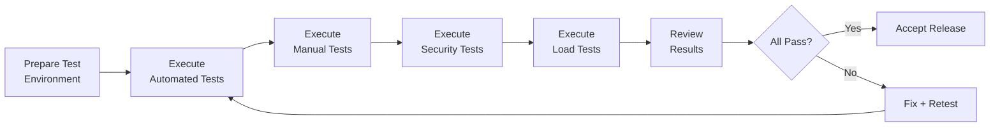

# Acceptance Criteria -- ERP-iPaaS
> Version: 1.0 | Last Updated: 2026-02-23 | Status: Draft
> Classification: Internal | Author: AIDD System

## 1. Overview

This document defines the acceptance criteria for the ERP-iPaaS v1.0 GA release. Each criterion is tied to specific functional requirements and must be validated before the platform is considered production-ready.

## 2. Acceptance Criteria Matrix

### 2.1 Workflow Engine

| AC ID | Criterion | Validation Method | Status |
|-------|----------|------------------|--------|
| AC-WE-001 | Visual workflow builder loads and allows drag-and-drop of 10+ action types | Manual UI testing | Pending |
| AC-WE-002 | Workflow executes successfully with webhook trigger | Automated test | Pending |
| AC-WE-003 | Workflow executes successfully with schedule trigger (cron) | Automated test + 24h observation | Pending |
| AC-WE-004 | Conditional branching routes correctly for if/else/switch | Automated test with multiple paths | Pending |
| AC-WE-005 | Loop construct iterates over a 100-item collection without failure | Load test | Pending |
| AC-WE-006 | Failed action retries 5 times with exponential backoff | Temporal test environment | Pending |
| AC-WE-007 | Parallel branches execute concurrently and join correctly | Automated test | Pending |
| AC-WE-008 | Temporal workflow survives worker restart | Chaos test | Pending |
| AC-WE-009 | Human approval workflow pauses and resumes on signal | End-to-end test | Pending |
| AC-WE-010 | All 16 Activepieces templates import successfully | Automated import test | Pending |
| AC-WE-011 | All 7 Temporal templates register and execute | Automated test | Pending |
| AC-WE-012 | Execution history recorded in ClickHouse with correct tenant_id | SQL query validation | Pending |
| AC-WE-013 | Workflow execution rate sustains 1000/sec under load | Load test (k6) | Pending |

### 2.2 Connector Framework

| AC ID | Criterion | Validation Method | Status |
|-------|----------|------------------|--------|
| AC-CF-001 | connector-cli scaffolds a new connector project | CLI test | Pending |
| AC-CF-002 | connector-cli validates connector against schema registry | CLI test | Pending |
| AC-CF-003 | Connector marketplace lists connectors with pagination | API test | Pending |
| AC-CF-004 | OAuth2 authentication flow completes for connectors | End-to-end test | Pending |
| AC-CF-005 | API key authentication works for connectors | API test | Pending |
| AC-CF-006 | Quality scoring returns 0-100 score for published connectors | Database validation | Pending |
| AC-CF-007 | Connector latency tracked in ClickHouse | SQL query | Pending |

### 2.3 Event Backbone

| AC ID | Criterion | Validation Method | Status |
|-------|----------|------------------|--------|
| AC-EB-001 | Events publish to tenant-scoped Redpanda topics | Producer test | Pending |
| AC-EB-002 | Avro schema validation rejects invalid events | Negative test | Pending |
| AC-EB-003 | Dead letter queue receives failed events after 3 retries | Consumer failure test | Pending |
| AC-EB-004 | Event throughput sustains 100K events/sec | Load test | Pending |
| AC-EB-005 | CloudEvents envelope includes all required fields | Schema validation | Pending |

### 2.4 API Management

| AC ID | Criterion | Validation Method | Status |
|-------|----------|------------------|--------|
| AC-AM-001 | Traefik rate limiting returns 429 when limit exceeded | Load test | Pending |
| AC-AM-002 | JWT validation rejects expired and invalid tokens | Security test | Pending |
| AC-AM-003 | API p99 latency < 50ms under normal load | Performance test | Pending |
| AC-AM-004 | All 12 Integration Layer API endpoints respond correctly | API contract test | Pending |

### 2.5 ETL Service

| AC ID | Criterion | Validation Method | Status |
|-------|----------|------------------|--------|
| AC-ETL-001 | ETL pipeline extracts data from PostgreSQL | Pipeline test | Pending |
| AC-ETL-002 | ETL pipeline transforms data (map, filter, deduplicate) | Unit test | Pending |
| AC-ETL-003 | ETL pipeline loads data to ClickHouse | Pipeline test | Pending |
| AC-ETL-004 | Batch pipeline runs on schedule | Schedule test | Pending |

### 2.6 Webhook Management

| AC ID | Criterion | Validation Method | Status |
|-------|----------|------------------|--------|
| AC-WH-001 | Incoming webhook URL generated and accessible | API test | Pending |
| AC-WH-002 | HMAC-SHA256 signature verification rejects invalid signatures | Security test | Pending |
| AC-WH-003 | Outgoing webhook retries 5 times with backoff | Delivery test | Pending |
| AC-WH-004 | Webhook delivery logged with request/response data | Database validation | Pending |

### 2.7 Security

| AC ID | Criterion | Validation Method | Status |
|-------|----------|------------------|--------|
| AC-SEC-001 | PostgreSQL RLS prevents cross-tenant data access | Penetration test | Pending |
| AC-SEC-002 | Requests without X-Tenant-ID return 400 | API test | Pending |
| AC-SEC-003 | All services require authentication | Security scan | Pending |
| AC-SEC-004 | Secrets stored encrypted (AES-256) | Database inspection | Pending |
| AC-SEC-005 | Audit log records all CRUD operations | Log validation | Pending |

### 2.8 Infrastructure

| AC ID | Criterion | Validation Method | Status |
|-------|----------|------------------|--------|
| AC-INF-001 | All Helm charts deploy without errors | Helm install test | Pending |
| AC-INF-002 | ArgoCD syncs all applications successfully | ArgoCD UI validation | Pending |
| AC-INF-003 | KEDA scales workers based on Kafka lag | Load test with scaling | Pending |
| AC-INF-004 | Platform achieves 99.95% uptime over 30 days | Monitoring SLA report | Pending |
| AC-INF-005 | All health endpoints return healthy | Automated health check | Pending |

## 3. Acceptance Test Procedure

## 4. Sign-Off

| Role | Name | Date | Decision |
|------|------|------|----------|
| Product Owner | ___________________ | ___/___/2026 | Accept / Reject |
| Technical Lead | ___________________ | ___/___/2026 | Accept / Reject |
| Security Lead | ___________________ | ___/___/2026 | Accept / Reject |
| QA Lead | ___________________ | ___/___/2026 | Accept / Reject |
