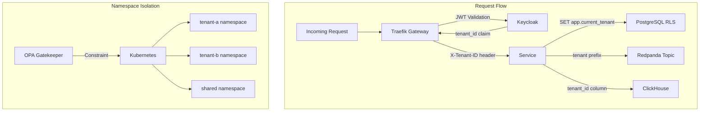
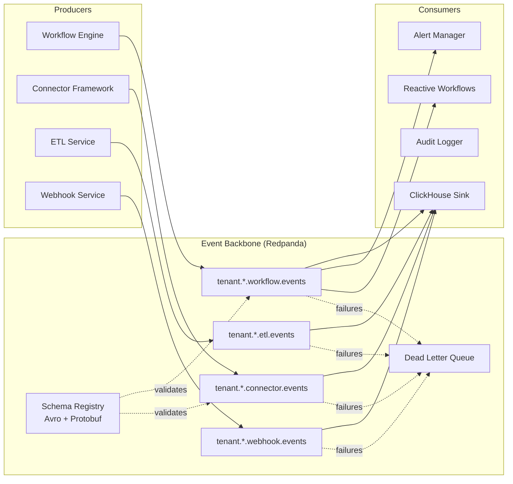
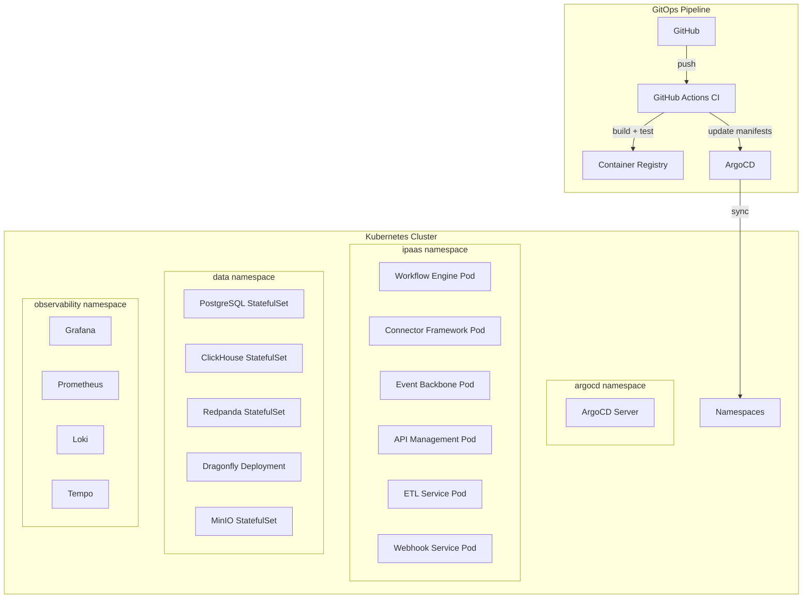
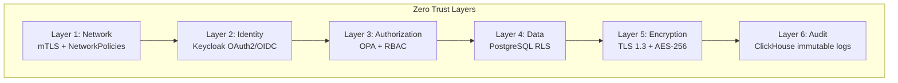
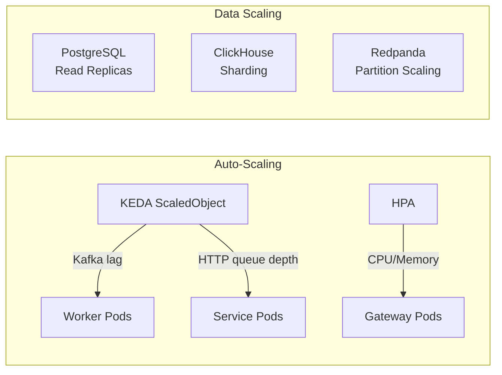

# System Architecture -- ERP-iPaaS
> Version: 1.0 | Last Updated: 2026-02-23 | Status: Draft
> Classification: Internal | Author: AIDD System

## 1. Architecture Overview

ERP-iPaaS follows a microservices architecture deployed on Kubernetes with six core services, an event-driven backbone, and a multi-layer security model providing complete tenant isolation.

```mermaid
graph TB
    subgraph "Client Layer"
        WEB[Web UI<br/>React + Next.js]
        CLI[CLI Tool<br/>connector-cli]
        SDK_TS[TypeScript SDK]
        SDK_GO[Go SDK]
        SDK_PY[Python SDK]
        MOB[Mobile<br/>Flutter/React Native]
    end

    subgraph "API Gateway Layer"
        TRF[Traefik v2.10<br/>Rate Limiting + Auth]
        KC[Keycloak 22.0<br/>OAuth2/OIDC]
    end

    subgraph "Core Services"
        WE[Workflow Engine<br/>Go :8080]
        CF[Connector Framework<br/>Go :8080]
        EB[Event Backbone<br/>Go :8080]
        AM[API Management<br/>Go :8080]
        ETL[ETL Service<br/>Go :8080]
        WH[Webhook Service<br/>Go :8080]
    end

    subgraph "Workflow Runtimes"
        AP[Activepieces 0.20.0<br/>Low-code Builder]
        TMP[Temporal 1.23.0<br/>Durable Execution]
        NF[Nexum Flow<br/>DAG Engine]
    end

    subgraph "Data Layer"
        PG[(PostgreSQL 16<br/>Primary + RLS)]
        CH[(ClickHouse 23.9<br/>Analytics)]
        RP[Redpanda<br/>Event Streaming]
        DF[Dragonfly<br/>Cache/Redis)]
        MIO[MinIO<br/>Object Storage]
    end

    subgraph "Observability"
        GF[Grafana 10.1]
        PM[Prometheus]
        LK[Loki]
        TP[Tempo]
        ST[Sentry]
    end

    WEB --> TRF
    CLI --> TRF
    SDK_TS --> TRF
    SDK_GO --> TRF
    MOB --> TRF

    TRF --> KC
    TRF --> WE
    TRF --> CF
    TRF --> EB
    TRF --> AM
    TRF --> ETL
    TRF --> WH

    WE --> AP
    WE --> TMP
    WE --> NF

    WE --> PG
    WE --> RP
    WE --> CH
    CF --> PG
    CF --> RP
    EB --> RP
    EB --> CH
    ETL --> PG
    ETL --> CH
    WH --> PG
    WH --> RP

    AP --> DF
    TMP --> PG
    NF --> DF

    WE --> MIO
    ETL --> MIO

    PM --> GF
    LK --> GF
    TP --> GF
```

## 2. Service Architecture

### 2.1 Service Decomposition

Each core service follows the same Go microservice pattern with tenant-scoped endpoints:

```mermaid
graph LR
    subgraph "Service Pattern"
        H[Health Check<br/>/healthz]
        L[List<br/>GET /v1/{service}]
        C[Create<br/>POST /v1/{service}]
        R[Read<br/>GET /v1/{service}/{id}]
        U[Update<br/>PATCH /v1/{service}/{id}]
        D[Delete<br/>DELETE /v1/{service}/{id}]
    end

    subgraph "Cross-Cutting"
        T[Tenant Isolation<br/>X-Tenant-ID header]
        E[Event Publishing<br/>erp.ipaas.{service}.*]
        A[Audit Logging<br/>ClickHouse audit table]
    end

    L --> T
    C --> T
    R --> T
    U --> T
    D --> T

    C --> E
    U --> E
    D --> E

    C --> A
    U --> A
    D --> A
```

### 2.2 Service Registry

| Service | Base Path | Port | Event Topic Prefix |
|---------|-----------|------|-------------------|
| workflow-engine | `/v1/workflow-engine` | 8080 | `erp.ipaas.workflow-engine.*` |
| connector-framework | `/v1/connector-framework` | 8080 | `erp.ipaas.connector-framework.*` |
| event-backbone | `/v1/event-backbone` | 8080 | `erp.ipaas.event-backbone.*` |
| api-management | `/v1/api-management` | 8080 | `erp.ipaas.api-management.*` |
| etl | `/v1/etl` | 8080 | `erp.ipaas.etl.*` |
| webhook | `/v1/webhook` | 8080 | `erp.ipaas.webhook.*` |

## 3. Tenant Isolation Architecture



### 3.1 Isolation Layers

1. **Network**: Kubernetes namespace isolation with NetworkPolicies
2. **Identity**: Keycloak realm per tenant with JWT claims
3. **Database**: PostgreSQL Row-Level Security filtering on `tenant_id`
4. **Events**: Tenant-prefixed Kafka topics (`tenant.{id}.{topic}`)
5. **Storage**: MinIO bucket policies per tenant
6. **Compute**: Optional dedicated worker pools per tenant via KEDA

## 4. Event-Driven Architecture



### 4.1 Event Schema (Avro)

The `WorkflowCommand` Avro schema defines the canonical event format:

```json
{
  "type": "record",
  "name": "WorkflowCommand",
  "namespace": "com.billyronks.workflow",
  "fields": [
    { "name": "tenant_id", "type": "string" },
    { "name": "workflow_type", "type": "string" },
    { "name": "task_queue", "type": "string" },
    { "name": "payload", "type": { "type": "map", "values": "string" } },
    { "name": "idempotency_key", "type": "string" },
    { "name": "priority", "type": "int", "default": 0 },
    { "name": "timestamp", "type": "long", "logicalType": "timestamp-millis" }
  ]
}
```

## 5. Deployment Architecture



### 5.1 Helm Chart Inventory

| Chart | Location | Purpose |
|-------|----------|---------|
| activepieces | `infra/helm/activepieces/` | Low-code workflow runtime |
| temporal | `infra/helm/temporal/` | Durable workflow runtime |
| redpanda | `infra/helm/redpanda/` | Event streaming |
| traefik | `infra/helm/traefik/` | API gateway |
| keycloak | `infra/helm/keycloak/` | Identity provider |
| clickhouse | `infra/helm/clickhouse/` | Analytics database |
| postgres | `infra/helm/postgres/` | Primary database |
| minio | `infra/helm/minio/` | Object storage |
| keda | `infra/helm/keda/` | Auto-scaling |
| prometheus-stack | `infrastructure/helm/prometheus-stack/` | Monitoring |
| loki-tempo | `infra/helm/loki-tempo/` | Log aggregation + tracing |
| sentry | `infra/helm/sentry/` | Error tracking |

## 6. Data Architecture

### 6.1 PostgreSQL (Operational Data)

- Tenant isolation via Row-Level Security
- Tables: `tenants`, `workflows`, `workflow_runs`, `connectors`, `webhooks`
- Session-scoped tenant context via `set_config('request.jwt.claim.tenant_id', ...)`

### 6.2 ClickHouse (Analytics and Metrics)

- Database: `billyronks`
- Tables: `runs`, `audit`, `connector_latency`, `tenant_usage`, `cost_approx`, `workflow_dlp`, `connector_marketplace`, `connector_validation_queue`, `connector_attestations`
- Materialized view: `connector_validation_daily`
- Timezone: `Africa/Lagos`
- TTL: 30-day default on `runs` table

### 6.3 Redpanda (Event Streaming)

- Kafka-compatible protocol
- Schema registry with Avro
- Tenant-scoped topics
- Dead-letter queues per topic

## 7. Security Architecture



### 7.1 Authentication Flow

1. Client authenticates with Keycloak via OAuth2 (authorization code or client credentials)
2. Keycloak issues JWT with `tenant_id` claim
3. Traefik validates JWT signature and expiry
4. Traefik injects `X-Tenant-ID` header from JWT claim
5. Service uses `X-Tenant-ID` for all data access

### 7.2 Secrets Management

- Vault/SOPS for infrastructure secrets
- Encrypted secret storage via integration layer API
- Rotation policies configurable per secret
- Audit trail for all secret access

## 8. Scalability Architecture



- **KEDA**: Scales workflow workers based on Kafka consumer lag and Temporal task queue depth
- **HPA**: Scales API gateway and services based on CPU/memory
- **ClickHouse**: Partition-based scaling with MergeTree engine
- **Redpanda**: Horizontal partition scaling for throughput
