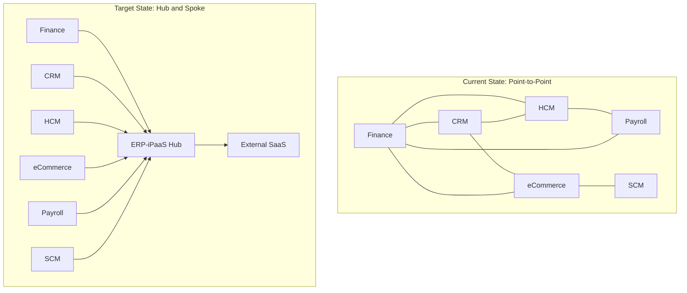
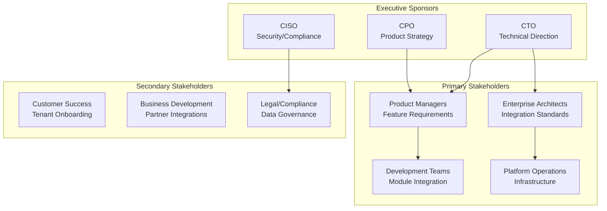
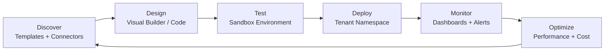
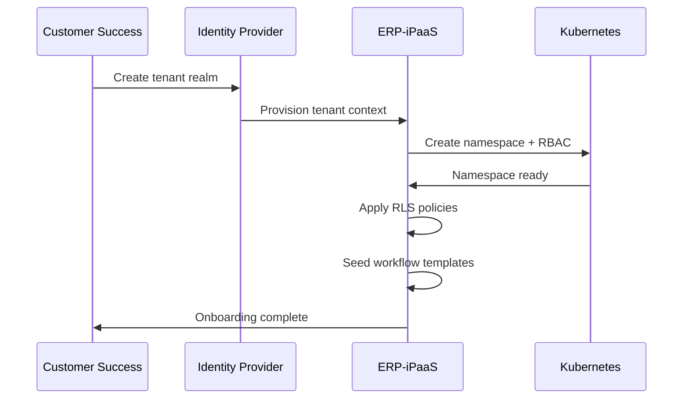

# Business Requirements Document -- ERP-iPaaS
> Version: 1.0 | Last Updated: 2026-02-23 | Status: Draft
> Classification: Internal | Author: AIDD System

## 1. Executive Summary

The ERP-iPaaS module addresses the critical business need for a unified integration platform that connects BillyRonks ERP modules, external SaaS applications, and on-premises systems. This document defines the business requirements, stakeholder needs, and expected outcomes that justify the investment in building and maintaining the integration platform.

## 2. Business Context

### 2.1 Problem Statement

BillyRonks Global Limited operates 15+ ERP modules (Finance, HCM, CRM, Commerce, SCM, Healthcare, Church Management, School Management, etc.) that currently rely on point-to-point integrations, resulting in:

- **Data Silos**: Each module maintains its own data with manual reconciliation
- **Integration Debt**: 200+ point-to-point connections with no central governance
- **Slow Time-to-Market**: New integrations take 6-12 weeks to build and deploy
- **Operational Risk**: No centralized monitoring, retry logic, or error handling
- **Cost Escalation**: Third-party iPaaS costs (MuleSoft, Zapier) growing 30%+ annually

### 2.2 Business Opportunity

| Opportunity | Estimated Impact | Timeline |
|------------|-----------------|----------|
| Eliminate third-party iPaaS licensing | $300K-$500K/year savings | 12 months |
| Reduce integration development time | 70% reduction (6 weeks to 1.5 weeks) | 6 months |
| Enable real-time data synchronization | Zero-lag cross-module data | 3 months |
| Unlock new integration-dependent features | 10+ new features per quarter | Ongoing |
| Improve compliance posture | On-premises data sovereignty | 6 months |

## 3. Stakeholders

### 3.1 Stakeholder Map

### 3.2 Stakeholder Needs

| Stakeholder | Need | Priority |
|------------|------|----------|
| CTO | Reduce technical debt from point-to-point integrations | Critical |
| CPO | Enable rapid feature delivery through integration | Critical |
| CISO | Ensure tenant data isolation and compliance | Critical |
| Product Managers | Self-service integration building for non-developers | High |
| Enterprise Architects | Standardized integration patterns and governance | High |
| Development Teams | SDKs and APIs for building integrations programmatically | High |
| Platform Operations | Centralized monitoring and alerting for all integrations | High |
| Customer Success | Streamlined tenant onboarding with templates | Medium |
| Business Development | Partner connector marketplace | Medium |
| Legal/Compliance | Data residency and audit trail requirements | High |

## 4. Business Requirements

### 4.1 Core Business Requirements

| BR ID | Requirement | Rationale | Priority |
|-------|------------|-----------|----------|
| BR-001 | Provide a unified integration platform for all ERP modules | Eliminates point-to-point integration debt | Critical |
| BR-002 | Support both low-code and pro-code integration development | Serves business analysts and developers | Critical |
| BR-003 | Enable real-time event-driven integration patterns | Supports business processes requiring immediate data sync | Critical |
| BR-004 | Ensure complete tenant data isolation | Regulatory and contractual requirement | Critical |
| BR-005 | Deploy on-premises or in private cloud | Data sovereignty for regulated industries | High |
| BR-006 | Provide a connector marketplace for reuse | Reduce duplicate integration effort across tenants | High |
| BR-007 | Support integration with 100+ external SaaS applications | Customer demand for third-party connectivity | High |
| BR-008 | Deliver integration monitoring and alerting | Operational visibility for platform team | High |
| BR-009 | Enable self-service workflow creation | Reduce dependency on engineering for standard integrations | High |
| BR-010 | Provide comprehensive audit logging | Compliance and troubleshooting requirement | High |

### 4.2 Financial Requirements

| BR ID | Requirement | Metric | Target |
|-------|------------|--------|--------|
| BR-F01 | Reduce iPaaS licensing costs | Annual spend | 60%+ reduction vs. MuleSoft |
| BR-F02 | Reduce integration development cost | Cost per integration | < $5,000 for standard integrations |
| BR-F03 | Achieve positive ROI within 18 months | ROI | > 200% |
| BR-F04 | Per-tenant cost tracking | ClickHouse metrics | Real-time cost visibility |

### 4.3 Compliance Requirements

| BR ID | Requirement | Standard | Region |
|-------|------------|----------|--------|
| BR-C01 | Data residency controls | NDPR, GDPR | Nigeria, EU |
| BR-C02 | PII redaction in logs | GDPR Art. 25 | Global |
| BR-C03 | Immutable audit trail | SOC2 CC6.1 | Global |
| BR-C04 | Encryption at rest and in transit | ISO 27001 | Global |
| BR-C05 | Access control with RBAC | SOC2 CC6.3 | Global |

## 5. Business Process Requirements

### 5.1 Integration Development Lifecycle

### 5.2 Tenant Onboarding Process

## 6. Success Criteria

| Criteria | Metric | Target | Measurement |
|----------|--------|--------|-------------|
| Time to first integration | Days from tenant onboarding | < 1 day | Template import to first execution |
| Integration reliability | Success rate | > 99.5% | Workflow completion rate |
| Platform availability | Uptime | > 99.95% | Monitoring SLA |
| Developer adoption | Active developers | 50+ per quarter | API key activity |
| Cost efficiency | Cost per execution | < $0.001 | ClickHouse cost_approx table |
| Tenant satisfaction | NPS | > 40 | Quarterly survey |

## 7. Constraints

| Constraint | Description | Impact |
|-----------|-------------|--------|
| AGPLv3 licensing | Activepieces is AGPLv3; modifications must be open-sourced | Limits proprietary Activepieces modifications |
| Africa/Lagos timezone | Default timezone for all logs, metrics, and schedules | UTC conversion required for global tenants |
| Kubernetes dependency | Platform requires K8s cluster | On-premises customers need K8s expertise |
| Redpanda licensing | BSL for some Redpanda features | Enterprise features may require commercial license |

## 8. Dependencies

| Dependency | Type | Risk Level |
|-----------|------|-----------|
| IDaaS (Keycloak) | Identity and authentication | High -- platform unusable without identity |
| PostgreSQL (DBaaS) | Primary data store | High -- data loss risk |
| Redpanda cluster | Event streaming | High -- workflows fail without event bus |
| Kubernetes cluster | Container orchestration | High -- deployment platform |
| MinIO | Object storage | Medium -- file-based workflows impacted |
| ClickHouse | Analytics and metrics | Low -- analytics degraded but core unaffected |

## 9. Acceptance Criteria

The business will accept the platform when:

1. All 10 core business requirements (BR-001 through BR-010) are demonstrably met
2. At least 16 workflow templates are deployed and functional
3. The platform sustains 99.95% uptime over a 30-day evaluation period
4. Tenant isolation is validated through penetration testing
5. Integration development time is demonstrated at < 2 weeks for 5 sample integrations
6. Cost tracking is operational in ClickHouse with per-tenant breakdowns
7. Audit logging captures all create/update/delete operations with immutable records
