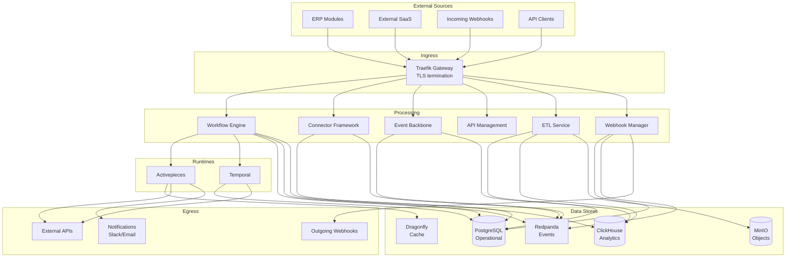
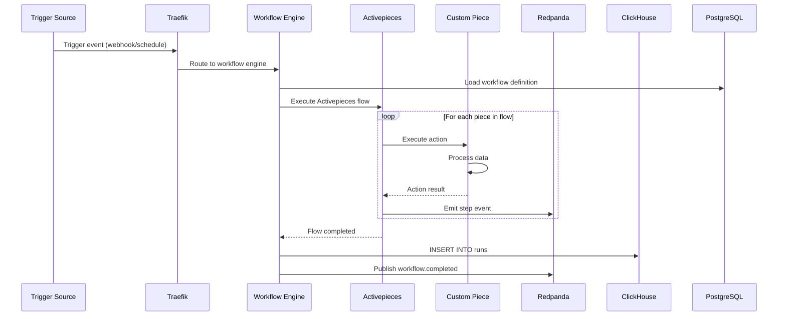
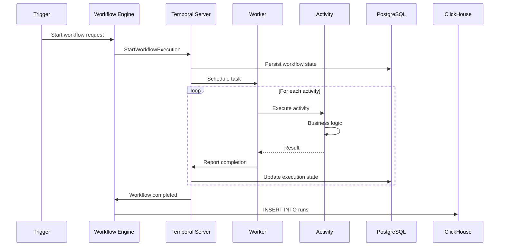
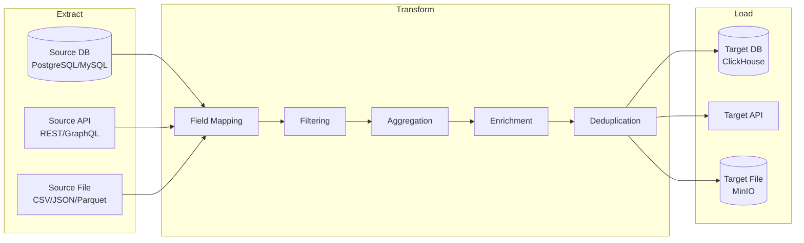
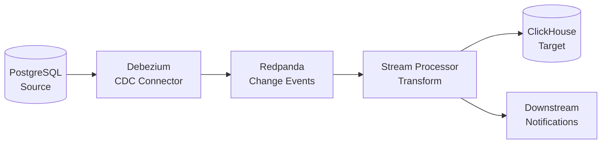
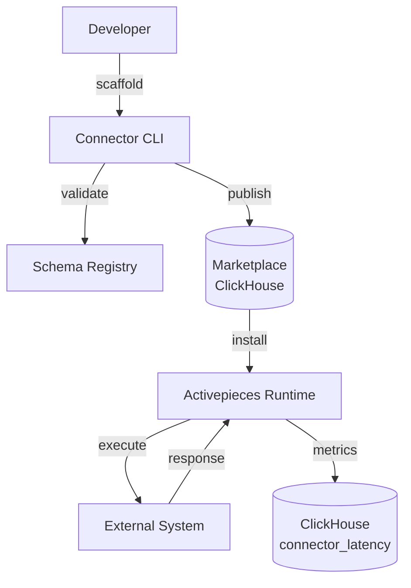
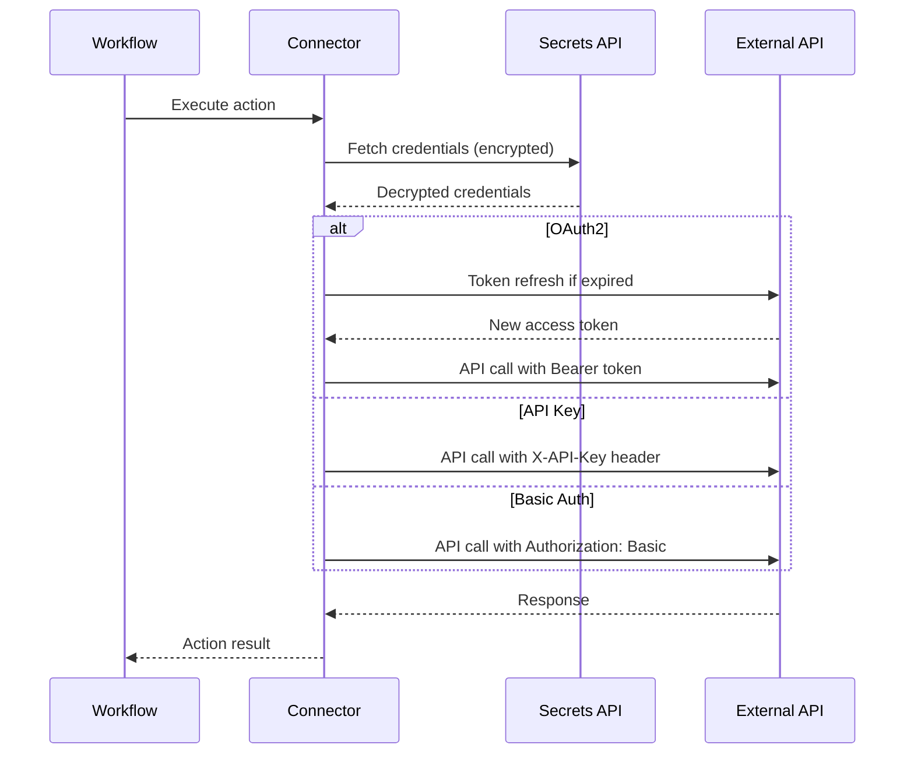
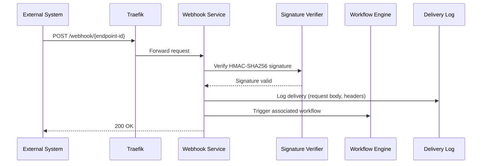
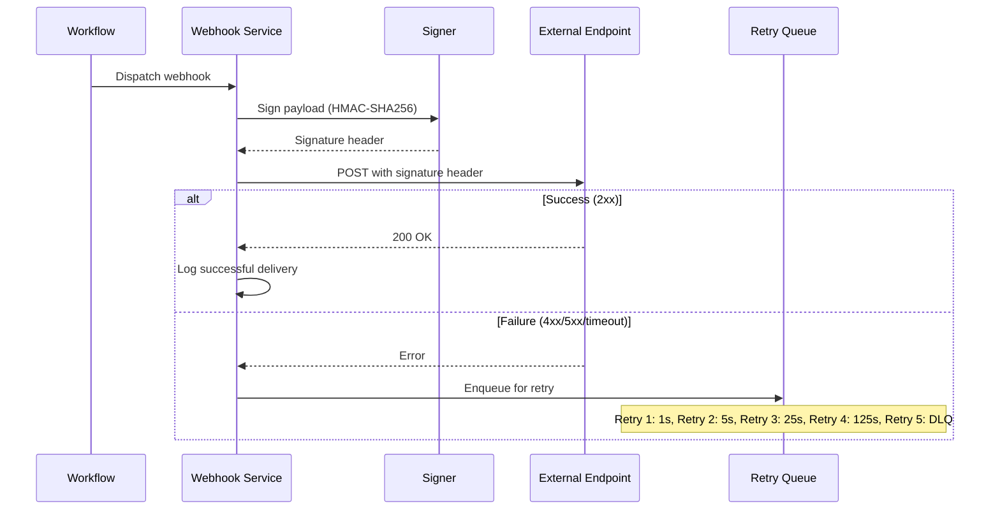
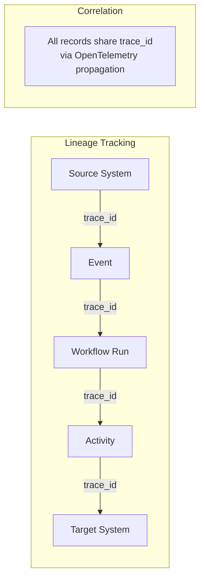

# Data Flows -- ERP-iPaaS
> Version: 1.0 | Last Updated: 2026-02-23 | Status: Draft
> Classification: Internal | Author: AIDD System

## 1. Overview

This document maps all data flows within ERP-iPaaS, covering ingress/egress paths, inter-service communication, event propagation, ETL pipelines, and data lineage tracking.

## 2. System-Level Data Flow



## 3. Workflow Execution Data Flow

### 3.1 Activepieces Execution



### 3.2 Temporal Execution



## 4. Event Data Flow

### 4.1 Event Production Pipeline

```mermaid
graph LR
    subgraph "Producers"
        P1[Service Layer]
        P2[Workflow Runtime]
        P3[External Webhook]
    end

    subgraph "Schema Validation"
        SR[Redpanda Schema Registry]
    end

    subgraph "Redpanda Cluster"
        T1[tenant.{id}.workflow.events]
        T2[tenant.{id}.connector.events]
        T3[tenant.{id}.etl.events]
        T4[tenant.{id}.webhook.events]
    end

    P1 --> SR
    P2 --> SR
    P3 --> SR
    SR --> T1
    SR --> T2
    SR --> T3
    SR --> T4
```

### 4.2 Event Consumption Pipeline

```mermaid
graph LR
    subgraph "Topics"
        T[tenant.{id}.*]
    end

    subgraph "Consumer Groups"
        CG1[clickhouse-sink<br/>Analytics ingestion]
        CG2[workflow-trigger<br/>Reactive workflows]
        CG3[alert-evaluator<br/>Prometheus alerting]
        CG4[audit-logger<br/>Compliance logging]
        CG5[notification-dispatcher<br/>Slack/Email]
    end

    T --> CG1
    T --> CG2
    T --> CG3
    T --> CG4
    T --> CG5
```

### 4.3 Dead Letter Queue Flow

```mermaid
graph TD
    MSG[Event Message] --> CON{Consumer<br/>Processing}
    CON -->|Success| ACK[Commit Offset]
    CON -->|Failure| RT1[Retry 1<br/>1s delay]
    RT1 --> CON
    CON -->|Failure| RT2[Retry 2<br/>5s delay]
    RT2 --> CON
    CON -->|Failure| DLQ[tenant.{id}.dlq]
    DLQ --> MON[Monitoring Alert]
    DLQ --> RPL[Manual Replay]
    RPL --> MSG
```

## 5. ETL Data Flow

### 5.1 Batch ETL Pipeline



### 5.2 CDC (Streaming) Pipeline



## 6. Connector Data Flow

### 6.1 Connector Lifecycle



### 6.2 Connector Authentication Flow



## 7. Webhook Data Flow

### 7.1 Incoming Webhook



### 7.2 Outgoing Webhook



## 8. Data Lineage



Every data movement carries an OpenTelemetry `trace_id` that enables end-to-end lineage tracking from source event to final destination. Traces are stored in Tempo and correlated with Loki logs and Prometheus metrics in Grafana.
