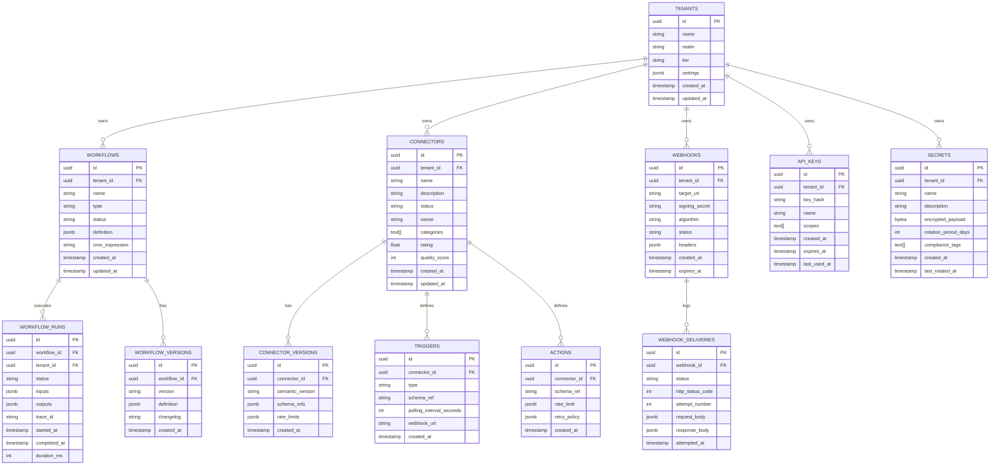
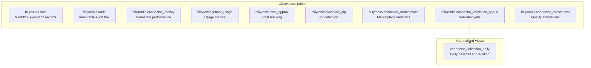

# Database Schema -- ERP-iPaaS
> Version: 1.0 | Last Updated: 2026-02-23 | Status: Draft
> Classification: Internal | Author: AIDD System

## 1. Overview

ERP-iPaaS uses a polyglot persistence strategy with PostgreSQL 16 for operational data, ClickHouse 23.9 for analytics and metrics, Redpanda for event streaming, Dragonfly for caching, and MinIO for object storage.

## 2. PostgreSQL Schema

### 2.1 Entity Relationship Diagram



### 2.2 Row-Level Security

All tenant-scoped tables enforce RLS via JWT claims:

```sql
-- Enable RLS on key tables
ALTER TABLE tenants ENABLE ROW LEVEL SECURITY;
ALTER TABLE workflows ENABLE ROW LEVEL SECURITY;
ALTER TABLE workflow_runs ENABLE ROW LEVEL SECURITY;

-- Tenant isolation policies
CREATE POLICY tenant_isolation_tenants ON tenants
  USING (id::text = current_setting('request.jwt.claim.tenant_id'));

CREATE POLICY tenant_isolation_workflows ON workflows
  USING (tenant_id = current_setting('request.jwt.claim.tenant_id'))
  WITH CHECK (tenant_id = current_setting('request.jwt.claim.tenant_id'));

CREATE POLICY tenant_isolation_runs ON workflow_runs
  USING (tenant_id = current_setting('request.jwt.claim.tenant_id'));
```

### 2.3 Index Strategy

| Table | Index | Type | Purpose |
|-------|-------|------|---------|
| workflows | `idx_workflows_tenant_status` | B-tree | Filter by tenant + status |
| workflow_runs | `idx_runs_workflow_started` | B-tree | Sort by started_at |
| workflow_runs | `idx_runs_tenant_trace` | B-tree | Trace correlation |
| connectors | `idx_connectors_tenant_cats` | GIN | Category search |
| webhooks | `idx_webhooks_tenant_status` | B-tree | Active webhook lookup |
| api_keys | `idx_apikeys_hash` | Hash | Key lookup |

## 3. ClickHouse Schema

### 3.1 Table Definitions



### 3.2 Runs Table

```sql
CREATE TABLE IF NOT EXISTS billyronks.runs (
    tenant_id String,
    workflow_id String,
    workflow_type String,
    status LowCardinality(String),
    started_at DateTime64(3, 'Africa/Lagos'),
    completed_at DateTime64(3, 'Africa/Lagos'),
    duration_ms UInt64,
    trace_id String,
    inputs JSON,
    outputs JSON
) ENGINE = MergeTree
PARTITION BY toDate(started_at)
ORDER BY (tenant_id, started_at)
TTL completed_at + INTERVAL 30 DAY
SETTINGS index_granularity = 8192;
```

**Design notes**:
- Partitioned by date for efficient time-range queries
- Ordered by tenant_id + started_at for tenant-scoped scans
- 30-day TTL on completed_at to manage storage
- LowCardinality for status field (running, completed, failed, cancelled)

### 3.3 Audit Table

```sql
CREATE TABLE IF NOT EXISTS billyronks.audit (
    tenant_id String,
    actor String,
    actor_type LowCardinality(String),
    action String,
    resource_type String,
    resource_id String,
    metadata JSON,
    timestamp DateTime64(3, 'Africa/Lagos')
) ENGINE = MergeTree
PARTITION BY toDate(timestamp)
ORDER BY (tenant_id, timestamp);
```

**Design notes**:
- No TTL -- immutable audit trail for compliance
- Actor_type distinguishes human, service, and system actors
- JSON metadata for flexible audit context

### 3.4 Connector Latency Table

Tracks per-connector, per-action latency for SLO monitoring:

```sql
CREATE TABLE IF NOT EXISTS billyronks.connector_latency (
    tenant_id String,
    connector String,
    action String,
    attempt UInt8,
    latency_ms UInt32,
    status LowCardinality(String),
    observed_at DateTime64(3, 'Africa/Lagos')
) ENGINE = MergeTree
PARTITION BY toDate(observed_at)
ORDER BY (tenant_id, connector, observed_at);
```

### 3.5 Connector Marketplace Table

```sql
CREATE TABLE IF NOT EXISTS billyronks.connector_marketplace (
    tenant_id String,
    connector_id String,
    version String,
    status LowCardinality(String),
    owner String,
    categories Array(String),
    badges Array(String),
    quality_score UInt8,
    rating Float32,
    slo JSON,
    published_at DateTime64(3, 'Africa/Lagos')
) ENGINE = ReplacingMergeTree
ORDER BY (tenant_id, connector_id, version);
```

**Design notes**:
- ReplacingMergeTree deduplicates on primary key, keeping latest row
- Quality score 0-100, rating 0.0-5.0

### 3.6 Materialized View

```sql
CREATE MATERIALIZED VIEW IF NOT EXISTS billyronks.connector_validation_daily
ENGINE = SummingMergeTree
PARTITION BY toDate(event_date)
ORDER BY (tenant_id, connector_id, event_date)
AS
SELECT
    tenant_id,
    connector_id,
    toDate(enqueued_at) AS event_date,
    countIf(status = 'passed') AS passed,
    countIf(status = 'failed') AS failed
FROM billyronks.connector_validation_queue
GROUP BY tenant_id, connector_id, event_date;
```

## 4. Redpanda Topic Schema

### 4.1 Topic Naming Convention

```
tenant.{tenant_id}.{module}.{entity}.{action}
```

Examples:
- `tenant.abc123.workflow.run.started`
- `tenant.abc123.connector.validation.completed`
- `tenant.abc123.webhook.delivery.failed`

### 4.2 Avro Schema: WorkflowCommand

```json
{
  "type": "record",
  "name": "WorkflowCommand",
  "namespace": "com.billyronks.workflow",
  "fields": [
    { "name": "tenant_id", "type": "string" },
    { "name": "workflow_type", "type": "string" },
    { "name": "task_queue", "type": "string" },
    { "name": "payload", "type": { "type": "map", "values": "string" } },
    { "name": "idempotency_key", "type": "string" },
    { "name": "priority", "type": "int", "default": 0 },
    { "name": "timestamp", "type": "long", "logicalType": "timestamp-millis" }
  ]
}
```

## 5. Data Dictionary

### 5.1 Common Fields

| Field | Type | Description | Example |
|-------|------|-------------|---------|
| tenant_id | UUID/String | Unique tenant identifier from IDaaS | `a1b2c3d4-...` |
| trace_id | String | OpenTelemetry trace ID | `4bf92f3577b34da6a...` |
| created_at | DateTime | Record creation timestamp (Africa/Lagos) | `2026-02-23T10:30:00` |
| updated_at | DateTime | Last modification timestamp | `2026-02-23T11:45:00` |
| status | Enum | Resource lifecycle status | `draft`, `active`, `archived` |

### 5.2 Workflow Status Enum

| Value | Description |
|-------|-------------|
| draft | Workflow defined but not activated |
| active | Workflow accepting triggers |
| paused | Workflow temporarily disabled |
| archived | Workflow retired |

### 5.3 Run Status Enum

| Value | Description |
|-------|-------------|
| running | Execution in progress |
| completed | Successfully finished |
| failed | Execution failed |
| cancelled | Manually or timeout cancelled |
| waiting | Awaiting human approval |

## 6. Migration Strategy

- Schema migrations managed via versioned SQL files
- ClickHouse DDL applied via ConfigMap (`config/clickhouse/ddl.sql`)
- PostgreSQL RLS policies applied via ConfigMap (`config/security/postgres_rls.sql`)
- Zero-downtime migrations using blue-green deployment
