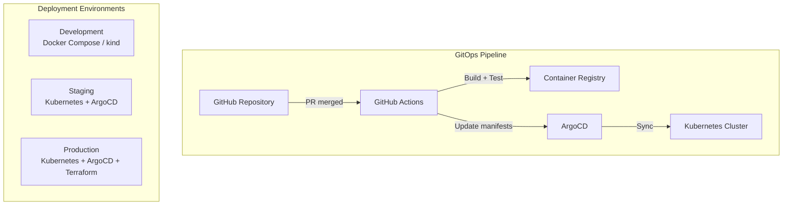
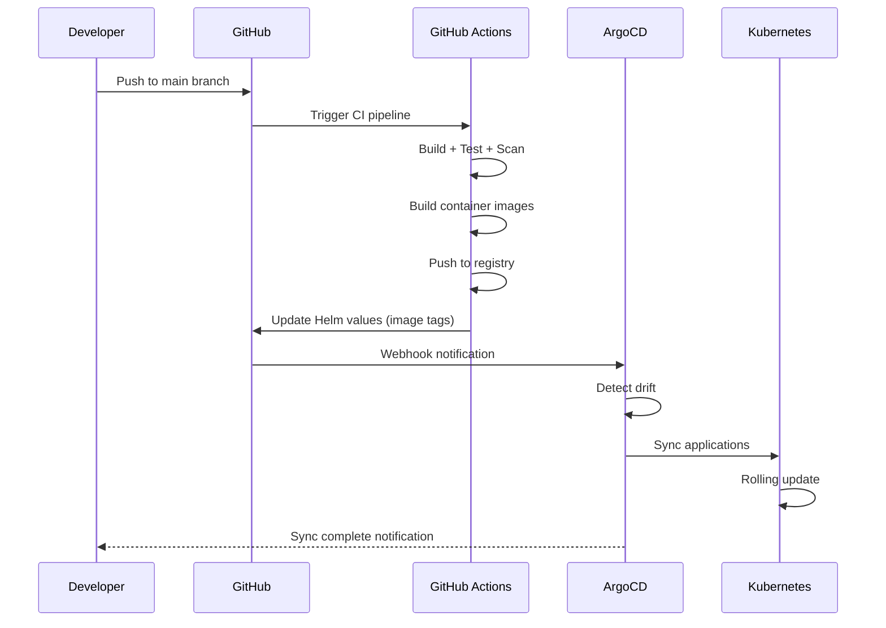
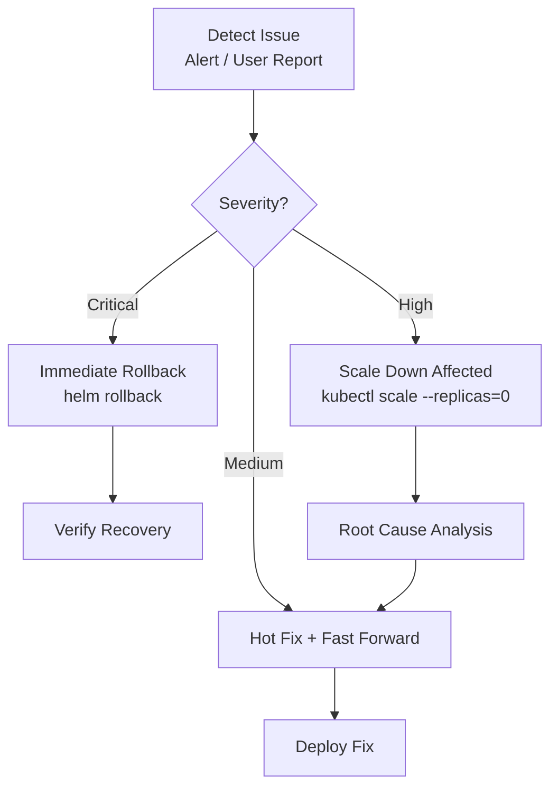

# Deployment Guide -- ERP-iPaaS
> Version: 1.0 | Last Updated: 2026-02-23 | Status: Draft
> Classification: Internal | Author: AIDD System

## 1. Overview

This document provides step-by-step deployment procedures for ERP-iPaaS across development, staging, and production environments using Kubernetes, Helm, ArgoCD, and Terraform.

## 2. Deployment Architecture



## 3. Development Deployment

### 3.1 Docker Compose (Local)

```bash
# Start all services
docker compose up -d

# Verify services
docker compose ps

# View logs
docker compose logs -f activepieces
docker compose logs -f temporal
```

**Services started**: Traefik, Keycloak, PostgreSQL, Redpanda, Dragonfly, Activepieces, Temporal, Temporal Web, MinIO, ClickHouse, Grafana.

### 3.2 Local Kubernetes (kind)

```bash
# Bootstrap local cluster
make bootstrap

# This runs:
# 1. kind create cluster --name billyronks
# 2. kubectl create namespace argocd
# 3. helm install argocd
# 4. kubectl apply -f infra/argocd/applications.yaml
```

## 4. Staging Deployment

### 4.1 Prerequisites

- Kubernetes 1.28+ cluster
- Helm 3.12+ installed
- kubectl configured with cluster access
- Container registry accessible
- Keycloak realm configured

### 4.2 Kustomize Configuration

```bash
# Apply staging overlay
kubectl apply -k deploy/kustomize/overlays/dev/
```

Configuration in `deploy/kustomize/overlays/dev/`:
- Reduced replica counts
- Lower resource limits
- Debug logging enabled

### 4.3 Helm Installation

```bash
# Install data tier
helm upgrade --install postgres ./infra/helm/postgres -n ipaas-data -f infra/helm/postgres/values.yaml
helm upgrade --install clickhouse ./infra/helm/clickhouse -n ipaas-data -f infra/helm/clickhouse/values.yaml
helm upgrade --install redpanda ./infra/helm/redpanda -n ipaas-data -f infra/helm/redpanda/values.yaml
helm upgrade --install minio ./infra/helm/minio -n ipaas-data -f infra/helm/minio/values.yaml

# Install runtime tier
helm upgrade --install keycloak ./infra/helm/keycloak -n ipaas-system -f infra/helm/keycloak/values.yaml
helm upgrade --install activepieces ./infra/helm/activepieces -n ipaas-runtime -f infra/helm/activepieces/values.yaml
helm upgrade --install temporal ./infra/helm/temporal -n ipaas-runtime -f infra/helm/temporal/values.yaml

# Install gateway
helm upgrade --install traefik ./infra/helm/traefik -n ipaas-system -f infra/helm/traefik/values.yaml

# Install observability
helm upgrade --install monitoring ./infra/helm/monitoring -n observability -f infra/helm/monitoring/values.yaml
helm upgrade --install sentry ./infra/helm/sentry -n observability -f infra/helm/sentry/values.yaml
```

## 5. Production Deployment

### 5.1 Terraform Infrastructure

```bash
# Initialize Terraform
cd infra/terraform
terraform init

# Plan infrastructure changes
terraform plan -var-file=environments/prod/variables.tf

# Apply infrastructure
terraform apply -var-file=environments/prod/variables.tf
```

### 5.2 ArgoCD GitOps Deployment



### 5.3 ArgoCD Application of Applications

```bash
# Apply the app-of-apps pattern
kubectl apply -f infra/argocd/applications.yaml

# This deploys all ArgoCD applications:
# - activepieces
# - temporal
# - kafka (redpanda)
# - observability
```

### 5.4 Production Kustomize Overlay

```bash
kubectl apply -k deploy/kustomize/overlays/prod/
```

Production overlay includes:
- Higher replica counts
- Production resource limits
- Production secrets references
- NetworkPolicies enabled

## 6. Post-Deployment Verification

### 6.1 Health Check Script

```bash
# Check all service health endpoints
for svc in workflow-engine connector-framework event-backbone api-management-service etl-service webhook-service; do
  echo "Checking $svc..."
  kubectl exec -n ipaas-system deploy/$svc -- curl -s localhost:8080/healthz
done
```

### 6.2 Smoke Tests

```bash
make smoke
# Runs Vitest tests and kubectl pod verification
```

### 6.3 Verification Checklist

- [ ] All pods in Running state: `kubectl get pods -A`
- [ ] All health endpoints return healthy
- [ ] Traefik ingress routing works
- [ ] Keycloak login succeeds
- [ ] Activepieces UI loads
- [ ] Temporal Web UI loads
- [ ] Grafana dashboards display data
- [ ] ClickHouse DDL applied
- [ ] Prometheus alerts configured
- [ ] ArgoCD shows all apps synced

## 7. Rollback Procedures

### 7.1 Helm Rollback

```bash
# List release history
helm history <release-name> -n <namespace>

# Rollback to previous version
helm rollback <release-name> <revision> -n <namespace>
```

### 7.2 ArgoCD Rollback

1. Open ArgoCD UI
2. Select the application
3. Click "History and Rollback"
4. Select the previous healthy revision
5. Click "Rollback"

### 7.3 Emergency Procedures



## 8. Environment Configuration

### 8.1 Environment Variables

Managed via Kubernetes ConfigMaps and Secrets:

```yaml
# deploy/kustomize/base/configmaps.yaml
apiVersion: v1
kind: ConfigMap
metadata:
  name: ipaas-config
data:
  MODULE_NAME: ERP-iPaaS
  TIMEZONE: Africa/Lagos
```

### 8.2 Secret Management

```yaml
# deploy/kustomize/base/secrets.yaml (template - actual values via Vault/SOPS)
apiVersion: v1
kind: Secret
metadata:
  name: ipaas-secrets
type: Opaque
stringData:
  POSTGRES_PASSWORD: <from-vault>
  MINIO_SECRET_KEY: <from-vault>
  KEYCLOAK_ADMIN_PASSWORD: <from-vault>
```

## 9. Scaling Procedures

### 9.1 Horizontal Scaling

```bash
# Scale a deployment
kubectl scale deployment workflow-engine --replicas=4 -n ipaas-system

# Verify scaling
kubectl get pods -l app=workflow-engine -n ipaas-system
```

### 9.2 KEDA Auto-Scaling

KEDA ScaledObjects automatically scale based on event-driven metrics:
- Kafka consumer lag
- Temporal task queue depth
- HTTP request queue length
