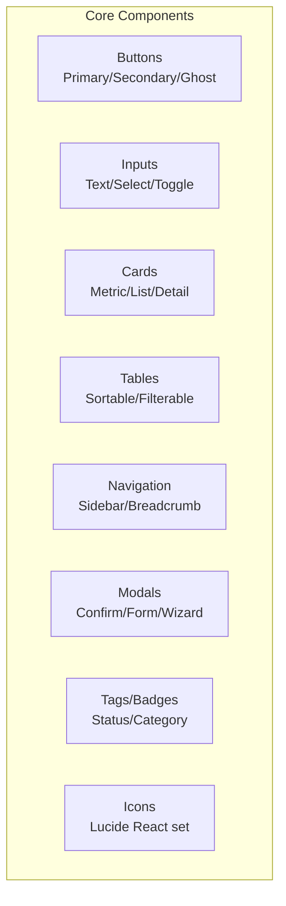

# Figma and Make.com Automation Prompts -- ERP-iPaaS
> Version: 1.0 | Last Updated: 2026-02-23 | Status: Draft
> Classification: Internal | Author: AIDD System

## 1. Overview

This document contains detailed Figma design prompts for 8 key screens of the ERP-iPaaS platform, plus Make.com automation prompts for integration workflows. Each prompt provides sufficient detail for a designer to produce high-fidelity mockups.

## 2. Design System Foundation

### 2.1 Brand Guidelines

| Element | Specification |
|---------|---------------|
| Primary color | #2563EB (Blue 600) |
| Secondary color | #7C3AED (Violet 600) |
| Success | #059669 (Emerald 600) |
| Warning | #D97706 (Amber 600) |
| Error | #DC2626 (Red 600) |
| Background | #F8FAFC (Slate 50) |
| Surface | #FFFFFF |
| Text primary | #0F172A (Slate 900) |
| Text secondary | #64748B (Slate 500) |
| Font family | Inter (headings), JetBrains Mono (code) |
| Border radius | 8px (cards), 6px (buttons), 4px (inputs) |
| Shadow | 0 1px 3px rgba(0,0,0,0.1) |

### 2.2 Component Library

---

## 3. Screen 1: Integration Studio (Visual Workflow Canvas)

### Figma Prompt

**Screen Name**: Integration Studio -- Visual Workflow Canvas

**Layout**: Full-screen canvas workspace with collapsible sidebar panels.

**Design the following elements**:

1. **Left Panel (260px width, collapsible)**:
   - Tab bar: "Triggers" | "Actions" | "Logic" | "Connectors"
   - Search input with icon
   - Scrollable list of draggable action cards, each showing: icon (24x24), action name, category tag
   - Categories: HTTP, Database, Email, Slack, CRM, Finance, Custom
   - Each card has a subtle grab handle icon

2. **Center Canvas (fluid width)**:
   - Light grid background (#F1F5F9, 20px grid)
   - Workflow nodes rendered as rounded rectangles (200x80px):
     - Trigger node: Green left border (#059669), icon + label
     - Action node: Blue left border (#2563EB), icon + label + status indicator
     - Condition node: Diamond shape, Yellow border (#D97706)
     - Loop node: Rounded rectangle with loop icon
   - Connection lines: Curved bezier paths with arrow heads, animated flow dots when running
   - Node selection: Blue glow outline (box-shadow: 0 0 0 3px rgba(37,99,235,0.3))
   - Mini-map in bottom-right corner (150x100px, semi-transparent)
   - Zoom controls: +/- buttons and zoom percentage badge
   - Canvas toolbar: Undo, Redo, Zoom to Fit, Grid toggle, Auto-layout

3. **Right Panel (320px width, collapsible)**:
   - Shows when a node is selected
   - Header: Node name (editable), node type badge
   - Configuration form: Dynamic fields based on node type
   - Input mapping section: Source field picker (dropdown from previous steps)
   - Output preview: JSON viewer with syntax highlighting
   - Test button: "Test this step" with loading state
   - Delete button (red, requires confirmation)

4. **Top Bar (64px height)**:
   - Workflow name (editable inline)
   - Status badge: Draft (gray) / Active (green) / Paused (yellow)
   - Version indicator: "v1.2.0"
   - Buttons: "Test Workflow" (secondary), "Save" (primary), "Activate" (success)
   - User avatar + tenant picker dropdown
   - Breadcrumb: Workflows > My Workflow Name

5. **Bottom Panel (expandable, 200px)**:
   - Execution log: Real-time step execution status
   - Each row: Step name, status icon, duration, timestamp
   - Expandable rows showing input/output JSON
   - Filter: All / Running / Completed / Failed

**Interactions**:
- Drag from palette to canvas to add nodes
- Click and drag between node connection points to create edges
- Double-click node to open configuration panel
- Right-click for context menu (copy, paste, delete, duplicate)
- Cmd+Z for undo, Cmd+Shift+Z for redo

**States to design**: Empty canvas, Canvas with 5-node workflow, Node selected, Test execution running, Test execution completed with error.

---

## 4. Screen 2: Connector Marketplace

### Figma Prompt

**Screen Name**: Connector Marketplace

**Layout**: Two-column layout with filter sidebar and main grid.

**Design the following elements**:

1. **Header Section**:
   - Title: "Connector Marketplace" with subtitle: "Browse, install, and manage connectors"
   - Search bar (full width, prominent, with filter icon)
   - Stats bar: "127 connectors | 24 categories | 15 verified"

2. **Left Sidebar (240px)**:
   - Category filter (checkboxes): CRM, Finance, Communication, Data, DevOps, Marketing, HR, Custom
   - Status filter: All, Published, Draft, Deprecated
   - Rating filter: Star rating selector (1-5)
   - Badge filter: Verified, Enterprise, Community
   - "Clear All Filters" link

3. **Main Grid (fluid)**:
   - Card grid: 3 columns on desktop, 2 on tablet, 1 on mobile
   - Each connector card (280x200px):
     - Connector icon (48x48) in top-left
     - Connector name (bold, 16px)
     - Author name (gray, 14px)
     - Short description (2 lines, 14px)
     - Category tags (small pills)
     - Star rating with count (e.g., 4.5 with 23 reviews)
     - Quality score badge (e.g., "87/100" in blue pill)
     - Version number (e.g., "v1.2.0")
     - "Install" button (primary) or "Installed" badge (green)
     - Verified badge (shield icon) if applicable

4. **Connector Detail Modal**:
   - Full connector information
   - Tabs: Overview | Documentation | Actions | Triggers | Reviews | Versions
   - Overview: Description, author, category, SLO metrics
   - Actions list: Each action with name, description, schema preview
   - Version history timeline
   - "Install" CTA button

**States**: Empty search results, Loading skeleton, Card hover state, Installed state.

---

## 5. Screen 3: API Management Console

### Figma Prompt

**Screen Name**: API Management Console

**Layout**: Dashboard with metric cards, endpoint table, and detail drawer.

**Design the following elements**:

1. **Metric Cards (4 across top)**:
   - Total Requests (24h): Large number + sparkline chart
   - Average Latency: Number + p50/p95/p99 breakdown
   - Error Rate: Percentage with red/green indicator
   - Active API Keys: Count with trend arrow

2. **Endpoint Table**:
   - Columns: Endpoint | Method | Requests (24h) | Avg Latency | Error Rate | Rate Limit | Status
   - Method badges: GET (green), POST (blue), PATCH (yellow), DELETE (red)
   - Inline sparkline charts for request volume
   - Sortable columns
   - Row click opens detail drawer

3. **API Key Management Panel**:
   - Table: Key Name | Created | Last Used | Scopes | Status | Actions
   - "Generate New Key" button
   - Key creation modal with scope checkboxes
   - Rotate and revoke actions with confirmation

4. **Rate Limit Configuration**:
   - Per-tenant rate limit settings
   - Visual slider for requests per second/minute/hour
   - Burst allowance input
   - Apply button

**Charts**: Use area charts for request volume, bar charts for latency distribution, donut chart for endpoint breakdown.

---

## 6. Screen 4: Event Stream Monitor

### Figma Prompt

**Screen Name**: Event Stream Monitor

**Layout**: Real-time dashboard with topic list, event stream, and DLQ panel.

**Design the following elements**:

1. **Topic Overview (top section)**:
   - Card grid showing topic health:
     - Topic name
     - Messages/sec (real-time counter)
     - Consumer lag indicator (green/yellow/red)
     - Partition count
     - Schema version

2. **Live Event Stream (center)**:
   - Real-time scrolling list of events
   - Each event row: Timestamp | Topic | Event Type | Size | Status
   - Color-coded by event type
   - Click to expand: Full CloudEvents envelope + payload JSON viewer
   - Pause/Resume button for stream
   - Filter by topic, event type, time range

3. **Dead Letter Queue Panel (bottom)**:
   - Table: Event ID | Original Topic | Failure Reason | Retry Count | Timestamp
   - "Replay" button per event
   - "Replay All" bulk action
   - Failure reason tooltip with full error message

4. **Schema Registry Tab**:
   - List of schemas: Name | Type (Avro/Protobuf) | Version | Last Updated
   - Schema detail view: JSON/Avro definition with syntax highlighting
   - Version diff viewer

---

## 7. Screen 5: ETL Pipeline Builder

### Figma Prompt

**Screen Name**: ETL Pipeline Builder

**Layout**: Three-panel horizontal layout: Source > Transform > Target.

**Design the following elements**:

1. **Source Panel (left, 300px)**:
   - Source type selector: Database | API | File | SaaS
   - Connection configuration form
   - For databases: Connection string, table selector, query builder
   - Preview: Sample data table (first 5 rows)
   - "Test Connection" button

2. **Transform Panel (center, fluid)**:
   - Visual transformation pipeline (vertical stack of transform cards)
   - Each transform card: Type icon + description + configure button
   - Transform types: Map Fields, Filter Rows, Aggregate, Enrich, Deduplicate, Custom SQL
   - Drag to reorder transforms
   - "Add Transform" button between cards
   - Data preview at each stage

3. **Target Panel (right, 300px)**:
   - Target type selector: Database | API | File
   - Field mapping visualization: Source fields -> Target fields (lines connecting them)
   - Auto-map button
   - Conflict indicators

4. **Bottom Bar**:
   - Schedule configuration: Cron expression builder with human-readable preview
   - "Run Now" button
   - "Save Pipeline" button
   - Execution history link

---

## 8. Screen 6: Webhook Debugger

### Figma Prompt

**Screen Name**: Webhook Debugger

**Layout**: Split-panel layout with webhook list and request/response inspector.

**Design the following elements**:

1. **Webhook List (left, 320px)**:
   - List of registered webhooks
   - Each item: Name, URL (truncated), status indicator (green/red), last triggered
   - "New Webhook" button
   - Filter: Active / Inactive / All

2. **Request Inspector (right, fluid)**:
   - Tabs: Recent Deliveries | Test | Configuration
   - **Recent Deliveries tab**:
     - Timeline of deliveries with status icons
     - Each delivery expandable to show:
       - Request: Method, URL, Headers, Body (JSON viewer)
       - Response: Status code, Headers, Body
       - Timing: Duration, retry attempts
       - Signature verification result
   - **Test tab**:
     - Payload editor (JSON with syntax highlighting)
     - "Send Test" button
     - Response viewer
   - **Configuration tab**:
     - Signing secret (masked, copy button)
     - Algorithm display
     - Verification example code snippet
     - Retry policy settings

---

## 9. Screen 7: Developer Portal

### Figma Prompt

**Screen Name**: Developer Portal

**Layout**: Documentation-style layout with sidebar navigation and main content area.

**Design the following elements**:

1. **Top Navigation**:
   - Logo + "Developer Portal"
   - Search bar (global documentation search)
   - Links: Docs | API Reference | SDKs | Changelog
   - User menu / Sign In button

2. **Hero Section**:
   - Title: "Build integrations with ERP-iPaaS"
   - Subtitle: "SDKs, APIs, and tools to connect your systems"
   - Quick start buttons: "TypeScript SDK" | "Go SDK" | "REST API" | "Connectors"
   - Code snippet preview (TypeScript client initialization)

3. **Getting Started Cards (3 columns)**:
   - Card 1: "Quick Start" -- 5-minute guide
   - Card 2: "Build a Connector" -- Step-by-step tutorial
   - Card 3: "API Reference" -- Full endpoint documentation

4. **Sidebar Navigation (240px)**:
   - Collapsible sections:
     - Getting Started
     - Authentication (OAuth2, API Keys)
     - SDKs (TypeScript, Go, Python)
     - API Reference (Connectors, Triggers, Actions, Secrets, Webhooks, Schemas, Events)
     - Guides (Build a Connector, Create a Workflow, Event Streaming)
     - Changelog

5. **Content Area**:
   - Markdown-rendered documentation
   - Code samples with language tabs (TypeScript / Go / cURL)
   - Interactive API explorer (try-it panel)
   - Response examples

---

## 10. Screen 8: SDK Documentation Site

### Figma Prompt

**Screen Name**: SDK Documentation Site

**Layout**: Two-column layout with method navigation and code documentation.

**Design the following elements**:

1. **Left Navigation (280px)**:
   - SDK version selector dropdown
   - Module list:
     - Client
     - Connectors
     - Triggers
     - Actions
     - Secrets
     - Webhooks
     - Schemas
     - Events
   - Each module expands to show methods

2. **Main Content**:
   - Method documentation:
     - Method signature (monospace, syntax highlighted)
     - Description paragraph
     - Parameters table: Name | Type | Required | Description
     - Return type
     - Code example (multi-language tabs)
     - Error handling notes
   - Type definitions section
   - Changelog per version

3. **Right Sidebar (200px)**:
   - On this page navigation (auto-generated from headings)
   - "Edit on GitHub" link
   - Last updated timestamp

---

## 11. Make.com Automation Prompts

### 11.1 Workflow: Documentation Auto-Update

**Trigger**: GitHub webhook on PR merge to main branch
**Actions**:
1. Fetch changed files from GitHub API
2. Filter for `docs/` directory changes
3. Parse Markdown to extract section titles
4. Update documentation index in portal
5. Send Slack notification: "Documentation updated: {file_list}"

### 11.2 Workflow: Connector Validation Alert

**Trigger**: Webhook from connector validation pipeline
**Actions**:
1. Parse validation result JSON
2. If status = "failed": Send Slack alert to #connectors channel
3. Create GitHub issue with failure details
4. Update ClickHouse connector_validation_queue status

### 11.3 Workflow: Tenant Onboarding Automation

**Trigger**: New tenant creation event from Keycloak webhook
**Actions**:
1. Create Kubernetes namespace via K8s API
2. Apply Helm chart with tenant defaults
3. Seed workflow templates
4. Send welcome email to tenant admin
5. Log onboarding event to ClickHouse audit table
