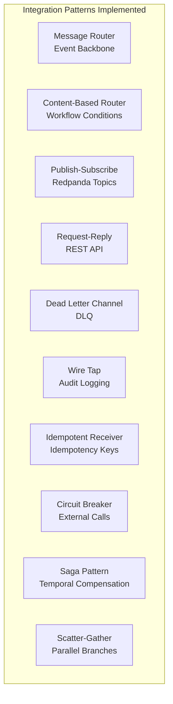
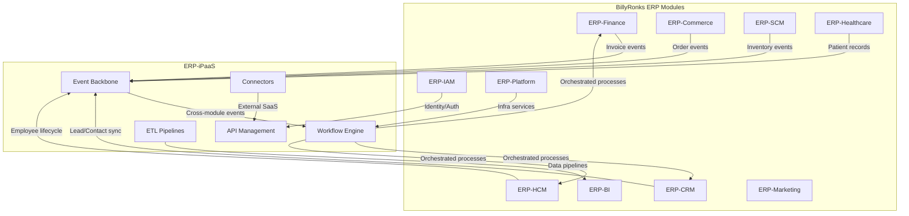
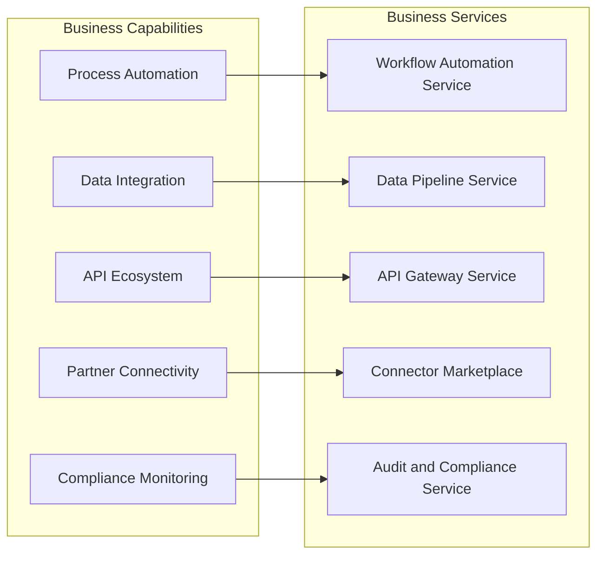
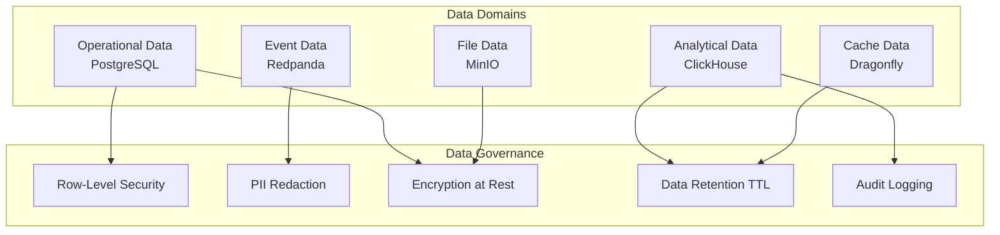
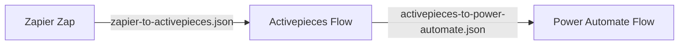
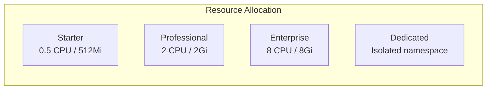

# Enterprise Architecture -- ERP-iPaaS
> Version: 1.0 | Last Updated: 2026-02-23 | Status: Draft
> Classification: Internal | Author: AIDD System

## 1. Enterprise Context

ERP-iPaaS operates as the integration backbone within the BillyRonks enterprise ecosystem, connecting 15+ ERP modules and serving as the central nervous system for cross-module data flow, event propagation, and process automation.

## 2. Enterprise Integration Patterns

### 2.1 Pattern Catalog

### 2.2 Module Integration Map

### 2.3 Integration Styles by Module

| Source Module | Target Module | Pattern | Protocol | Trigger |
|--------------|--------------|---------|----------|---------|
| CRM | Finance | Event-driven | Kafka | New deal closed |
| HCM | Finance | Workflow | Temporal | Payroll cycle |
| Commerce | SCM | Event-driven | Kafka | Order placed |
| Commerce | Finance | Workflow | Activepieces | Invoice generation |
| CRM | Marketing | Event-driven | Kafka | Lead stage change |
| Healthcare | BI | ETL | Batch + CDC | Daily/real-time |
| IAM | All modules | Request-reply | REST/OAuth2 | Authentication |
| Finance | BI | ETL | Batch | End of day |

## 3. TOGAF Alignment

### 3.1 Business Architecture

### 3.2 Application Architecture

| Application Component | Technology | Business Service |
|----------------------|-----------|-----------------|
| Activepieces | Low-code platform | Workflow Automation |
| Temporal | Durable workflow engine | Workflow Automation |
| Redpanda | Event streaming | Data Integration |
| Traefik | API gateway | API Gateway |
| ClickHouse | Analytics database | Audit and Compliance |
| Connector CLI | Developer tool | Connector Marketplace |

### 3.3 Technology Architecture

| Layer | Technology | Standard |
|-------|-----------|----------|
| Compute | Kubernetes 1.28+ | CNCF |
| Networking | Traefik + Calico CNI | Service mesh ready |
| Identity | Keycloak (OIDC/OAuth2) | OpenID Connect |
| Messaging | Redpanda (Kafka protocol) | Apache Kafka 3.5 |
| Storage | PostgreSQL + ClickHouse + MinIO | SQL + Columnar + S3 |
| Observability | Grafana + Prometheus + Loki + Tempo | OpenTelemetry |
| GitOps | ArgoCD + Helm + Kustomize | CNCF GitOps |
| IaC | Terraform | HashiCorp |

### 3.4 Data Architecture

## 4. Interoperability Strategy

### 4.1 Platform Interop Mappings

The platform provides bidirectional mapping templates for migrating workflows from competing platforms:

| Source Platform | Mapping Template | Location |
|----------------|-----------------|----------|
| Zapier | zapier-mapping.json | `templates/interop/` |
| Make (Integromat) | make-mapping.json | `templates/interop/` |
| Power Automate | power-automate-mapping.json | `templates/interop/` |
| Pabbly Connect | pabbly-mapping.json | `templates/interop/` |
| IFTTT | ifttt-mapping.json | `templates/interop/` |
| Integrately | integrately-mapping.json | `templates/interop/` |

### 4.2 Interop Recipes

Migration recipes in `connectors/interop/recipes/` provide automated conversion between platforms.

## 5. Governance Framework

### 5.1 Integration Governance Model

| Governance Area | Policy | Enforcement |
|----------------|--------|-------------|
| API versioning | Semantic versioning required | Gateway validation |
| Schema evolution | Backward-compatible changes only | Schema registry |
| Rate limiting | Per-tenant rate limits | Traefik middleware |
| Data classification | PII tagging on all fields | PII guard config |
| Change management | GitOps + PR review | ArgoCD sync |
| Security scanning | Container image scanning | CI/CD pipeline |
| Compliance | SOC2/GDPR/NDPR controls | OPA constraints |

### 5.2 Architecture Decision Records

Architecture decisions are tracked in `docs/ADR/`:

| ADR | Decision | Status |
|-----|----------|--------|
| ADR-001 | Language choice: Go for services, TypeScript for SDKs | Accepted |

## 6. Capacity Model

### 6.1 Tenant Sizing Tiers

| Tier | Workflows/day | Events/sec | API calls/min | Storage |
|------|--------------|-----------|--------------|---------|
| Starter | 1,000 | 100 | 60 | 1 GB |
| Professional | 100,000 | 5,000 | 600 | 50 GB |
| Enterprise | 1,000,000+ | 50,000+ | 6,000+ | 500 GB+ |
| Dedicated | Unlimited | Unlimited | Unlimited | Custom |

### 6.2 Resource Allocation per Tier

