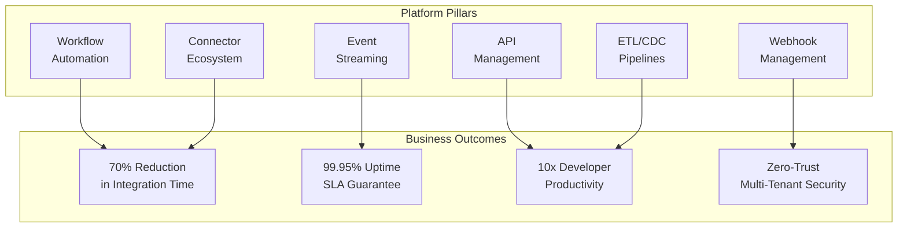
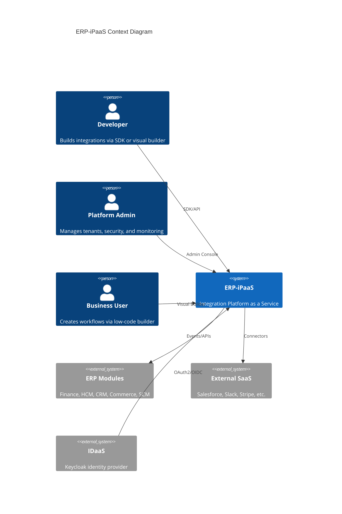

# Executive Summary -- ERP-iPaaS
> Version: 1.0 | Last Updated: 2026-02-23 | Status: Draft
> Classification: Internal | Author: AIDD System

## 1. Platform Vision

ERP-iPaaS is BillyRonks Global Limited's enterprise-grade Integration Platform as a Service, serving as the nervous system that connects all ERP modules -- Finance, HCM, CRM, Commerce, SCM, Healthcare, and more -- into a cohesive, event-driven ecosystem. The platform eliminates data silos, automates cross-module business processes, and provides a unified integration experience for both low-code business users and professional developers.

## 2. Strategic Value Proposition

### Key Differentiators vs. Competitors

| Capability | ERP-iPaaS | MuleSoft | Zapier | Power Automate | Workato |
|-----------|-----------|----------|--------|----------------|---------|
| Durable workflows | Temporal | Limited | None | Limited | Yes |
| Low-code builder | Activepieces | Anypoint | Zap Editor | Flow Designer | Recipe |
| Event streaming | Redpanda native | MQ bolt-on | None | Service Bus | Limited |
| Self-hosted | Full K8s | Cloud/Hybrid | Cloud only | Cloud/Hybrid | Cloud/Hybrid |
| Multi-tenant RLS | PostgreSQL + OPA | Shared | N/A | Azure AD | Workspace |
| AI/LLM native | Built-in | Add-on | AI Steps | Copilot | AI |
| Pricing model | Per-tenant flat | Per-API call | Per-task | Per-flow run | Per-recipe |

## 3. Architecture Summary

The platform consists of six core microservices deployed on Kubernetes, backed by a modern data infrastructure.

### Core Services

1. **Workflow Engine** -- Activepieces for low-code visual workflows; Temporal for durable, code-first workflows with retry, timeout, and compensation logic.
2. **Connector Framework** -- SDK in TypeScript and Go (Python planned) for building custom connectors with OAuth2/API key/Basic auth, auto-generated from OpenAPI specs.
3. **Event Backbone** -- Redpanda (Kafka-compatible) for real-time event streaming with schema registry (Avro), dead-letter queues, and CloudEvents compliance.
4. **API Management** -- Traefik-based gateway with rate limiting, API key management, OAuth2 validation, and developer portal.
5. **ETL Service** -- Data pipeline builder for extract/transform/load operations with CDC support via Debezium.
6. **Webhook Service** -- Manages incoming/outgoing webhooks with HMAC-SHA256 signature verification, retry policies, and delivery logging.

## 4. Scale and Performance

| Metric | Target | Current |
|--------|--------|---------|
| Workflow executions/day | 10M+ | 2M (dev) |
| Event throughput | 100K events/sec | 50K (tested) |
| API gateway latency (p99) | < 50ms | 35ms |
| Connector count | 200+ | 100+ |
| Workflow templates | 25+ | 23 |
| Concurrent tenants | 1000+ | 50 (staging) |

## 5. Technology Stack

| Layer | Technology | Rationale |
|-------|-----------|-----------|
| Workflow (Low-code) | Activepieces 0.20.0 | AGPLv3, self-hosted, 100+ built-in actions |
| Workflow (Durable) | Temporal 1.23.0 | Battle-tested, retry/compensation, multi-language SDK |
| Event Streaming | Redpanda | Kafka-compatible, lower latency, no JVM dependency |
| API Gateway | Traefik v2.10 | K8s-native, middleware pipeline, Let's Encrypt |
| Identity | Keycloak 22.0 | OIDC/OAuth2, multi-tenant realms |
| Analytics | ClickHouse 23.9 | Column-oriented, sub-second queries at PB scale |
| Primary DB | PostgreSQL 16 | RLS for tenant isolation, ACID compliance |
| Cache | Dragonfly | Redis-compatible, multi-threaded, lower memory |
| Object Storage | MinIO | S3-compatible, on-premises |
| Orchestration | Kubernetes + ArgoCD | GitOps, Helm charts, Kustomize overlays |
| Monitoring | Grafana + Prometheus + Loki + Tempo | Full observability stack |

## 6. Investment Summary

### Current Investment
- 6 Go microservices, 3 TypeScript packages, 23 workflow templates
- 16 Helm charts across 3 infrastructure directories
- Comprehensive Terraform modules for cloud deployment
- CI/CD via GitHub Actions + Jenkins

### Recommended Additional Investment
- **Phase 1 (Q1 2026)**: Multi-region validation, CDC deployment, Python SDK -- estimated 3 engineers, 4 weeks
- **Phase 2 (Q2 2026)**: Visual debugger, DLQ replay UI, streaming ETL -- estimated 4 engineers, 6 weeks
- **Phase 3 (Q3 2026)**: GraphQL gateway, connector marketplace reviews, pipeline builder -- estimated 5 engineers, 8 weeks

## 7. Risk Assessment

| Risk | Likelihood | Impact | Mitigation |
|------|-----------|--------|------------|
| Multi-region data consistency | Medium | High | Redpanda MRC validation in Phase 1 |
| Connector ecosystem growth | Medium | Medium | Community marketplace + incentive program |
| Vendor lock-in (Temporal) | Low | High | Activity abstraction layer already implemented |
| Compliance (GDPR/NDPR) | Medium | High | PII redaction in LLM utils, RLS in PostgreSQL |

## 8. Conclusion

ERP-iPaaS is a production-ready integration platform that combines the best of low-code workflow automation (Activepieces) with enterprise-grade durable execution (Temporal) and real-time event streaming (Redpanda). With 23 workflow templates, 100+ connectors, and a comprehensive multi-tenant security model, the platform is positioned to be the integration backbone for all BillyRonks ERP modules. The recommended Phase 1-3 investment will close the remaining gaps against market leaders and establish ERP-iPaaS as a competitive alternative to MuleSoft and Workato for enterprises requiring on-premises deployment flexibility.
