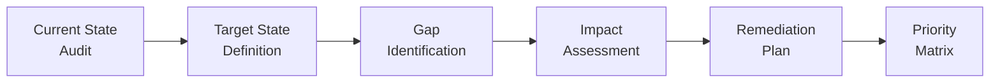
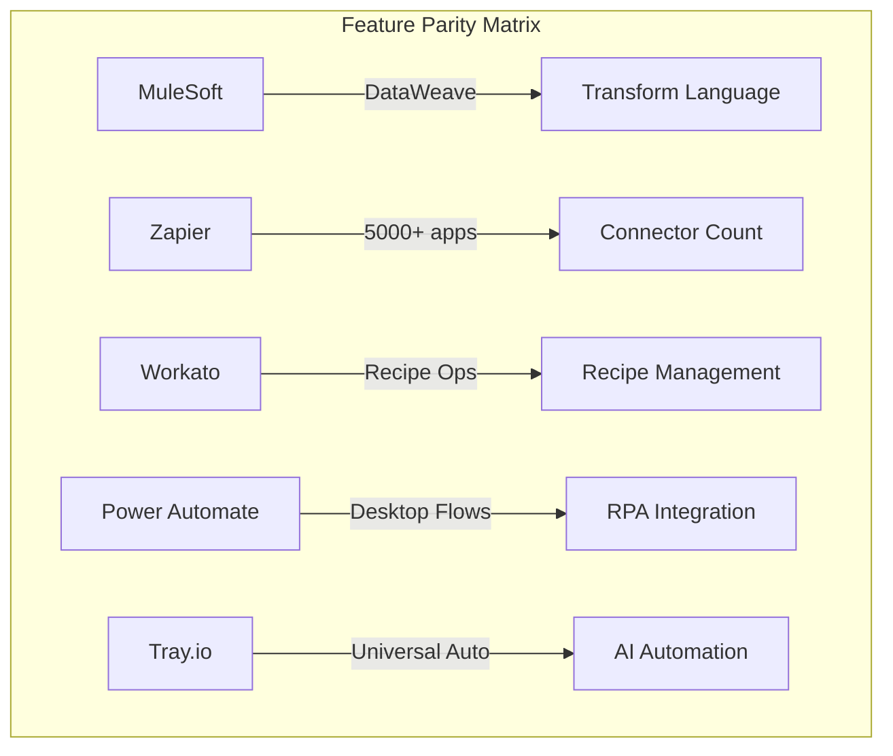

# Gap Analysis -- ERP-iPaaS
> Version: 1.0 | Last Updated: 2026-02-23 | Status: Draft
> Classification: Internal | Author: AIDD System

## 1. Purpose

This gap analysis evaluates the current state of the ERP-iPaaS module against the target state defined by enterprise iPaaS standards, competitive benchmarks (MuleSoft, Zapier, Power Automate, Workato, Tray.io), and the AIDD-28 documentation standard. It identifies functional, architectural, documentation, and operational gaps with prioritized remediation recommendations.

## 2. Methodology

The analysis followed a structured approach:
1. **Source audit** -- Full traversal of the `/ERP-iPaaS/` repository including services, packages, configs, templates, and existing docs.
2. **Target benchmarking** -- Features and capabilities from MuleSoft Anypoint, Zapier, Microsoft Power Automate, Workato, and Tray.io mapped to functional categories.
3. **Gap scoring** -- Each gap rated on Impact (1-5) and Effort (1-5) with a composite priority score.

## 3. Current State Summary

### 3.1 Services Inventory

| Service | Status | Maturity |
|---------|--------|----------|
| Workflow Engine (Activepieces + Temporal) | Operational | High |
| Connector Framework | Operational | Medium |
| Event Backbone (Redpanda) | Operational | High |
| API Management Service | Operational | Medium |
| ETL Service | Operational | Low-Medium |
| Webhook Service | Operational | Medium |
| Nexum Flow (Visual DAG engine) | Operational | Medium |
| MCP Host (AI Agent Gateway) | Operational | Low |

### 3.2 Infrastructure

- Kubernetes deployment via Helm + ArgoCD + Terraform
- ClickHouse for analytics (7 tables, 1 materialized view)
- PostgreSQL with RLS for tenant isolation
- Redpanda/Kafka for event streaming
- Traefik as API gateway
- Grafana/Prometheus/Loki/Tempo for observability
- MinIO for object storage
- Keycloak for identity

### 3.3 Templates and Workflows

- 16 Activepieces workflow templates
- 7 Temporal durable workflow templates
- 6 interop mapping templates (Zapier, Make, Power Automate, Pabbly, IFTTT, Integrately)

## 4. Functional Gaps

### 4.1 Workflow Engine

| Gap ID | Gap Description | Impact | Effort | Priority |
|--------|----------------|--------|--------|----------|
| WE-01 | No visual debugger for step-through execution | 4 | 3 | High |
| WE-02 | Sub-workflow invocation limited to Temporal; Activepieces lacks native sub-flows | 3 | 4 | Medium |
| WE-03 | Parallel branch execution in Activepieces limited to fan-out pattern only | 3 | 3 | Medium |
| WE-04 | No built-in A/B testing for workflow variants | 2 | 3 | Low |
| WE-05 | Version rollback requires manual re-import | 3 | 2 | High |

### 4.2 Connector Framework

| Gap ID | Gap Description | Impact | Effort | Priority |
|--------|----------------|--------|--------|----------|
| CF-01 | Python SDK for custom connectors not yet published | 4 | 2 | High |
| CF-02 | Connector marketplace lacks review/approval workflow | 3 | 3 | Medium |
| CF-03 | Auto-generated OpenAPI-to-connector only supports REST; no GraphQL or gRPC | 3 | 4 | Medium |
| CF-04 | No connector health dashboard aggregating latency from ClickHouse | 3 | 2 | High |
| CF-05 | Rate limit policies per connector lack dynamic adjustment | 2 | 3 | Low |

### 4.3 Event Backbone

| Gap ID | Gap Description | Impact | Effort | Priority |
|--------|----------------|--------|--------|----------|
| EB-01 | Schema registry supports Avro only; Protobuf schemas referenced but not enforced | 4 | 3 | High |
| EB-02 | DLQ replay UI not implemented; replay requires CLI commands | 3 | 2 | High |
| EB-03 | Multi-region Redpanda replication configured but not validated in prod | 4 | 4 | Critical |
| EB-04 | CloudEvents spec compliance partial -- missing `datacontenttype` and `subject` | 2 | 1 | Medium |
| EB-05 | Event filtering rules limited to exact match; no regex or CEL support | 3 | 3 | Medium |

### 4.4 API Management

| Gap ID | Gap Description | Impact | Effort | Priority |
|--------|----------------|--------|--------|----------|
| AM-01 | Developer portal scaffold exists but lacks interactive API explorer | 4 | 3 | High |
| AM-02 | API versioning strategy documented but not enforced at gateway level | 3 | 2 | High |
| AM-03 | No GraphQL gateway; REST-only exposure | 3 | 4 | Medium |
| AM-04 | Analytics pipeline from Traefik to ClickHouse requires manual SQL queries | 3 | 2 | Medium |
| AM-05 | API key rotation automation not implemented | 4 | 2 | High |

### 4.5 ETL Service

| Gap ID | Gap Description | Impact | Effort | Priority |
|--------|----------------|--------|--------|----------|
| ETL-01 | CDC via Debezium referenced but not deployed; service is stub only | 5 | 4 | Critical |
| ETL-02 | No visual pipeline builder UI | 4 | 5 | High |
| ETL-03 | Data quality validation rules not implemented | 3 | 3 | Medium |
| ETL-04 | No data lineage tracking across pipeline stages | 3 | 3 | Medium |
| ETL-05 | Streaming mode not implemented; batch only via Go service | 4 | 4 | High |

### 4.6 Webhook Management

| Gap ID | Gap Description | Impact | Effort | Priority |
|--------|----------------|--------|--------|----------|
| WH-01 | Webhook signature verification supports HMAC-SHA256 only; no Ed25519 | 2 | 2 | Low |
| WH-02 | No webhook testing sandbox for external developers | 3 | 2 | High |
| WH-03 | Outbound webhook retry policy hardcoded; not configurable per endpoint | 3 | 2 | Medium |
| WH-04 | Webhook payload transformation rules not exposed in API | 2 | 2 | Low |

## 5. Competitive Benchmark Gaps

| Capability | MuleSoft | Zapier | Power Automate | Workato | Tray.io | ERP-iPaaS | Gap |
|-----------|----------|--------|----------------|---------|---------|-----------|-----|
| Visual workflow builder | Yes | Yes | Yes | Yes | Yes | Yes (Activepieces) | None |
| Durable workflows | Limited | No | Limited | Yes | Yes | Yes (Temporal) | None |
| Pre-built connectors | 1500+ | 5000+ | 1000+ | 1000+ | 600+ | 100+ (growing) | Connector count |
| Custom connector SDK | Yes | Yes | Yes | Yes | Yes | Yes (TS/Go) | Python SDK pending |
| Event streaming | MQ only | No | Service Bus | Yes | Limited | Yes (Redpanda) | None |
| CDC | Via Anypoint | No | No | Yes | Limited | Planned (Debezium) | Not deployed |
| AI/LLM integration | Limited | AI steps | Copilot | AI | AI | Yes (LLM utils) | None |
| RPA | No | No | Yes | Limited | No | No | Major gap |
| Multi-tenant | Yes | No | Yes | Yes | Yes | Yes (RLS + namespaces) | None |
| On-premises | Yes | No | Hybrid | Hybrid | No | Yes (K8s) | None |

## 6. Documentation Gaps

| Doc ID | Required Document | Status | Notes |
|--------|------------------|--------|-------|
| DOC-01 | executive-summary.md | Exists in docs/ but needs consolidation | Merge with exec_summary |
| DOC-02 | security.md | Exists but incomplete threat matrix | Needs STRIDE analysis |
| DOC-03 | data-flows.md | Exists but lacks Mermaid diagrams | Needs visual overhaul |
| DOC-04 | Figma prompts | Not present in standard location | Create for 8 screens |
| DOC-05 | API reference | Exists but not generated from OpenAPI | Auto-generate from spec |

## 7. Remediation Roadmap

### Phase 1: Critical (Weeks 1-4)
- EB-03: Validate multi-region Redpanda replication
- ETL-01: Deploy Debezium CDC alongside ETL service
- AM-05: Implement API key rotation automation

### Phase 2: High Priority (Weeks 5-10)
- CF-01: Publish Python connector SDK
- WE-01: Build visual step-through debugger
- EB-01: Enforce Protobuf schema validation
- EB-02: Build DLQ replay UI
- ETL-05: Implement streaming ETL mode

### Phase 3: Medium Priority (Weeks 11-16)
- CF-03: Add GraphQL/gRPC connector auto-generation
- EB-05: Implement CEL-based event filtering
- AM-01: Build interactive API explorer in developer portal
- ETL-02: Design visual pipeline builder

### Phase 4: Low Priority (Weeks 17+)
- WE-04: A/B testing for workflow variants
- WH-01: Ed25519 webhook signatures
- Research RPA integration strategy

## 8. Summary Metrics

| Category | Total Gaps | Critical | High | Medium | Low |
|----------|-----------|----------|------|--------|-----|
| Workflow Engine | 5 | 0 | 2 | 2 | 1 |
| Connector Framework | 5 | 0 | 2 | 2 | 1 |
| Event Backbone | 5 | 1 | 2 | 2 | 0 |
| API Management | 5 | 0 | 3 | 2 | 0 |
| ETL Service | 5 | 1 | 2 | 2 | 0 |
| Webhook Management | 4 | 0 | 1 | 1 | 2 |
| **Total** | **29** | **2** | **12** | **11** | **4** |
