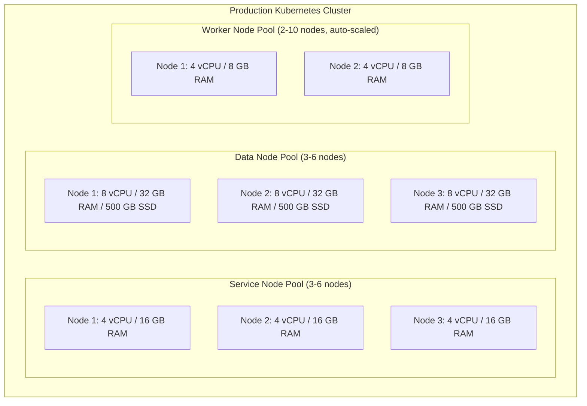
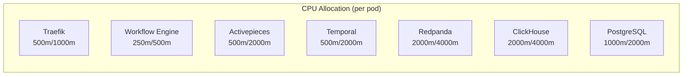
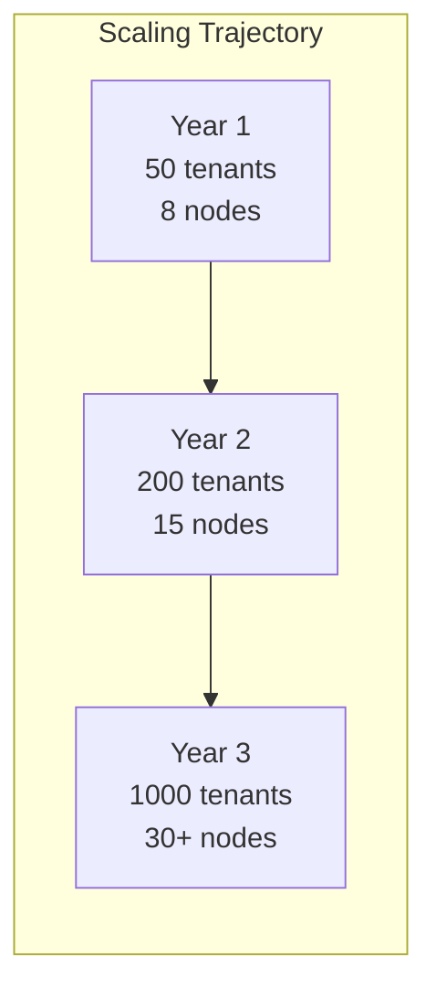

# Hardware Requirements -- ERP-iPaaS
> Version: 1.0 | Last Updated: 2026-02-23 | Status: Draft
> Classification: Internal | Author: AIDD System

## 1. Overview

This document specifies the hardware and infrastructure requirements for deploying ERP-iPaaS across development, staging, and production environments. All deployments target Kubernetes clusters with specific node pool configurations optimized for each workload type.

## 2. Environment Specifications

### 2.1 Production Environment

#### Service Node Pool

| Specification | Minimum | Recommended |
|--------------|---------|-------------|
| Node count | 3 | 6 |
| vCPU per node | 4 | 8 |
| RAM per node | 16 GB | 32 GB |
| Disk per node | 100 GB SSD | 200 GB SSD |
| Network | 1 Gbps | 10 Gbps |

#### Data Node Pool

| Specification | Minimum | Recommended |
|--------------|---------|-------------|
| Node count | 3 | 6 |
| vCPU per node | 8 | 16 |
| RAM per node | 32 GB | 64 GB |
| Disk per node | 500 GB NVMe SSD | 1 TB NVMe SSD |
| IOPS | 10,000 | 50,000 |
| Network | 10 Gbps | 25 Gbps |

#### Worker Node Pool (Auto-Scaled)

| Specification | Minimum | Maximum |
|--------------|---------|---------|
| Node count | 2 | 10 |
| vCPU per node | 4 | 4 |
| RAM per node | 8 GB | 8 GB |
| Disk per node | 50 GB SSD | 50 GB SSD |

### 2.2 Staging Environment

| Node Pool | Nodes | vCPU | RAM | Disk |
|-----------|-------|------|-----|------|
| Service | 2 | 2 | 8 GB | 50 GB SSD |
| Data | 2 | 4 | 16 GB | 200 GB SSD |
| Worker | 1-3 | 2 | 4 GB | 30 GB SSD |

### 2.3 Development Environment (Docker Compose)

| Resource | Minimum | Recommended |
|----------|---------|-------------|
| CPU cores | 4 | 8 |
| RAM | 16 GB | 32 GB |
| Disk | 50 GB free | 100 GB free |
| Docker memory limit | 12 GB | 24 GB |

## 3. Component Resource Allocation

### 3.1 Production Pod Resource Requests/Limits

| Component | CPU Request | CPU Limit | Memory Request | Memory Limit | Replicas |
|-----------|-----------|-----------|---------------|-------------|----------|
| Traefik | 500m | 1000m | 256 Mi | 512 Mi | 2-4 |
| Workflow Engine | 250m | 500m | 128 Mi | 256 Mi | 2-4 |
| Connector Framework | 250m | 500m | 128 Mi | 256 Mi | 2-3 |
| Event Backbone | 250m | 500m | 128 Mi | 256 Mi | 2-3 |
| API Management | 250m | 500m | 128 Mi | 256 Mi | 2-3 |
| ETL Service | 250m | 500m | 128 Mi | 256 Mi | 2-3 |
| Webhook Service | 250m | 500m | 128 Mi | 256 Mi | 2-3 |
| Activepieces Controller | 500m | 2000m | 512 Mi | 2 Gi | 1 |
| Activepieces Workers | 500m | 2000m | 512 Mi | 2 Gi | 2-10 (KEDA) |
| Temporal Frontend | 500m | 1000m | 256 Mi | 1 Gi | 2 |
| Temporal History | 500m | 2000m | 512 Mi | 2 Gi | 2 |
| Temporal Matching | 500m | 1000m | 256 Mi | 1 Gi | 2 |
| Temporal Workers | 500m | 2000m | 512 Mi | 2 Gi | 2-10 (KEDA) |
| PostgreSQL | 1000m | 2000m | 2 Gi | 4 Gi | 2 (primary+replica) |
| ClickHouse | 2000m | 4000m | 4 Gi | 8 Gi | 3 |
| Redpanda | 2000m | 4000m | 4 Gi | 8 Gi | 3 |
| Dragonfly | 500m | 1000m | 1 Gi | 2 Gi | 1 |
| MinIO | 500m | 1000m | 1 Gi | 2 Gi | 4 |
| Grafana | 250m | 500m | 256 Mi | 512 Mi | 1 |
| Prometheus | 500m | 1000m | 2 Gi | 4 Gi | 1 |
| Loki | 500m | 1000m | 1 Gi | 2 Gi | 1 |
| Tempo | 500m | 1000m | 1 Gi | 2 Gi | 1 |
| Sentry | 500m | 1000m | 1 Gi | 2 Gi | 1 |
| Keycloak | 500m | 1000m | 512 Mi | 1 Gi | 2 |

### 3.2 Storage Requirements

| Component | Storage Type | Size (Prod) | IOPS |
|-----------|-------------|-------------|------|
| PostgreSQL | Persistent Volume (SSD) | 100 GB | 10,000 |
| ClickHouse | Persistent Volume (NVMe) | 500 GB | 50,000 |
| Redpanda | Persistent Volume (NVMe) | 200 GB | 50,000 |
| MinIO | Persistent Volume (HDD/SSD) | 1 TB | 5,000 |
| Loki | Persistent Volume (SSD) | 100 GB | 5,000 |
| Tempo | Persistent Volume (SSD) | 50 GB | 5,000 |

## 4. Network Requirements

| Requirement | Specification |
|------------|---------------|
| Internal bandwidth | 10 Gbps minimum between node pools |
| External bandwidth | 1 Gbps dedicated for API traffic |
| Load balancer | L4/L7 with TLS termination |
| DNS | Internal cluster DNS (CoreDNS) |
| Ingress | Traefik IngressController |
| Network policies | Calico or Cilium CNI |

## 5. Total Resource Summary

### 5.1 Production Total

| Resource | Minimum | Recommended |
|----------|---------|-------------|
| Total vCPU | 56 | 112 |
| Total RAM | 160 GB | 320 GB |
| Total Storage | 1.5 TB | 3 TB |
| Total Nodes | 8 | 22 |

### 5.2 Scaling Projections

## 6. Cloud Provider Equivalents

| Component | AWS | Azure | GCP |
|-----------|-----|-------|-----|
| Service nodes | m6i.xlarge | D4s_v5 | e2-standard-4 |
| Data nodes | i3.2xlarge | L8s_v3 | n2-highmem-8 |
| Worker nodes | m6i.xlarge | D4s_v5 | e2-standard-4 |
| Block storage | gp3 | Premium SSD v2 | pd-ssd |
| Object storage | S3 | Blob Storage | GCS |
| Load balancer | ALB/NLB | Azure LB | Cloud LB |
