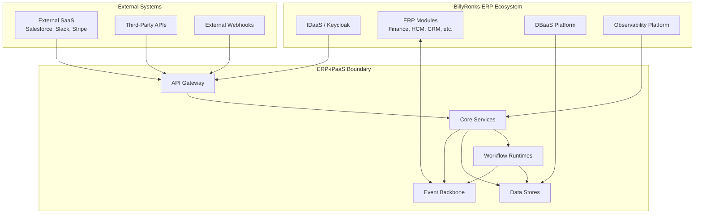
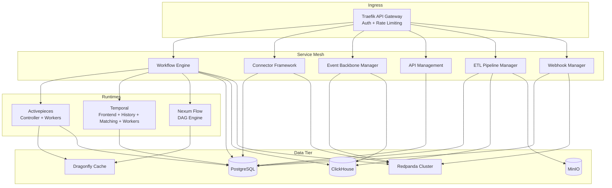
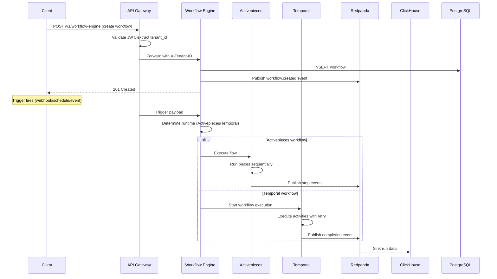
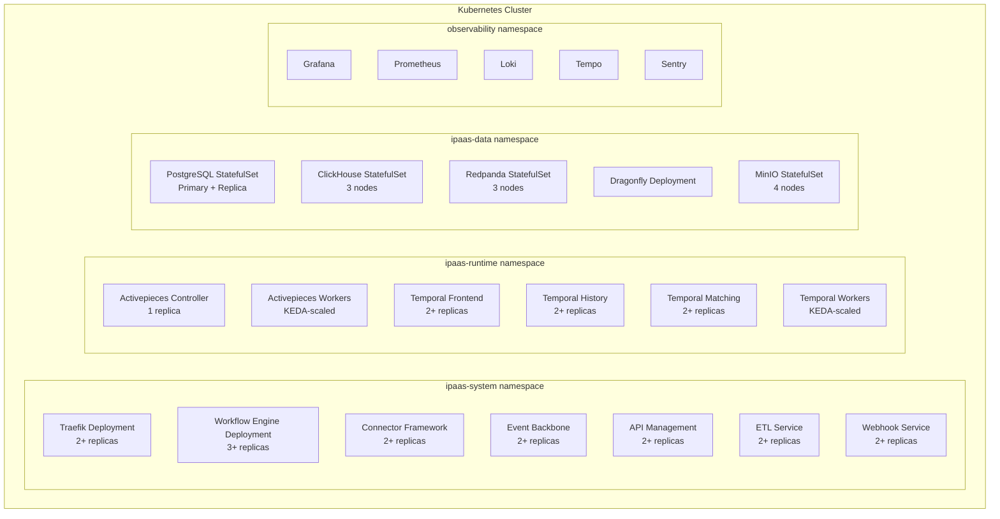
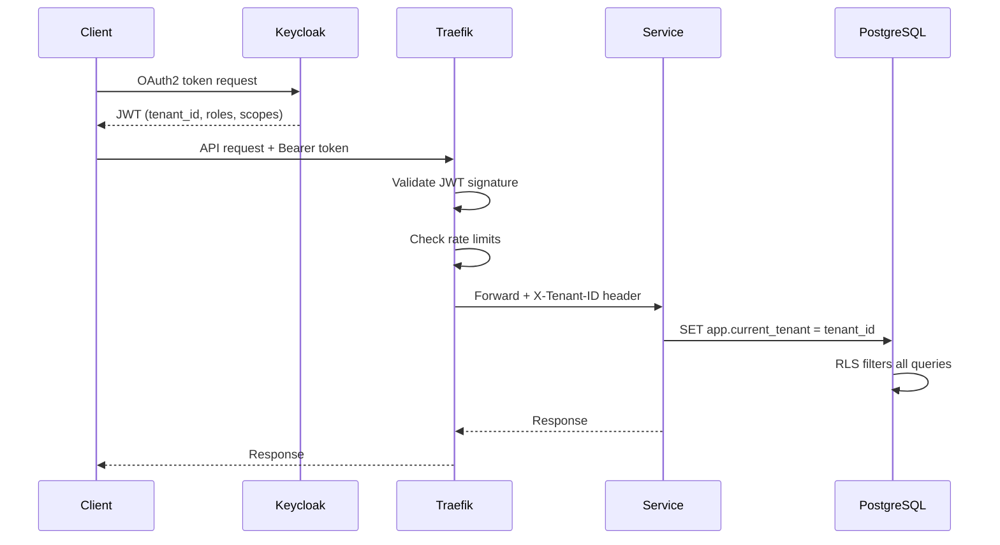
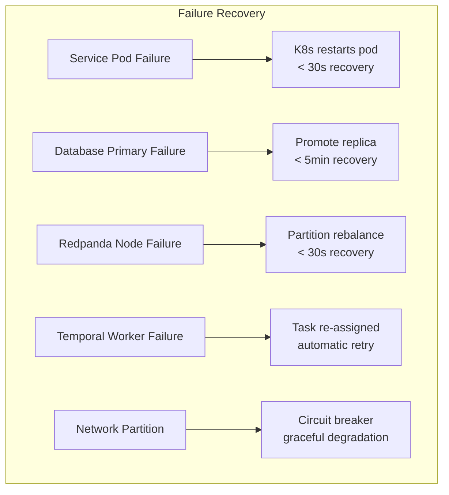

# High-Level Design -- ERP-iPaaS
> Version: 1.0 | Last Updated: 2026-02-23 | Status: Draft
> Classification: Internal | Author: AIDD System

## 1. Introduction

This High-Level Design (HLD) document describes the overall system design of ERP-iPaaS, covering system boundaries, major components, interaction patterns, data flow, and deployment topology at an abstraction level suitable for architecture review boards and technical leadership.

## 2. System Boundary



## 3. Major Components

### 3.1 Component Interaction Diagram



### 3.2 Component Responsibilities

| Component | Responsibility | Technology | Scaling Strategy |
|-----------|---------------|-----------|-----------------|
| API Gateway | Authentication, rate limiting, routing | Traefik v2.10 | HPA on CPU |
| Workflow Engine | Workflow CRUD, execution orchestration | Go service | KEDA on queue depth |
| Connector Framework | Connector lifecycle, marketplace | Go service | HPA on requests |
| Event Backbone Manager | Topic management, schema registry | Go service | HPA on requests |
| API Management | Key management, analytics | Go service | HPA on requests |
| ETL Pipeline Manager | Pipeline CRUD, execution | Go service | KEDA on pipeline queue |
| Webhook Manager | Registration, delivery, retry | Go service | KEDA on delivery queue |
| Activepieces | Visual builder, piece execution | Node.js | KEDA on task queue |
| Temporal | Durable workflow execution | Go + TypeScript | KEDA on task backlog |
| Nexum Flow | AI-augmented DAG execution | TypeScript | HPA on CPU |

## 4. High-Level Data Flow

### 4.1 Workflow Execution Flow



### 4.2 Event Propagation Flow

```mermaid
graph LR
    subgraph "Producers"
        P1[ERP Module]
        P2[Workflow]
        P3[Webhook]
    end

    subgraph "Redpanda"
        T[Topic<br/>tenant.{id}.{type}]
        SR[Schema Registry]
        DLQ[Dead Letter Queue]
    end

    subgraph "Consumers"
        C1[Workflow Trigger]
        C2[ClickHouse Sink]
        C3[Alert Evaluator]
        C4[Audit Logger]
    end

    P1 -->|"Produce"| SR
    SR -->|"Validate"| T
    P2 --> T
    P3 --> T

    T --> C1
    T --> C2
    T --> C3
    T --> C4

    T -.->|"Failed"| DLQ
```

## 5. Deployment Topology

### 5.1 Kubernetes Cluster Layout



### 5.2 Network Architecture

| Source | Destination | Protocol | Port | Purpose |
|--------|------------|----------|------|---------|
| External | Traefik | HTTPS | 443 | API ingress |
| Traefik | Services | HTTP | 8080 | Internal routing |
| Services | PostgreSQL | TCP | 5432 | Database |
| Services | Redpanda | TCP | 9092 | Event streaming |
| Services | ClickHouse | HTTP | 8123 | Analytics |
| Services | Dragonfly | TCP | 6379 | Cache |
| Services | MinIO | HTTP | 9000 | Object storage |
| Temporal | PostgreSQL | TCP | 5432 | Workflow state |
| Activepieces | Dragonfly | TCP | 6379 | Session cache |

## 6. Security Design

### 6.1 Authentication and Authorization Flow



### 6.2 Encryption Strategy

| Layer | Method | Key Management |
|-------|--------|---------------|
| Transit | TLS 1.3 (mTLS between services) | Cert-manager + Let's Encrypt |
| At rest (PostgreSQL) | AES-256 | Kubernetes secrets |
| At rest (MinIO) | SSE-S3 | MinIO KMS |
| At rest (Redpanda) | Disk encryption | Node-level encryption |
| Secrets | Vault/SOPS | HashiCorp Vault |

## 7. High Availability Design

### 7.1 HA Configuration

| Component | HA Strategy | Min Replicas | RPO | RTO |
|-----------|------------|-------------|-----|-----|
| Traefik | Multi-replica | 2 | 0 | < 30s |
| Core Services | Multi-replica | 2 | 0 | < 30s |
| PostgreSQL | Primary-replica | 2 | < 1min | < 5min |
| ClickHouse | 3-node cluster | 3 | < 5min | < 10min |
| Redpanda | 3-node cluster | 3 | 0 | < 30s |
| Temporal | Multi-replica per role | 2 | 0 | < 60s |

### 7.2 Failure Modes



## 8. Integration with Platform Services

| Platform Service | Integration Point | Protocol |
|-----------------|-------------------|----------|
| IDaaS (Keycloak) | JWT issuance and validation | OIDC/OAuth2 |
| DBaaS | PostgreSQL, ClickHouse provisioning | Terraform |
| Observability | Metrics, logs, traces | Prometheus, Loki, Tempo |
| Orchestration (ArgoCD) | GitOps deployment | Kubernetes API |
| Secret Management (Vault) | Secret injection | Vault Agent |
