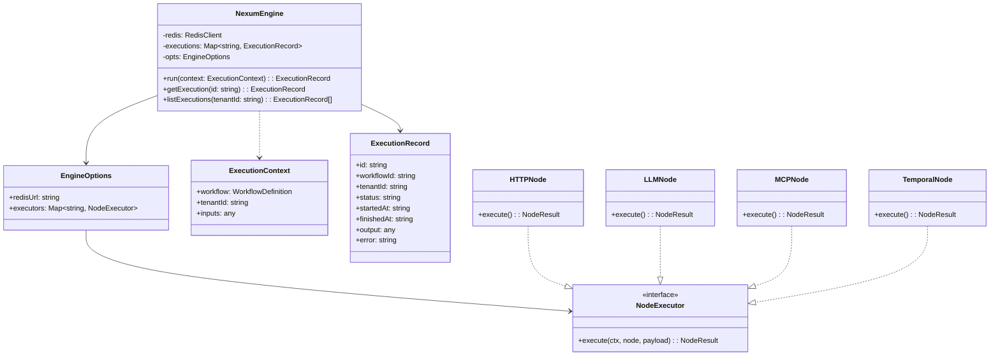
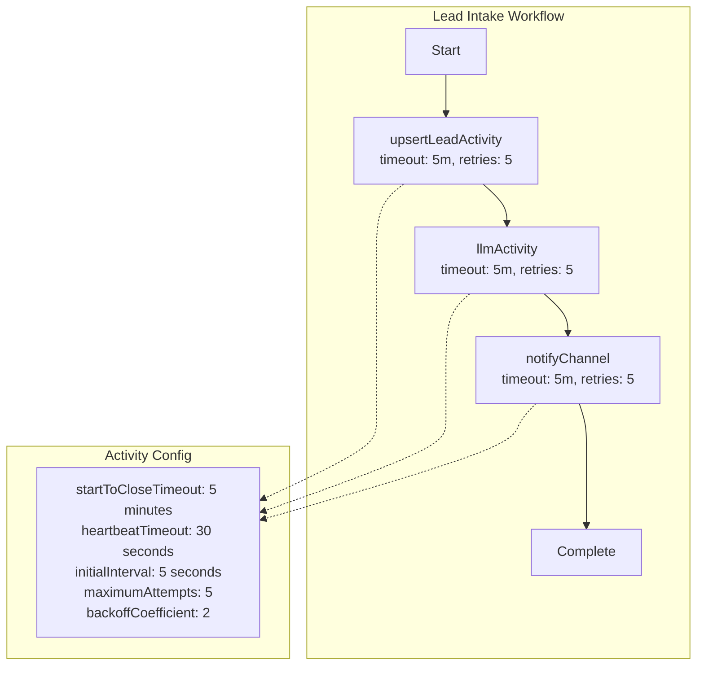
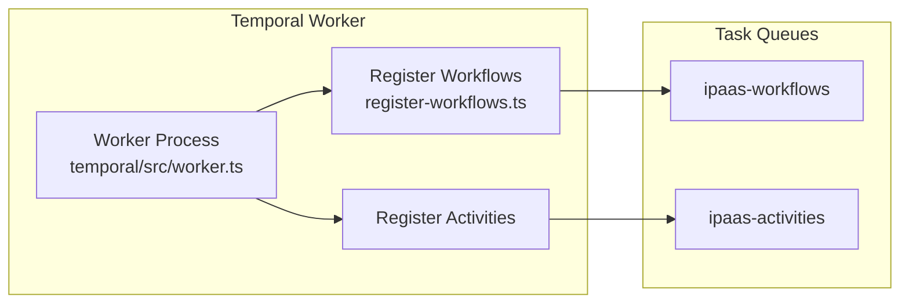
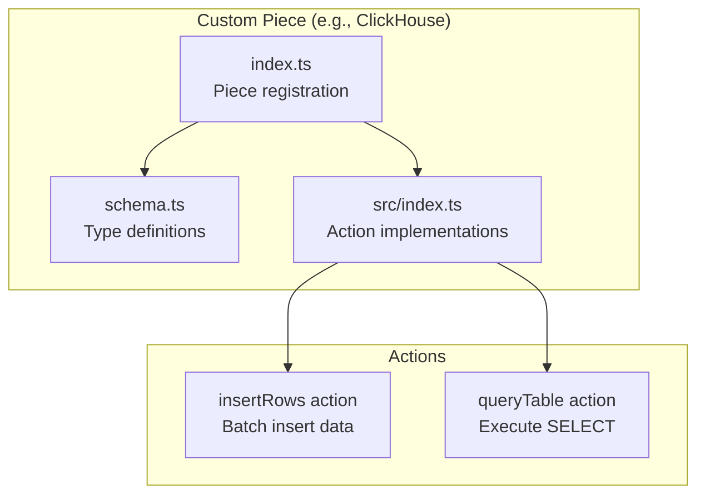
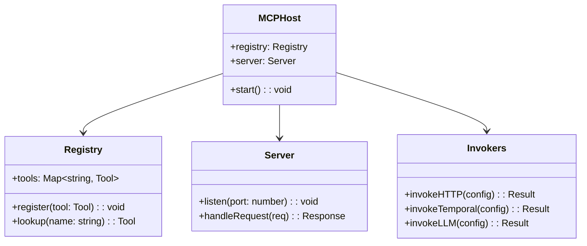
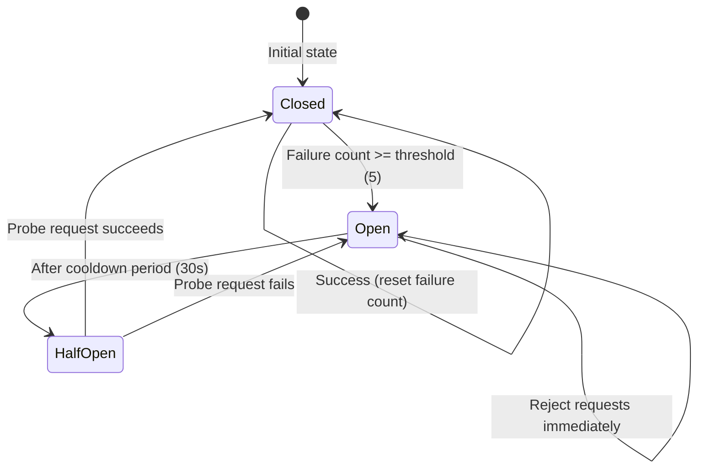
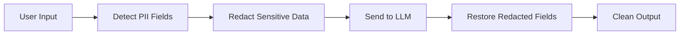

# Low-Level Design -- ERP-iPaaS
> Version: 1.0 | Last Updated: 2026-02-23 | Status: Draft
> Classification: Internal | Author: AIDD System

## 1. Introduction

This Low-Level Design (LLD) document provides implementation-level detail for ERP-iPaaS components, including class/module diagrams, function signatures, data structures, algorithm descriptions, and configuration specifics.

## 2. Go Microservice Implementation

### 2.1 Service Skeleton

Each Go microservice follows an identical pattern implemented in `main.go`:

```mermaid
graph TB
    subgraph "main.go Structure"
        ENV[Environment Variables<br/>PORT, MODULE_NAME]
        MUX[http.ServeMux]
        H[Health Handler<br/>/healthz]
        COL[Collection Handler<br/>/v1/{service}]
        RES[Resource Handler<br/>/v1/{service}/{id}]
        JSON[writeJSON helper]
    end

    ENV --> MUX
    MUX --> H
    MUX --> COL
    MUX --> RES
    COL --> JSON
    RES --> JSON
```

### 2.2 Handler Implementation Detail

```go
// Common payload type for all services
type payload map[string]any

// JSON response writer with content-type header
func writeJSON(w http.ResponseWriter, code int, v any) {
    w.Header().Set("Content-Type", "application/json")
    w.WriteHeader(code)
    _ = json.NewEncoder(w).Encode(v)
}

// Tenant validation middleware (inline)
if r.Header.Get("X-Tenant-ID") == "" {
    writeJSON(w, http.StatusBadRequest,
        map[string]string{"error": "missing X-Tenant-ID"})
    return
}
```

### 2.3 Event Topic Convention

Each service emits events following the pattern:
```
erp.ipaas.{service-name}.{action}
```

| Service | Created | Updated | Deleted | Listed | Read |
|---------|---------|---------|---------|--------|------|
| workflow-engine | `erp.ipaas.workflow-engine.created` | `erp.ipaas.workflow-engine.updated` | `erp.ipaas.workflow-engine.deleted` | `erp.ipaas.workflow-engine.listed` | `erp.ipaas.workflow-engine.read` |
| connector-framework | `erp.ipaas.connector-framework.created` | `erp.ipaas.connector-framework.updated` | `erp.ipaas.connector-framework.deleted` | `erp.ipaas.connector-framework.listed` | `erp.ipaas.connector-framework.read` |
| event-backbone | `erp.ipaas.event-backbone.created` | `erp.ipaas.event-backbone.updated` | `erp.ipaas.event-backbone.deleted` | `erp.ipaas.event-backbone.listed` | `erp.ipaas.event-backbone.read` |
| api-management | `erp.ipaas.api-management.created` | `erp.ipaas.api-management.updated` | `erp.ipaas.api-management.deleted` | `erp.ipaas.api-management.listed` | `erp.ipaas.api-management.read` |
| etl | `erp.ipaas.etl.created` | `erp.ipaas.etl.updated` | `erp.ipaas.etl.deleted` | `erp.ipaas.etl.listed` | `erp.ipaas.etl.read` |
| webhook | `erp.ipaas.webhook.created` | `erp.ipaas.webhook.updated` | `erp.ipaas.webhook.deleted` | `erp.ipaas.webhook.listed` | `erp.ipaas.webhook.read` |

## 3. Nexum Flow Engine Detail

### 3.1 Class Diagram



### 3.2 Execution Algorithm

```
function run(context):
    id = generateUUID()
    record = new ExecutionRecord(id, context)
    record.status = "running"

    try:
        payload = context.inputs
        for each node in context.workflow.nodes:
            executor = executors.get(node.type)
            if executor is null:
                throw Error("No executor for " + node.type)

            result = executor.execute(context, node, payload)
            payload = { previous: payload, output: result.output }

            // Cache intermediate results in Redis (1h TTL)
            redis.set("nexum:{id}:{node.id}", result.output, TTL=3600)

            emit("node:completed", { executionId: id, nodeId: node.id })

        record.status = "completed"
        record.output = payload.output
        emit("execution:completed", record)
    catch error:
        record.status = "failed"
        record.error = error.message
        emit("execution:failed", record)
        throw error

    return record
```

## 4. Temporal Workflow Implementation

### 4.1 Lead Intake Workflow Detail



### 4.2 Activity Implementations

| Activity | Module | Purpose |
|----------|--------|---------|
| `upsertLeadActivity` | `temporal/src/activities/crm.ts` | Upsert lead record in CRM |
| `llmActivity` | `temporal/src/activities/llm.ts` | Generate LLM-powered content |
| `notifyChannel` | `temporal/src/activities/notifications.ts` | Send notifications (Slack, email, etc.) |
| `throttleActivity` | `temporal/src/activities/throttling.ts` | Rate-limit external API calls |

### 4.3 Worker Configuration



## 5. Activepieces Custom Piece Implementation

### 5.1 Piece Structure



### 5.2 Shared Utilities

| Utility | Path | Purpose |
|---------|------|---------|
| HTTP Client | `src/activepieces/pieces/_shared/http-client.ts` | Centralized HTTP with retry |
| Tenant Context | `src/activepieces/pieces/_shared/tenant-context.ts` | Extract tenant from execution context |

## 6. MCP Host Implementation

### 6.1 Module Structure



## 7. Circuit Breaker Implementation



Implementation in `src/temporal/workers/circuitBreaker.ts`:

| Parameter | Default Value | Description |
|-----------|--------------|-------------|
| failureThreshold | 5 | Failures before opening circuit |
| cooldownPeriod | 30000ms | Time before half-open probe |
| successThreshold | 1 | Successes in half-open to close |
| timeout | 10000ms | Per-request timeout |

## 8. LLM Utilities Detail

### 8.1 Module Structure

| File | Purpose |
|------|---------|
| `src/lib/llm/prompts.ts` | Prompt templates for various LLM tasks |
| `src/lib/llm/redaction.ts` | PII redaction before sending to LLM |
| `src/lib/llm/retry.ts` | LLM-specific retry with rate limit handling |
| `src/lib/llm/validators.ts` | Output validation and structured parsing |

### 8.2 PII Redaction Flow



## 9. Configuration Details

### 9.1 Docker Compose Port Mapping

| Service | Host Port | Container Port |
|---------|-----------|---------------|
| Traefik | 80, 443 | 80, 443 |
| Keycloak | 8081 | 8080 |
| PostgreSQL | 5432 | 5432 |
| Redpanda (Kafka) | 9092 | 9092 |
| Redpanda (Schema Registry) | 8081 | 8081 |
| Redpanda (HTTP Proxy) | 8082 | 8082 |
| Activepieces | 8080 | 80 |
| Temporal | 7233 | 7233 |
| Temporal Web UI | 8088 | 8088 |
| MinIO API | 9000 | 9000 |
| MinIO Console | 9001 | 9001 |
| ClickHouse | 8123 | 8123 |
| Grafana | 3000 | 3000 |
| Dragonfly (Redis) | 6379 | 6379 |

### 9.2 Environment Variables

| Variable | Service | Default | Description |
|----------|---------|---------|-------------|
| PORT | All Go services | 8080 | HTTP listen port |
| MODULE_NAME | All Go services | ERP-iPaaS | Module identifier |
| AP_API_KEY | Activepieces | dev | API authentication key |
| DB | Temporal | postgresql | Database backend |
| GF_SECURITY_ADMIN_PASSWORD | Grafana | admin | Admin password |
| MINIO_ROOT_USER | MinIO | waas | Root username |
| MINIO_ROOT_PASSWORD | MinIO | waaswaas | Root password |
