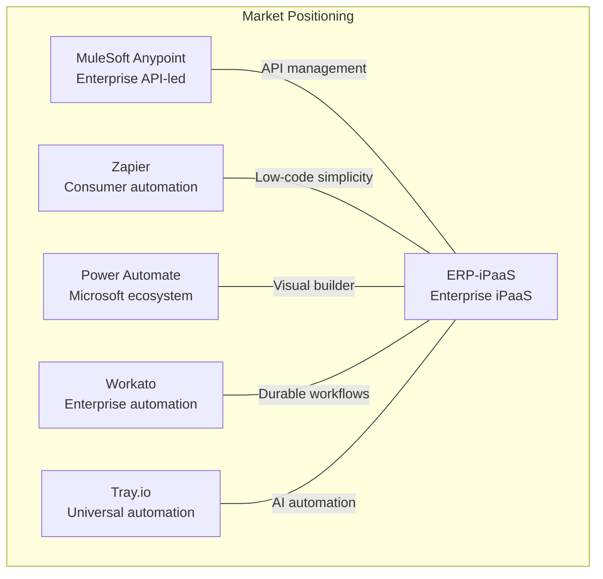
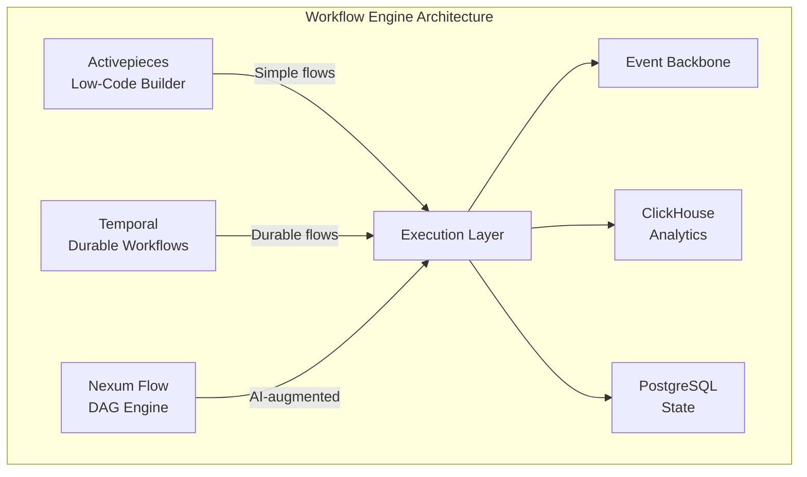

# Product Requirements Document -- ERP-iPaaS
> Version: 1.0 | Last Updated: 2026-02-23 | Status: Draft
> Classification: Internal | Author: AIDD System

## 1. Introduction

### 1.1 Product Overview

ERP-iPaaS (Integration Platform as a Service) is the integration backbone for the BillyRonks ERP ecosystem. It provides a unified platform for building, deploying, and managing integrations across all ERP modules and external systems through six core capabilities: workflow automation, connector management, event streaming, API management, ETL/CDC pipelines, and webhook management.

### 1.2 Product Vision

To be the single integration layer that eliminates data silos, reduces integration time by 70%, and provides both low-code and pro-code experiences for building enterprise integrations -- deployable on-premises or in the cloud with zero-trust multi-tenant security.

### 1.3 Target Users

| Persona | Description | Primary Needs |
|---------|-------------|---------------|
| Business Analyst | Creates workflows using visual builder | Low-code, templates, no deployment knowledge |
| Integration Developer | Builds custom connectors and complex workflows | SDK, API, debugging, version control |
| Platform Administrator | Manages tenants, security, and infrastructure | Monitoring, tenant provisioning, alerting |
| External Integrator | Connects third-party systems via APIs/webhooks | Developer portal, documentation, sandbox |
| Data Engineer | Builds ETL/CDC pipelines | Pipeline builder, data quality, lineage |

## 2. Competitive Analysis

### 2.1 Competitor Feature Matrix

### 2.2 Detailed Competitive Benchmark

#### 2.2.1 vs. MuleSoft Anypoint Platform

| Feature | MuleSoft | ERP-iPaaS | Advantage |
|---------|----------|-----------|-----------|
| **Pricing** | $50K-$500K/yr | Per-tenant flat | ERP-iPaaS |
| **Deployment** | CloudHub/Hybrid | Full K8s/On-prem | ERP-iPaaS |
| **Connector Count** | 1500+ | 100+ | MuleSoft |
| **Transformation** | DataWeave | JSON mapping + LLM | Parity |
| **API Management** | Full lifecycle | Gateway + portal | MuleSoft (richer) |
| **Event Streaming** | Anypoint MQ | Redpanda native | ERP-iPaaS |
| **Durable Execution** | Limited | Temporal | ERP-iPaaS |
| **Learning Curve** | Steep (DataWeave, RAML) | Moderate | ERP-iPaaS |
| **Multi-tenancy** | MuleSoft Gov | RLS + K8s namespaces | Parity |
| **AI/LLM** | Einstein limited | Built-in LLM utils | ERP-iPaaS |

**Strategic Position**: ERP-iPaaS competes with MuleSoft on enterprise features at a fraction of the cost, with stronger event streaming and durable workflow capabilities.

#### 2.2.2 vs. Zapier

| Feature | Zapier | ERP-iPaaS | Advantage |
|---------|--------|-----------|-----------|
| **Pricing** | Per-task ($0.01-0.05) | Per-tenant flat | ERP-iPaaS at scale |
| **Deployment** | Cloud only | K8s/On-prem | ERP-iPaaS |
| **Connector Count** | 5000+ | 100+ | Zapier |
| **Visual Builder** | Zap Editor | Activepieces | Parity |
| **Error Handling** | Basic retry | Temporal compensation | ERP-iPaaS |
| **Multi-step Logic** | Paths/Filters | Full DAG | ERP-iPaaS |
| **Self-hosted** | No | Yes | ERP-iPaaS |
| **Event Streaming** | No | Redpanda | ERP-iPaaS |
| **ETL/CDC** | No | Yes (Debezium) | ERP-iPaaS |
| **Enterprise Security** | SOC2 | Zero-trust/RLS | ERP-iPaaS |

**Strategic Position**: Zapier dominates in connector breadth and ease of use; ERP-iPaaS wins for enterprises needing self-hosted deployment, durable execution, and event streaming.

#### 2.2.3 vs. Microsoft Power Automate

| Feature | Power Automate | ERP-iPaaS | Advantage |
|---------|---------------|-----------|-----------|
| **Pricing** | $15-40/user/mo | Per-tenant flat | Depends on scale |
| **Deployment** | Azure only | Any K8s | ERP-iPaaS |
| **Microsoft Integration** | Native | Via connectors | Power Automate |
| **Visual Builder** | Flow Designer | Activepieces | Parity |
| **RPA** | Desktop Flows | Not available | Power Automate |
| **Durable Execution** | Durable Functions | Temporal | Parity |
| **Event Streaming** | Service Bus | Redpanda | ERP-iPaaS |
| **Open Source** | No | Activepieces AGPLv3 | ERP-iPaaS |
| **AI Integration** | Copilot | LLM utilities | Parity |
| **Custom Connectors** | Limited | Full SDK (TS/Go/Py) | ERP-iPaaS |

**Strategic Position**: Power Automate is the default choice for Microsoft-centric organizations; ERP-iPaaS is preferable for multi-cloud/on-prem enterprises and those requiring Kafka-native event streaming.

#### 2.2.4 vs. Workato

| Feature | Workato | ERP-iPaaS | Advantage |
|---------|---------|-----------|-----------|
| **Pricing** | $10K-$100K/yr | Per-tenant flat | ERP-iPaaS |
| **Deployment** | Cloud/OPA | Full K8s | ERP-iPaaS |
| **Recipe Builder** | Excellent | Activepieces (good) | Workato |
| **Error Handling** | Recipe Ops | Temporal compensation | ERP-iPaaS |
| **Connector Count** | 1000+ | 100+ | Workato |
| **Event Streaming** | Limited | Redpanda native | ERP-iPaaS |
| **CDC** | Yes | Debezium (planned) | Workato (today) |
| **AI** | WorkBot AI | LLM utilities | Parity |
| **Self-hosted** | OPA agent | Full platform | ERP-iPaaS |

**Strategic Position**: Workato offers a more mature recipe builder; ERP-iPaaS offers stronger event streaming and full self-hosted deployment.

#### 2.2.5 vs. Tray.io

| Feature | Tray.io | ERP-iPaaS | Advantage |
|---------|---------|-----------|-----------|
| **Pricing** | Custom enterprise | Per-tenant flat | ERP-iPaaS |
| **Visual Builder** | Tray Builder | Activepieces | Parity |
| **Universal Automation** | Yes | Temporal + Activepieces | Parity |
| **Connector Count** | 600+ | 100+ | Tray.io |
| **Event Streaming** | Limited | Redpanda native | ERP-iPaaS |
| **Self-hosted** | No | Yes | ERP-iPaaS |
| **AI** | Merlin AI | LLM utilities | Tray.io (more mature) |
| **Developer Experience** | Good | SDKs + CLI | Parity |

## 3. Functional Requirements

### 3.1 Workflow Engine

| FR ID | Requirement | Priority | Acceptance Criteria |
|-------|------------|----------|-------------------|
| FR-WE-001 | Visual workflow builder with drag-and-drop canvas | P0 | Users can create multi-step workflows without code |
| FR-WE-002 | Trigger types: webhook, schedule, event, manual, polling | P0 | All 5 trigger types functional |
| FR-WE-003 | Action types: HTTP, database, email, Slack, custom | P0 | 100+ built-in actions available |
| FR-WE-004 | Conditional branching with if/else/switch | P0 | Branching logic evaluates correctly |
| FR-WE-005 | Loop constructs: for-each, while, until | P0 | Loops iterate over collections |
| FR-WE-006 | Error handling: try/catch, retry with backoff | P0 | Failed steps retry per policy |
| FR-WE-007 | Parallel branch execution | P1 | Multiple branches run concurrently |
| FR-WE-008 | Sub-workflow invocation | P1 | Workflows call child workflows |
| FR-WE-009 | Durable execution with compensation (Temporal) | P0 | Long-running workflows survive restarts |
| FR-WE-010 | Human-in-the-loop approval steps | P1 | Workflows pause pending human approval |
| FR-WE-011 | Workflow versioning with rollback | P1 | Previous versions restorable |
| FR-WE-012 | Template marketplace with 18+ templates | P0 | Templates importable by users |
| FR-WE-013 | Execution history with trace correlation | P0 | All runs logged to ClickHouse |
| FR-WE-014 | Real-time execution monitoring | P1 | Live status updates during execution |
| FR-WE-015 | Workflow scheduling (cron) | P0 | Cron expressions supported |

### 3.2 Connector Framework

| FR ID | Requirement | Priority | Acceptance Criteria |
|-------|------------|----------|-------------------|
| FR-CF-001 | Connector SDK in TypeScript | P0 | npm package published |
| FR-CF-002 | Connector SDK in Go | P0 | Go module published |
| FR-CF-003 | Connector SDK in Python | P1 | PyPI package published |
| FR-CF-004 | Authentication: OAuth2, API key, Basic | P0 | All 3 auth types functional |
| FR-CF-005 | Auto-generated connector from OpenAPI spec | P0 | OpenAPI YAML produces working connector |
| FR-CF-006 | Connector marketplace with versioning | P1 | Semantic versioning enforced |
| FR-CF-007 | Connector validation pipeline | P0 | Schema + rate limit validation automated |
| FR-CF-008 | Connector quality scoring | P1 | 0-100 score based on tests, docs, latency |
| FR-CF-009 | Connector health monitoring | P1 | Latency/error rates in ClickHouse |
| FR-CF-010 | Connector rate limiting per tenant | P0 | Rate limits enforced per connector/tenant |

### 3.3 Event Backbone

| FR ID | Requirement | Priority | Acceptance Criteria |
|-------|------------|----------|-------------------|
| FR-EB-001 | Kafka-compatible event bus (Redpanda) | P0 | Produce/consume at 100K events/sec |
| FR-EB-002 | Topic management (create/delete/configure) | P0 | API for topic lifecycle |
| FR-EB-003 | Schema registry (Avro) | P0 | Avro schemas enforced on publish |
| FR-EB-004 | Schema registry (Protobuf) | P1 | Protobuf schemas enforced |
| FR-EB-005 | Dead-letter queue management | P0 | Failed events routed to DLQ |
| FR-EB-006 | Event replay from DLQ | P1 | DLQ events re-publishable |
| FR-EB-007 | Event filtering and transformation | P1 | Filter rules on topic subscriptions |
| FR-EB-008 | CloudEvents specification compliance | P0 | All events include CloudEvents headers |
| FR-EB-009 | Guaranteed delivery (at-least-once) | P0 | Acknowledged delivery semantics |
| FR-EB-010 | Multi-region replication | P1 | Cross-region topic mirroring |

### 3.4 API Management

| FR ID | Requirement | Priority | Acceptance Criteria |
|-------|------------|----------|-------------------|
| FR-AM-001 | API gateway with rate limiting | P0 | Rate limits per key/tenant |
| FR-AM-002 | API key management (create/rotate/revoke) | P0 | Full key lifecycle |
| FR-AM-003 | OAuth2 token validation | P0 | JWT validation at gateway |
| FR-AM-004 | Request/response transformation | P1 | Header/body transforms |
| FR-AM-005 | API versioning (URL path) | P0 | /v1/, /v2/ routing |
| FR-AM-006 | API analytics dashboard | P1 | Request counts, latency, errors |
| FR-AM-007 | Developer portal with docs | P1 | Interactive API explorer |
| FR-AM-008 | Auto-generated API documentation | P0 | OpenAPI to rendered docs |

### 3.5 ETL Service

| FR ID | Requirement | Priority | Acceptance Criteria |
|-------|------------|----------|-------------------|
| FR-ETL-001 | Extract from databases (Postgres, MySQL, ClickHouse) | P0 | Query-based extraction |
| FR-ETL-002 | Extract from APIs (REST, GraphQL) | P0 | HTTP-based extraction |
| FR-ETL-003 | Extract from files (CSV, JSON, Parquet) | P1 | File-based extraction from MinIO |
| FR-ETL-004 | Transform: mapping, filtering, aggregation | P0 | Pipeline transforms |
| FR-ETL-005 | Transform: enrichment, deduplication | P1 | Lookup enrichment |
| FR-ETL-006 | Load to databases and data warehouses | P0 | Bulk insert/upsert |
| FR-ETL-007 | Load to APIs | P1 | HTTP push loading |
| FR-ETL-008 | Batch processing mode | P0 | Scheduled batch runs |
| FR-ETL-009 | Streaming processing mode | P1 | Real-time via Redpanda |
| FR-ETL-010 | CDC via Debezium | P1 | Change capture from Postgres |

### 3.6 Webhook Management

| FR ID | Requirement | Priority | Acceptance Criteria |
|-------|------------|----------|-------------------|
| FR-WH-001 | Incoming webhook registration | P0 | URL endpoint per tenant |
| FR-WH-002 | Outgoing webhook dispatch | P0 | HTTP POST to external URLs |
| FR-WH-003 | HMAC-SHA256 signature verification | P0 | Signature validated on ingest |
| FR-WH-004 | Retry with exponential backoff | P0 | Failed deliveries retried |
| FR-WH-005 | Delivery logs and replay | P1 | All deliveries logged; replay available |
| FR-WH-006 | Webhook testing sandbox | P1 | Developers can test payloads |
| FR-WH-007 | Platform-specific signing (Zapier, Make, etc.) | P1 | 6+ platform signatures supported |

## 4. Non-Functional Requirements

| NFR ID | Requirement | Target |
|--------|------------|--------|
| NFR-001 | Availability | 99.95% uptime SLA |
| NFR-002 | Latency (API gateway p99) | < 50ms |
| NFR-003 | Throughput (events/sec) | 100,000+ |
| NFR-004 | Workflow executions/day | 10,000,000+ |
| NFR-005 | Tenant isolation | Zero cross-tenant data leakage |
| NFR-006 | Data retention | 30-day default, configurable |
| NFR-007 | Recovery Point Objective (RPO) | < 5 minutes |
| NFR-008 | Recovery Time Objective (RTO) | < 15 minutes |
| NFR-009 | Horizontal scalability | Auto-scale via KEDA |
| NFR-010 | Compliance | SOC2, GDPR, NDPR |

## 5. Release Plan

| Milestone | Target Date | Key Deliverables |
|-----------|------------|------------------|
| v1.0 GA | Q1 2026 | All P0 requirements, 16 templates, TS/Go SDKs |
| v1.1 | Q2 2026 | Python SDK, CDC deployment, DLQ replay UI |
| v1.2 | Q3 2026 | Visual debugger, streaming ETL, GraphQL gateway |
| v2.0 | Q4 2026 | Connector marketplace reviews, visual pipeline builder, RPA research |

## 6. Success Metrics

| Metric | Target | Measurement |
|--------|--------|-------------|
| Integration build time | < 4 hours for standard integrations | Time-to-first-event |
| Template adoption | 80% of tenants use at least 3 templates | Template import count |
| Connector utilization | 50+ active connectors per quarter | Connector execution count |
| Developer satisfaction | NPS > 40 | Quarterly survey |
| Incident rate | < 2 P1 incidents per quarter | PagerDuty metrics |
