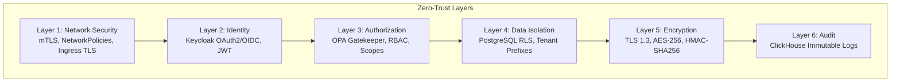
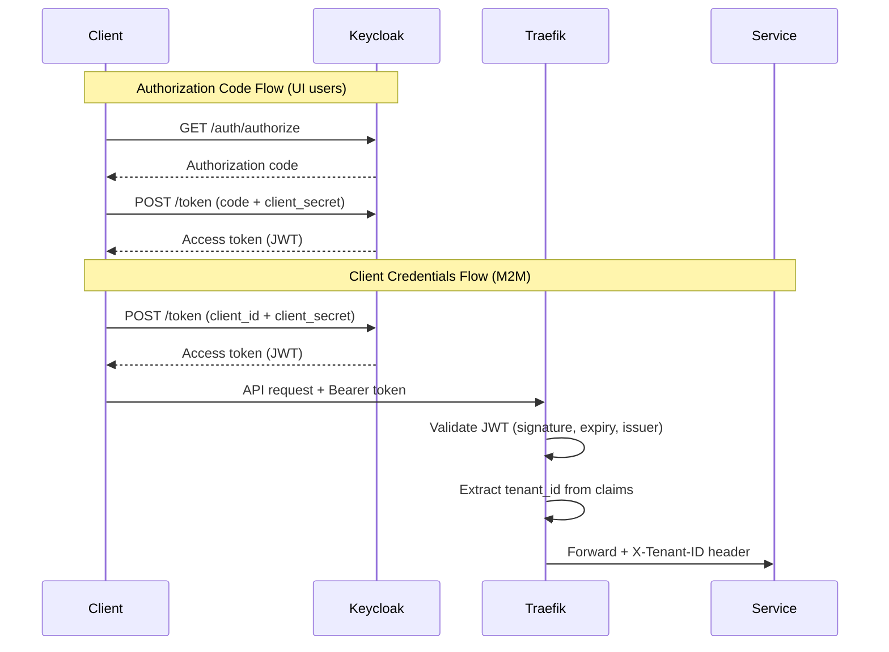
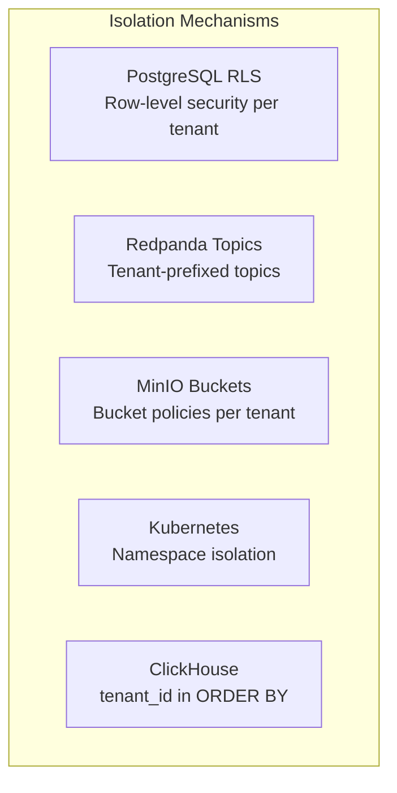
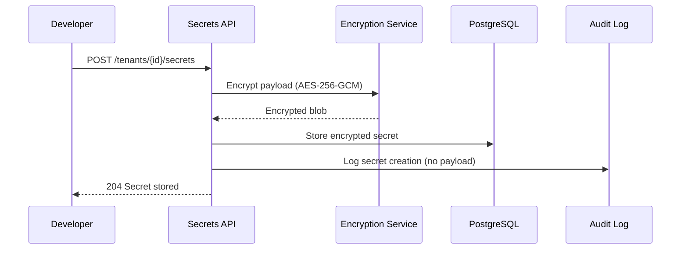
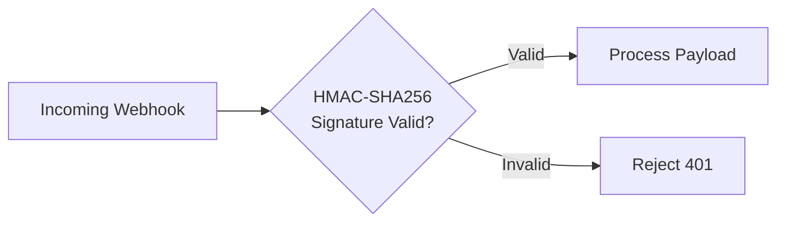
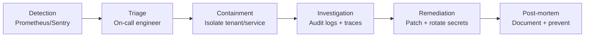

# Security Architecture -- ERP-iPaaS
> Version: 1.0 | Last Updated: 2026-02-23 | Status: Draft
> Classification: Internal | Author: AIDD System

## 1. Security Overview

ERP-iPaaS implements a zero-trust security model with defense-in-depth across six layers: network, identity, authorization, data, encryption, and audit. Every request is authenticated, authorized, and audited regardless of network origin.

## 2. Zero-Trust Architecture



## 3. Authentication

### 3.1 OAuth2 Flows



### 3.2 JWT Claims Structure

```json
{
  "iss": "https://id.<DOMAIN>/realms/billyronks",
  "sub": "user-uuid",
  "aud": "erp-ipaas",
  "exp": 1740000000,
  "iat": 1739996400,
  "tenant_id": "tenant-uuid",
  "roles": ["integration_admin", "workflow_editor"],
  "scopes": ["integration.layer", "integration.layer.read"]
}
```

### 3.3 API Key Authentication

For machine-to-machine scenarios where OAuth2 is impractical:
- Keys generated via `/tenants/{tenantId}/secrets` API
- Key hashed with bcrypt before storage
- Scopes attached to each key
- Expiration and rotation policies enforced
- Last-used timestamp tracked

## 4. Authorization

### 4.1 Role-Based Access Control

| Role | Permissions |
|------|------------|
| `integration_admin` | Full CRUD on all resources, tenant management |
| `workflow_editor` | Create/edit/delete workflows, read connectors |
| `workflow_viewer` | Read-only access to workflows and runs |
| `connector_author` | Create/publish connectors, manage schemas |
| `data_engineer` | Create/manage ETL pipelines, access data stores |
| `developer` | SDK access, webhook management, sandbox |
| `auditor` | Read-only access to audit logs and metrics |

### 4.2 OPA Gatekeeper Policies

```yaml
# config/opa/tenant-namespace-constraint.yaml
# Ensures pods can only deploy in their assigned namespace
# Prevents cross-tenant resource access at the K8s level
```

### 4.3 Scope-Based API Access

| Scope | Operations |
|-------|-----------|
| `integration.layer` | Full read/write access to integration assets |
| `integration.layer.read` | Read-only access to all resources |
| `webhook.manage` | Create/delete/replay webhooks |
| `secret.manage` | Store/rotate secrets |
| `event.publish` | Publish events to topics |

## 5. Data Security

### 5.1 Tenant Data Isolation



### 5.2 PII Protection

PII is handled through multiple mechanisms:

1. **Detection**: `activepieces/config/pii-guards.ts` detects PII patterns in workflow data
2. **Redaction**: `src/lib/llm/redaction.ts` redacts PII before sending to LLM providers
3. **Logging**: `workflow_dlp` ClickHouse table tracks detected PII fields
4. **Encryption**: Sensitive fields encrypted at rest with AES-256-GCM

### 5.3 Secret Management



## 6. Network Security

### 6.1 Network Policies

- Default deny-all ingress/egress in tenant namespaces
- Explicit allow rules for:
  - Services to database pods
  - Services to Redpanda pods
  - Traefik to service pods
  - Observability scraping

### 6.2 mTLS Configuration

- All inter-service communication encrypted with mTLS
- Certificates managed by cert-manager
- Certificate rotation: 90-day validity, 60-day auto-renewal
- Traefik terminates external TLS (Let's Encrypt)

## 7. Webhook Security

### 7.1 Signature Verification



Supported signing platforms:
- Custom HMAC-SHA256
- Zapier webhook signing
- Make (Integromat) webhook signing
- Power Automate webhook signing
- Pabbly Connect webhook signing
- IFTTT webhook signing
- Integrately webhook signing

### 7.2 Webhook Signing Secret Lifecycle

| Phase | Action |
|-------|--------|
| Generation | Cryptographically random 256-bit secret |
| Storage | Encrypted in secrets table |
| Distribution | Displayed once to developer |
| Rotation | New secret generated, old invalidated |
| Expiration | Configurable TTL |

## 8. Audit and Compliance

### 8.1 Audit Log Schema

All CRUD operations are logged to `billyronks.audit` in ClickHouse:

| Field | Description |
|-------|-------------|
| tenant_id | Tenant context |
| actor | User or service identifier |
| actor_type | human, service, system |
| action | create, read, update, delete |
| resource_type | workflow, connector, secret, etc. |
| resource_id | Resource identifier |
| metadata | Additional context (JSON) |
| timestamp | Event time (Africa/Lagos) |

### 8.2 Compliance Controls

| Control | Standard | Implementation |
|---------|----------|---------------|
| Data residency | NDPR/GDPR | Kubernetes region affinity, MinIO site replication |
| Encryption at rest | ISO 27001 A.10 | AES-256 on all data stores |
| Access logging | SOC2 CC6.1 | Immutable ClickHouse audit table |
| Least privilege | SOC2 CC6.3 | RBAC + OPA Gatekeeper |
| Secret rotation | SOC2 CC6.7 | Configurable rotation policies |
| Vulnerability scanning | SOC2 CC7.1 | Container image scanning in CI |

## 9. Incident Response

### 9.1 Security Alert Flow



### 9.2 Security Monitoring Alerts

| Alert | Condition | Action |
|-------|----------|--------|
| Unauthorized access attempt | 401/403 spike > 100/min | Investigate source IP |
| Secret access anomaly | Unusual secret read pattern | Review actor activity |
| Cross-tenant access attempt | RLS violation logged | Immediate investigation |
| Certificate expiry | < 7 days to expiration | Auto-renewal verification |
