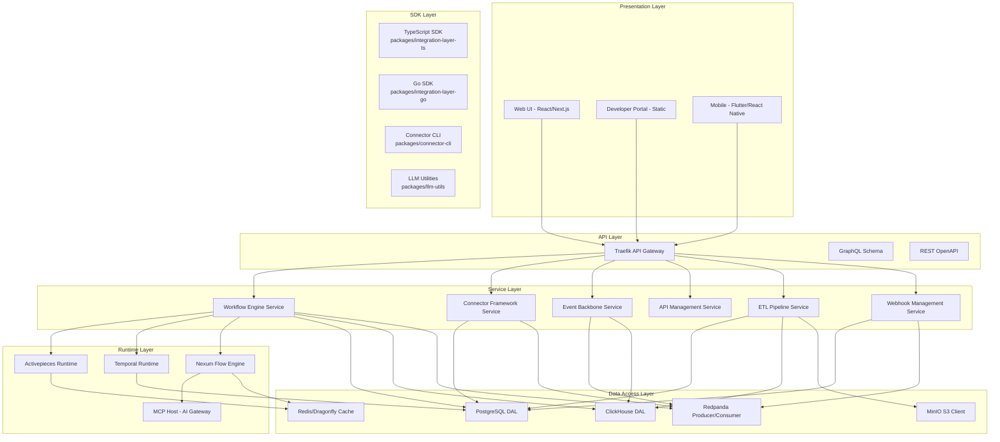
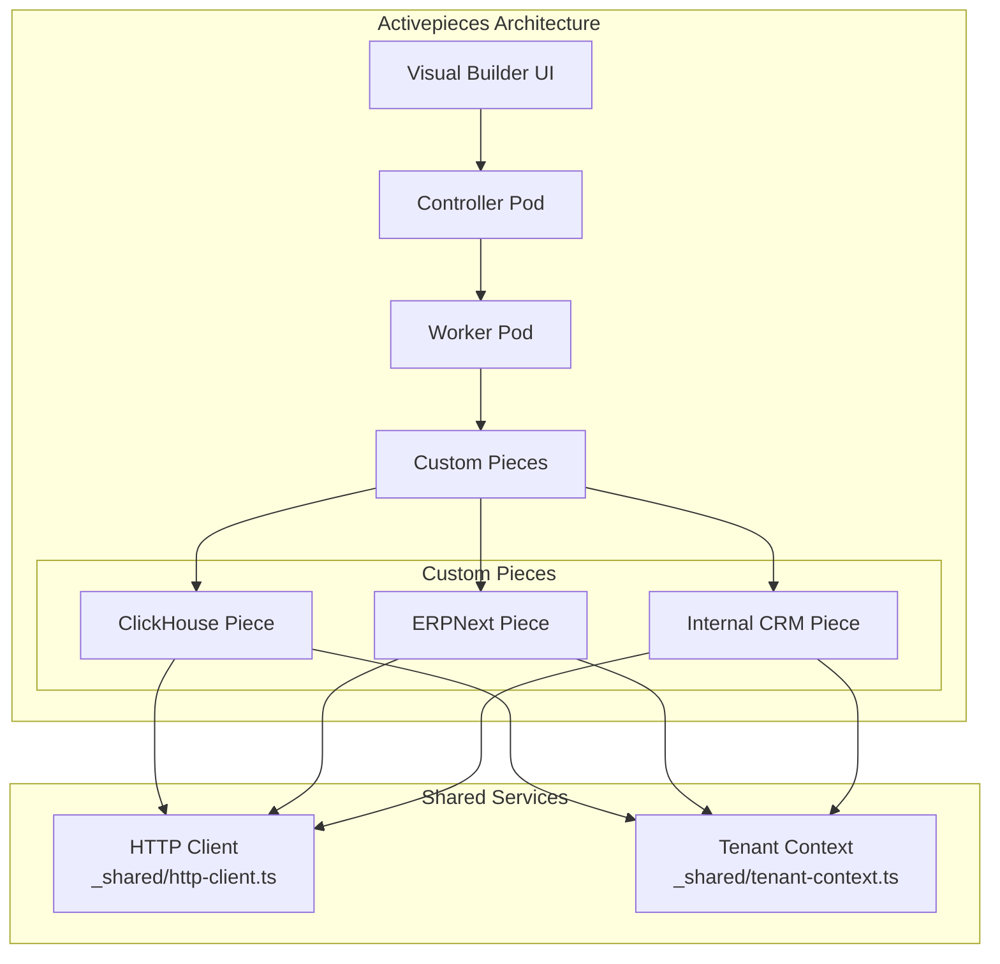
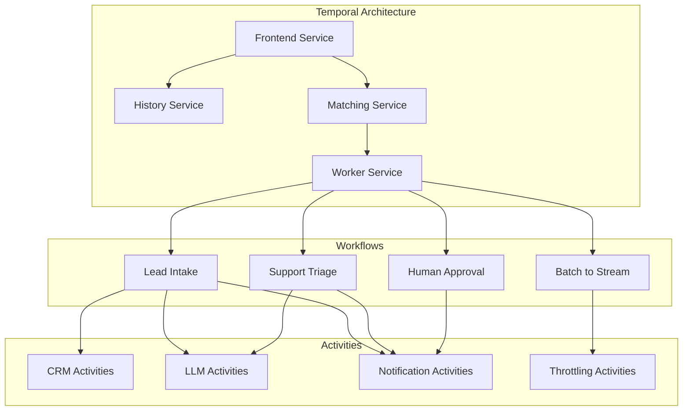
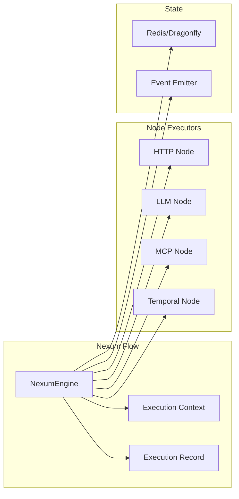
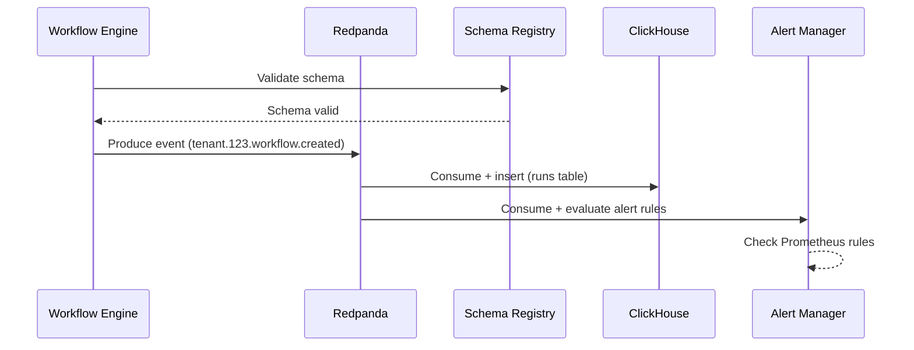
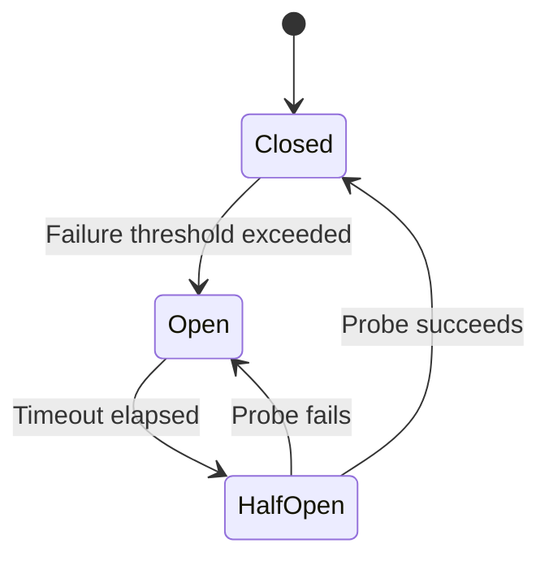
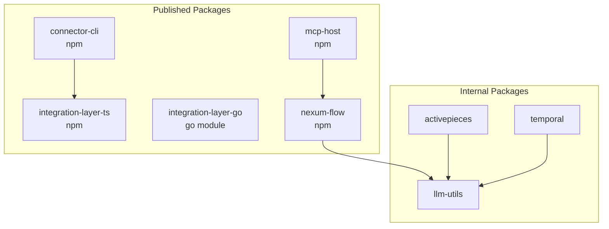

# Software Architecture -- ERP-iPaaS
> Version: 1.0 | Last Updated: 2026-02-23 | Status: Draft
> Classification: Internal | Author: AIDD System

## 1. Introduction

This document describes the software architecture of ERP-iPaaS at the component and module level, detailing service internals, package structure, communication patterns, and the technology choices behind each layer.

## 2. Component Architecture



## 3. Package Structure

### 3.1 Repository Layout

```
ERP-iPaaS/
  services/                    # Go microservices
    workflow-engine/           # Main workflow orchestration service
    connector-framework/       # Connector lifecycle management
    event-backbone/            # Event streaming management
    api-management-service/    # API gateway management
    etl-service/               # ETL pipeline management
    webhook-service/           # Webhook management
  packages/                    # TypeScript/Go packages
    activepieces/              # Activepieces custom pieces
    connector-cli/             # Connector CLI tool
    integration-layer-ts/      # TypeScript SDK
    integration-layer-go/      # Go SDK
    llm-utils/                 # LLM utility functions
    mcp-host/                  # AI MCP gateway
    nexum-flow/                # Visual DAG engine
    temporal/                  # Temporal SDK wrapper
  activepieces/                # Activepieces config and pieces
    config/                    # Multitenancy, PII guards
    pieces/                    # Custom pieces (ClickHouse, ERPNext, CRM)
    templates/                 # 16 workflow templates
  temporal/                    # Temporal config and workflows
    src/workflows/             # Workflow definitions
    src/activities/            # Activity implementations
    workers/                   # Worker processes
    templates/                 # Temporal templates
  src/                         # Shared source code
    activepieces/pieces/       # Piece implementations
    ai-agent/                  # AI agent service
    lib/interops/              # Interop utilities
    lib/llm/                   # LLM prompts, redaction, retry
    temporal/workflows/        # Temporal workflow implementations
    temporal/workers/          # Worker implementations
  config/                      # Configuration
    clickhouse/                # DDL scripts
    grafana/                   # Dashboard definitions
    kafka/schemas/             # Avro schemas
    prometheus/rules/          # Alert rules
    security/                  # RLS policies, MinIO policies
  infra/                       # Infrastructure as Code
    helm/                      # 16 Helm charts
    terraform/                 # Terraform modules
    argocd/                    # ArgoCD applications
```

### 3.2 Service Internal Architecture

Each Go microservice follows a consistent pattern:

```mermaid
graph TB
    subgraph "Go Microservice Pattern"
        MAIN[main.go]
        MUX[http.ServeMux]
        HEALTH[/healthz handler]
        LIST[GET handler]
        CREATE[POST handler]
        READ[GET /:id handler]
        UPDATE[PATCH /:id handler]
        DELETE[DELETE /:id handler]
    end

    subgraph "Cross-Cutting Middleware"
        TENANT[X-Tenant-ID Validation]
        JSON[JSON Serialization]
        EVENT[Event Topic Tagging]
    end

    MAIN --> MUX
    MUX --> HEALTH
    MUX --> LIST
    MUX --> CREATE
    MUX --> READ
    MUX --> UPDATE
    MUX --> DELETE

    LIST --> TENANT
    CREATE --> TENANT
    READ --> TENANT
    UPDATE --> TENANT
    DELETE --> TENANT

    CREATE --> EVENT
    UPDATE --> EVENT
    DELETE --> EVENT

    LIST --> JSON
    CREATE --> JSON
    READ --> JSON
```

## 4. Workflow Runtime Architecture

### 4.1 Activepieces Runtime



### 4.2 Temporal Runtime



### 4.3 Nexum Flow DAG Engine



## 5. Communication Patterns

### 5.1 Synchronous Communication

- **REST API**: All service-to-client communication via OpenAPI-defined REST endpoints
- **gRPC**: Temporal client-to-server communication
- **GraphQL**: Schema defined in `schema.graphql` for query aggregation

### 5.2 Asynchronous Communication

- **Kafka/Redpanda**: All cross-service events via tenant-scoped topics
- **CloudEvents**: Standard event envelope format
- **Avro Schema Registry**: Schema validation on produce

### 5.3 Event Flow



## 6. Error Handling Strategy

### 6.1 Retry Policies

| Component | Strategy | Max Attempts | Backoff |
|-----------|----------|-------------|---------|
| Temporal Workflows | Exponential backoff with jitter | 5 | 2x coefficient |
| Activepieces Actions | Configurable retry | 3 | Linear |
| Kafka Consumers | Retry topic + DLQ | 3 | Fixed interval |
| HTTP Clients | Circuit breaker | 3 | Exponential |
| Webhook Delivery | Exponential backoff | 5 | 2x with jitter |

### 6.2 Circuit Breaker Pattern



The circuit breaker is implemented in `src/temporal/workers/circuitBreaker.ts` and applied to all external HTTP calls.

## 7. Configuration Management

### 7.1 Configuration Hierarchy

```
Environment Variables (highest priority)
  -> Helm Values (per-chart)
    -> Kustomize Overlays (dev/prod)
      -> Default Values (lowest priority)
```

### 7.2 Key Configuration Sources

| Config | Location | Format |
|--------|----------|--------|
| Activepieces multitenancy | `activepieces/config/multitenancy.ts` | TypeScript |
| PII guards | `activepieces/config/pii-guards.ts` | TypeScript |
| ClickHouse DDL | `config/clickhouse/ddl.sql` | SQL |
| Kafka schemas | `config/kafka/schemas/` | Avro |
| Prometheus alerts | `config/prometheus/rules/` | YAML |
| Grafana dashboards | `config/grafana/dashboards/` | JSON |
| OPA constraints | `config/opa/` | YAML |
| Security policies | `config/security/` | SQL/JSON |

## 8. Dependency Injection and Modularity

The platform uses a modular architecture where each package is independently publishable:


