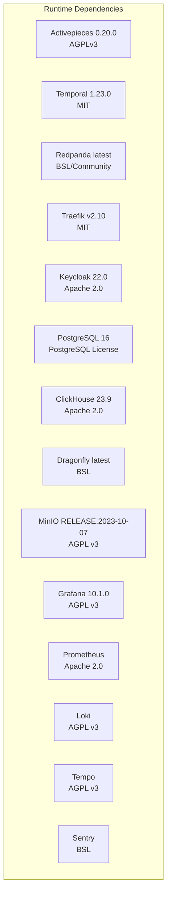
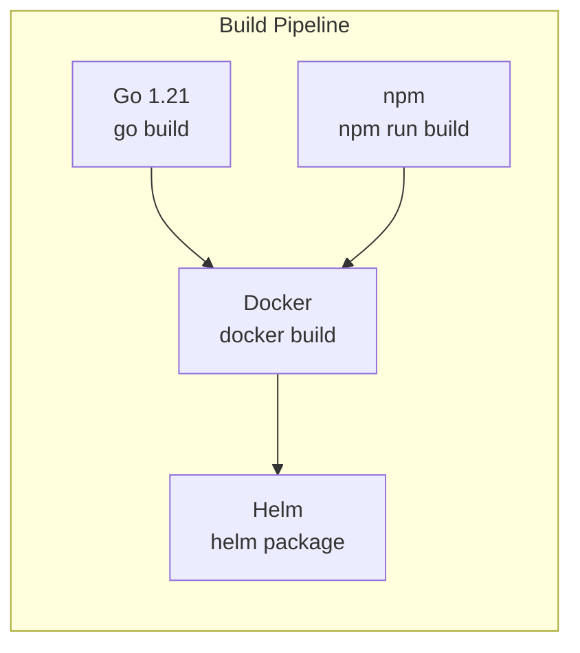
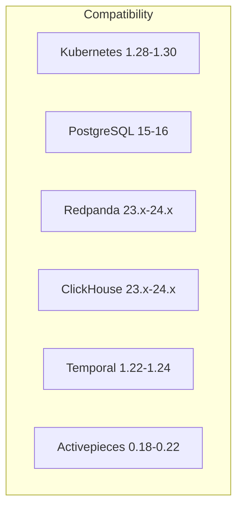

# Software Requirements -- ERP-iPaaS
> Version: 1.0 | Last Updated: 2026-02-23 | Status: Draft
> Classification: Internal | Author: AIDD System

## 1. Overview

This document specifies all software dependencies, runtime requirements, and toolchain requirements for building, deploying, and operating ERP-iPaaS.

## 2. Runtime Dependencies

### 2.1 Core Platform Services

| Software | Version | License | Purpose |
|----------|---------|---------|---------|
| Activepieces | 0.20.0 | AGPLv3 | Low-code workflow builder |
| Temporal | 1.23.0 | MIT | Durable workflow execution |
| Temporal Web UI | 2.15.0 | MIT | Workflow monitoring UI |
| Redpanda | latest | BSL/Community | Event streaming (Kafka-compatible) |
| Traefik | v2.10 | MIT | API gateway and reverse proxy |
| Keycloak | 22.0 | Apache 2.0 | Identity and access management |
| PostgreSQL | 16 | PostgreSQL License | Primary relational database |
| ClickHouse | 23.9 | Apache 2.0 | Analytics and metrics database |
| Dragonfly | latest | BSL | Redis-compatible cache |
| MinIO | 2023-10-07 | AGPL v3 | S3-compatible object storage |
| Grafana | 10.1.0 | AGPL v3 | Dashboard and visualization |
| Prometheus | latest | Apache 2.0 | Metrics collection and alerting |
| Loki | latest | AGPL v3 | Log aggregation |
| Tempo | latest | AGPL v3 | Distributed tracing |
| Sentry | latest | BSL | Error tracking |

### 2.2 Container and Orchestration

| Software | Version | Purpose |
|----------|---------|---------|
| Kubernetes | 1.28+ | Container orchestration |
| Docker | 24+ | Container runtime |
| Helm | 3.12+ | Kubernetes package manager |
| ArgoCD | 2.8+ | GitOps continuous delivery |
| KEDA | 2.12+ | Event-driven autoscaling |
| Kustomize | 5.0+ | Kubernetes configuration management |
| OPA Gatekeeper | 3.14+ | Policy enforcement |
| cert-manager | 1.13+ | Certificate management |

### 2.3 Infrastructure as Code

| Software | Version | Purpose |
|----------|---------|---------|
| Terraform | 1.5+ | Infrastructure provisioning |
| kind | 0.20+ | Local Kubernetes cluster (dev) |

## 3. Development Dependencies

### 3.1 Languages and Runtimes

| Language/Runtime | Version | Usage |
|-----------------|---------|-------|
| Go | 1.21+ | Microservices (6 services) |
| Node.js | 18 LTS+ | TypeScript packages, Activepieces pieces |
| TypeScript | 5.0+ | SDKs, workflow definitions, Temporal workers |
| Python | 3.11+ | SDK, Temporal examples |

### 3.2 Node.js Packages (package.json)

| Package | Version | Purpose |
|---------|---------|---------|
| @temporalio/workflow | ^1.8 | Temporal workflow SDK |
| @temporalio/activity | ^1.8 | Temporal activity SDK |
| @temporalio/worker | ^1.8 | Temporal worker SDK |
| redis | ^4.6 | Redis/Dragonfly client |
| uuid | ^9.0 | UUID generation |
| vitest | ^1.0 | Unit testing framework |
| typescript | ^5.0 | TypeScript compiler |

### 3.3 Go Modules

| Module | Purpose |
|--------|---------|
| net/http | HTTP server (standard library) |
| encoding/json | JSON serialization (standard library) |

### 3.4 Development Tools

| Tool | Version | Purpose |
|------|---------|---------|
| npm | 9+ | Node.js package manager |
| npx | 9+ | Package runner |
| ts-node | latest | TypeScript execution |
| @redocly/cli | latest | OpenAPI linting |
| vitest | 1.0+ | Testing framework |
| ESLint | 8+ | Code linting |
| Prettier | 3+ | Code formatting |

## 4. Build Requirements

### 4.1 Build Toolchain

### 4.2 Docker Images

| Image | Base | Size (approx) |
|-------|------|---------------|
| workflow-engine | golang:1.21-alpine + scratch | ~15 MB |
| connector-framework | golang:1.21-alpine + scratch | ~15 MB |
| event-backbone | golang:1.21-alpine + scratch | ~15 MB |
| api-management-service | golang:1.21-alpine + scratch | ~15 MB |
| etl-service | golang:1.21-alpine + scratch | ~15 MB |
| webhook-service | golang:1.21-alpine + scratch | ~15 MB |
| ai-agent | node:18-alpine | ~150 MB |
| temporal-workers | node:18-alpine | ~150 MB |

### 4.3 Dockerfile Patterns

Two Dockerfile patterns are used:

**Go services** (`Dockerfile.api`):
- Multi-stage build with golang:1.21-alpine builder
- Final stage: scratch or distroless for minimal attack surface

**TypeScript services** (`Dockerfile.ai`):
- Multi-stage build with node:18-alpine builder
- Final stage: node:18-alpine with production dependencies only

## 5. Operating System Requirements

| Environment | OS | Notes |
|-------------|----|----|
| Production (K8s nodes) | Ubuntu 22.04 LTS / Amazon Linux 2023 | Kernel 5.15+ recommended |
| Development (local) | macOS 13+ / Ubuntu 22.04+ / Windows 11 + WSL2 | Docker Desktop required |
| CI/CD runners | Ubuntu 22.04 (GitHub Actions) | Node.js 18, Go 1.21 pre-installed |

## 6. Browser Requirements (Web UI)

| Browser | Minimum Version |
|---------|----------------|
| Chrome | 110+ |
| Firefox | 110+ |
| Safari | 16+ |
| Edge | 110+ |

## 7. SDK Requirements

### 7.1 TypeScript SDK

| Requirement | Version |
|------------|---------|
| Node.js | 18+ |
| TypeScript | 5.0+ |
| npm/yarn/pnpm | npm 9+ |

### 7.2 Go SDK

| Requirement | Version |
|------------|---------|
| Go | 1.21+ |
| Module support | go.mod |

### 7.3 Python SDK (Planned)

| Requirement | Version |
|------------|---------|
| Python | 3.11+ |
| pip | 23+ |

## 8. Compatibility Matrix

| Component | Tested Versions | Notes |
|-----------|----------------|-------|
| Kubernetes | 1.28, 1.29, 1.30 | KEDA requires 1.27+ |
| PostgreSQL | 15, 16 | RLS requires 9.5+; 16 recommended |
| Redpanda | 23.2, 23.3, 24.1 | Kafka protocol 3.5 compatible |
| ClickHouse | 23.8, 23.9, 24.1 | JSON type requires 23.8+ |
| Temporal | 1.22, 1.23, 1.24 | Worker versioning requires 1.22+ |
| Activepieces | 0.18, 0.19, 0.20 | Custom pieces SDK stable from 0.18 |
