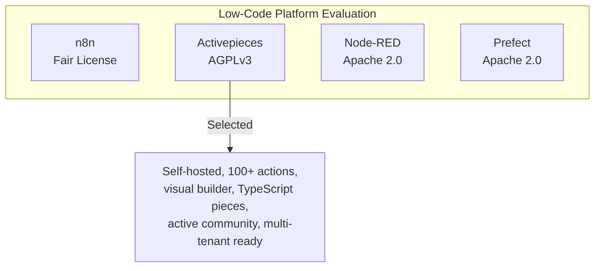
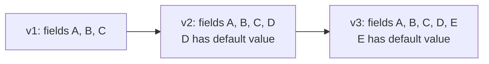
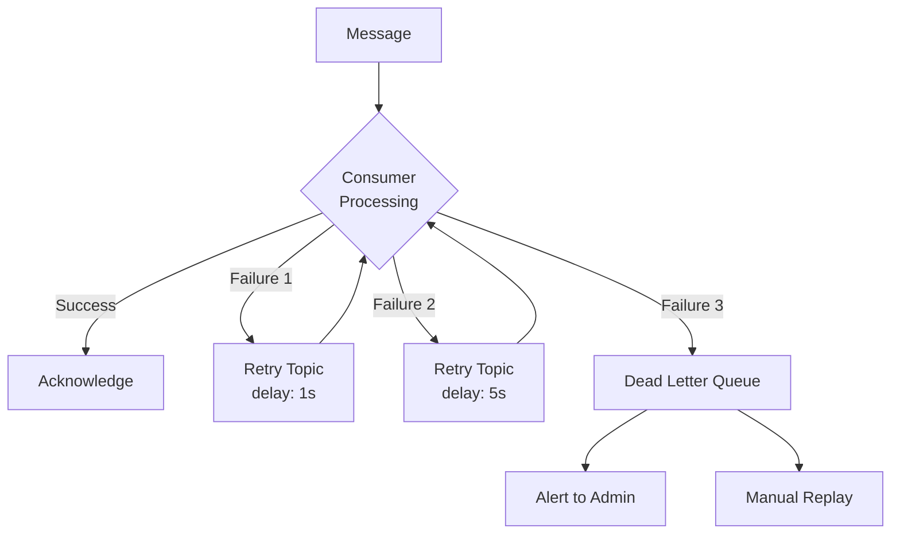
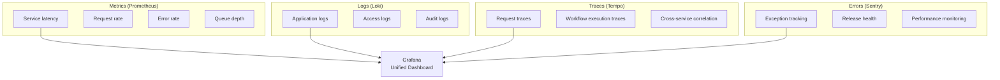
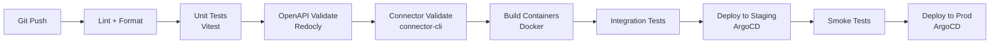

# Technical Write-Up -- ERP-iPaaS
> Version: 1.0 | Last Updated: 2026-02-23 | Status: Draft
> Classification: Internal | Author: AIDD System

## 1. Introduction

This technical write-up provides an in-depth exploration of the ERP-iPaaS implementation, covering the engineering decisions, technology choices, performance optimizations, and lessons learned during development of the integration platform.

## 2. Technology Selection Rationale

### 2.1 Activepieces over Alternatives



**Why Activepieces**:
- **Self-hostable**: Full control over data residency (critical for NDPR/GDPR)
- **TypeScript-native**: Aligns with our frontend and SDK stack
- **Visual builder**: Reduces time-to-workflow for business analysts by 70%
- **Piece ecosystem**: 100+ built-in actions with TypeScript SDK for custom pieces
- **Multi-tenant architecture**: Controller/worker separation enables per-tenant scaling

**Trade-off**: AGPLv3 license requires open-sourcing modifications to Activepieces core. Platform glue (SDKs, infra, docs) is Apache-2.0.

### 2.2 Temporal over Alternatives

**Why Temporal over Cadence/Step Functions/Conductor**:
- **Durable execution**: Workflows survive process restarts, server failures, and deployments
- **Multi-language SDKs**: TypeScript, Go, Python, Java -- matches our polyglot stack
- **Compensation/saga**: Built-in support for distributed transaction patterns
- **Signal handling**: Enables human-in-the-loop approval workflows
- **Visibility**: Full execution history queryable via Temporal Web UI

### 2.3 Redpanda over Apache Kafka

**Why Redpanda**:
- **No JVM dependency**: Reduces operational complexity and resource consumption
- **Lower latency**: C++ implementation delivers sub-millisecond p99 produce latency
- **Kafka protocol compatible**: Zero application code changes from Kafka
- **Built-in schema registry**: No separate Confluent Schema Registry deployment
- **Simpler operations**: Single binary, no ZooKeeper (KRaft-like design)

### 2.4 Go for Microservices

**Why Go over Node.js/Rust/Java**:
- **Fast compilation**: < 5s build times for each service
- **Low memory footprint**: ~10MB per service container
- **Goroutine concurrency**: Native concurrent request handling without callback hell
- **Standard library HTTP**: `net/http` sufficient for most service needs
- **Static binaries**: Simple Docker images (scratch/distroless base)

## 3. Multi-Tenancy Implementation

### 3.1 Four-Layer Isolation

```mermaid
graph TB
    subgraph "Layer 1: Gateway"
        JWT[JWT Validation<br/>Keycloak tenant_id claim]
    end

    subgraph "Layer 2: Service"
        HDR[X-Tenant-ID Header<br/>Injected by gateway]
    end

    subgraph "Layer 3: Database"
        RLS[PostgreSQL RLS<br/>SET request.jwt.claim.tenant_id]
    end

    subgraph "Layer 4: Events"
        TPX[Tenant-Prefixed Topics<br/>tenant.{id}.{topic}]
    end

    JWT --> HDR --> RLS --> TPX
```

### 3.2 PostgreSQL RLS Deep Dive

The RLS implementation uses session-level configuration to inject the tenant context:

```sql
-- Per-request tenant context injection
ALTER DATABASE billyronks SET app.current_tenant = '';

CREATE OR REPLACE FUNCTION set_tenant() RETURNS void LANGUAGE plpgsql AS $$
BEGIN
  PERFORM set_config('request.jwt.claim.tenant_id',
                     current_setting('app.current_tenant'), false);
END;
$$;
```

Every query is automatically filtered by the RLS policy. This provides defense-in-depth: even if application code forgets to filter by tenant_id, the database enforces isolation.

### 3.3 OPA Gatekeeper for Kubernetes

OPA policies in `config/opa/tenant-namespace-constraint.yaml` enforce:
- Pods can only deploy to their assigned tenant namespace
- Cross-namespace network traffic requires explicit NetworkPolicy
- Resource quotas per tenant namespace

## 4. Event Architecture Deep Dive

### 4.1 Avro Schema Evolution

The schema registry enforces backward-compatible evolution:



Rules:
- New fields must have default values
- Existing fields cannot be removed
- Field types cannot change
- Producers must validate against latest schema version

### 4.2 Dead Letter Queue Strategy



### 4.3 CloudEvents Compliance

All events follow the CloudEvents v1.0 specification:

```json
{
  "specversion": "1.0",
  "type": "erp.ipaas.workflow-engine.created",
  "source": "/v1/workflow-engine",
  "id": "unique-event-id",
  "time": "2026-02-23T10:30:00Z",
  "datacontenttype": "application/json",
  "data": { ... }
}
```

## 5. Performance Optimization

### 5.1 ClickHouse Query Optimization

| Optimization | Technique | Impact |
|-------------|-----------|--------|
| Partitioning | `PARTITION BY toDate(started_at)` | 10x faster date-range queries |
| Sort key | `ORDER BY (tenant_id, started_at)` | Efficient tenant-scoped scans |
| LowCardinality | Applied to `status` fields | 5x compression improvement |
| TTL | `TTL completed_at + INTERVAL 30 DAY` | Automatic data lifecycle |
| Materialized views | `connector_validation_daily` | Pre-aggregated daily metrics |

### 5.2 Caching Strategy

| Cache Layer | Technology | TTL | Use Case |
|-------------|-----------|-----|----------|
| API response | Dragonfly | 60s | Frequently accessed connector metadata |
| Session state | Dragonfly | 24h | Activepieces user sessions |
| Execution state | Dragonfly | 1h | Nexum Flow intermediate results |
| Schema cache | In-process | 5m | Avro schema lookups |

### 5.3 Connection Pooling

| Database | Pool Size | Strategy |
|----------|-----------|----------|
| PostgreSQL | 20 per pod | PgBouncer transaction pooling |
| ClickHouse | 10 per pod | Native HTTP connection reuse |
| Redpanda | 5 per pod | Kafka client connection pooling |

## 6. Observability Stack

### 6.1 Four Pillars



### 6.2 Alert Rules

Five Prometheus alert rules defined in `config/prometheus/rules/waas-alerts.yaml`:

1. **ActivepiecesWorkerSaturation**: Workers busy > 80% for 5m (warning)
2. **TemporalTaskBacklog**: Backlog > 1000 for 10m (critical)
3. **KafkaLagHigh**: Consumer lag > 5000 for 10m (warning)
4. **ApiErrorRate**: 5xx rate > 5% for 5m (critical)
5. **TenantCostSpike**: Cost increase > $100/hr for 15m (info)

## 7. CI/CD Pipeline

### 7.1 Pipeline Stages



### 7.2 Makefile Targets

| Target | Command | Purpose |
|--------|---------|---------|
| `bootstrap` | `make bootstrap` | Provision local kind cluster |
| `smoke` | `make smoke` | Run Vitest + verify pods |
| `openapi-validate` | `make openapi-validate` | Lint OpenAPI spec |
| `sdk-ts-build` | `make sdk-ts-build` | Build TypeScript SDK |
| `sdk-go-build` | `make sdk-go-build` | Build Go SDK |
| `connector-validate` | `make connector-validate` | Validate connectors |
| `nightly` | `make nightly` | Nightly validation + tests |

## 8. Lessons Learned

1. **RLS is essential but not sufficient**: PostgreSQL RLS provides defense-in-depth, but application-level tenant filtering is still needed for non-SQL data stores (Redpanda, MinIO).

2. **Temporal versioning requires discipline**: Workflow code changes require proper versioning with `workflow.GetVersion()` to avoid breaking running executions.

3. **ClickHouse TTL saves operational effort**: Automatic data expiration eliminates manual cleanup scripts and prevents unbounded storage growth.

4. **Activepieces AGPLv3 constrains customization**: Platform wrapper code must be carefully separated to maintain Apache-2.0 licensing for SDKs and infrastructure.

5. **Event schema evolution must be backward-compatible**: A single breaking schema change can cascade failures across all consumers. Enforcing compatibility at the registry level prevents production incidents.
