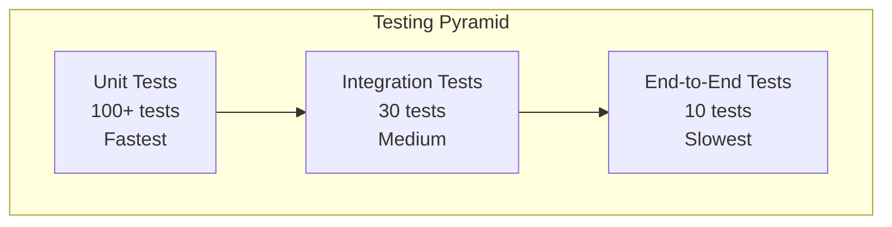
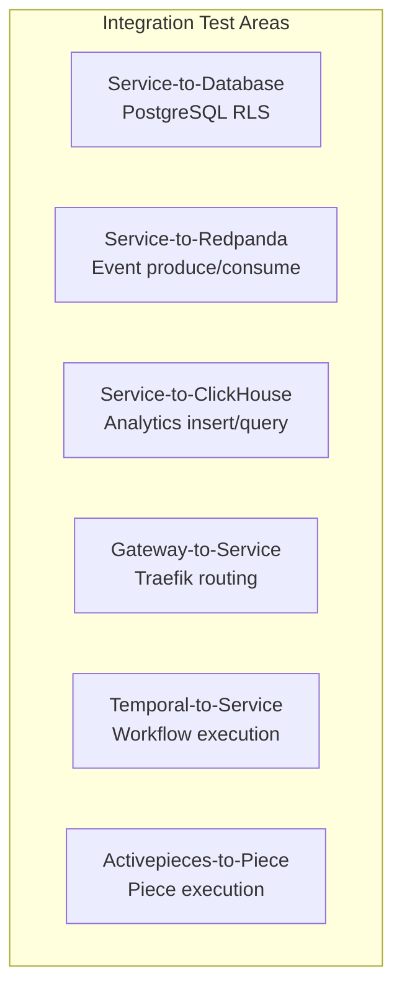
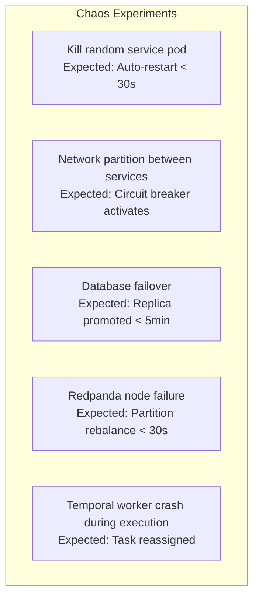
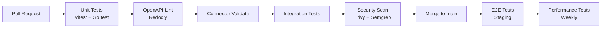

# AIDD Testing Requirements -- ERP-iPaaS
> Version: 1.0 | Last Updated: 2026-02-23 | Status: Draft
> Classification: Internal | Author: AIDD System

## 1. Overview

This document defines the comprehensive testing strategy for ERP-iPaaS, covering unit testing, integration testing, end-to-end testing, performance testing, security testing, and chaos engineering.

## 2. Testing Pyramid



## 3. Unit Testing

### 3.1 Framework and Tools

| Tool | Purpose | Location |
|------|---------|----------|
| Vitest | TypeScript unit testing | `tests/` |
| Go testing | Go service testing | `services/*/main_test.go` |
| Temporal TestWorkflowEnvironment | Temporal workflow testing | `temporal/tests/` |

### 3.2 Coverage Requirements

| Component | Minimum Coverage | Target Coverage |
|-----------|-----------------|----------------|
| Temporal workflows | 80% | 90% |
| Temporal activities | 80% | 90% |
| Activepieces pieces | 70% | 85% |
| TypeScript SDK | 80% | 90% |
| Go SDK | 80% | 90% |
| LLM utilities | 70% | 80% |
| Nexum Flow engine | 80% | 90% |

### 3.3 Unit Test Categories

| Category | Tests | Priority |
|----------|-------|----------|
| Workflow logic | 15+ | P0 |
| Activity implementations | 20+ | P0 |
| Piece actions | 15+ | P0 |
| SDK client methods | 20+ | P0 |
| LLM redaction | 10+ | P1 |
| Circuit breaker | 5+ | P1 |
| Schema validation | 10+ | P1 |

### 3.4 Existing Test Files

| File | Coverage |
|------|----------|
| `temporal/tests/lead-intake.test.ts` | Lead intake workflow |
| `temporal/tests/support-triage.test.ts` | Support triage workflow |
| `temporal/workers/tests/workflow.test.ts` | Worker workflow tests |

## 4. Integration Testing

### 4.1 Integration Test Scenarios



| IT ID | Test | Dependencies | Priority |
|-------|------|-------------|----------|
| IT-001 | Workflow engine creates workflow in PostgreSQL with RLS | PostgreSQL | P0 |
| IT-002 | Event backbone publishes to Redpanda with schema validation | Redpanda | P0 |
| IT-003 | Workflow run inserts to ClickHouse runs table | ClickHouse | P0 |
| IT-004 | Traefik routes request with valid JWT to service | Traefik, Keycloak | P0 |
| IT-005 | Temporal workflow executes lead intake end-to-end | Temporal | P0 |
| IT-006 | ClickHouse piece inserts rows and queries table | ClickHouse | P1 |
| IT-007 | ERPNext piece upserts sales order | ERPNext API | P1 |
| IT-008 | Webhook service verifies HMAC signature | Webhook service | P0 |
| IT-009 | Connector validation pipeline runs successfully | Schema registry | P1 |
| IT-010 | DLQ receives events after consumer failure | Redpanda | P1 |

## 5. End-to-End Testing

### 5.1 E2E Scenarios

| E2E ID | Scenario | Steps | Priority |
|--------|---------|-------|----------|
| E2E-001 | Lead intake flow | Webhook trigger -> CRM upsert -> LLM summary -> Slack notification | P0 |
| E2E-002 | Invoice processing | Webhook -> Extract data -> Validate -> Human approval -> Post to ERP | P0 |
| E2E-003 | ETL pipeline | Extract from PostgreSQL -> Transform -> Load to ClickHouse | P0 |
| E2E-004 | Connector lifecycle | Scaffold -> Validate -> Publish -> Install -> Use in workflow | P0 |
| E2E-005 | Event round-trip | Publish event -> Schema validation -> Consumer -> ClickHouse | P0 |
| E2E-006 | Webhook round-trip | Register webhook -> Send payload -> Verify signature -> Trigger workflow | P1 |
| E2E-007 | Multi-tenant isolation | Tenant A workflow -> Verify Tenant B cannot access data | P0 |
| E2E-008 | Rate limiting | Exceed rate limit -> Verify 429 response -> Verify Retry-After header | P1 |
| E2E-009 | Secret lifecycle | Store secret -> Read metadata -> Rotate -> Verify audit log | P1 |
| E2E-010 | Template import flow | Browse marketplace -> Import template -> Customize -> Execute | P1 |

## 6. Performance Testing

### 6.1 Load Test Configuration

| Test | Tool | Target | Duration |
|------|------|--------|----------|
| API throughput | k6 | 10,000 req/sec | 30 min |
| Workflow execution | Custom | 1,000 workflows/sec | 15 min |
| Event throughput | Kafka benchmark | 100,000 events/sec | 10 min |
| ClickHouse insert | clickhouse-benchmark | 50,000 rows/sec | 10 min |
| Concurrent tenants | k6 | 100 concurrent tenants | 30 min |

### 6.2 Performance SLAs

| Metric | SLA | Test Method |
|--------|-----|------------|
| API p50 latency | < 10ms | k6 percentiles |
| API p99 latency | < 50ms | k6 percentiles |
| Workflow start latency | < 100ms | Temporal metrics |
| Event produce latency | < 5ms | Producer benchmark |
| Availability under load | > 99.9% | Error rate monitoring |

## 7. Security Testing

### 7.1 Security Test Plan

| Test | Type | Tool | Priority |
|------|------|------|----------|
| JWT forgery | Penetration | Custom scripts | P0 |
| Cross-tenant access | Penetration | Custom scripts | P0 |
| SQL injection | SAST + DAST | SQLMap, Semgrep | P0 |
| XSS in webhook payloads | DAST | OWASP ZAP | P1 |
| Container image vulnerabilities | SAST | Trivy | P0 |
| Secret exposure in logs | Log analysis | Grep + regex | P0 |
| Rate limit bypass | Penetration | k6 | P1 |
| RBAC privilege escalation | Penetration | Keycloak testing | P0 |

## 8. Chaos Engineering

### 8.1 Chaos Experiments



| Experiment | Tool | Expected Outcome | Frequency |
|-----------|------|-----------------|-----------|
| Pod kill | Chaos Mesh / Litmus | Service recovers < 30s | Weekly |
| Network partition | Chaos Mesh | Circuit breaker activates | Monthly |
| DB failover | Manual / Runbook | Replica promoted < 5min | Monthly |
| Worker crash | Manual | Temporal task reassigned | Weekly |
| Disk pressure | Chaos Mesh | Alerts fire, no data loss | Monthly |

## 9. Test Execution

### 9.1 CI/CD Integration



### 9.2 Test Commands

```bash
# Unit tests
make smoke                          # Vitest + kubectl check
npx vitest run --config tests/vitest.config.ts

# Connector validation
make connector-validate

# OpenAPI validation
make openapi-validate

# Full nightly suite
make nightly
```
