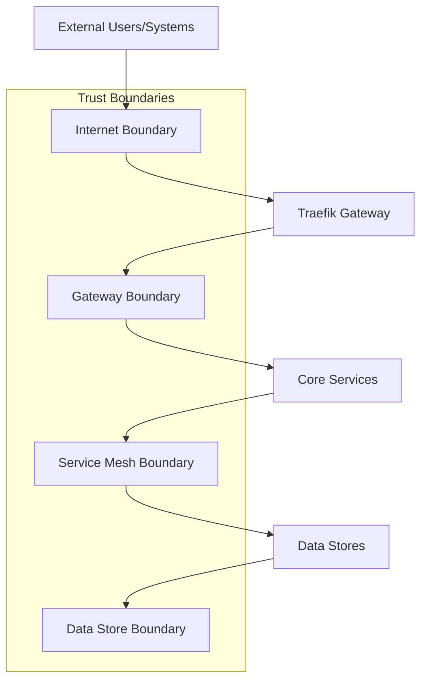
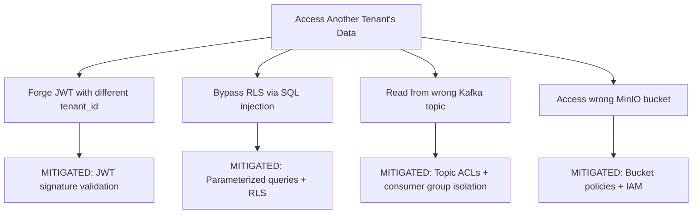
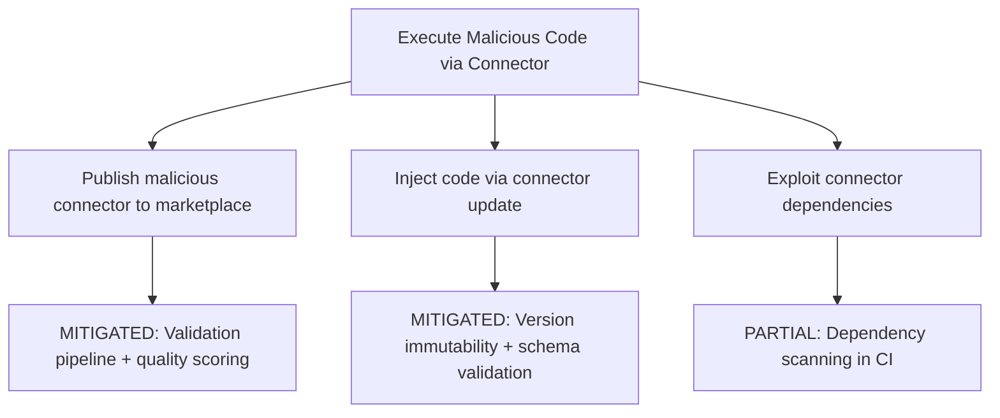
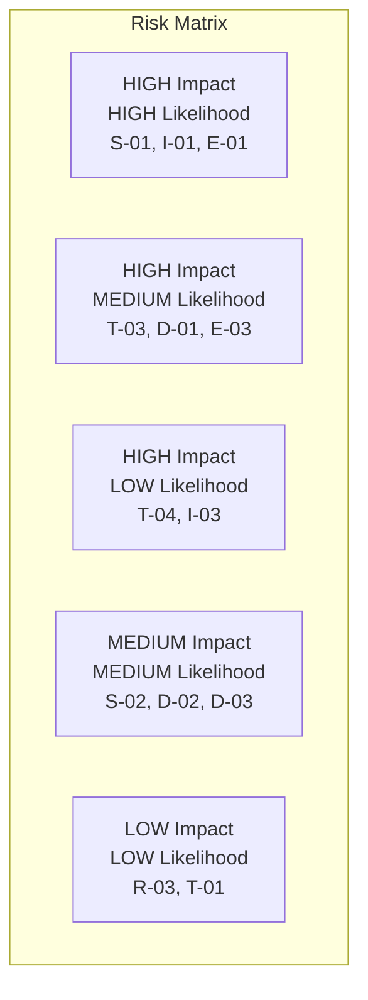

# Threat Model -- ERP-iPaaS
> Version: 1.0 | Last Updated: 2026-02-23 | Status: Draft
> Classification: Internal | Author: AIDD System

## 1. Overview

This threat model applies the STRIDE methodology to ERP-iPaaS, identifying threats across all six service boundaries, data stores, and communication channels.

## 2. System Decomposition

## 3. STRIDE Analysis

### 3.1 Spoofing

| Threat ID | Threat | Target | Impact | Mitigation |
|-----------|--------|--------|--------|------------|
| S-01 | Forged JWT tokens | API Gateway | Unauthorized access | JWT signature validation with Keycloak JWKS |
| S-02 | Stolen API keys | Integration Layer | Data exfiltration | Key hashing, rotation, IP allowlisting |
| S-03 | Webhook source spoofing | Webhook Service | Malicious payload injection | HMAC-SHA256 signature verification |
| S-04 | Service impersonation | Inter-service communication | Lateral movement | mTLS with cert-manager |

### 3.2 Tampering

| Threat ID | Threat | Target | Impact | Mitigation |
|-----------|--------|--------|--------|------------|
| T-01 | Workflow definition tampering | PostgreSQL | Unauthorized workflow behavior | RLS + audit logging + version control |
| T-02 | Event payload modification | Redpanda | Data corruption | Schema validation, event signing |
| T-03 | Connector code injection | Marketplace | Malicious connector execution | Sandboxed execution, code review |
| T-04 | Helm chart tampering | ArgoCD | Infrastructure compromise | GitOps with signed commits |

### 3.3 Repudiation

| Threat ID | Threat | Target | Impact | Mitigation |
|-----------|--------|--------|--------|------------|
| R-01 | Denied admin actions | Platform | Accountability gap | Immutable ClickHouse audit log |
| R-02 | Denied secret access | Secrets API | Compliance violation | Secret access audit trail |
| R-03 | Denied workflow execution | Workflow Engine | Dispute resolution | Execution history in ClickHouse |

### 3.4 Information Disclosure

| Threat ID | Threat | Target | Impact | Mitigation |
|-----------|--------|--------|--------|------------|
| I-01 | Cross-tenant data leakage | PostgreSQL | Privacy violation | Row-Level Security policies |
| I-02 | PII exposure in logs | Application logs | GDPR/NDPR violation | PII redaction in LLM utils |
| I-03 | Secret exposure in error messages | API responses | Credential theft | Sanitized error responses |
| I-04 | Event data exposure | Redpanda topics | Data breach | Tenant-prefixed topics, ACLs |

### 3.5 Denial of Service

| Threat ID | Threat | Target | Impact | Mitigation |
|-----------|--------|--------|--------|------------|
| D-01 | API flood | Traefik Gateway | Platform unavailability | Rate limiting per tenant/API key |
| D-02 | Kafka topic flood | Redpanda | Event backbone saturation | Per-tenant topic quotas |
| D-03 | Workflow execution bomb | Activepieces/Temporal | Resource exhaustion | Execution limits per tenant |
| D-04 | Connector DDoS via iPaaS | External systems | Third-party service disruption | Rate limit policies per connector |

### 3.6 Elevation of Privilege

| Threat ID | Threat | Target | Impact | Mitigation |
|-----------|--------|--------|--------|------------|
| E-01 | Tenant escalation | Multi-tenant boundary | Full data access | RLS + OPA Gatekeeper |
| E-02 | Role escalation | Keycloak | Admin access | Role assignment requires admin approval |
| E-03 | Container escape | Kubernetes | Node compromise | Pod security standards, distroless images |
| E-04 | SQL injection via workflow | PostgreSQL | Data manipulation | Parameterized queries, RLS as backstop |

## 4. Attack Trees

### 4.1 Cross-Tenant Data Access

### 4.2 Malicious Connector Injection

## 5. Risk Assessment Matrix

| Risk Level | Threats | Treatment |
|-----------|---------|-----------|
| Critical | S-01, I-01, E-01 | Mitigated with primary + secondary controls |
| High | T-03, D-01, E-03 | Mitigated with primary controls |
| Medium | S-02, D-02, D-03 | Mitigated with standard controls |
| Low | R-03, T-01 | Accepted with monitoring |

## 6. Security Controls Summary

| Control | Layer | Technology | Threats Mitigated |
|---------|-------|-----------|------------------|
| JWT validation | Gateway | Traefik + Keycloak | S-01 |
| mTLS | Network | cert-manager | S-04, T-02 |
| Rate limiting | Gateway | Traefik middleware | D-01, D-04 |
| RLS | Database | PostgreSQL | I-01, E-01, E-04 |
| PII redaction | Application | LLM utils | I-02 |
| Audit logging | Application | ClickHouse | R-01, R-02, R-03 |
| Schema validation | Event | Redpanda SR | T-02 |
| OPA Gatekeeper | Kubernetes | OPA | E-01, E-03 |
| Secret encryption | Storage | AES-256-GCM | I-03 |
| Container scanning | CI/CD | GitHub Actions | E-03 |

## 7. Residual Risks

| Risk | Status | Mitigation Plan |
|------|--------|----------------|
| Connector code execution in shared process | Partial | Phase 2: Sandboxed execution (WebAssembly) |
| DLQ replay without authorization check | Open | Phase 1: Add RBAC to DLQ replay |
| Multi-region consistency during partition | Open | Phase 1: Validate Redpanda MRC |
| LLM prompt injection via workflow data | Partial | Enhanced input sanitization planned |
