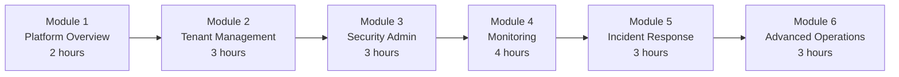
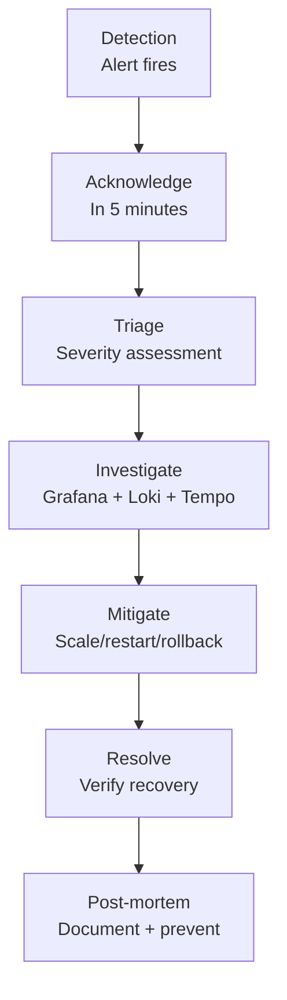

# Training Manual for Administrators -- ERP-iPaaS
> Version: 1.0 | Last Updated: 2026-02-23 | Status: Draft
> Classification: Internal | Author: AIDD System

## 1. Training Overview

This training manual provides a structured curriculum for platform administrators to develop proficiency in managing ERP-iPaaS. The training is organized into modules that progress from foundational concepts to advanced operational skills.

## 2. Curriculum Structure



**Total Duration**: 18 hours (3 days)

## 3. Module 1: Platform Overview (2 hours)

### 3.1 Learning Objectives
- Describe the six core services of ERP-iPaaS
- Explain the role of each infrastructure component
- Navigate the admin dashboard

### 3.2 Content

**The Six Pillars**:
1. **Workflow Engine**: Activepieces (low-code) + Temporal (durable)
2. **Connector Framework**: SDK-based connector development and marketplace
3. **Event Backbone**: Redpanda (Kafka-compatible) event streaming
4. **API Management**: Traefik gateway with rate limiting and analytics
5. **ETL Service**: Data pipeline builder with batch and streaming modes
6. **Webhook Service**: Incoming/outgoing webhook management with signatures

**Infrastructure Stack**: Kubernetes, PostgreSQL, ClickHouse, Redpanda, Dragonfly, MinIO, Keycloak, Grafana, Prometheus, Loki, Tempo, Sentry, ArgoCD

### 3.3 Lab Exercise
- Access the admin dashboard
- Identify the health status of each service
- Locate the Grafana WaaS Overview dashboard

## 4. Module 2: Tenant Management (3 hours)

### 4.1 Learning Objectives
- Provision a new tenant end-to-end
- Configure tenant-specific settings
- Manage tenant lifecycle (create, configure, decommission)

### 4.2 Lab Exercises

**Lab 2.1**: Provision a test tenant
```bash
# Step 1: Create Keycloak realm
# Step 2: Create K8s namespace
kubectl create namespace tenant-lab1
# Step 3: Apply RLS policies
# Step 4: Seed workflow templates
./scripts/seed.sh --tenant lab1
# Step 5: Verify tenant isolation
```

**Lab 2.2**: Configure tenant rate limits
- Set API rate limit to 100 requests/minute
- Set event throughput to 1,000 events/sec
- Verify limits using load testing

**Lab 2.3**: Decommission a test tenant
- Disable workflows, export audit logs, delete namespace

## 5. Module 3: Security Administration (3 hours)

### 5.1 Learning Objectives
- Manage OAuth2 clients and API keys
- Configure RBAC roles in Keycloak
- Review audit logs for compliance
- Understand the RLS implementation

### 5.2 Lab Exercises

**Lab 3.1**: Create and rotate API keys
- Generate a new API key via the Secrets API
- Test the key against the Integration Layer API
- Rotate the key and verify old key revocation

**Lab 3.2**: Configure RBAC
- Create a new user in Keycloak
- Assign the `workflow_editor` role
- Verify the user can create workflows but not manage tenants

**Lab 3.3**: Audit log investigation
- Query ClickHouse for all secret access events in the last 24 hours
- Identify unusual access patterns

## 6. Module 4: Monitoring and Alerting (4 hours)

### 6.1 Learning Objectives
- Navigate Grafana dashboards
- Create custom dashboard panels
- Configure alert notification channels
- Interpret Prometheus alert rules

### 6.2 Key Metrics to Monitor

| Metric | Source | Healthy Range |
|--------|--------|---------------|
| Workflow execution rate | Prometheus | Baseline +/- 20% |
| Workflow error rate | Prometheus | < 5% |
| API p99 latency | Traefik metrics | < 50ms |
| Kafka consumer lag | Redpanda metrics | < 1000 |
| Worker saturation | Prometheus | < 80% |
| ClickHouse query time | ClickHouse metrics | < 1s |

### 6.3 Lab Exercises

**Lab 4.1**: Navigate the WaaS Overview dashboard
- Identify the workflow with the highest error rate
- Determine the p99 latency for the API gateway
- Check the current Kafka consumer lag

**Lab 4.2**: Create a custom Grafana panel
- Create a panel showing per-tenant execution counts
- Add a threshold line at the tenant's limit

**Lab 4.3**: Simulate and respond to an alert
- Generate artificial load to trigger `KafkaLagHigh`
- Observe the alert in Prometheus
- Scale consumers to resolve

## 7. Module 5: Incident Response (3 hours)

### 7.1 Learning Objectives
- Follow the incident response playbook
- Use observability tools for root cause analysis
- Perform post-incident reviews

### 7.2 Incident Response Flow



### 7.3 Lab Exercise

**Lab 5.1**: Incident simulation
- Instructor introduces a simulated database failure
- Students follow the response playbook
- Root cause analysis using Grafana, Loki, and Tempo
- Write a post-mortem document

## 8. Module 6: Advanced Operations (3 hours)

### 8.1 Topics
- Helm chart customization and upgrades
- Terraform module management
- ArgoCD application management
- KEDA auto-scaling configuration
- Performance tuning (ClickHouse, Redpanda, PostgreSQL)
- Disaster recovery drills

### 8.2 Lab Exercise

**Lab 6.1**: Perform a rolling upgrade
- Update Helm values for a service
- Push changes to Git
- Observe ArgoCD sync and rollout
- Verify zero-downtime deployment

## 9. Assessment

### 9.1 Written Assessment (30 questions)
Covering all six modules with multiple choice and short answer questions.

### 9.2 Practical Assessment
- Provision a new tenant
- Configure security (RBAC, API keys)
- Respond to a simulated incident
- Perform a rolling upgrade

**Passing Score**: 80% on written, successful completion of all practical tasks.
